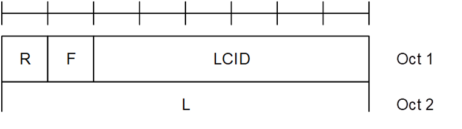

3GPP TS 38.321 V16.6.0 (2021-09)
=========
Technical Specification
|||
|--------------------------------|--------------:|
|                  |3rd Generation Partnership Project;|
||Technical Specification Group Radio Access Network;|
||NR;|
||Medium Access Control (MAC) protocol specification|
||(Release 16)|
|||

The present document has been developed within the 3rd Generation Partnership Project (3GPP TM) and may be further elaborated for the purposes of 3GPP.
The present document has not been subject to any approval process by the 3GPP Organizational Partners and shall not be implemented.
This Specification is provided for future development work within 3GPP only. The Organizational Partners accept no liability for any use of this Specification.
Specifications and Reports for implementation of the 3GPP TM system should be obtained via the 3GPP Organizational Partners' Publications Offices.

**3GPP**

Postal address

***

3GPP support office address

***

650 Route des Lucioles - Sophia Antipolis

Valbonne - FRANCE

Tel.: +33 4 92 94 42 00 Fax: +33 4 93 65 47 16

Internet

***

http://www.3gpp.org

**Copyright Notification**

***

No part may be reproduced except as authorized by written permission.
The copyright and the foregoing restriction extend to reproduction in all media.

© 2021, 3GPP Organizational Partners (ARIB, ATIS, CCSA, ETSI, TSDSI, TTA, TTC).

All rights reserved.

UMTS™ is a Trade Mark of ETSI registered for the benefit of its members

3GPP™ is a Trade Mark of ETSI registered for the benefit of its Members and of the 3GPP Organizational Partners
LTE™ is a Trade Mark of ETSI registered for the benefit of its Members and of the 3GPP Organizational Partners

GSM® and the GSM logo are registered and owned by the GSM Association

# Contents
- [3GPP TS 38.321 V16.6.0 (2021-09)](#3gpp-ts-38321-v1660-2021-09)
- [Contents](#contents)
- [Foreword](#foreword)
- [1 Scope](#1-scope)
- [2 References](#2-references)
- [3 Definitions, symbols and abbreviations](#3-definitions-symbols-and-abbreviations)
  - [3.1 Definitions](#31-definitions)
  - [3.2 Abbreviations](#32-abbreviations)
- [4 General](#4-general)
  - [4.1 Introduction](#41-introduction)
  - [4.2 MAC architecture](#42-mac-architecture)
    - [4.2.1 General](#421-general)
    - [4.2.2 MAC Entities](#422-mac-entities)
  - [4.3 Services](#43-services)
    - [4.3.1 Services provided to upper layers](#431-services-provided-to-upper-layers)
    - [4.3.2 Services expected from physical layer](#432-services-expected-from-physical-layer)
  - [4.4 Functions](#44-functions)
  - [4.5 Channel structure](#45-channel-structure)
    - [4.5.1 General](#451-general)
    - [4.5.2 Transport Channels](#452-transport-channels)
    - [4.5.3 Logical Channels](#453-logical-channels)
    - [4.5.4 Mapping of Transport Channels to Logical Channels](#454-mapping-of-transport-channels-to-logical-channels)
      - [4.5.4.1 General](#4541-general)
      - [4.5.4.2 Uplink mapping](#4542-uplink-mapping)
      - [4.5.4.3 Downlink mapping](#4543-downlink-mapping)
      - [4.5.4.4 Sidelink mapping](#4544-sidelink-mapping)
- [5 MAC procedures](#5-mac-procedures)
  - [5.1 Random Access procedure](#51-random-access-procedure)
    - [5.1.1 Random Access procedure initialization](#511-random-access-procedure-initialization)
    - [5.1.1a Initialization of variables specific to Random Access type](#511a-initialization-of-variables-specific-to-random-access-type)
    - [5.1.2 Random Access Resource selection](#512-random-access-resource-selection)
    - [5.1.2a Random Access Resource selection for 2-step RA type](#512a-random-access-resource-selection-for-2-step-ra-type)
    - [5.1.3 Random Access Preamble transmission](#513-random-access-preamble-transmission)
    - [5.1.3a MSGA transmission](#513a-msga-transmission)
    - [5.1.4 Random Access Response reception](#514-random-access-response-reception)
    - [5.1.4a MSGB reception and contention resolution for 2-step RA type](#514a-msgb-reception-and-contention-resolution-for-2-step-ra-type)
    - [5.1.5 Contention Resolution](#515-contention-resolution)
    - [5.1.6 Completion of the Random Access procedure](#516-completion-of-the-random-access-procedure)
  - [5.2 Maintenance of Uplink Time Alignment](#52-maintenance-of-uplink-time-alignment)
  - [5.3 DL-SCH data transfer](#53-dl-sch-data-transfer)
    - [5.3.1 DL Assignment reception](#531-dl-assignment-reception)
    - [5.3.2 HARQ operation](#532-harq-operation)
      - [5.3.2.1 HARQ Entity](#5321-harq-entity)
      - [5.3.2.2 HARQ process](#5322-harq-process)
    - [5.3.3 Disassembly and demultiplexing](#533-disassembly-and-demultiplexing)
  - [5.4 UL-SCH data transfer](#54-ul-sch-data-transfer)
    - [5.4.1 UL Grant reception](#541-ul-grant-reception)
    - [5.4.2 HARQ operation](#542-harq-operation)
      - [5.4.2.1 HARQ Entity](#5421-harq-entity)
      - [5.4.2.2 HARQ process](#5422-harq-process)
    - [5.4.3 Multiplexing and assembly](#543-multiplexing-and-assembly)
      - [5.4.3.1 Logical Channel Prioritization](#5431-logical-channel-prioritization)
        - [5.4.3.1.1 General](#54311-general)
        - [5.4.3.1.2 Selection of logical channels](#54312-selection-of-logical-channels)
        - [5.4.3.1.3 Allocation of resources](#54313-allocation-of-resources)
      - [5.4.3.2 Multiplexing of MAC Control Elements and MAC SDUs](#5432-multiplexing-of-mac-control-elements-and-mac-sdus)
    - [5.4.4 Scheduling Request](#544-scheduling-request)
    - [5.4.5 Buffer Status Reporting](#545-buffer-status-reporting)
    - [5.4.6 Power Headroom Reporting](#546-power-headroom-reporting)
    - [5.4.7 Pre-emptive Buffer Status Reporting](#547-pre-emptive-buffer-status-reporting)
  - [5.5 PCH reception](#55-pch-reception)
  - [5.6 BCH reception](#56-bch-reception)
  - [5.7 Discontinuous Reception (DRX)](#57-discontinuous-reception-drx)
  - [5.8 Transmission and reception without dynamic scheduling](#58-transmission-and-reception-without-dynamic-scheduling)
    - [5.8.1 Downlink](#581-downlink)
    - [5.8.2 Uplink](#582-uplink)
    - [5.8.3 Sidelink](#583-sidelink)
  - [5.9 Activation/Deactivation of SCells](#59-activationdeactivation-of-scells)
  - [5.10 Activation/Deactivation of PDCP duplication](#510-activationdeactivation-of-pdcp-duplication)
  - [5.11 MAC reconfiguration](#511-mac-reconfiguration)
  - [5.12 MAC Reset](#512-mac-reset)
  - [5.13 Handling of unknown, unforeseen and erroneous protocol data](#513-handling-of-unknown-unforeseen-and-erroneous-protocol-data)
  - [5.14 Handling of measurement gaps](#514-handling-of-measurement-gaps)
  - [5.15 Bandwidth Part (BWP) operation](#515-bandwidth-part-bwp-operation)
    - [5.15.1 Downlink and Uplink](#5151-downlink-and-uplink)
    - [5.15.2 Sidelink](#5152-sidelink)
  - [5.16 SUL operation](#516-sul-operation)
  - [5.17 Beam Failure Detection and Recovery procedure](#517-beam-failure-detection-and-recovery-procedure)
  - [5.18 Handling of MAC CEs](#518-handling-of-mac-ces)
    - [5.18.1 General](#5181-general)
    - [5.18.2 Activation/Deactivation of Semi-persistent CSI-RS/CSI-IM resource set](#5182-activationdeactivation-of-semi-persistent-csi-rscsi-im-resource-set)
    - [5.18.3 Aperiodic CSI Trigger State Subselection](#5183-aperiodic-csi-trigger-state-subselection)
    - [5.18.4 Activation/Deactivation of UE-specific PDSCH TCI state](#5184-activationdeactivation-of-ue-specific-pdsch-tci-state)
    - [5.18.5 Indication of TCI state for UE-specific PDCCH](#5185-indication-of-tci-state-for-ue-specific-pdcch)
    - [5.18.6 Activation/Deactivation of Semi-persistent CSI reporting on PUCCH](#5186-activationdeactivation-of-semi-persistent-csi-reporting-on-pucch)
    - [5.18.7 Activation/Deactivation of Semi-persistent SRS and Indication of spatial relation of SP/AP SRS](#5187-activationdeactivation-of-semi-persistent-srs-and-indication-of-spatial-relation-of-spap-srs)
    - [5.18.8 Activation/Deactivation of spatial relation of PUCCH resource](#5188-activationdeactivation-of-spatial-relation-of-pucch-resource)
    - [5.18.9 Activation/Deactivation of semi-persistent ZP CSI-RS resource set](#5189-activationdeactivation-of-semi-persistent-zp-csi-rs-resource-set)
    - [5.18.10 Recommended Bit Rate](#51810-recommended-bit-rate)
    - [5.18.11 Void](#51811-void)
    - [5.18.12 Void](#51812-void)
    - [5.18.13 Void](#51813-void)
    - [5.18.14 Update of Pathloss Reference RS of SRS](#51814-update-of-pathloss-reference-rs-of-srs)
    - [5.18.15 Update of Pathloss Reference RS of PUSCH](#51815-update-of-pathloss-reference-rs-of-pusch)
    - [5.18.16 Indication of spatial relation of SRS resource for a Serving Cell set](#51816-indication-of-spatial-relation-of-srs-resource-for-a-serving-cell-set)
    - [5.18.17 Activation/Deactivation of Semi-persistent Positioning SRS](#51817-activationdeactivation-of-semi-persistent-positioning-srs)
    - [5.18.18 Timing offset adjustment for IAB](#51818-timing-offset-adjustment-for-iab)
    - [5.18.19 Guard symbols for IAB](#51819-guard-symbols-for-iab)
  - [5.19 Data inactivity monitoring](#519-data-inactivity-monitoring)
  - [5.20 Void](#520-void)
  - [5.21 LBT operation](#521-lbt-operation)
    - [5.21.1 General](#5211-general)
    - [5.21.2 LBT failure detection and recovery procedure](#5212-lbt-failure-detection-and-recovery-procedure)
  - [5.22 SL-SCH Data transfer](#522-sl-sch-data-transfer)
    - [5.22.1 SL-SCH Data transmission](#5221-sl-sch-data-transmission)
      - [5.22.1.1 SL Grant reception and SCI transmission](#52211-sl-grant-reception-and-sci-transmission)
      - [5.22.1.2 TX resource (re-)selection check](#52212-tx-resource-re-selection-check)
      - [5.22.1.2a Re-evaluation and Pre-emption](#52212a-re-evaluation-and-pre-emption)
      - [5.22.1.3 Sidelink HARQ operation](#52213-sidelink-harq-operation)
        - [5.22.1.3.1 Sidelink HARQ Entity](#522131-sidelink-harq-entity)
        - [5.22.1.3.1a Sidelink process](#522131a-sidelink-process)
        - [5.22.1.3.2 PSFCH reception](#522132-psfch-reception)
        - [5.22.1.3.3 HARQ-based Sidelink RLF detection](#522133-harq-based-sidelink-rlf-detection)
      - [5.22.1.4 Multiplexing and assembly](#52214-multiplexing-and-assembly)
        - [5.22.1.4.1 Logical channel prioritization](#522141-logical-channel-prioritization)
          - [5.22.1.4.1.1 General](#5221411-general)
          - [5.22.1.4.1.2 Selection of logical channels](#5221412-selection-of-logical-channels)
          - [5.22.1.4.1.3 Allocation of sidelink resources](#5221413-allocation-of-sidelink-resources)
        - [5.22.1.4.2 Multiplexing of MAC Control Elements and MAC SDUs](#522142-multiplexing-of-mac-control-elements-and-mac-sdus)
      - [5.22.1.5 Scheduling Request](#52215-scheduling-request)
      - [5.22.1.6 Buffer Status Reporting](#52216-buffer-status-reporting)
      - [5.22.1.7 CSI Reporting](#52217-csi-reporting)
    - [5.22.2 SL-SCH Data reception](#5222-sl-sch-data-reception)
      - [5.22.2.1 SCI reception](#52221-sci-reception)
      - [5.22.2.2 Sidelink HARQ operation](#52222-sidelink-harq-operation)
        - [5.22.2.2.1 Sidelink HARQ Entity](#522221-sidelink-harq-entity)
        - [5.22.2.2.2 Sidelink process](#522222-sidelink-process)
      - [5.22.2.3 Disassembly and demultiplexing](#52223-disassembly-and-demultiplexing)
  - [5.23 SL-BCH data transfer](#523-sl-bch-data-transfer)
    - [5.23.1 SL-BCH data transmission](#5231-sl-bch-data-transmission)
    - [5.23.2 SL-BCH data reception](#5232-sl-bch-data-reception)
- [6 Protocol Data Units, formats and parameters](#6-protocol-data-units-formats-and-parameters)
  - [6.1 Protocol Data Units](#61-protocol-data-units)
    - [6.1.1 General](#611-general)
    - [6.1.2 MAC PDU (DL-SCH and UL-SCH except transparent MAC and Random Access Response)](#612-mac-pdu-dl-sch-and-ul-sch-except-transparent-mac-and-random-access-response)
    - [6.1.3 MAC Control Elements (CEs)](#613-mac-control-elements-ces)
      - [6.1.3.1 Buffer Status Report MAC CEs](#6131-buffer-status-report-mac-ces)
      - [6.1.3.2 C-RNTI MAC CE](#6132-c-rnti-mac-ce)
      - [6.1.3.3 UE Contention Resolution Identity MAC CE](#6133-ue-contention-resolution-identity-mac-ce)
      - [6.1.3.4 Timing Advance Command MAC CE](#6134-timing-advance-command-mac-ce)
      - [6.1.3.4a Absolute Timing Advance Command MAC CE](#6134a-absolute-timing-advance-command-mac-ce)
      - [6.1.3.5 DRX Command MAC CE](#6135-drx-command-mac-ce)
      - [6.1.3.6 Long DRX Command MAC CE](#6136-long-drx-command-mac-ce)
      - [6.1.3.7 Configured Grant Confirmation MAC CE](#6137-configured-grant-confirmation-mac-ce)
      - [6.1.3.8 Single Entry PHR MAC CE](#6138-single-entry-phr-mac-ce)
      - [6.1.3.9 Multiple Entry PHR MAC CE](#6139-multiple-entry-phr-mac-ce)
      - [6.1.3.10 SCell Activation/Deactivation MAC CEs](#61310-scell-activationdeactivation-mac-ces)
      - [6.1.3.11 Duplication Activation/Deactivation MAC CE](#61311-duplication-activationdeactivation-mac-ce)
      - [6.1.3.12 SP CSI-RS/CSI-IM Resource Set Activation/Deactivation MAC CE](#61312-sp-csi-rscsi-im-resource-set-activationdeactivation-mac-ce)
      - [6.1.3.13 Aperiodic CSI Trigger State Subselection MAC CE](#61313-aperiodic-csi-trigger-state-subselection-mac-ce)
      - [6.1.3.14 TCI States Activation/Deactivation for UE-specific PDSCH MAC CE](#61314-tci-states-activationdeactivation-for-ue-specific-pdsch-mac-ce)
      - [6.1.3.15 TCI State Indication for UE-specific PDCCH MAC CE](#61315-tci-state-indication-for-ue-specific-pdcch-mac-ce)
      - [6.1.3.16 SP CSI reporting on PUCCH Activation/Deactivation MAC CE](#61316-sp-csi-reporting-on-pucch-activationdeactivation-mac-ce)
      - [6.1.3.17 SP SRS Activation/Deactivation MAC CE](#61317-sp-srs-activationdeactivation-mac-ce)
      - [6.1.3.18 PUCCH spatial relation Activation/Deactivation MAC CE](#61318-pucch-spatial-relation-activationdeactivation-mac-ce)
      - [6.1.3.19 SP ZP CSI-RS Resource Set Activation/Deactivation MAC CE](#61319-sp-zp-csi-rs-resource-set-activationdeactivation-mac-ce)
      - [6.1.3.20 Recommended bit rate MAC CE](#61320-recommended-bit-rate-mac-ce)
      - [6.1.3.21 Timing Delta MAC CE](#61321-timing-delta-mac-ce)
      - [6.1.3.22 Guard Symbols MAC CEs](#61322-guard-symbols-mac-ces)
      - [6.1.3.23 BFR MAC CEs](#61323-bfr-mac-ces)
      - [6.1.3.24 Enhanced TCI States Activation/Deactivation for UE-specific PDSCH MAC CE](#61324-enhanced-tci-states-activationdeactivation-for-ue-specific-pdsch-mac-ce)
      - [6.1.3.25 Enhanced PUCCH Spatial Relation Activation/Deactivation MAC CE](#61325-enhanced-pucch-spatial-relation-activationdeactivation-mac-ce)
      - [6.1.3.26 Enhanced SP/AP SRS Spatial Relation Indication MAC CE](#61326-enhanced-spap-srs-spatial-relation-indication-mac-ce)
      - [6.1.3.27 SRS Pathloss Reference RS Update MAC CE](#61327-srs-pathloss-reference-rs-update-mac-ce)
      - [6.1.3.28 PUSCH Pathloss Reference RS Update MAC CE](#61328-pusch-pathloss-reference-rs-update-mac-ce)
      - [6.1.3.29 Serving Cell Set based SRS Spatial Relation Indication MAC CE](#61329-serving-cell-set-based-srs-spatial-relation-indication-mac-ce)
      - [6.1.3.30 LBT failure MAC CEs](#61330-lbt-failure-mac-ces)
      - [6.1.3.31 Multiple Entry Configured Grant Confirmation MAC CE](#61331-multiple-entry-configured-grant-confirmation-mac-ce)
      - [6.1.3.32 Duplication RLC Activation/Deactivation MAC CE](#61332-duplication-rlc-activationdeactivation-mac-ce)
      - [6.1.3.33 Sidelink Buffer Status Report MAC CEs](#61333-sidelink-buffer-status-report-mac-ces)
      - [6.1.3.34 Sidelink Configured Grant Confirmation MAC CE](#61334-sidelink-configured-grant-confirmation-mac-ce)
      - [6.1.3.35 Sidelink CSI Reporting MAC CE](#61335-sidelink-csi-reporting-mac-ce)
      - [6.1.3.36 SP Positioning SRS Activation/Deactivation MAC CE](#61336-sp-positioning-srs-activationdeactivation-mac-ce)
    - [6.1.4 MAC PDU (transparent MAC)](#614-mac-pdu-transparent-mac)
    - [6.1.5 MAC PDU (Random Access Response)](#615-mac-pdu-random-access-response)
    - [6.1.5a MAC PDU (MSGB)](#615a-mac-pdu-msgb)
    - [6.1.6 MAC PDU (SL-SCH)](#616-mac-pdu-sl-sch)
  - [6.2 Formats and parameters](#62-formats-and-parameters)
    - [6.2.1 MAC subheader for DL-SCH and UL-SCH](#621-mac-subheader-for-dl-sch-and-ul-sch)
    - [6.2.2 MAC subheader for Random Access Response](#622-mac-subheader-for-random-access-response)
    - [6.2.2a MAC subheader for MSGB](#622a-mac-subheader-for-msgb)
    - [6.2.3 MAC payload for Random Access Response](#623-mac-payload-for-random-access-response)
    - [6.2.3a MAC payload for MSGB](#623a-mac-payload-for-msgb)
    - [6.2.4 MAC subheader for SL-SCH](#624-mac-subheader-for-sl-sch)
- [7 Variables and constants](#7-variables-and-constants)
  - [7.1 RNTI values](#71-rnti-values)
  - [7.2 Backoff Parameter values](#72-backoff-parameter-values)
  - [7.3 DELTA\_PREAMBLE values](#73-delta_preamble-values)
  - [7.4 PRACH Mask Index values](#74-prach-mask-index-values)

# Foreword

This Technical Specification has been produced by the 3rd Generation Partnership Project (3GPP).

The contents of the present document are subject to continuing work within the TSG and may change following formal TSG approval. Should the TSG modify the contents of the present document, it will be re-released by the TSG with an identifying change of release date and an increase in version number as follows:

Version x.y.z

where:

x the first digit:

1 presented to TSG for information;

2 presented to TSG for approval;

3 or greater indicates TSG approved document under change control.

y the second digit is incremented for all changes of substance, i.e. technical enhancements, corrections, updates, etc.

z the third digit is incremented when editorial only changes have been incorporated in the document.

# 1 Scope

The present document specifies the NR MAC protocol.

# 2 References

The following documents contain provisions which, through reference in this text, constitute provisions of the present document.

* References are either specific (identified by date of publication, edition number, version number, etc.) or nonspecific.

* For a specific reference, subsequent revisions do not apply.

* For a non-specific reference, the latest version applies. In the case of a reference to a 3GPP document (including a GSM document), a non-specific reference implicitly refers to the latest version of that document *in the same Release as the present document*.

[[1]](#2-References) 3GPP TR 21.905: "Vocabulary for 3GPP Specifications".

[[2]](#2-References) 3GPP TS 38.300: "NR; Overall description; Stage 2".

[[3]](#2-References) 3GPP TS 38.322: "NR; Radio Link Control (RLC) protocol specification".

[[4]](#2-References) 3GPP TS 38.323: "NR; Packet Data Convergence Protocol (PDCP) protocol specification".

[[5]](#2-References) 3GPP TS 38.331: "NR; Radio Resource Control (RRC); Protocol specification".

[[6]](#2-References) 3GPP TS 38.213: "NR; Physical Layer Procedures for control".

[[7]](#2-References) 3GPP TS 38.214: "NR; Physical Layer Procedures for data".

[[8]](#2-References) 3GPP TS 38.211: "NR; Physical channels and modulation".

[[9]](#2-References) 3GPP TS 38.212: "NR; Multiplexing and channel coding".

[[10]](#2-References) Void.

[[11]](#2-References) 3GPP TS 38.133: "NR; Requirements for support of radio resource management".

[[12]](#2-References) 3GPP TS 36.133: "Evolved Universal Terrestrial Radio Access (E-UTRA); Requirements for support of radio resource management".

[[13]](#2-References) 3GPP TS 26.114: "Technical Specification Group Services and System Aspects; IP Multimedia Subsystem (IMS); Multimedia Telephony; Media handling and interaction".

[[14]](#2-References) 3GPP TS 38.101-1: "NR; User Equipment (UE) radio transmission and reception; Part 1: Range 1 Standalone".

[[15]](#2-References) 3GPP TS 38.101-2: "NR; User Equipment (UE) radio transmission and reception; Part 2: Range 2 Standalone".

[[16]](#2-References) 3GPP TS 38.101-3: "NR; User Equipment (UE) radio transmission and reception; Part 3: Range 1 and Range 2 Interworking operation with other radios".

[[17]](#2-References) 3GPP TS 36.213: "Evolved Universal Terrestrial Radio Access (E-UTRA); Physical Layer Procedures".

[[18]](#2-References) 3GPP TS 37.213: "Physical layer procedures for shared spectrum channel access".

[[19]](#2-References) 3GPP TS 23.287: "Architecture enhancements for 5G System (5GS) to support Vehicle-to-Everything (V2X) services ".

[[20]](#2-References) 3GPP TS 23.285: "Architecture enhancements for V2X services".

[[21]](#2-References) 3GPP TS 36.331: "Evolved Universal Terrestrial Radio Access (E-UTRA); Radio Resource Control (RRC); Protocol specification".

[[22]](#2-References) 3GPP TS 36.321: "Evolved Universal Terrestrial Radio Access (E-UTRA); Medium Access Control (MAC); Protocol specification".

[[23]](#2-References) 3GPP TS 37.355: "Evolved Universal Terrestrial Radio Access (E-UTRA); LTE Positioning Protocol (LPP)".

[[24]](#2-References) 3GPP TS 38.215: "NR; Physical layer measurements".

# 3 Definitions, symbols and abbreviations

## 3.1 Definitions

For the purposes of the present document, the terms and definitions given in TR 21.905 [[1]](#2-References) and the following apply. A term defined in the present document takes precedence over the definition of the same term, if any, in TR 21.905 [[1]](#2-References).

**Dormant BWP:** The dormant BWP is one of downlink BWPs configured by the network via dedicated RRC signaling. In the dormant BWP, the UE stop monitoring PDCCH on/for the SCell, but continues performing CSI measurements, Automatic Gain Control (AGC) and beam management, if configured.

**DRX group:** A group of Serving Cells that is configured by RRC and that have the same DRX Active Time.

**HARQ information:** HARQ information for DL-SCH, for UL-SCH, or for SL-SCH transmissions consists of New Data Indicator (NDI), Transport Block size (TBS), Redundancy Version (RV), and HARQ process ID.

**IAB-donor:** gNB that provides network access to UEs via a network of backhaul and access links.

**IAB-node:** RAN node that supports NR access links to UEs and NR backhaul links to parent nodes and child nodes.

**Listen Before Talk**: A procedure according to which transmissions are not performed if the channel is identified as being occupied, see TS 37.213 [[18]](#2-References).

**Msg3**: Message transmitted on UL-SCH containing a C-RNTI MAC CE or CCCH SDU, submitted from upper layer and associated with the UE Contention Resolution Identity, as part of a Random Access procedure.

**NR backhaul link:** NR link used for backhauling between an IAB-node and an IAB-donor, and between IAB-nodes in case of a multi-hop backhauling.

**NR sidelink communication**: AS functionality enabling at least V2X Communication as defined in TS 23.287 [[19]](#2-References), between two or more nearby UEs, using NR technology but not traversing any network node.

**PDCCH occasion**: A time duration (i.e. one or a consecutive number of symbols) during which the MAC entity is configured to monitor the PDCCH.

**Serving Cell:** A PCell, a PSCell, or an SCell in TS 38.331 [[5]](#2-References).

**Sidelink transmission information:** Sidelink transmission information included in a SCI for a SL-SCH transmission as specified in clause 8.3 and 8.4 of TS 38.212 [[9]](#2-References) consists of Sidelink HARQ information including NDI, RV, Sidelink process ID, HARQ feedback enabled/disabled indicator, Sidelink identification information including cast type indicator, Source Layer-1 ID and Destination Layer-1 ID, and Sidelink other information including CSI request, a priority, a communication range requirement and Zone ID.

**Special Cell:** For Dual Connectivity operation the term Special Cell refers to the PCell of the MCG or the PSCell of the SCG depending on if the MAC entity is associated to the MCG or the SCG, respectively. Otherwise the term Special Cell refers to the PCell. A Special Cell supports PUCCH transmission and contention-based Random Access, and is always activated.

**Timing Advance Group:** A group of Serving Cells that is configured by RRC and that, for the cells with a UL configured, using the same timing reference cell and the same Timing Advance value. A Timing Advance Group containing the SpCell of a MAC entity is referred to as Primary Timing Advance Group (PTAG), whereas the term Secondary Timing Advance Group (STAG) refers to other TAGs.

**V2X sidelink communication**: AS functionality enabling V2X Communication as defined in TS 23.285 [[20]](#2-References), between nearby UEs, using E-UTRA technology but not traversing any network node.

NOTE: A timer is running once it is started, until it is stopped or until it expires; otherwise it is not running. A timer can be started if it is not running or restarted if it is running. A Timer is always started or restarted from its initial value. The duration of a timer is not updated until it is stopped or expires (e.g. due to BWP switching). When the MAC entity applies zero value for a timer, the timer shall be started and immediately expire unless explicitly stated otherwise.

## 3.2 Abbreviations

For the purposes of the present document, the abbreviations given in TR 21.905 [[1]](#2-References) and the following apply. An abbreviation defined in the present document takes precedence over the definition of the same abbreviation, if any, in TR 21.905 [[1]](#2-References).

AP Aperiodic

BFR Beam Failure Recovery

BSR Buffer Status Report

BWP Bandwidth Part

CE Control Element

CG Cell Group

CI-RNTI Cancellation Indication RNTI

CSI Channel State Information

CSI-IM CSI Interference Measurement

CSI-RS CSI Reference Signal

CS-RNTI Configured Scheduling RNTI

DAPS Dual Active Protocol Stack

DCP DCI with CRC scrambled by PS-RNTI

DL-PRS DownLink-Positioning Reference Signal

IAB Integrated Access and Backhaul

INT-RNTI Interruption RNTI

LBT Listen Before Talk

LCG Logical Channel Group

LCP Logical Channel Prioritization

MCG Master Cell Group

MPE Maximum Permissible Exposure

NUL Normal Uplink

NZP CSI-RS Non-Zero Power CSI-RS

PDB Packet Delay Budget

PHR Power Headroom Report

PS-RNTI Power Saving RNTI

PTAG Primary Timing Advance Group

QCL Quasi-colocation

RS Reference Signal

SCG Secondary Cell Group

SFI-RNTI Slot Format Indication RNTI

SI System Information

SL-RNTI Sidelink RNTI

SLCS-RNTI Sidelink Configured Scheduling RNTI

SpCell Special Cell

SP Semi-Persistent

SP-CSI-RNTI Semi-Persistent CSI RNTI

SPS Semi-Persistent Scheduling

SR Scheduling Request

SS Synchronization Signals

SSB Synchronization Signal Block

STAG Secondary Timing Advance Group

SUL Supplementary Uplink

TAG Timing Advance Group

TCI Transmission Configuration Indicator

TPC-SRS-RNTI Transmit Power Control-Sounding Reference Signal-RNTI

UCI Uplink Control Information

V2X Vehicle-to-Everything

ZP CSI-RS Zero Power CSI-RS

# 4 General

## 4.1 Introduction

The objective of this clause is to describe the MAC architecture and the MAC entity of the UE from a functional point of view.

## 4.2 MAC architecture

### 4.2.1 General

This clause describes a model of the MAC i.e. it does not specify or restrict implementations.

RRC is in control of the MAC configuration.

### 4.2.2 MAC Entities

The MAC entity of the UE handles the following transport channels:

* Broadcast Channel (BCH);

* Downlink Shared Channel(s) (DL-SCH);

* Paging Channel (PCH);

* Uplink Shared Channel(s) (UL-SCH);

* Random Access Channel(s) (RACH).

When the UE is configured with SCG, two MAC entities are configured to the UE: one for the MCG and one for the SCG.

When the UE is configured with DAPS handover, two MAC entities are used by the UE: one for the source cell (source MAC entity) and one for the target cell (target MAC entity).

The functions of the different MAC entities in the UE operate independently unless otherwise specified. The timers and parameters used in each MAC entity are configured independently unless otherwise specified. The Serving Cells, C-RNTI, radio bearers, logical channels, upper and lower layer entities, LCGs, and HARQ entities considered by each MAC entity refer to those mapped to that MAC entity unless otherwise specified.

If the MAC entity is configured with one or more SCells, there are multiple DL-SCH and there may be multiple UL-SCH as well as multiple RACH per MAC entity; one DL-SCH, one UL-SCH, and one RACH on the SpCell, one DL-SCH, zero or one UL-SCH and zero or one RACH for each SCell.

If the MAC entity is not configured with any SCell, there is one DL-SCH, one UL-SCH, and one RACH per MAC entity.

Figure 4.2.2-1 illustrates one possible structure of the MAC entity when SCG is not configured and for each MAC entity during DAPS handover.

Figure 4.2.2-1: MAC structure overview

Figure 4.2.2-2 illustrates one possible structure for the MAC entities when MCG and SCG are configured.

Figure 4.2.2-2: MAC structure overview with two MAC entities

In addition, the MAC entity of the UE handles the following transport channel for sidelink:

* Sidelink Shared Channel (SL-SCH);

* Sidelink Broadcast Channel (SL-BCH).

Figure 4.2.2-3 illustrates one possible structure for the MAC entity when sidelink is configured.

Figure 4.2.2-3: MAC structure overview for sidelink

## 4.3 Services

### 4.3.1 Services provided to upper layers

The MAC sublayer provides the following services to upper layers:

* data transfer;

* radio resource allocation.

### 4.3.2 Services expected from physical layer

The MAC sublayer expects the following services from the physical layer:

* data transfer services;

* signalling of HARQ feedback;

* signalling of Scheduling Request;

* measurements (e.g. Channel Quality Indication (CQI)).

## 4.4 Functions

The MAC sublayer supports the following functions:

* mapping between logical channels and transport channels;

* multiplexing of MAC SDUs from one or different logical channels onto transport blocks (TB) to be delivered to the physical layer on transport channels;

* demultiplexing of MAC SDUs to one or different logical channels from transport blocks (TB) delivered from the physical layer on transport channels;

* scheduling information reporting;

* error correction through HARQ;

* logical channel prioritization;

* priority handling between overlapping resources of one UE;

* radio resource selection.

The relevance of MAC functions for uplink, downlink, and sidelink is indicated in Table 4.4-1.

Table 4.4-1: The link direction association of MAC functions.

| MAC function                                            | Downlink | Uplink | Sidelink TX | Sidelink RX |
|---------------------------------------------------------|----------|--------|-------------|-------------|
| Mapping between logical channels and transport channels | X        | X      | X           | X           |
| Multiplexing                                            |          | X      | X           |             |
| Demultiplexing                                          | X        |        |             | X           |
| Scheduling information reporting                        |          | X      | X           |             |
| Error correction through HARQ                           | X        | X      | X           | X           |
| Logical Channel prioritization                          |          | X      | X           |             |
| Radio resource selection                                |          |        | X           |             |

## 4.5 Channel structure

### 4.5.1 General

The MAC sublayer operates on the channels defined below; transport channels are SAPs between MAC and Layer 1, logical channels are SAPs between MAC and RLC.

### 4.5.2 Transport Channels

The MAC sublayer uses the transport channels listed in Table 4.5.2-1 below.

Table 4.5.2-1: Transport channels used by MAC

| Transport channel name     | Acronym | Downlink | Uplink | Sidelink |
|----------------------------|---------|----------|--------|----------|
| Broadcast Channel          | BCH     | X        |        |          |
| Downlink Shared Channel    | DL-SCH  | X        |        |          |
| Paging Channel             | PCH     | X        |        |          |
| Uplink Shared Channel      | UL-SCH  |          | X      |          |
| Random Access Channel      | RACH    |          | X      |          |
| Sidelink Broadcast Channel | SL-BCH  |          |        | X        |
| Sidelink Shared Channel    | SL-SCH  |          |        | X        |

### 4.5.3 Logical Channels

The MAC sublayer provides data transfer services on logical channels. To accommodate different kinds of data transfer services, multiple types of logical channels are defined i.e. each supporting transfer of a particular type of information.

Each logical channel type is defined by what type of information is transferred.

The MAC sublayer provides the control and traffic channels listed in Table 4.5.3-1 below.

Table 4.5.3-1: Logical channels provided by MAC.

| Logical channel name               | Acronym | Control channel | Traffic channel |
|------------------------------------|---------|-----------------|-----------------|
| Broadcast Control Channel          | BCCH    | X               |                 |
| Paging Control Channel             | PCCH    | X               |                 |
| Common Control Channel             | CCCH    | X               |                 |
| Dedicated Control Channel          | DCCH    | X               |                 |
| Dedicated Traffic Channel          | DTCH    |                 | X               |
| Sidelink Broadcast Control Channel | SBCCH   | X               |                 |
| Sidelink Control Channel           | SCCH    | X               |                 |
| Sidelink Traffic Channel           | STCH    |                 | X               |

### 4.5.4 Mapping of Transport Channels to Logical Channels

#### 4.5.4.1 General

The MAC entity is responsible for mapping logical channels onto transport channels. This mapping depends on the multiplexing that is configured by RRC.

#### 4.5.4.2 Uplink mapping

The uplink logical channels can be mapped as described in Table 4.5.4.2-1.

Table 4.5.4.2-1: Uplink channel mapping.

| Transport channel Logical channel | UL-SCH | RACH |
|-----------------------------------|--------|------|
| CCCH                              | X      |      |
| DCCH                              | X      |      |
| DTCH                              | X      |      |

#### 4.5.4.3 Downlink mapping

The downlink logical channels can be mapped as described in Table 4.5.4.3-1.

Table 4.5.4.3-1: Downlink channel mapping.

| Transport channel Logical channel | BCH | PCH | DL-SCH |
|-----------------------------------|-----|-----|--------|
| BCCH                              | X   |     | X      |
| PCCH                              |     | X   |        |
| CCCH                              |     |     | X      |
| DCCH                              |     |     | X      |
| DTCH                              |     |     | X      |

#### 4.5.4.4 Sidelink mapping

The sidelink logical channels can be mapped as described in Table 4.5.4.4-1.

Table 4.5.4.4-1: Sidelink channel mapping.

| Transport channel Logical channel | SL-BCH | SL-SCH |
|-----------------------------------|--------|--------|
| SBCCH                             | X      |        |
| SCCH                              |        | X      |
| STCH                              |        | X      |

# 5 MAC procedures

## 5.1 Random Access procedure

### 5.1.1 Random Access procedure initialization

The Random Access procedure described in this clause is initiated by a PDCCH order, by the MAC entity itself, or by RRC for the events in accordance with TS 38.300 [[2]](#2-References). There is only one Random Access procedure ongoing at any point in time in a MAC entity. The Random Access procedure on an SCell shall only be initiated by a PDCCH order with *ra-PreambleIndex* different from 0b000000.

NOTE 1: If a new Random Access procedure is triggered while another is already ongoing in the MAC entity, it is up to UE implementation whether to continue with the ongoing procedure or start with the new procedure (e.g. for SI request).

NOTE 2: If there was an ongoing Random Access procedure that is triggered by a PDCCH order while the UE receives another PDCCH order indicating the same Random Access Preamble, PRACH mask index and uplink carrier, the Random Access procedure is considered as the same Random Access procedure as the ongoing one and not initialized again.

RRC configures the following parameters for the Random Access procedure:

* *prach-ConfigurationIndex*: the available set of PRACH occasions for the transmission of the Random Access Preamble for Msg1. These are also applicable to the MSGA PRACH if the PRACH occasions are shared between 2-step and 4-step RA types;

* *prach-ConfigurationPeriodScaling-IAB*: the scaling factor defined in TS 38.211 [[8]](#2-References) and applicable to IAB-MTs, extending the periodicity of the PRACH occasions baseline configuration indicated by *prach-ConfigurationIndex*;

* *prach-ConfigurationFrameOffset-IAB*: the frame offset defined in TS 38.211 [[8]](#2-References) and applicable to IAB-MTs, altering the ROs frame defined in the baseline configuration indicated by *prach-ConfigurationIndex*;

* *prach-ConfigurationSOffset-IAB*: the subframe/slot offset defined in TS 38.211 [[8]](#2-References) and applicable to IAB-MTs, altering the ROs subframe or slot defined in the baseline configuration indicated by *prach-ConfigurationIndex*;

* *msgA-PRACH-ConfigurationIndex*: the available set of PRACH occasions for the transmission of the Random Access Preamble for MSGA in 2-step RA type;

* *preambleReceivedTargetPower*: initial Random Access Preamble power for 4-step RA type;

* *msgA-PreambleReceivedTargetPower*: initial Random Access Preamble power for 2-step RA type;

* *rsrp-ThresholdSSB*: an RSRP threshold for the selection of the SSB for 4-step RA type. If the Random Access procedure is initiated for beam failure recovery, *rsrp-ThresholdSSB* used for the selection of the SSB within *candidateBeamRSList* refers to *rsrp-ThresholdSSB* in *BeamFailureRecoveryConfig* IE;

* *rsrp-ThresholdCSI-RS*: an RSRP threshold for the selection of CSI-RS for 4-step RA type. If the Random Access procedure is initiated for beam failure recovery, *rsrp-ThresholdCSI-RS* is equal to *rsrp-ThresholdSSB* in *BeamFailureRecoveryConfig* IE;

* *msgA-RSRP-ThresholdSSB*: an RSRP threshold for the selection of the SSB for 2-step RA type;

* *rsrp-ThresholdSSB-SUL*: an RSRP threshold for the selection between the NUL carrier and the SUL carrier;

* *msgA-RSRP-Threshold*: an RSRP threshold for selection between 2-step RA type and 4-step RA type when both 2-step and 4-step RA type Random Access Resources are configured in the UL BWP;

* *msgA-TransMax*: The maximum number of MSGA transmissions when both 4-step and 2-step RA type Random Access Resources are configured;

* *candidateBeamRSList*: a list of reference signals (CSI-RS and/or SSB) identifying the candidate beams for recovery and the associated Random Access parameters;

* *recoverySearchSpaceId*: the search space identity for monitoring the response of the beam failure recovery request;

* *powerRampingStep*: the power-ramping factor;

* *msgA-PreamblePowerRampingStep*: the power ramping factor for MSGA preamble;

* *powerRampingStepHighPriority*: the power-ramping factor in case of prioritized Random Access procedure;

* *scalingFactorBI*: a scaling factor for prioritized Random Access procedure;

* *ra-PreambleIndex*: Random Access Preamble;

* *ra-ssb-OccasionMaskIndex*: defines PRACH occasion(s) associated with an SSB in which the MAC entity may transmit a Random Access Preamble (see clause 7.4);

* *msgA-SSB-SharedRO-MaskIndex*: Indicates the subset of 4-step RA type PRACH occasions shared with 2-step RA type PRACH occasions for each SSB. If 2-step RA type PRACH occasions are shared with 4-step RA type PRACH occasions and *msgA-SSB-SharedRO-MaskIndex* is not configured, then all 4-step RA type PRACH occasions are available for 2-step RA type (see clause 7.4);

* *ra-OccasionList*: defines PRACH occasion(s) associated with a CSI-RS in which the MAC entity may transmit a Random Access Preamble;

* *ra-PreambleStartIndex*: the starting index of Random Access Preamble(s) for on-demand SI request;

* *preambleTransMax*: the maximum number of Random Access Preamble transmission;

* *ssb-perRACH-OccasionAndCB-PreamblesPerSSB*: defines the number of SSBs mapped to each PRACH occasion for 4-step RA type and the number of contention-based Random Access Preambles mapped to each SSB;

* *msgA-CB-PreamblesPerSSB-PerSharedRO*: defines the number of contention-based Random Access Preambles for 2-step RA type mapped to each SSB when the PRACH occasions are shared between 2-step and 4-step RA types;

* *msgA-SSB-PerRACH-OccasionAndCB-PreamblesPerSSB*: defines the number of SSBs mapped to each PRACH occasion for 2-step RA type and the number of contention-based Random Access Preambles mapped to each SSB;

* *msgA-PUSCH-ResourceGroupA*: defines MSGA PUSCH resources that the UE shall use when performing MSGA transmission using Random Access Preambles group A;

* *msgA-PUSCH-ResourceGroupB*: defines MSGA PUSCH resources that the UE shall use when performing MSGA transmission using Random Access Preambles group B;

* *msgA-PUSCH-Resource-Index*: identifies the index of the PUSCH resource used for MSGA in case of contention-free Random Access with 2-step RA type;

* if *groupBconfigured* is configured, then Random Access Preambles group B is configured for 4-step RA type.

* Amongst the contention-based Random Access Preambles associated with an SSB (as defined in TS 38.213 [[6]](#2-References)), the first *numberOfRA-PreamblesGroupA* included in *groupBconfigured* Random Access Preambles belong to Random Access Preambles group A. The remaining Random Access Preambles associated with the SSB belong to Random Access Preambles group B (if configured).

* if *groupB-ConfiguredTwoStepRA* is configured, then Random Access Preambles group B is configured for 2-step RA type.

* Amongst the contention-based Random Access Preambles for 2-step RA type associated with an SSB (as defined in TS 38.213 [[6]](#2-References)), the first *numberOfRA-PreamblesGroupA* included in *GroupB-ConfiguredTwoStepRA* Random Access Preambles belong to Random Access Preambles group A. The remaining Random Access Preambles associated with the SSB belong to Random Access Preambles group B (if configured).

NOTE 3: If Random Access Preambles group B is supported by the cell Random Access Preambles group B is included for each SSB.

* if Random Access Preambles group B is configured for 4-step RA type:

* *ra-Msg3SizeGroupA*: the threshold to determine the groups of Random Access Preambles for 4-step RA type;

* *msg3-DeltaPreamble*: ∆*PREAMBLE_Msg3* in TS 38.213 [[6]](#2-References);

* *messagePowerOffsetGroupB*: the power offset for preamble selection included in *groupBconfigured*;

* *numberOfRA-PreamblesGroupA*: defines the number of Random Access Preambles in Random Access Preamble group A for each SSB included in *groupBconfigured*.

* if Random Access Preambles group B is configured for 2-step RA type:

* *msgA-DeltaPreamble*: ∆*MsgA_PUSCH* in TS 38.213 [[6]](#2-References);

* *messagePowerOffsetGroupB*: the power offset for preamble selection included in *GroupB-ConfiguredTwoStepRA*;

* *numberOfRA-PreamblesGroupA*: defines the number of Random Access Preambles in Random Access Preamble group A for each SSB included in *GroupB-ConfiguredTwoStepRA*;

* *ra-MsgA-SizeGroupA*: the threshold to determine the groups of Random Access Preambles for 2-step RA type.

* the set of Random Access Preambles and/or PRACH occasions for SI request, if any;

* the set of Random Access Preambles and/or PRACH occasions for beam failure recovery request, if any;

* the set of Random Access Preambles and/or PRACH occasions for reconfiguration with sync, if any;

* *ra-ResponseWindow*: the time window to monitor RA response(s) (SpCell only);

* *ra-ContentionResolutionTimer*: the Contention Resolution Timer (SpCell only);

* *msgB-ResponseWindow*: the time window to monitor RA response(s) for 2-step RA type (SpCell only).

In addition, the following information for related Serving Cell is assumed to be available for UEs:

* if Random Access Preambles group B is configured:

* if the Serving Cell for the Random Access procedure is configured with supplementary uplink as specified in TS 38.331 [[5]](#2-References), and SUL carrier is selected for performing Random Access Procedure:

* PCMAX,f,c of the SUL carrier as specified in TS 38.101-1 [[14]](#2-References), TS 38.101-2 [[15]](#2-References), and TS 38.101-3 [[16]](#2-References).

* else:

* PCMAX,f,c of the NUL carrier as specified in TS 38.101-1 [[14]](#2-References), TS 38.101-2 [[15]](#2-References), and TS 38.101-3 [[16]](#2-References).

The following UE variables are used for the Random Access procedure:

* *PREAMBLE_INDEX*;

* *PREAMBLE_TRANSMISSION_COUNTER*;

* *PREAMBLE_POWER_RAMPING_COUNTER*;

* *PREAMBLE_POWER_RAMPING_STEP*;

* *PREAMBLE_RECEIVED_TARGET_POWER*;

* *PREAMBLE_BACKOFF*;

* *PCMAX*;

* *SCALING_FACTOR_BI*;

* *TEMPORARY_C-RNTI*;

* *RA_TYPE*;

* *POWER_OFFSET_2STEP_RA*;

* *MSGA_PREAMBLE_POWER_RAMPING_STEP*.

When the Random Access procedure is initiated on a Serving Cell, the MAC entity shall:

- 1> flush the Msg3 buffer;

- 1> flush the MSGA buffer;

- 1> set the *PREAMBLE_TRANSMISSION_COUNTER* to 1;

- 1> set the *PREAMBLE_POWER_RAMPING_COUNTER* to 1;

- 1> set the *PREAMBLE_BACKOFF* to 0 ms;

- 1> set *POWER_OFFSET_2STEP_RA* to 0 dB;

- 1> if the carrier to use for the Random Access procedure is explicitly signalled:

    - 2> select the signalled carrier for performing Random Access procedure;

    - 2> set the *PCMAX* to PCMAX,f,c of the signalled carrier.

- 1> else if the carrier to use for the Random Access procedure is not explicitly signalled; and

- 1> if the Serving Cell for the Random Access procedure is configured with supplementary uplink as specified in TS 38.331 [[5]](#2-References); and

- 1> if the RSRP of the downlink pathloss reference is less than *rsrp-ThresholdSSB-SUL*:

    - 2> select the SUL carrier for performing Random Access procedure;

    - 2> set the *PCMAX* to PCMAX,f,c of the SUL carrier.

- 1> else:

    - 2> select the NUL carrier for performing Random Access procedure;

    - 2> set the *PCMAX* to PCMAX,f,c of the NUL carrier.

- 1> perform the BWP operation as specified in clause 5.15;

- 1> if the Random Access procedure is initiated by PDCCH order and if the *ra-PreambleIndex* explicitly provided by PDCCH is not 0b000000; or

- 1> if the Random Access procedure was initiated for SI request (as specified in TS 38.331 [[5]](#2-References)) and the Random Access Resources for SI request have been explicitly provided by RRC; or

- 1> if the Random Access procedure was initiated for SpCell beam failure recovery (as specified in clause 5.17) and if the contention-free Random Access Resources for beam failure recovery request for 4-step RA type have been explicitly provided by RRC for the BWP selected for Random Access procedure; or

- 1> if the Random Access procedure was initiated for reconfiguration with sync and if the contention-free Random Access Resources for 4-step RA type have been explicitly provided in *rach-ConfigDedicated* for the BWP selected for Random Access procedure:

    - 2> set the *RA_TYPE* to *4-stepRA*.

- 1> else if the BWP selected for Random Access procedure is configured with both 2-step and 4-step RA type Random Access Resources and the RSRP of the downlink pathloss reference is above *msgA-RSRP-Threshold*; or

- 1> if the BWP selected for Random Access procedure is only configured with 2-step RA type Random Access resources (i.e. no 4-step RACH RA type resources configured); or

- 1> if the Random Access procedure was initiated for reconfiguration with sync and if the contention-free Random Access Resources for 2-step RA type have been explicitly provided in *rach-ConfigDedicated* for the BWP selected for Random Access procedure:

    - 2> set the *RA_TYPE* to *2-stepRA*.

- 1> else:

    - 2> set the *RA_TYPE* to *4-stepRA*.

- 1> perform initialization of variables specific to Random Access type as specified in clause 5.1.1a;

- 1> if *RA_TYPE* is set to *2-stepRA*:

    - 2> perform the Random Access Resource selection procedure for 2-step RA type (see clause 5.1.2a).

- 1> else:

    - 2> perform the Random Access Resource selection procedure (see clause 5.1.2).

### 5.1.1a Initialization of variables specific to Random Access type

The MAC entity shall:

- 1> if *RA_TYPE* is set to *2-stepRA*:

    - 2> set *PREAMBLE_POWER_RAMPING_STEP* to *msgA-PreamblePowerRampingStep*;

    - 2> set *SCALING_FACTOR_BI* to 1;

    - 2> apply *preambleTransMax* included in the *RACH-ConfigGenericTwoStepRA*;

    - 2> if the Random Access procedure was initiated for handover; and

    - 2> if *cfra-TwoStep* is configured for the selected carrier:

      - 3> if *msgA-TransMax* is configured in the *cfra-TwoStep*:

        - 4> apply *msgA-TransMax* configured in the *cfra-TwoStep*.

    - 2> else if *msgA-TransMax* is included in the *RACH-ConfigCommonTwoStepRA*:

      - 3> apply *msgA-TransMax* included in the *RACH-ConfigCommonTwoStepRA*.

    - 2> if the Random Access procedure was initiated for SpCell beam failure recovery (as specified in clause 5.17); and

    - 2> if *beamFailureRecoveryConfig* is configured for the active UL BWP of the selected carrier; and

    - 2> if *ra-PrioritizationTwoStep* is configured in the *beamFailureRecoveryConfig*:

      - 3> set *PREAMBLE_POWER_RAMPING_STEP* to the *powerRampingStepHighPriority* included in the *ra-PrioritizationTwoStep* in *beamFailureRecoveryConfig*;

      - 3> if *scalingFactorBI* is configured in the *ra-PrioritizationTwoStep* in *beamFailureRecoveryConfig*:

        - 4> set *SCALING_FACTOR_BI* to the *scalingFactorBI*.

    - 2> else if the Random Access procedure was initiated for handover; and

    - 2> if *rach-ConfigDedicated* is configured for the selected carrier; and

    - 2> if *ra-PrioritizationTwoStep* is configured in the *rach-ConfigDedicated*:

      - 3> set *PREAMBLE_POWER_RAMPING_STEP* to the *powerRampingStepHighPriority* included in the *ra-PrioritizationTwoStep* in *rach-ConfigDedicated*;

      - 3> if *scalingFactorBI* is configured in *ra-PrioritizationTwoStep* in the *rach-ConfigDedicated*:

        - 4> set *SCALING_FACTOR_BI* to the *scalingFactorBI*.

    - 2> else if *ra-PrioritizationForAccessIdentityTwoStep* is configured for the selected carrier; and

    - 2> if the MAC entity is provided by upper layers with Access Identity 1 or 2; and

    - 2> if for at least one of these Access Identities the corresponding bit in the *ra-PrioritizationForAI* is set to *one*:

      - 3> if *powerRampingStepHighPriority* is configured in the *ra-PrioritizationForAccessIdentityTwoStep*:

        - 4> set *PREAMBLE_POWER_RAMPING_STEP* to the *powerRampingStepHighPriority*.

      - 3> if *scalingFactorBI* is configured in the *ra-PrioritizationForAccessIdentityTwoStep*:

        - 4> set *SCALING_FACTOR_BI* to the *scalingFactorBI*.

    - 2> set *MSGA_PREAMBLE_POWER_RAMPING_STEP* to *PREAMBLE_POWER_RAMPING_STEP*.

- 1> else (i.e. *RA_TYPE* is set to *4-stepRA*):

    - 2> set *PREAMBLE_POWER_RAMPING_STEP* to *powerRampingStep*;

    - 2> set *SCALING_FACTOR_BI* to 1;

    - 2> set *preambleTransMax* to *preambleTransMax* included in the *RACH-ConfigGeneric*;

    - 2> if the Random Access procedure was initiated for SpCell beam failure recovery (as specified in clause 5.17); and

    - 2> if *beamFailureRecoveryConfig* is configured for the active UL BWP of the selected carrier:

      - 3> start the *beamFailureRecoveryTimer*, if configured;

      - 3> apply the parameters *powerRampingStep*, *preambleReceivedTargetPower*, and *preambleTransMax* configured in the *beamFailureRecoveryConfig*.

    - 2> if the Random Access procedure was initiated for beam failure recovery (as specified in clause 5.17); and

    - 2> if *beamFailureRecoveryConfig* is configured for the active UL BWP of the selected carrier; and

    - 2> if *ra-Prioritization* is configured in the *beamFailureRecoveryConfig*:

      - 3> set *PREAMBLE_POWER_RAMPING_STEP* to the *powerRampingStepHighPriority* included in the *ra-Prioritization* in *beamFailureRecoveryConfig*;

      - 3> if *scalingFactorBI* is configured in *ra-Prioritization* in the *beamFailureRecoveryConfig*:

        - 4> set *SCALING_FACTOR_BI* to the *scalingFactorBI*.

    - 2> else if the Random Access procedure was initiated for handover; and

    - 2> if *rach-ConfigDedicated* is configured for the selected carrier; and

    - 2> if *ra-Prioritization* is configured in the *rach-ConfigDedicated*:

      - 3> set *PREAMBLE_POWER_RAMPING_STEP* to the *powerRampingStepHighPriority* included in the *ra-Prioritization* in *rach-ConfigDedicated*;

      - 3> if *scalingFactorBI* is configured in *ra-Prioritization* in the *rach-ConfigDedicated*:

        - 4> set *SCALING_FACTOR_BI* to the *scalingFactorBI*.

    - 2> else if *ra-PrioritizationForAccessIdentity* is configured for the selected carrier; and

    - 2> if the MAC entity is provided by upper layers with Access Identity 1 or 2; and

    - 2> if for at least one of these Access Identities the corresponding bit in the *ra-PrioritizationForAI* is set to *one*:

      - 3> if *powerRampingStepHighPriority* is configured in the *ra-PrioritizationForAccessIdentity*:

        - 4> set *PREAMBLE_POWER_RAMPING_STEP* to the *powerRampingStepHighPriority*.

      - 3> if *scalingFactorBI* is configured in the *ra-PrioritizationForAccessIdentity*:

        - 4> set *SCALING_FACTOR_BI* to the *scalingFactorBI*.

    - 2> if *RA_TYPE* is switched from *2-stepRA* to *4-stepRA* during this Random Access procedure:

      - 3> set *POWER_OFFSET_2STEP_RA* to (*PREAMBLE_POWER_RAMPING_COUNTER* – 1) × (*MSGA_PREAMBLE_POWER_RAMPING_STEP* – *PREAMBLE_POWER_RAMPING_STEP*).

### 5.1.2 Random Access Resource selection

If the selected *RA_TYPE* is set to *4-stepRA*, the MAC entity shall:

- 1> if the Random Access procedure was initiated for SpCell beam failure recovery (as specified in clause 5.17); and

- 1> if the *beamFailureRecoveryTimer* (in clause 5.17) is either running or not configured; and

- 1> if the contention-free Random Access Resources for beam failure recovery request associated with any of the SSBs and/or CSI-RSs have been explicitly provided by RRC; and

- 1> if at least one of the SSBs with SS-RSRP above *rsrp-ThresholdSSB* amongst the SSBs in *candidateBeamRSList* or the CSI-RSs with CSI-RSRP above *rsrp-ThresholdCSI-RS* amongst the CSI-RSs in *candidateBeamRSList* is available:

    - 2> select an SSB with SS-RSRP above *rsrp-ThresholdSSB* amongst the SSBs in *candidateBeamRSList* or a CSI-RS with CSI-RSRP above *rsrp-ThresholdCSI-RS* amongst the CSI-RSs in *candidateBeamRSList*;

    - 2> if CSI-RS is selected, and there is no *ra-PreambleIndex* associated with the selected CSI-RS:

      - 3> set the *PREAMBLE_INDEX* to a *ra-PreambleIndex* corresponding to the SSB in *candidateBeamRSList* which is quasi-colocated with the selected CSI-RS as specified in TS 38.214 [[7]](#2-References).

    - 2> else:

      - 3> set the *PREAMBLE_INDEX* to a *ra-PreambleIndex* corresponding to the selected SSB or CSI-RS from the set of Random Access Preambles for beam failure recovery request.

- 1> else if the *ra-PreambleIndex* has been explicitly provided by PDCCH; and

- 1> if the *ra-PreambleIndex* is not 0b000000:

    - 2> set the *PREAMBLE_INDEX* to the signalled *ra-PreambleIndex*;

    - 2> select the SSB signalled by PDCCH.

- 1> else if the contention-free Random Access Resources associated with SSBs have been explicitly provided in *rach-ConfigDedicated* and at least one SSB with SS-RSRP above *rsrp-ThresholdSSB* amongst the associated SSBs is available:

    - 2> select an SSB with SS-RSRP above *rsrp-ThresholdSSB* amongst the associated SSBs;

    - 2> set the *PREAMBLE_INDEX* to a *ra-PreambleIndex* corresponding to the selected SSB.

- 1> else if the contention-free Random Access Resources associated with CSI-RSs have been explicitly provided in *rach-ConfigDedicated* and at least one CSI-RS with CSI-RSRP above *rsrp-ThresholdCSI-RS* amongst the associated CSI-RSs is available:

    - 2> select a CSI-RS with CSI-RSRP above *rsrp-ThresholdCSI-RS* amongst the associated CSI-RSs;

    - 2> set the *PREAMBLE_INDEX* to a *ra-PreambleIndex* corresponding to the selected CSI-RS.

- 1> else if the Random Access procedure was initiated for SI request (as specified in TS 38.331 [[5]](#2-References)); and

- 1> if the Random Access Resources for SI request have been explicitly provided by RRC:

    - 2> if at least one of the SSBs with SS-RSRP above *rsrp-ThresholdSSB* is available:

      - 3> select an SSB with SS-RSRP above *rsrp-ThresholdSSB*.

    - 2> else:

      - 3> select any SSB.

    - 2> select a Random Access Preamble corresponding to the selected SSB, from the Random Access Preamble(s) determined according to *ra-PreambleStartIndex* as specified in TS 38.331 [[5]](#2-References);

    - 2> set the *PREAMBLE_INDEX* to selected Random Access Preamble.

- 1> else (i.e. for the contention-based Random Access preamble selection):

    - 2> if at least one of the SSBs with SS-RSRP above *rsrp-ThresholdSSB* is available:

      - 3> select an SSB with SS-RSRP above *rsrp-ThresholdSSB*.

    - 2> else:

      - 3> select any SSB.

    - 2> if the *RA_TYPE* is switched from *2-stepRA* to *4-stepRA*:

      - 3> if a Random Access Preambles group was selected during the current Random Access procedure:

        - 4> select the same group of Random Access Preambles as was selected for the 2-step RA type.

      - 3> else:

        - 4> if Random Access Preambles group B is configured; and

        - 4> if the transport block size of the MSGA payload configured in the *rach-ConfigDedicated* corresponds to the transport block size of the MSGA payload associated with Random Access Preambles group B:

          - 5> select the Random Access Preambles group B.

        - 4> else:

          - 5> select the Random Access Preambles group A.

    - 2> else if Msg3 buffer is empty:

      - 3> if Random Access Preambles group B is configured:

        - 4> if the potential Msg3 size (UL data available for transmission plus MAC subheader(s) and, where required, MAC CEs) is greater than *ra-Msg3SizeGroupA* and the pathloss is less than *PCMAX* (of the Serving Cell performing the Random Access Procedure) – *preambleReceivedTargetPower* – *msg3-DeltaPreamble* – *messagePowerOffsetGroupB*; or

        - 4> if the Random Access procedure was initiated for the CCCH logical channel and the CCCH SDU size plus MAC subheader is greater than *ra-Msg3SizeGroupA*:

          - 5> select the Random Access Preambles group B.

        - 4> else:

          - 5> select the Random Access Preambles group A.

      - 3> else:

        - 4> select the Random Access Preambles group A.

    - 2> else (i.e. Msg3 is being retransmitted):

      - 3> select the same group of Random Access Preambles as was used for the Random Access Preamble transmission attempt corresponding to the first transmission of Msg3.

    - 2> select a Random Access Preamble randomly with equal probability from the Random Access Preambles associated with the selected SSB and the selected Random Access Preambles group;

    - 2> set the *PREAMBLE_INDEX* to the selected Random Access Preamble.

- 1> if the Random Access procedure was initiated for SI request (as specified in TS 38.331 [[5]](#2-References)); and

- 1> if *ra-AssociationPeriodIndex* and *si-RequestPeriod* are configured:

    - 2> determine the next available PRACH occasion from the PRACH occasions corresponding to the selected SSB in the association period given by *ra-AssociationPeriodIndex* in the *si-RequestPeriod* permitted by the restrictions given by the *ra-ssb-OccasionMaskIndex* if configured (the MAC entity shall select a PRACH occasion randomly with equal probability amongst the consecutive PRACH occasions according to clause 8.1 of TS 38.213 [[6]](#2-References) corresponding to the selected SSB).

- 1> else if an SSB is selected above:

    - 2> determine the next available PRACH occasion from the PRACH occasions corresponding to the selected SSB permitted by the restrictions given by the *ra-ssb-OccasionMaskIndex* if configured or indicated by PDCCH (the MAC entity shall select a PRACH occasion randomly with equal probability amongst the consecutive PRACH occasions according to clause 8.1 of TS 38.213 [[6]](#2-References), corresponding to the selected SSB; the MAC entity may take into account the possible occurrence of measurement gaps when determining the next available PRACH occasion corresponding to the selected SSB).

- 1> else if a CSI-RS is selected above:

    - 2> if there is no contention-free Random Access Resource associated with the selected CSI-RS:

      - 3> determine the next available PRACH occasion from the PRACH occasions, permitted by the restrictions given by the *ra-ssb-OccasionMaskIndex* if configured, corresponding to the SSB in *candidateBeamRSList* which is quasi-colocated with the selected CSI-RS as specified in TS 38.214 [[7]](#2-References) (the MAC entity shall select a PRACH occasion randomly with equal probability amongst the consecutive PRACH occasions according to clause 8.1 of TS 38.213 [[6]](#2-References), corresponding to the SSB which is quasi-colocated with the selected CSI-RS; the MAC entity may take into account the possible occurrence of measurement gaps when determining the next available PRACH occasion corresponding to the SSB which is quasi-colocated with the selected CSI-RS).

    - 2> else:

      - 3> determine the next available PRACH occasion from the PRACH occasions in *ra-OccasionList* corresponding to the selected CSI-RS (the MAC entity shall select a PRACH occasion randomly with equal probability amongst the PRACH occasions occurring simultaneously but on different subcarriers, corresponding to the selected CSI-RS; the MAC entity may take into account the possible occurrence of measurement gaps when determining the next available PRACH occasion corresponding to the selected CSI-RS).

- 1> perform the Random Access Preamble transmission procedure (see clause 5.1.3).

NOTE 1: When the UE determines if there is an SSB with SS-RSRP above *rsrp-ThresholdSSB* or a CSI-RS with CSI-RSRP above *rsrp-ThresholdCSI-RS*, the UE uses the latest unfiltered L1-RSRP measurement.

NOTE 2: Void.

### 5.1.2a Random Access Resource selection for 2-step RA type

If the selected *RA_TYPE* is set to *2-stepRA*, the MAC entity shall:

- 1> if the contention-free 2-step RA type Resources associated with SSBs have been explicitly provided in *rach-ConfigDedicated* and at least one SSB with SS-RSRP above *msgA-RSRP-ThresholdSSB* amongst the associated SSBs is available:

    - 2> select an SSB with SS-RSRP above *msgA-RSRP-ThresholdSSB* amongst the associated SSBs;

    - 2> set the *PREAMBLE_INDEX* to a *ra-PreambleIndex* corresponding to the selected SSB.

- 1> else (i.e. for the contention-based Random Access Preamble selection):

    - 2> if at least one of the SSBs with SS-RSRP above *msgA-RSRP-ThresholdSSB* is available:

      - 3> select an SSB with SS-RSRP above *msgA-RSRP-ThresholdSSB*.

    - 2> else:

      - 3> select any SSB.

    - 2> if contention-free Random Access Resources for 2-step RA type have not been configured and if Random Access Preambles group has not yet been selected during the current Random Access procedure:

      - 3> if Random Access Preambles group B for 2-step RA type is configured:

        - 4> if the potential MSGA payload size (UL data available for transmission plus MAC subheader and, where required, MAC CEs) is greater than the *ra-MsgA-SizeGroupA* and the pathloss is less than *PCMAX* (of the Serving Cell performing the Random Access Procedure) – *msgA-PreambleReceivedTargetPower* – *msgA-DeltaPreamble* – *messagePowerOffsetGroupB*; or

        - 4> if the Random Access procedure was initiated for the CCCH logical channel and the CCCH SDU size plus MAC subheader is greater than *ra-MsgA-SizeGroupA*:

          - 5> select the Random Access Preambles group B.

        - 4> else:

          - 5> select the Random Access Preambles group A.

      - 3> else:

        - 4> select the Random Access Preambles group A.

    - 2> else if contention-free Random Access Resources for 2-step RA type have been configured and if Random Access Preambles group has not yet been selected during the current Random Access procedure:

      - 3> if Random Access Preambles group B for 2-step RA type is configured; and

      - 3> if the transport block size of the MSGA payload configured in the *rach-ConfigDedicated* corresponds to the transport block size of the MSGA payload associated with Random Access Preambles group B:

        - 4> select the Random Access Preambles group B.

      - 3> else:

        - 4> select the Random Access Preambles group A.

    - 2> else (i.e. Random Access preambles group has been selected during the current Random Access procedure):

      - 3> select the same group of Random Access Preambles as was used for the Random Access Preamble transmission attempt corresponding to the earlier transmission of MSGA.

    - 2> select a Random Access Preamble randomly with equal probability from the 2-step RA type Random Access Preambles associated with the selected SSB and the selected Random Access Preambles group;

    - 2> set the *PREAMBLE_INDEX* to the selected Random Access Preamble.

- 1> determine the next available PRACH occasion from the PRACH occasions corresponding to the selected SSB permitted by the restrictions given by the *msgA-SSB-SharedRO-MaskIndex* if configured and *ra-ssb-OccasionMaskIndex* if configured (the MAC entity shall select a PRACH occasion randomly with equal probability among the consecutive PRACH occasions allocated for 2-step RA type according to clause 8.1 of TS 38.213 [[6]](#2-References), corresponding to the selected SSB; the MAC entity may take into account the possible occurrence of measurement gaps when determining the next available PRACH occasion corresponding to the selected SSB);

- 1> if the Random Access Preamble was not selected by the MAC entity among the contention-based Random Access Preamble(s):

    - 2> select a PUSCH occasion from the PUSCH occasions configured in *msgA-CFRA-PUSCH* corresponding to the PRACH slot of the selected PRACH occasion, according to *msgA-PUSCH-resource-Index* corresponding to the selected SSB;

    - 2> determine the UL grant and the associated HARQ information for the MSGA payload in the selected PUSCH occasion;

    - 2> deliver the UL grant and the associated HARQ information to the HARQ entity.

- 1> else:

    - 2> select a PUSCH occasion corresponding to the selected preamble and PRACH occasion according to clause 8.1A of TS 38.213 [[6]](#2-References);

    - 2> determine the UL grant for the MSGA payload according to the PUSCH configuration associated with the selected Random Access Preambles group and determine the associated HARQ information;

    - 2> if the selected preamble and PRACH occasion is mapped to a valid PUSCH occasion as specified in clause 8.1A of TS 38.213 [[6]](#2-References):

      - 3> deliver the UL grant and the associated HARQ information to the HARQ entity.

- 1> perform the MSGA transmission procedure (see clause 5.1.3a).

NOTE: To determine if there is an SSB with *SS-RSRP* above *msgA-RSRP-ThresholdSSB*, the UE uses the latest unfiltered *L1-RSRP* measurement.

### 5.1.3 Random Access Preamble transmission

The MAC entity shall, for each Random Access Preamble:

- 1> if *PREAMBLE_TRANSMISSION_COUNTER* is greater than one; and

- 1> if the notification of suspending power ramping counter has not been received from lower layers; and

- 1> if LBT failure indication was not received from lower layers for the last Random Access Preamble transmission; and

- 1> if SSB or CSI-RS selected is not changed from the selection in the last Random Access Preamble transmission:

    - 2> increment *PREAMBLE_POWER_RAMPING_COUNTER* by 1.

- 1> select the value of *DELTA_PREAMBLE* according to clause 7.3;

- 1> set *PREAMBLE_RECEIVED_TARGET_POWER* to *preambleReceivedTargetPower* + *DELTA_PREAMBLE* + (*PREAMBLE_POWER_RAMPING_COUNTER* – 1) × *PREAMBLE_POWER_RAMPING_STEP* *+* *POWER_OFFSET_2STEP_RA*;

- 1> except for contention-free Random Access Preamble for beam failure recovery request, compute the RA-RNTI associated with the PRACH occasion in which the Random Access Preamble is transmitted;

- 1> instruct the physical layer to transmit the Random Access Preamble using the selected PRACH occasion, corresponding RA-RNTI (if available), *PREAMBLE_INDEX*, and *PREAMBLE_RECEIVED_TARGET_POWER*.

- 1> if LBT failure indication is received from lower layers for this Random Access Preamble transmission:

    - 2> if *lbt-FailureRecoveryConfig* is configured:

      - 3> perform the Random Access Resource selection procedure (see clause 5.1.2).

    - 2> else:

      - 3> increment *PREAMBLE_TRANSMISSION_COUNTER* by 1;

      - 3> if *PREAMBLE_TRANSMISSION_COUNTER* = *preambleTransMax* + 1:

        - 4> if the Random Access Preamble is transmitted on the SpCell:

          - 5> indicate a Random Access problem to upper layers;

          - 5> if this Random Access procedure was triggered for SI request:

            - 6> consider the Random Access procedure unsuccessfully completed.

        - 4> else if the Random Access Preamble is transmitted on an SCell:

          - 5> consider the Random Access procedure unsuccessfully completed.

      - 3> if the Random Access procedure is not completed:

        - 4> perform the Random Access Resource selection procedure (see clause 5.1.2).

The RA-RNTI associated with the PRACH occasion in which the Random Access Preamble is transmitted, is computed as:

RA-RNTI = 1 + s_id + 14 × t_id + 14 × 80 × f_id + 14 × 80 × 8 × ul_carrier_id

where s_id is the index of the first OFDM symbol of the PRACH occasion (0 ≤ s_id \< 14), t_id is the index of the first slot of the PRACH occasion in a system frame (0 ≤ t_id \< 80), where the subcarrier spacing to determine t_id is based on the value of μ specified in clause 5.3.2 in TS 38.211 [[8]](#2-References), f_id is the index of the PRACH occasion in the frequency domain (0 ≤ f_id \< 8), and ul_carrier_id is the UL carrier used for Random Access Preamble transmission (0 for NUL carrier, and 1 for SUL carrier).

### 5.1.3a MSGA transmission

The MAC entity shall, for each MSGA:

- 1> if *PREAMBLE_TRANSMISSION_COUNTER* is greater than one; and

- 1> if the notification of suspending power ramping counter has not been received from lower layers; and

- 1> if LBT failure indication was not received from lower layers for the last MSGA Random Access Preamble transmission; and

- 1> if SSB selected is not changed from the selection in the last Random Access Preamble transmission:

    - 2> increment *PREAMBLE_POWER_RAMPING_COUNTER* by 1.

- 1> select the value of *DELTA_PREAMBLE* according to clause 7.3;

- 1> set *PREAMBLE_RECEIVED_TARGET_POWER* to *msgA-PreambleReceivedTargetPower* + *DELTA_PREAMBLE* + (*PREAMBLE_POWER_RAMPING_COUNTER* – 1) × *PREAMBLE_POWER_RAMPING_STEP*;

- 1> if this is the first MSGA transmission within this Random Access procedure:

    - 2> if the transmission is not being made for the CCCH logical channel:

      - 3> indicate to the Multiplexing and assembly entity to include a C-RNTI MAC CE in the subsequent uplink transmission.

    - 2> if the Random Access procedure was initiated for SpCell beam failure recovery and *spCell-BFR-CBRA* with value *true* is configured:

      - 3> indicate to the Multiplexing and assembly entity to include a BFR MAC CE or a Truncated BFR MAC CE in the subsequent uplink transmission.

    - 2> obtain the MAC PDU to transmit from the Multiplexing and assembly entity according to the HARQ information determined for the MSGA payload (see clause 5.1.2a) and store it in the MSGA buffer.

- 1> compute the MSGB-RNTI associated with the PRACH occasion in which the Random Access Preamble is transmitted;

- 1> instruct the physical layer to transmit the MSGA using the selected PRACH occasion and the associated PUSCH resource of MSGA (if the selected preamble and PRACH occasion is mapped to a valid PUSCH occasion), using the corresponding RA-RNTI, MSGB-RNTI, *PREAMBLE_INDEX*, *PREAMBLE_RECEIVED_TARGET_POWER*, *msgA-PreambleReceivedTargetPower*, and the amount of power ramping applied to the latest MSGA preamble transmission (i.e. (*PREAMBLE_POWER_RAMPING_COUNTER* – 1) × *PREAMBLE_POWER_RAMPING_STEP*);

- 1> if LBT failure indication is received from lower layers for the transmission of this MSGA Random Access Preamble:

    - 2> instruct the physical layer to cancel the transmission of the MSGA payload on the associated PUSCH resource;

    - 2> if *lbt-FailureRecoveryConfig* is configured:

      - 3> perform the Random Access Resource selection procedure for 2-step RA type (see clause 5.1.2a).

    - 2> else:

      - 3> increment *PREAMBLE_TRANSMISSION_COUNTER* by 1;

      - 3> if *PREAMBLE_TRANSMISSION_COUNTE*R = *preambleTransMax* + 1:

        - 4> indicate a Random Access problem to upper layers;

        - 4> if this Random Access procedure was triggered for SI request:

          - 5> consider this Random Access procedure unsuccessfully completed.

      - 3> if the Random Access procedure is not completed:

        - 4> if *msgA-TransMax* is applied (see clause 5.1.1a) and *PREAMBLE_TRANSMISSION_COUNTER* = *msgA-TransMax* + 1:

          - 5> set the *RA_TYPE* to *4-stepRA*;

          - 5> perform initialization of variables specific to Random Access type as specified in clause 5.1.1a;

          - 5> if the Msg3 buffer is empty:

            - 6> obtain the MAC PDU to transmit from the MSGA buffer and store it in the Msg3 buffer;

          - 5> flush HARQ buffer used for the transmission of MAC PDU in the MSGA buffer;

          - 5> discard explicitly signalled contention-free 2-step RA type Random Access Resources, if any;

          - 5> perform the Random Access Resource selection procedure as specified in clause 5.1.2.

        - 4> else:

          - 5> perform the Random Access Resource selection procedure for 2-step RA type (see clause 5.1.2a).

NOTE: The MSGA transmission includes the transmission of the PRACH Preamble as well as the contents of the MSGA buffer in the PUSCH resource corresponding to the selected PRACH occasion and *PREAMBLE_INDEX* (see TS 38.213 [[6]](#2-References))

The MSGB-RNTI associated with the PRACH occasion in which the Random Access Preamble is transmitted, is computed as:

MSGB-RNTI = 1 + s_id + 14 × t_id + 14 × 80 × f_id + 14 × 80 × 8 × ul_carrier_id + 14 × 80 × 8 × 2

where s_id is the index of the first OFDM symbol of the PRACH occasion (0 ≤ s_id \< 14), t_id is the index of the first slot of the PRACH occasion in a system frame (0 ≤ t_id \< 80), where the subcarrier spacing to determine t_id is based on the value of μ specified in clause 5.3.2 in TS 38.211 [[8]](#2-References), f_id is the index of the PRACH occasion in the frequency domain (0 ≤ f_id \< 8), and ul_carrier_id is the UL carrier used for Random Access Preamble transmission (0 for NUL carrier, and 1 for SUL carrier). The RA-RNTI is calculated as specified in clause 5.1.3.

### 5.1.4 Random Access Response reception

Once the Random Access Preamble is transmitted and regardless of the possible occurrence of a measurement gap, the MAC entity shall:

- 1> if the contention-free Random Access Preamble for beam failure recovery request was transmitted by the MAC entity:

    - 2> start the *ra-ResponseWindow* configured in *BeamFailureRecoveryConfig* at the first PDCCH occasion as specified in TS 38.213 [[6]](#2-References) from the end of the Random Access Preamble transmission;

    - 2> monitor for a PDCCH transmission on the search space indicated by *recoverySearchSpaceId* of the SpCell identified by the C-RNTI while *ra-ResponseWindow* is running.

- 1> else:

    - 2> start the *ra-ResponseWindow* configured in *RACH-ConfigCommon* at the first PDCCH occasion as specified in TS 38.213 [[6]](#2-References) from the end of the Random Access Preamble transmission;

    - 2> monitor the PDCCH of the SpCell for Random Access Response(s) identified by the RA-RNTI while the *ra-ResponseWindow* is running.

- 1> if notification of a reception of a PDCCH transmission on the search space indicated by *recoverySearchSpaceId* is received from lower layers on the Serving Cell where the preamble was transmitted; and

- 1> if PDCCH transmission is addressed to the C-RNTI; and

- 1> if the contention-free Random Access Preamble for beam failure recovery request was transmitted by the MAC entity:

    - 2> consider the Random Access procedure successfully completed.

- 1> else if a valid (as specified in TS 38.213 [[6]](#2-References)) downlink assignment has been received on the PDCCH for the RA-RNTI and the received TB is successfully decoded:

    - 2> if the Random Access Response contains a MAC subPDU with Backoff Indicator:

      - 3> set the *PREAMBLE_BACKOFF* to value of the BI field of the MAC subPDU using Table 7.2-1, multiplied with *SCALING_FACTOR_BI*.

    - 2> else:

      - 3> set the *PREAMBLE_BACKOFF* to 0 ms.

    - 2> if the Random Access Response contains a MAC subPDU with Random Access Preamble identifier corresponding to the transmitted *PREAMBLE_INDEX* (see clause 5.1.3):

      - 3> consider this Random Access Response reception successful.

    - 2> if the Random Access Response reception is considered successful:

      - 3> if the Random Access Response includes a MAC subPDU with RAPID only:

        - 4> consider this Random Access procedure successfully completed;

        - 4> indicate the reception of an acknowledgement for SI request to upper layers.

      - 3> else:

        - 4> apply the following actions for the Serving Cell where the Random Access Preamble was transmitted:

          - 5> process the received Timing Advance Command (see clause 5.2);

          - 5> indicate the *preambleReceivedTargetPower* and the amount of power ramping applied to the latest Random Access Preamble transmission to lower layers (i.e. (*PREAMBLE_POWER_RAMPING_COUNTER* – 1) × *PREAMBLE_POWER_RAMPING_STEP*);

          - 5> if the Random Access procedure for an SCell is performed on uplink carrier where *pusch-Config* is not configured:

            - 6> ignore the received UL grant.

          - 5> else:

            - 6> process the received UL grant value and indicate it to the lower layers.

        - 4> if the Random Access Preamble was not selected by the MAC entity among the contention-based Random Access Preamble(s):

          - 5> consider the Random Access procedure successfully completed.

        - 4> else:

          - 5> set the *TEMPORARY_C-RNTI* to the value received in the Random Access Response;

          - 5> if this is the first successfully received Random Access Response within this Random Access procedure:

            - 6> if the transmission is not being made for the CCCH logical channel:

              - 7> indicate to the Multiplexing and assembly entity to include a C-RNTI MAC CE in the subsequent uplink transmission.

            - 6> if the Random Access procedure was initiated for SpCell beam failure recovery and *spCell-BFR-CBRA* with value *true* is configured:

              - 7> indicate to the Multiplexing and assembly entity to include a BFR MAC CE or a Truncated BFR MAC CE in the subsequent uplink transmission.

            - 6> obtain the MAC PDU to transmit from the Multiplexing and assembly entity and store it in the Msg3 buffer.

NOTE: If within a Random Access procedure, an uplink grant provided in the Random Access Response for the same group of contention-based Random Access Preambles has a different size than the first uplink grant allocated during that Random Access procedure, the UE behavior is not defined.

- 1> if *ra-ResponseWindow* configured in *BeamFailureRecoveryConfig* expires and if a PDCCH transmission on the search space indicated by *recoverySearchSpaceId* addressed to the C-RNTI has not been received on the Serving Cell where the preamble was transmitted; or

- 1> if *ra-ResponseWindow* configured in *RACH-ConfigCommon* expires, and if the Random Access Response containing Random Access Preamble identifiers that matches the transmitted *PREAMBLE_INDEX* has not been received:

    - 2> consider the Random Access Response reception not successful;

    - 2> increment *PREAMBLE_TRANSMISSION_COUNTER* by 1;

    - 2> if *PREAMBLE_TRANSMISSION_COUNTER* = *preambleTransMax* + 1:

      - 3> if the Random Access Preamble is transmitted on the SpCell:

        - 4> indicate a Random Access problem to upper layers;

        - 4> if this Random Access procedure was triggered for SI request:

          - 5> consider the Random Access procedure unsuccessfully completed.

      - 3> else if the Random Access Preamble is transmitted on an SCell:

        - 4> consider the Random Access procedure unsuccessfully completed.

    - 2> if the Random Access procedure is not completed:

      - 3> select a random backoff time according to a uniform distribution between 0 and the *PREAMBLE_BACKOFF*;

      - 3> if the criteria (as defined in clause 5.1.2) to select contention-free Random Access Resources is met during the backoff time:

        - 4> perform the Random Access Resource selection procedure (see clause 5.1.2);

      - 3> else if the Random Access procedure for an SCell is performed on uplink carrier where *pusch-Config* is not configured:

        - 4> delay the subsequent Random Access transmission until the Random Access Procedure is triggered by a PDCCH order with the same *ra-PreambleIndex*, *ra-ssb-OccasionMaskIndex*, and UL/SUL indicator TS 38.212 [[9]](#2-References).

      - 3> else:

        - 4> perform the Random Access Resource selection procedure (see clause 5.1.2) after the backoff time.

The MAC entity may stop *ra-ResponseWindow* (and hence monitoring for Random Access Response(s)) after successful reception of a Random Access Response containing Random Access Preamble identifiers that matches the transmitted *PREAMBLE_INDEX*.

HARQ operation is not applicable to the Random Access Response reception.

### 5.1.4a MSGB reception and contention resolution for 2-step RA type

Once the MSGA preamble is transmitted, regardless of the possible occurrence of a measurement gap, the MAC entity shall:

- 1> start the *msgB-ResponseWindow* at the PDCCH occasion as specified in TS 38.213 [[6]](#2-References), clause 8.2A;

- 1> monitor the PDCCH of the SpCell for a Random Access Response identified by MSGB-RNTI while the *msgB-ResponseWindow* is running;

- 1> if C-RNTI MAC CE was included in the MSGA:

    - 2> monitor the PDCCH of the SpCell for Random Access Response identified by the C-RNTI while the *msgB-ResponseWindow* is running.

- 1> if notification of a reception of a PDCCH transmission of the SpCell is received from lower layers:

    - 2> if the C-RNTI MAC CE was included in MSGA:

      - 3> if the Random Access procedure was initiated for SpCell beam failure recovery (as specified in clause 5.17) and the PDCCH transmission is addressed to the C-RNTI:

        - 4> consider this Random Access Response reception successful;

        - 4> stop the *msgB-ResponseWindow*;

        - 4> consider this Random Access procedure successfully completed.

      - 3> else if the *timeAlignmentTimer* associated with the PTAG is running:

        - 4> if the PDCCH transmission is addressed to the C-RNTI and contains a UL grant for a new transmission:

          - 5> consider this Random Access Response reception successful;

          - 5> stop the *msgB-ResponseWindow*;

          - 5> consider this Random Access procedure successfully completed.

      - 3> else:

        - 4> if a downlink assignment has been received on the PDCCH for the C-RNTI and the received TB is successfully decoded:

          - 5> if the MAC PDU contains the Absolute Timing Advance Command MAC CE:

            - 6> process the received Timing Advance Command (see clause 5.2);

            - 6> consider this Random Access Response reception successful;

            - 6> stop the *msgB-ResponseWindow*;

            - 6> consider this Random Access procedure successfully completed and finish the disassembly and demultiplexing of the MAC PDU.

    - 2> if a valid (as specified in TS 38.213 [[6]](#2-References)) downlink assignment has been received on the PDCCH for the MSGB-RNTI and the received TB is successfully decoded:

      - 3> if the MSGB contains a MAC subPDU with Backoff Indicator:

        - 4> set the *PREAMBLE_BACKOFF* to value of the BI field of the MAC subPDU using Table 7.2-1, multiplied with *SCALING_FACTOR_BI*.

      - 3> else:

        - 4> set the *PREAMBLE_BACKOFF* to 0 ms.

      - 3> if the MSGB contains a fallbackRAR MAC subPDU; and

      - 3> if the Random Access Preamble identifier in the MAC subPDU matches the transmitted *PREAMBLE_INDEX* (see clause 5.1.3a):

        - 4> consider this Random Access Response reception successful;

        - 4> apply the following actions for the SpCell:

          - 5> process the received Timing Advance Command (see clause 5.2);

          - 5> indicate the *msgA-PreambleReceivedTargetPower* and the amount of power ramping applied to the latest Random Access Preamble transmission to lower layers (i.e. (*PREAMBLE_POWER_RAMPING_COUNTER* – 1) × *PREAMBLE_POWER_RAMPING_STEP*);

          - 5> if the Random Access Preamble was not selected by the MAC entity among the contention-based Random Access Preamble(s):

            - 6> consider the Random Access procedure successfully completed;

            - 6> process the received UL grant value and indicate it to the lower layers.

          - 5> else:

            - 6> set the *TEMPORARY_C-RNTI* to the value received in the Random Access Response;

            - 6> if the Msg3 buffer is empty:

              - 7> obtain the MAC PDU to transmit from the MSGA buffer and store it in the Msg3 buffer;

            - 6> process the received UL grant value and indicate it to the lower layers and proceed with Msg3 transmission.

NOTE: If within a 2-step RA type procedure, an uplink grant provided in the fallback RAR has a different size than the MSGA payload, the UE behavior is not defined.

      - 3> else if the MSGB contains a successRAR MAC subPDU; and

      - 3> if the CCCH SDU was included in the MSGA and the UE Contention Resolution Identity in the MAC subPDU matches the CCCH SDU:

        - 4> stop *msgB-ResponseWindow*;

        - 4> if this Random Access procedure was initiated for SI request:

          - 5> indicate the reception of an acknowledgement for SI request to upper layers.

        - 4> else:

          - 5> set the C-RNTI to the value received in the *successRAR*;

          - 5> apply the following actions for the SpCell:

            - 6> process the received Timing Advance Command (see clause 5.2);

            - 6> indicate the *msgA-PreambleReceivedTargetPower* and the amount of power ramping applied to the latest Random Access Preamble transmission to lower layers (i.e. (*PREAMBLE_POWER_RAMPING_COUNTER* – 1) × *PREAMBLE_POWER_RAMPING_STEP*).

        - 4> deliver the *TPC*, *PUCCH resource Indicator*, *ChannelAccess-CPext* (if indicated), and *HARQ feedback Timing Indicator* received in successRAR to lower layers.

        - 4> consider this Random Access Response reception successful;

        - 4> consider this Random Access procedure successfully completed;

        - 4> finish the disassembly and demultiplexing of the MAC PDU.

- 1> if *msgB-ResponseWindow* expires, and the Random Access Response Reception has not been considered as successful based on descriptions above:

    - 2> increment *PREAMBLE_TRANSMISSION_COUNTER* by 1;

    - 2> if *PREAMBLE_TRANSMISSION_COUNTE*R = *preambleTransMax* + 1:

      - 3> indicate a Random Access problem to upper layers;

      - 3> if this Random Access procedure was triggered for SI request:

        - 4> consider this Random Access procedure unsuccessfully completed.

    - 2> if the Random Access procedure is not completed:

      - 3> if *msgA-TransMax* is applied (see clause 5.1.1a) and *PREAMBLE_TRANSMISSION_COUNTER* = *msgA-TransMax* + 1:

        - 4> set the *RA_TYPE* to *4-stepRA*;

        - 4> perform initialization of variables specific to Random Access type as specified in clause 5.1.1a;

        - 4> if the Msg3 buffer is empty:

          - 5> obtain the MAC PDU to transmit from the MSGA buffer and store it in the Msg3 buffer;

        - 4> flush HARQ buffer used for the transmission of MAC PDU in the MSGA buffer;

        - 4> discard explicitly signalled contention-free 2-step RA type Random Access Resources, if any;

        - 4> perform the Random Access Resource selection procedure as specified in clause 5.1.2.

      - 3> else:

        - 4> select a random backoff time according to a uniform distribution between 0 and the *PREAMBLE_BACKOFF*;

        - 4> if the criteria (as defined in clause 5.1.2a) to select contention-free Random Access Resources is met during the backoff time:

          - 5> perform the Random Access Resource selection procedure for 2-step RA type Random Access (see clause 5.1.2a).

        - 4> else:

          - 5> perform the Random Access Resource selection procedure for 2-step RA type Random Access (see clause 5.1.2a) after the backoff time.

Upon receiving a fallbackRAR, the MAC entity may stop *msgB-ResponseWindow* once the Random Access Response reception is considered as successful.

### 5.1.5 Contention Resolution

Once Msg3 is transmitted the MAC entity shall:

- 1> start the *ra-ContentionResolutionTimer* and restart the *ra-ContentionResolutionTimer* at each HARQ retransmission in the first symbol after the end of the Msg3 transmission;

- 1> monitor the PDCCH while the *ra-ContentionResolutionTimer* is running regardless of the possible occurrence of a measurement gap;

- 1> if notification of a reception of a PDCCH transmission of the SpCell is received from lower layers:

    - 2> if the C-RNTI MAC CE was included in Msg3:

      - 3> if the Random Access procedure was initiated for SpCell beam failure recovery (as specified in clause 5.17) and the PDCCH transmission is addressed to the C-RNTI; or

      - 3> if the Random Access procedure was initiated by a PDCCH order and the PDCCH transmission is addressed to the C-RNTI; or

      - 3> if the Random Access procedure was initiated by the MAC sublayer itself or by the RRC sublayer and the PDCCH transmission is addressed to the C-RNTI and contains a UL grant for a new transmission:

        - 4> consider this Contention Resolution successful;

        - 4> stop *ra-ContentionResolutionTimer*;

        - 4> discard the *TEMPORARY_C-RNTI*;

        - 4> consider this Random Access procedure successfully completed.

    - 2> else if the CCCH SDU was included in Msg3 and the PDCCH transmission is addressed to its *TEMPORARY_C-RNTI*:

      - 3> if the MAC PDU is successfully decoded:

        - 4> stop *ra-ContentionResolutionTimer*;

        - 4> if the MAC PDU contains a UE Contention Resolution Identity MAC CE; and

        - 4> if the UE Contention Resolution Identity in the MAC CE matches the CCCH SDU transmitted in Msg3:

          - 5> consider this Contention Resolution successful and finish the disassembly and demultiplexing of the MAC PDU;

          - 5> if this Random Access procedure was initiated for SI request:

            - 6> indicate the reception of an acknowledgement for SI request to upper layers.

          - 5> else:

            - 6> set the C-RNTI to the value of the *TEMPORARY_C-RNTI*;

          - 5> discard the *TEMPORARY_C-RNTI*;

          - 5> consider this Random Access procedure successfully completed.

        - 4> else:

          - 5> discard the *TEMPORARY_C-RNTI*;

          - 5> consider this Contention Resolution not successful and discard the successfully decoded MAC PDU.

- 1> if *ra-ContentionResolutionTimer* expires:

    - 2> discard the *TEMPORARY_C-RNTI*;

    - 2> consider the Contention Resolution not successful.

- 1> if the Contention Resolution is considered not successful:

    - 2> flush the HARQ buffer used for transmission of the MAC PDU in the Msg3 buffer;

    - 2> increment *PREAMBLE_TRANSMISSION_COUNTER* by 1;

    - 2> if *PREAMBLE_TRANSMISSION_COUNTER* = *preambleTransMax* + 1:

      - 3> indicate a Random Access problem to upper layers.

      - 3> if this Random Access procedure was triggered for SI request:

        - 4> consider the Random Access procedure unsuccessfully completed.

    - 2> if the Random Access procedure is not completed:

      - 3> if the *RA_TYPE* is set to *4-stepRA*:

        - 4> select a random backoff time according to a uniform distribution between 0 and the *PREAMBLE_BACKOFF*;

        - 4> if the criteria (as defined in clause 5.1.2) to select contention-free Random Access Resources is met during the backoff time:

          - 5> perform the Random Access Resource selection procedure (see clause 5.1.2);

        - 4> else:

          - 5> perform the Random Access Resource selection procedure (see clause 5.1.2) after the backoff time.

      - 3> else (i.e. the *RA_TYPE* is set to *2-stepRA*):

        - 4> if *msgA-TransMax* is applied (see clause 5.1.1a) and *PREAMBLE_TRANSMISSION_COUNTER* = *msgA-TransMax* + 1:

          - 5> set the *RA_TYPE* to *4-stepRA*;

          - 5> perform initialization of variables specific to Random Access type as specified in clause 5.1.1a;

          - 5> flush HARQ buffer used for the transmission of MAC PDU in the MSGA buffer;

          - 5> discard explicitly signalled contention-free 2-step RA type Random Access Resources, if any;

          - 5> perform the Random Access Resource selection as specified in clause 5.1.2.

        - 4> else:

          - 5> select a random backoff time according to a uniform distribution between 0 and the *PREAMBLE_BACKOFF*;

          - 5> if the criteria (as defined in clause 5.1.2a) to select contention-free Random Access Resources is met during the backoff time:

            - 6> perform the Random Access Resource selection procedure for 2-step RA type as specified in clause 5.1.2a.

          - 5> else:

            - 6> perform the Random Access Resource selection for 2-step RA type procedure (see clause 5.1.2a) after the backoff time.

### 5.1.6 Completion of the Random Access procedure

Upon completion of the Random Access procedure, the MAC entity shall:

- 1> discard any explicitly signalled contention-free Random Access Resources for 2-step RA type and 4-step RA type except the 4-step RA type contention-free Random Access Resources for beam failure recovery request, if any;

- 1> flush the HARQ buffer used for transmission of the MAC PDU in the Msg3 buffer and the MSGA buffer.

Upon successful completion of the Random Access procedure initiated for DAPS handover, the target MAC entity shall:

- 1> indicate the successful completion of the Random Access procedure to the upper layers.

## 5.2 Maintenance of Uplink Time Alignment

RRC configures the following parameters for the maintenance of UL time alignment:

* *timeAlignmentTimer* (per TAG) which controls how long the MAC entity considers the Serving Cells belonging to the associated TAG to be uplink time aligned.

The MAC entity shall:

- 1> when a Timing Advance Command MAC CE is received, and if an NTA (as defined in TS 38.211 [[8]](#2-References)) has been maintained with the indicated TAG:

    - 2> apply the Timing Advance Command for the indicated TAG;

    - 2> start or restart the *timeAlignmentTimer* associated with the indicated TAG.

- 1> when a Timing Advance Command is received in a Random Access Response message for a Serving Cell belonging to a TAG or in a MSGB for an SpCell:

    - 2> if the Random Access Preamble was not selected by the MAC entity among the contention-based Random Access Preamble:

      - 3> apply the Timing Advance Command for this TAG;

      - 3> start or restart the *timeAlignmentTimer* associated with this TAG.

    - 2> else if the *timeAlignmentTimer* associated with this TAG is not running:

      - 3> apply the Timing Advance Command for this TAG;

      - 3> start the *timeAlignmentTimer* associated with this TAG;

      - 3> when the Contention Resolution is considered not successful as described in clause 5.1.5; or

      - 3> when the Contention Resolution is considered successful for SI request as described in clause 5.1.5, after transmitting HARQ feedback for MAC PDU including UE Contention Resolution Identity MAC CE:

        - 4> stop *timeAlignmentTimer* associated with this TAG.

    - 2> else:

      - 3> ignore the received Timing Advance Command.

- 1> when an Absolute Timing Advance Command is received in response to a MSGA transmission including C-RNTI MAC CE as specified in clause 5.1.4a:

    - 2> apply the Timing Advance Command for PTAG;

    - 2> start or restart the *timeAlignmentTimer* associated with PTAG.

- 1> when a *timeAlignmentTimer* expires:

    - 2> if the *timeAlignmentTimer* is associated with the PTAG:

      - 3> flush all HARQ buffers for all Serving Cells;

      - 3> notify RRC to release PUCCH for all Serving Cells, if configured;

      - 3> notify RRC to release SRS for all Serving Cells, if configured;

      - 3> clear any configured downlink assignments and configured uplink grants;

      - 3> clear any PUSCH resource for semi-persistent CSI reporting;

      - 3> consider all running *timeAlignmentTimer*s as expired;

      - 3> maintain NTA (defined in TS 38.211 [[8]](#2-References)) of all TAGs.

    - 2> else if the *timeAlignmentTimer* is associated with an STAG, then for all Serving Cells belonging to this TAG:

      - 3> flush all HARQ buffers;

      - 3> notify RRC to release PUCCH, if configured;

      - 3> notify RRC to release SRS, if configured;

      - 3> clear any configured downlink assignments and configured uplink grants;

      - 3> clear any PUSCH resource for semi-persistent CSI reporting;

      - 3> maintain NTA (defined in TS 38.211 [[8]](#2-References)) of this TAG.

When the MAC entity stops uplink transmissions for an SCell due to the fact that the maximum uplink transmission timing difference between TAGs of the MAC entity or the maximum uplink transmission timing difference between TAGs of any MAC entity of the UE is exceeded, the MAC entity considers the *timeAlignmentTimer* associated with the SCell as expired.

The MAC entity shall not perform any uplink transmission on a Serving Cell except the Random Access Preamble and MSGA transmission when the *timeAlignmentTimer* associated with the TAG to which this Serving Cell belongs is not running. Furthermore, when the *timeAlignmentTimer* associated with the PTAG is not running, the MAC entity shall not perform any uplink transmission on any Serving Cell except the Random Access Preamble and MSGA transmission on the SpCell.

## 5.3 DL-SCH data transfer

### 5.3.1 DL Assignment reception

Downlink assignments received on the PDCCH both indicate that there is a transmission on a DL-SCH for a particular MAC entity and provide the relevant HARQ information.

When the MAC entity has a C-RNTI, Temporary C-RNTI, or CS-RNTI, the MAC entity shall for each PDCCH occasion during which it monitors PDCCH and for each Serving Cell:

- 1> if a downlink assignment for this PDCCH occasion and this Serving Cell has been received on the PDCCH for the MAC entity's C-RNTI, or Temporary CRNTI:

    - 2> if this is the first downlink assignment for this Temporary C-RNTI:

      - 3> consider the NDI to have been toggled.

    - 2> if the downlink assignment is for the MAC entity's C-RNTI, and if the previous downlink assignment indicated to the HARQ entity of the same HARQ process was either a downlink assignment received for the MAC entity's CS-RNTI or a configured downlink assignment:

      - 3> consider the NDI to have been toggled regardless of the value of the NDI.

    - 2> indicate the presence of a downlink assignment and deliver the associated HARQ information to the HARQ entity.

- 1> else if a downlink assignment for this PDCCH occasion has been received for this Serving Cell on the PDCCH for the MAC entity's CS-RNTI:

    - 2> if the NDI in the received HARQ information is 1:

      - 3> consider the NDI for the corresponding HARQ process not to have been toggled;

      - 3> indicate the presence of a downlink assignment for this Serving Cell and deliver the associated HARQ information to the HARQ entity.

    - 2> if the NDI in the received HARQ information is 0:

      - 3> if PDCCH contents indicate SPS deactivation:

        - 4> clear the configured downlink assignment for this Serving Cell (if any);

        - 4> if the *timeAlignmentTimer*, associated with the TAG containing the Serving Cell on which the HARQ feedback is to be transmitted, is running:

          - 5> indicate a positive acknowledgement for the SPS deactivation to the physical layer.

      - 3> else if PDCCH content indicates SPS activation:

        - 4> store the downlink assignment for this Serving Cell and the associated HARQ information as configured downlink assignment;

        - 4> initialise or re-initialise the configured downlink assignment for this Serving Cell to start in the associated PDSCH duration and to recur according to rules in clause 5.8.1;

For each Serving Cell and each configured downlink assignment, if configured and activated, the MAC entity shall:

- 1> if the PDSCH duration of the configured downlink assignment does not overlap with the PDSCH duration of a downlink assignment received on the PDCCH for this Serving Cell:

    - 2> instruct the physical layer to receive, in this PDSCH duration, transport block on the DL-SCH according to the configured downlink assignment and to deliver it to the HARQ entity;

    - 2> set the HARQ Process ID to the HARQ Process ID associated with this PDSCH duration;

    - 2> consider the NDI bit for the corresponding HARQ process to have been toggled;

    - 2> indicate the presence of a configured downlink assignment and deliver the stored HARQ information to the HARQ entity.

For configured downlink assignments without *harq-ProcID-Offset*, the HARQ Process ID associated with the slot where the DL transmission starts is derived from the following equation:

HARQ Process ID = [floor (CURRENT_slot × 10 / (*numberOfSlotsPerFrame* × *periodicity*))] modulo *nrofHARQ-Processes*

where CURRENT_slot = [(SFN × *numberOfSlotsPerFrame*) + slot number in the frame] and *numberOfSlotsPerFrame* refers to the number of consecutive slots per frame as specified in TS 38.211 [[8]](#2-References).

For configured downlink assignments with *harq-ProcID-Offset*, the HARQ Process ID associated with the slot where the DL transmission starts is derived from the following equation:

HARQ Process ID = [floor (CURRENT_slot × 10 / (*numberOfSlotsPerFrame* × *periodicity*))] modulo *nrofHARQ-Processes* + *harq-ProcID-Offset*

where CURRENT_slot = [(SFN × *numberOfSlotsPerFrame*) + slot number in the frame] and *numberOfSlotsPerFrame* refers to the number of consecutive slots per frame as specified in TS 38.211 [[8]](#2-References).

NOTE 1: In case of unaligned SFN across carriers in a cell group, the SFN of the concerned Serving Cell is used to calculate the HARQ Process ID used for configured downlink assignments.

NOTE 2: CURRENT_slot refers to the slot index of the first transmission occasion of a bundle of configured downlink assignment.

When the MAC entity needs to read BCCH, the MAC entity may, based on the scheduling information from RRC:

- 1> if a downlink assignment for this PDCCH occasion has been received on the PDCCH for the SI-RNTI;

    - 2> indicate a downlink assignment and redundancy version for the dedicated broadcast HARQ process to the HARQ entity.

### 5.3.2 HARQ operation

#### 5.3.2.1 HARQ Entity

The MAC entity includes a HARQ entity for each Serving Cell, which maintains a number of parallel HARQ processes. Each HARQ process is associated with a HARQ process identifier. The HARQ entity directs HARQ information and associated TBs received on the DL-SCH to the corresponding HARQ processes (see clause 5.3.2.2).

The number of parallel DL HARQ processes per HARQ entity is specified in TS 38.214 [[7]](#2-References). The dedicated broadcast HARQ process is used for BCCH.

The HARQ process supports one TB when the physical layer is not configured for downlink spatial multiplexing. The HARQ process supports one or two TBs when the physical layer is configured for downlink spatial multiplexing.

When the MAC entity is configured with *pdsch-AggregationFactor* \> 1, the parameter *pdsch-AggregationFactor* provides the number of transmissions of a TB within a bundle of the downlink assignment. Bundling operation relies on the HARQ entity for invoking the same HARQ process for each transmission that is part of the same bundle. After the initial transmission, *pdsch-AggregationFactor* – 1 HARQ retransmissions follow within a bundle.

The MAC entity shall:

- 1> if a downlink assignment has been indicated:

    - 2> allocate the TB(s) received from the physical layer and the associated HARQ information to the HARQ process indicated by the associated HARQ information.

- 1> if a downlink assignment has been indicated for the broadcast HARQ process:

    - 2> allocate the received TB to the broadcast HARQ process.

#### 5.3.2.2 HARQ process

When a transmission takes place for the HARQ process, one or two (in case of downlink spatial multiplexing) TBs and the associated HARQ information are received from the HARQ entity.

For each received TB and associated HARQ information, the HARQ process shall:

- 1> if the NDI, when provided, has been toggled compared to the value of the previous received transmission corresponding to this TB; or

- 1> if the HARQ process is equal to the broadcast process, and this is the first received transmission for the TB according to the system information schedule indicated by RRC; or

- 1> if this is the very first received transmission for this TB (i.e. there is no previous NDI for this TB):

    - 2> consider this transmission to be a new transmission.

- 1> else:

    - 2> consider this transmission to be a retransmission.

The MAC entity then shall:

- 1> if this is a new transmission:

    - 2> attempt to decode the received data.

- 1> else if this is a retransmission:

    - 2> if the data for this TB has not yet been successfully decoded:

      - 3> instruct the physical layer to combine the received data with the data currently in the soft buffer for this TB and attempt to decode the combined data.

- 1> if the data which the MAC entity attempted to decode was successfully decoded for this TB; or

- 1> if the data for this TB was successfully decoded before:

    - 2> if the HARQ process is equal to the broadcast process:

      - 3> deliver the decoded MAC PDU to upper layers.

    - 2> else if this is the first successful decoding of the data for this TB:

      - 3> deliver the decoded MAC PDU to the disassembly and demultiplexing entity.

- 1> else:

    - 2> instruct the physical layer to replace the data in the soft buffer for this TB with the data which the MAC entity attempted to decode.

- 1> if the HARQ process is associated with a transmission indicated with a Temporary C-RNTI and the Contention Resolution is not yet successful (see clause 5.1.5); or

- 1> if the HARQ process is associated with a transmission indicated with a MSGB-RNTI and the Random Access procedure is not yet successfully completed (see clause 5.1.4a); or

- 1> if the HARQ process is equal to the broadcast process; or

- 1> if the *timeAlignmentTimer*, associated with the TAG containing the Serving Cell on which the HARQ feedback is to be transmitted, is stopped or expired:

    - 2> not instruct the physical layer to generate acknowledgement(s) of the data in this TB.

- 1> else:

    - 2> instruct the physical layer to generate acknowledgement(s) of the data in this TB.

The MAC entity shall ignore NDI received in all downlink assignments on PDCCH for its Temporary C-RNTI when determining if NDI on PDCCH for its C-RNTI has been toggled compared to the value in the previous transmission.

NOTE: If the MAC entity receives a retransmission with a TB size different from the last TB size signalled for this TB, the UE behavior is left up to UE implementation.

### 5.3.3 Disassembly and demultiplexing

The MAC entity shall disassemble and demultiplex a MAC PDU as defined in clauses 6.1.2 and 6.1.5a.

## 5.4 UL-SCH data transfer

### 5.4.1 UL Grant reception

Uplink grant is either received dynamically on the PDCCH, in a Random Access Response, configured semi-persistently by RRC or determined to be associated with the PUSCH resource of MSGA as specified in clause 5.1.2a. The MAC entity shall have an uplink grant to transmit on the UL-SCH. To perform the requested transmissions, the MAC layer receives HARQ information from lower layers. An uplink grant addressed to CS-RNTI with NDI = 0 is considered as a configured uplink grant. An uplink grant addressed to CS-RNTI with NDI = 1 is considered as a dynamic uplink grant.

If the MAC entity has a C-RNTI, a Temporary C-RNTI, or CS-RNTI, the MAC entity shall for each PDCCH occasion and for each Serving Cell belonging to a TAG that has a running *timeAlignmentTimer* and for each grant received for this PDCCH occasion:

- 1> if an uplink grant for this Serving Cell has been received on the PDCCH for the MAC entity's C-RNTI or Temporary C-RNTI; or

- 1> if an uplink grant has been received in a Random Access Response:

    - 2> if the uplink grant is for MAC entity's C-RNTI and if the previous uplink grant delivered to the HARQ entity for the same HARQ process was either an uplink grant received for the MAC entity's CS-RNTI or a configured uplink grant:

      - 3> consider the NDI to have been toggled for the corresponding HARQ process regardless of the value of the NDI.

    - 2> if the uplink grant is for MAC entity's C-RNTI, and the identified HARQ process is configured for a configured uplink grant:

      - 3> start or restart the *configuredGrantTimer* for the corresponding HARQ process, if configured.

      - 3> stop the *cg-RetransmissionTimer* for the corresponding HARQ process, if running.

    - 2> deliver the uplink grant and the associated HARQ information to the HARQ entity.

- 1> else if an uplink grant for this PDCCH occasion has been received for this Serving Cell on the PDCCH for the MAC entity's CS-RNTI:

    - 2> if the NDI in the received HARQ information is 1:

      - 3> consider the NDI for the corresponding HARQ process not to have been toggled;

      - 3> start or restart the *configuredGrantTimer* for the corresponding HARQ process, if configured;

      - 3> stop the *cg-RetransmissionTimer* for the corresponding HARQ process, if running;

      - 3> deliver the uplink grant and the associated HARQ information to the HARQ entity.

    - 2> else if the NDI in the received HARQ information is 0:

      - 3> if PDCCH contents indicate configured grant Type 2 deactivation:

        - 4> trigger configured uplink grant confirmation.

      - 3> else if PDCCH contents indicate configured grant Type 2 activation:

        - 4> trigger configured uplink grant confirmation;

        - 4> store the uplink grant for this Serving Cell and the associated HARQ information as configured uplink grant;

        - 4> initialise or re-initialise the configured uplink grant for this Serving Cell to start in the associated PUSCH duration and to recur according to rules in clause 5.8.2;

        - 4> stop the *configuredGrantTimer* for the corresponding HARQ process, if running;

        - 4> stop the *cg-RetransmissionTimer* for the corresponding HARQ process, if running.

For each Serving Cell and each configured uplink grant, if configured and activated, the MAC entity shall:

- 1> if the MAC entity is configured with *lch-basedPrioritization*, and the PUSCH duration of the configured uplink grant does not overlap with the PUSCH duration of an uplink grant received in a Random Access Response or with the PUSCH duration of an uplink grant addressed to Temporary C-RNTI or the PUSCH duration of a MSGA payload for this Serving Cell; or

- 1> if the MAC entity is not configured with *lch-basedPrioritization*, and the PUSCH duration of the configured uplink grant does not overlap with the PUSCH duration of an uplink grant received on the PDCCH or in a Random Access Response or the PUSCH duration of a MSGA payload for this Serving Cell:

    - 2> set the HARQ Process ID to the HARQ Process ID associated with this PUSCH duration;

    - 2> if, for the corresponding HARQ process, the *configuredGrantTimer* is not running and *cg-RetransmissionTimer* is not configured (i.e. new transmission):

      - 3> consider the NDI bit for the corresponding HARQ process to have been toggled;

      - 3> deliver the configured uplink grant and the associated HARQ information to the HARQ entity.

    - 2> else if the *cg-RetransmissionTimer* for the corresponding HARQ process is configured and not running, then for the corresponding HARQ process:

      - 3> if the *configuredGrantTimer* is not running, and the HARQ process is not pending (i.e. new transmission):

        - 4> consider the NDI bit to have been toggled;

        - 4> deliver the configured uplink grant and the associated HARQ information to the HARQ entity.

      - 3> else if the previous uplink grant delivered to the HARQ entity for the same HARQ process was a configured uplink grant (i.e. retransmission on configured grant):

        - 4> deliver the configured uplink grant and the associated HARQ information to the HARQ entity.

For configured uplink grants neither configured with *harq-ProcID-Offset2* nor with *cg-RetransmissionTimer*, the HARQ Process ID associated with the first symbol of a UL transmission is derived from the following equation:

HARQ Process ID = [floor(CURRENT_symbol/*periodicity*)] modulo *nrofHARQ-Processes*

For configured uplink grants with *harq-ProcID-Offset2*, the HARQ Process ID associated with the first symbol of a UL transmission is derived from the following equation:

HARQ Process ID = [floor(CURRENT_symbol / *periodicity*)] modulo *nrofHARQ-Processes* + *harq-ProcID-Offset2*

where CURRENT_symbol = (SFN × *numberOfSlotsPerFrame* × *numberOfSymbolsPerSlot* + slot number in the frame × *numberOfSymbolsPerSlot* + symbol number in the slot), and *numberOfSlotsPerFrame* and *numberOfSymbolsPerSlot* refer to the number of consecutive slots per frame and the number of consecutive symbols per slot, respectively as specified in TS 38.211 [[8]](#2-References).

For configured uplink grants configured with *cg-RetransmissionTimer*, the UE implementation selects an HARQ Process ID among the HARQ process IDs available for the configured grant configuration. For HARQ Process ID selection, the UE shall prioritize retransmissions before initial transmissions. The UE shall toggle the NDI in the CG-UCI for new transmissions and not toggle the NDI in the CG-UCI in retransmissions.

NOTE 1: CURRENT_symbol refers to the symbol index of the first transmission occasion of a bundle of configured uplink grant.

NOTE 2: A HARQ process is configured for a configured uplink grant where neither *harq-ProcID-Offset* nor *harq-ProcID-Offset2* is configured, if the configured uplink grant is activated and the associated HARQ process ID is less than *nrofHARQ-Processes*. A HARQ process is configured for a configured uplink grant where *harq-ProcID-Offset2* is configured, if the configured uplink grant is activated and the associated HARQ process ID is greater than or equal to *harq-ProcID-Offset2* and less than sum of *harq-ProcID-Offset2* and *nrofHARQ-Processes* for the configured grant configuration.

NOTE 3: If the MAC entity receives a grant in a Random Access Response (i.e. MAC RAR or fallbackRAR), or addressed to Temporary C-RNTI or determines a grant as specified in clause 5.1.2a for MSGA payload and if the MAC entity also receives an overlapping grant for its C-RNTI or CS-RNTI, requiring concurrent transmissions on the SpCell, the MAC entity may choose to continue with either the grant for its RA-RNTI/Temporary C-RNTI/MSGB-RNTI/the MSGA payload transmission or the grant for its C-RNTI or CS-RNTI.

NOTE 4: In case of unaligned SFN across carriers in a cell group, the SFN of the concerned Serving Cell is used to calculate the HARQ Process ID used for configured uplink grants.

NOTE 5: If *cg-RetransmissionTimer* is not configured, a HARQ process is not shared between different configured grant configurations in the same BWP.

For the MAC entity configured with *lch-basedPrioritization*, priority of an uplink grant is determined by the highest priority among priorities of the logical channels that are multiplexed (i.e. the MAC PDU to transmit is already stored in the HARQ buffer) or have data available that can be multiplexed (i.e. the MAC PDU to transmit is not stored in the HARQ buffer) in the MAC PDU, according to the mapping restrictions as described in clause 5.4.3.1.2. The priority of an uplink grant for which no data for logical channels is multiplexed or can be multiplexed in the MAC PDU is lower than either the priority of an uplink grant for which data for any logical channels is multiplexed or can be multiplexed in the MAC PDU or the priority of the logical channel triggering an SR.

For the MAC entity configured with *lch-basedPrioritization*, if the corresponding PUSCH transmission of a configured uplink grant is cancelled by CI-RNTI as specified in clause 11.2A of TS 38.213 [[6]](#2-References) or cancelled by a high PHY-priority PUCCH transmission as specified in clause 9 of TS 38.213 [[6]](#2-References), this configured uplink grant is considered as a de-prioritized uplink grant. If this deprioritized uplink grant is configured with *autonomousTx*, the *configuredGrantTimer* for the corresponding HARQ process of this de-prioritized uplink grant shall be stopped if it is running.

When the MAC entity is configured with *lch-basedPrioritization*, for each uplink grant delivered to the HARQ entity and whose associated PUSCH can be transmitted by lower layers, the MAC entity shall:

- 1> if this uplink grant is received in a Random Access Response (i.e. in a MAC RAR or fallback RAR), or addressed to Temporary C-RNTI, or is determined as specified in clause 5.1.2a for the transmission of the MSGA payload:

    - 2> consider this uplink grant as a prioritized uplink grant.

- 1> else if this uplink grant is addressed to CS-RNTI with NDI = 1 or C-RNTI:

    - 2> if there is no overlapping PUSCH duration of a configured uplink grant which was not already de-prioritized, in the same BWP whose priority is higher than the priority of the uplink grant; and

    - 2> if there is no overlapping PUCCH resource with an SR transmission which was not already de-prioritized and the priority of the logical channel that triggered the SR is higher than the priority of the uplink grant:

      - 3> consider this uplink grant as a prioritized uplink grant;

      - 3> consider the other overlapping uplink grant(s), if any, as a de-prioritized uplink grant(s);

      - 3> consider the other overlapping SR transmission(s), if any, as a de-prioritized SR transmission(s).

- 1> else if this uplink grant is a configured uplink grant:

    - 2> if there is no overlapping PUSCH duration of another configured uplink grant which was not already de-prioritized, in the same BWP, whose priority is higher than the priority of the uplink grant; and

    - 2> if there is no overlapping PUSCH duration of an uplink grant addressed to CS-RNTI with NDI = 1 or C-RNTI which was not already de-prioritized, in the same BWP, whose priority is higher than or equal to the priority of the uplink grant; and

    - 2> if there is no overlapping PUCCH resource with an SR transmission which was not already de-prioritized and the priority of the logical channel that triggered the SR is higher than the priority of the uplink grant:

      - 3> consider this uplink grant as a prioritized uplink grant;

      - 3> consider the other overlapping uplink grant(s), if any, as a de-prioritized uplink grant(s);

      - 3> if the de-prioritized uplink grant(s) is a configured uplink grant configured with *autonomousTx* whose PUSCH has already started:

        - 4> stop the *configuredGrantTimer* for the corresponding HARQ process of the de-prioritized uplink grant(s).

      - 3> consider the other overlapping SR transmission(s), if any, as a de-prioritized SR transmission(s).

NOTE 6: If the MAC entity is configured with *lch-basedPrioritization* and if there is overlapping PUSCH duration of at least two configured uplink grants whose priorities are equal, the prioritized uplink grant is determined by UE implementation.

NOTE 7: If the MAC entity is not configured with *lch-basedPrioritization* and if there is overlapping PUSCH duration of at least two configured uplink grants, it is up to UE implementation to choose one of the configured uplink grants.

NOTE 8: If the MAC entity is configured with *lch-basedPrioritization*, the MAC entity does not take UCI multiplexing according to the procedure specified in TS 38.213 [[6]](#2-References) into account when determining whether the PUSCH duration of an uplink grant overlaps with the PUCCH resource for an SR transmission.

### 5.4.2 HARQ operation

#### 5.4.2.1 HARQ Entity

The MAC entity includes a HARQ entity for each Serving Cell with configured uplink (including the case when it is configured with *supplementaryUplink*), which maintains a number of parallel HARQ processes.

The number of parallel UL HARQ processes per HARQ entity is specified in TS 38.214 [[7]](#2-References).

Each HARQ process supports one TB.

Each HARQ process is associated with a HARQ process identifier. For UL transmission with UL grant in RA Response or for UL transmission for MSGA payload, HARQ process identifier 0 is used.

NOTE: When a single DCI is used to schedule multiple PUSCH, the UE is allowed to map generated TB(s) internally to different HARQ processes in case of LBT failure(s), i.e. UE may transmit a new TB on any HARQ process in the grants that have the same TBS, the same RV and the NDIs indicate new transmission.

The maximum number of transmissions of a TB within a bundle of the dynamic grant or configured grant is given by *REPETITION_NUMBER* as follows:

* For a dynamic grant, *REPETITION_NUMBER* is set to a value provided by lower layers, as specified in clause 6.1.2.1 of TS 38.214 [[7]](#2-References);

* For a configured grant, *REPETITION_NUMBER* is set to a value provided by lower layers, as specified in clause 6.1.2.3 of TS 38.214 [[7]](#2-References).

If *REPETITION_NUMBER* \> 1, after the first transmission within a bundle, at most *REPETITION_NUMBER* – 1 HARQ retransmissions follow within the bundle. For both dynamic grant and configured uplink grant, bundling operation relies on the HARQ entity for invoking the same HARQ process for each transmission that is part of the same bundle. Within a bundle, HARQ retransmissions are triggered without waiting for feedback from previous transmission according to *REPETITION_NUMBER* for a dynamic grant or configured uplink grant unless they are terminated as specified in clause 6.1 of TS 38.214 [[7]](#2-References). Each transmission within a bundle is a separate uplink grant delivered to the HARQ entity.

For each transmission within a bundle of the dynamic grant, the sequence of redundancy versions is determined according to clause 6.1.2.1 of TS 38.214 [[7]](#2-References). For each transmission within a bundle of the configured uplink grant, the sequence of redundancy versions is determined according to clause 6.1.2.3 of TS 38.214 [[7]](#2-References).

For each uplink grant, the HARQ entity shall:

- 1> identify the HARQ process associated with this grant, and for each identified HARQ process:

    - 2> if the received grant was not addressed to a Temporary C-RNTI on PDCCH, and the NDI provided in the associated HARQ information has been toggled compared to the value in the previous transmission of this TB of this HARQ process; or

    - 2> if the uplink grant was received on PDCCH for the C-RNTI and the HARQ buffer of the identified process is empty; or

    - 2> if the uplink grant was received in a Random Access Response (i.e. in a MAC RAR or a fallback RAR); or

    - 2> if the uplink grant was determined as specified in clause 5.1.2a for the transmission of the MSGA payload; or

    - 2> if the uplink grant was received on PDCCH for the C-RNTI in *ra-ResponseWindow* and this PDCCH successfully completed the Random Access procedure initiated for beam failure recovery; or

    - 2> if the uplink grant is part of a bundle of the configured uplink grant, and may be used for initial transmission according to clause 6.1.2.3 of TS 38.214 [[7]](#2-References), and if no MAC PDU has been obtained for this bundle:

      - 3> if there is a MAC PDU in the MSGA buffer and the uplink grant determined as specified in clause 5.1.2a for the transmission of the MSGA payload was selected; or

      - 3> if there is a MAC PDU in the MSGA buffer and the uplink grant was received in a fallbackRAR and this fallbackRAR successfully completed the Random Access procedure:

        - 4> obtain the MAC PDU to transmit from the MSGA buffer.

      - 3> else if there is a MAC PDU in the Msg3 buffer and the uplink grant was received in a fallbackRAR:

        - 4> obtain the MAC PDU to transmit from the Msg3 buffer.

      - 3> else if there is a MAC PDU in the Msg3 buffer and the uplink grant was received in a MAC RAR; or:

      - 3> if there is a MAC PDU in the Msg3 buffer and the uplink grant was received on PDCCH for the C-RNTI in *ra-ResponseWindow* and this PDCCH successfully completed the Random Access procedure initiated for beam failure recovery:

        - 4> obtain the MAC PDU to transmit from the Msg3 buffer.

        - 4> if the uplink grant size does not match with size of the obtained MAC PDU; and

        - 4> if the Random Access procedure was successfully completed upon receiving the uplink grant:

          - 5> indicate to the Multiplexing and assembly entity to include MAC subPDU(s) carrying MAC SDU from the obtained MAC PDU in the subsequent uplink transmission;

          - 5> obtain the MAC PDU to transmit from the Multiplexing and assembly entity.

      - 3> else if this uplink grant is a configured grant configured with *autonomousTx*; and

      - 3> if the previous configured uplink grant, in the BWP, for this HARQ process was not prioritized; and

      - 3> if a MAC PDU had already been obtained for this HARQ process; and

      - 3> if the uplink grant size matches with size of the obtained MAC PDU; and

      - 3> if none of PUSCH transmission(s) of the obtained MAC PDU has been completely performed:

        - 4> consider the MAC PDU has been obtained.

      - 3> else if the MAC entity is not configured with *lch-basedPrioritization*; or

      - 3> if this uplink grant is a prioritized uplink grant:

        - 4> obtain the MAC PDU to transmit from the Multiplexing and assembly entity, if any;

      - 3> if a MAC PDU to transmit has been obtained:

        - 4> if the uplink grant is not a configured grant configured with *autonomousTx*; or

        - 4> if the uplink grant is a prioritized uplink grant:

          - 5> deliver the MAC PDU and the uplink grant and the HARQ information of the TB to the identified HARQ process;

          - 5> instruct the identified HARQ process to trigger a new transmission;

          - 5> if the uplink grant is a configured uplink grant:

            - 6> start or restart the *configuredGrantTimer*, if configured, for the corresponding HARQ process when the transmission is performed if LBT failure indication is not received from lower layers;

            - 6> start or restart the *cg-RetransmissionTimer*, if configured, for the corresponding HARQ process when the transmission is performed if LBT failure indication is not received from lower layers.

          - 5> if the uplink grant is addressed to C-RNTI, and the identified HARQ process is configured for a configured uplink grant:

            - 6> start or restart the *configuredGrantTimer*, if configured, for the corresponding HARQ process when the transmission is performed if LBT failure indication is not received from lower layers.

          - 5> if *cg-RetransmissionTimer* is configured for the identified HARQ process; and

          - 5> if the transmission is performed and LBT failure indication is received from lower layers:

            - 6> consider the identified HARQ process as pending.

      - 3> else:

        - 4> flush the HARQ buffer of the identified HARQ process.

    - 2> else (i.e. retransmission):

      - 3> if the uplink grant received on PDCCH was addressed to CS-RNTI and if the HARQ buffer of the identified process is empty; or

      - 3> if the uplink grant is part of a bundle and if no MAC PDU has been obtained for this bundle; or

      - 3> if the uplink grant is part of a bundle of the configured uplink grant, and the PUSCH duration of the uplink grant overlaps with an uplink grant received in a Random Access Response (i.e. MAC RAR or fallbackRAR) or an uplink grant determined as specified in clause 5.1.2a for MSGA payload for this Serving Cell; or:

      - 3> if the MAC entity is not configured with *lch-basedPrioritization* and this uplink grant is part of a bundle of the configured uplink grant, and the PUSCH duration of the uplink grant overlaps with a PUSCH duration of another uplink grant received on the PDCCH; or:

      - 3> if the MAC entity is configured with *lch-basedPrioritization* and this uplink grant is not a prioritized uplink grant:

        - 4> ignore the uplink grant.

      - 3> else:

        - 4> deliver the uplink grant and the HARQ information (redundancy version) of the TB to the identified HARQ process;

        - 4> instruct the identified HARQ process to trigger a retransmission;

        - 4> if the uplink grant is addressed to CS-RNTI; or

        - 4> if the uplink grant is addressed to C-RNTI, and the identified HARQ process is configured for a configured uplink grant:

          - 5> start or restart the *configuredGrantTimer*, if configured, for the corresponding HARQ process when the transmission is performed if LBT failure indication is not received from lower layers.

        - 4> if the uplink grant is a configured uplink grant:

          - 5> if the identified HARQ process is pending:

            - 6> start or restart the *configuredGrantTimer*, if configured, for the corresponding HARQ process when the transmission is performed if LBT failure indication is not received from lower layers;

          - 5> start or restart the *cg-RetransmissionTimer*, if configured, for the corresponding HARQ process when the transmission is performed if LBT failure indication is not received from lower layers.

        - 4> if the identified HARQ process is pending and the transmission is performed and LBT failure indication is not received from lower layers:

          - 5> consider the identified HARQ process as not pending.

When determining if NDI has been toggled compared to the value in the previous transmission the MAC entity shall ignore NDI received in all uplink grants on PDCCH for its Temporary C-RNTI.

When *configuredGrantTimer* or *cg-RetransmissionTimer* is started or restarted by a PUSCH transmission, it shall be started at the beginning of the first symbol of the PUSCH transmission.

#### 5.4.2.2 HARQ process

Each HARQ process is associated with a HARQ buffer.

New transmissions are performed on the resource and with the MCS indicated on PDCCH or indicated in the Random Access Response (i.e. MAC RAR or fallbackRAR), or signalled in RRC or determined as specified in clause 5.1.2a for MSGA payload. Retransmissions are performed on the resource and, if provided, with the MCS indicated on PDCCH, or on the same resource and with the same MCS as was used for last made transmission attempt within a bundle, or on stored configured uplink grant resources and stored MCS when *cg-RetransmissionTimer* is configured. If *cg-RetransmissionTimer* is configured, retransmissions with the same HARQ process may be performed on any configured grant configuration if the configured grant configurations have the same TBS.

When *cg-RetransmissionTimer* is configured and the HARQ entity obtains a MAC PDU to transmit and LBT failure indication is received from lower layer, the corresponding HARQ process is considered to be pending. For a configured uplink grant, configured with *cg-RetransmissionTimer*, each associated HARQ process is considered as not pending when:

* a transmission is performed on that HARQ process and LBT failure indication is not received from lower layers; or

* the configured uplink grant is initialised and this HARQ process is not associated with another active configured uplink grant; or

* the HARQ buffer for this HARQ process is flushed.

If the HARQ entity requests a new transmission for a TB, the HARQ process shall:

- 1> store the MAC PDU in the associated HARQ buffer;

- 1> store the uplink grant received from the HARQ entity;

- 1> generate a transmission as described below.

If the HARQ entity requests a retransmission for a TB, the HARQ process shall:

- 1> store the uplink grant received from the HARQ entity;

- 1> generate a transmission as described below.

To generate a transmission for a TB, the HARQ process shall:

- 1> if the MAC PDU was obtained from the Msg3 buffer; or

- 1> if the MAC PDU was obtained from the MSGA buffer; or

- 1> if there is no measurement gap at the time of the transmission and, in case of retransmission, the retransmission does not collide with a transmission for a MAC PDU obtained from the Msg3 buffer or the MSGA buffer:

    - 2> if there are neither transmission of NR sidelink communication nor transmission of V2X sidelink communication at the time of the transmission; or

    - 2> if the transmission of the MAC PDU is prioritized over sidelink transmission or can be simultaneously performed with sidelink transmission:

      - 3> instruct the physical layer to generate a transmission according to the stored uplink grant.

If a HARQ process receives downlink feedback information, the HARQ process shall:

- 1> stop the *cg-RetransmissionTimer*, if running;

- 1> if acknowledgement is indicated:

    - 2> stop the *configuredGrantTimer*, if running.

If the *configuredGrantTimer* expires for a HARQ process, the HARQ process shall:

- 1> stop the *cg-RetransmissionTimer*, if running.

The transmission of the MAC PDU is prioritized over sidelink transmission or can be performed simultaneously with sidelink transmission if one of the following conditions is met:

* if there are both a sidelink grant for transmission of NR sidelink communication and a configured grant for transmission of V2X sidelink communication on SL-SCH as described in clause 5.14.1.2.2 of TS 36.321 [[22]](#2-References) at the time of the transmission, and neither the transmission of NR sidelink communication is prioritized as described in clause 5.22.1.3.1a nor the transmissions of V2X sidelink communication is prioritized as described in clause 5.14.1.2.2 of TS 36.321 [[22]](#2-References); or

* if there are both a sidelink grant for transmission of NR sidelink communication and a configured grant for transmission of V2X sidelink communication on SL-SCH as described in clause 5.14.1.2.2 of TS 36.321 [[22]](#2-References) at the time of the transmission, and the MAC PDU includes any MAC CE prioritized as described in clause 5.4.3.1.3 or the value of the highest priority of the logical channel(s) in the MAC PDU is lower than *ul-PrioritizationThres* if *ul-PrioritizationThres* is configured; or

* if there are both a sidelink grant for transmission of NR sidelink communication and a configured grant for transmission of V2X sidelink communication on SL-SCH as described in clause 5.14.1.2.2 of TS 36.321 [[22]](#2-References) at the time of the transmission, and the MAC entity is able to perform this UL transmission simultaneously with the transmission of NR sidelink communication and/or the transmissions of V2X sidelink communication; or

* if there is only configured grant(s) for transmission of V2X sidelink communication on SL-SCH as described in clause 5.14.1.2.2 of TS 36.321 [[22]](#2-References) at the time of the transmission, and either none of the transmissions of V2X sidelink communication is prioritized as described in clause 5.14.1.2.2 of TS 36.321 [[22]](#2-References) or the MAC entity is able to perform this UL transmission simultaneously with the transmissions of V2X sidelink communication; or

* if there is only a sidelink grant for transmission of NR sidelink communication at the time of the transmission, and if the MAC PDU includes any MAC CE prioritized as described in clause 5.4.3.1.3, or the transmission of NR sidelink communication is not prioritized as described in clause 5.22.1.3.1a, or the value of the highest priority of the logical channel(s) in the MAC PDU is lower than *ul-PrioritizationThres* if *ul-PrioritizationThres* is configured, or there is a sidelink grant for transmission of NR sidelink communication at the time of the transmission and the MAC entity is able to perform this UL transmission simultaneously with the transmission of NR sidelink communication; or

* if there are both a sidelink grant for transmission of NR sidelink communication and a configured grant for transmission of V2X sidelink communication on SL-SCH as described in clause 5.14.1.2.2 of TS 36.321 [[22]](#2-References) at the time of the transmission, and either only the transmission of NR sidelink communication is prioritized as described in clause 5.22.1.3.1a or only the transmissions of V2X sidelink communication is prioritized as described in clause 5.14.1.2.2 of TS 36.321 [[22]](#2-References) and the MAC entity is able to perform this UL transmission simultaneously with the prioritized transmission of NR sidelink communication or V2X sidelink communication:

NOTE 1: Among the UL transmissions where the MAC entity is able to perform the transmission of NR sidelink communication prioritized simultaneously, if there are more than one UL transmission which the MAC entity is not able to perform simultaneously, it is up to UE implementation whether this UL transmission is performed.

NOTE 2: Among the UL transmissions that the MAC entity is able to perform simultaneously with all transmissions of V2X sidelink communication prioritized, if there are more than one UL transmission which the MAC entity is not able to perform simultaneously, it is up to UE implementation whether this UL transmission is performed.

NOTE 3: Among the UL transmissions where the MAC entity is able to perform the transmission of NR sidelink communication prioritized simultaneously with all transmissions of V2X sidelink communication prioritized, if there are more than one UL transmission which the MAC entity is not able to perform simultaneously, it is up to UE implementation whether this UL transmission is performed.

NOTE 4: If there is a configured grant for transmission of V2X sidelink communication on SL-SCH as described in clause 5.14.1.2.2 of TS 36.321 [[22]](#2-References) at the time of the transmission, and the MAC entity is not able to perform this UL transmission simultaneously with the transmission of V2X sidelink communication, and prioritization-related information is not available prior to the time of the transmission due to processing time restriction, it is up to UE implementation whether this UL transmission is performed.

### 5.4.3 Multiplexing and assembly

#### 5.4.3.1 Logical Channel Prioritization

##### 5.4.3.1.1 General

The Logical Channel Prioritization (LCP) procedure is applied whenever a new transmission is performed.

RRC controls the scheduling of uplink data by signalling for each logical channel per MAC entity:

* *priority* where an increasing priority value indicates a lower priority level;

* *prioritisedBitRate* which sets the Prioritized Bit Rate (PBR);

* *bucketSizeDuration* which sets the Bucket Size Duration (BSD).

RRC additionally controls the LCP procedure by configuring mapping restrictions for each logical channel:

* *allowedSCS-List* which sets the allowed Subcarrier Spacing(s) for transmission;

* *maxPUSCH-Duration* which sets the maximum PUSCH duration allowed for transmission;

* *configuredGrantType1Allowed* which sets whether a configured grant Type 1 can be used for transmission;

* *allowedServingCells* which sets the allowed cell(s) for transmission;

* *allowedCG-List* which sets the allowed configured grant(s) for transmission;

* *allowedPHY-PriorityIndex* which sets the allowed PHY priority index(es) of a dynamic grant for transmission.

The following UE variable is used for the Logical channel prioritization procedure:

* *Bj* which is maintained for each logical channel *j*.

The MAC entity shall initialize *Bj* of the logical channel to zero when the logical channel is established.

For each logical channel *j*, the MAC entity shall:

- 1> increment *Bj* by the product PBR × T before every instance of the LCP procedure, where T is the time elapsed since *Bj* was last incremented;

- 1> if the value of *Bj* is greater than the bucket size (i.e. PBR × BSD):

    - 2> set *Bj* to the bucket size.

NOTE: The exact moment(s) when the UE updates *Bj* between LCP procedures is up to UE implementation, as long as *Bj* is up to date at the time when a grant is processed by LCP.

##### 5.4.3.1.2 Selection of logical channels

The MAC entity shall, when a new transmission is performed:

- 1> select the logical channels for each UL grant that satisfy all the following conditions:

    - 2> the set of allowed Subcarrier Spacing index values in *allowedSCS-List*, if configured, includes the Subcarrier Spacing index associated to the UL grant; and

    - 2> *maxPUSCH-Duration*, if configured, is larger than or equal to the PUSCH transmission duration associated to the UL grant; and

    - 2> *configuredGrantType1Allowed*, if configured, is set to *true* in case the UL grant is a Configured Grant Type 1; and

    - 2> *allowedServingCells*, if configured, includes the Cell information associated to the UL grant. Does not apply to logical channels associated with a DRB configured with PDCP duplication within the same MAC entity (i.e. CA duplication) when CA duplication is deactivated for this DRB in this MAC entity; and

    - 2> *allowedCG-List*, if configured, includes the configured grant index associated to the UL grant; and

    - 2> *allowedPHY-PriorityIndex*, if configured, includes the priority index (as specified in clause 9 of TS 38.213 [[6]](#2-References)) associated to the dynamic UL grant.

NOTE: The Subcarrier Spacing index, PUSCH transmission duration, Cell information, and priority index are included in Uplink transmission information received from lower layers for the corresponding scheduled uplink transmission.

##### 5.4.3.1.3 Allocation of resources

Before the successful completion of the Random Access procedure initiated for DAPS handover, the target MAC entity shall not select the logical channel(s) corresponding to non-DAPS DRB(s) for the uplink grant received in a Random Access Response or the uplink grant for the transmission of the MSGA payload. The source MAC entity shall select only the logical channel(s) corresponding to DAPS DRB(s) during DAPS handover.

The MAC entity shall, when a new transmission is performed:

- 1> allocate resources to the logical channels as follows:

    - 2> logical channels selected in clause 5.4.3.1.2 for the UL grant with *Bj* \> 0 are allocated resources in a decreasing priority order. If the PBR of a logical channel is set to *infinity*, the MAC entity shall allocate resources for all the data that is available for transmission on the logical channel before meeting the PBR of the lower priority logical channel(s);

    - 2> decrement *Bj* by the total size of MAC SDUs served to logical channel *j* above;

    - 2> if any resources remain, all the logical channels selected in clause 5.4.3.1.2 are served in a strict decreasing priority order (regardless of the value of *Bj*) until either the data for that logical channel or the UL grant is exhausted, whichever comes first. Logical channels configured with equal priority should be served equally.

NOTE 1: The value of *Bj* can be negative.

If the MAC entity is requested to simultaneously transmit multiple MAC PDUs, or if the MAC entity receives the multiple UL grants within one or more coinciding PDCCH occasions (i.e. on different Serving Cells), it is up to UE implementation in which order the grants are processed.

The UE shall also follow the rules below during the scheduling procedures above:

* the UE should not segment an RLC SDU (or partially transmitted SDU or retransmitted RLC PDU) if the whole SDU (or partially transmitted SDU or retransmitted RLC PDU) fits into the remaining resources of the associated MAC entity;

* if the UE segments an RLC SDU from the logical channel, it shall maximize the size of the segment to fill the grant of the associated MAC entity as much as possible;

* the UE should maximise the transmission of data;

* if the MAC entity is given a UL grant size that is equal to or larger than 8 bytes (when eLCID is not used) or 10 bytes (when eLCID is used) while having data available and allowed (according to clause 5.4.3.1) for transmission, the MAC entity shall not transmit only padding BSR and/or padding.

The MAC entity shall:

- 1> if the MAC entity is configured with *enhancedSkipUplinkTxDynamic* with value *true* and the grant indicated to the HARQ entity was addressed to a C-RNTI, or if the MAC entity is configured with *enhancedSkipUplinkTxConfigured* with value *true* and the grant indicated to the HARQ entity is a configured uplink grant:

    - 2> if there is no UCI to be multiplexed on this PUSCH transmission as specified in TS 38.213 [[6]](#2-References); and

    - 2> if there is no aperiodic CSI requested for this PUSCH transmission as specified in TS 38.212 [[9]](#2-References); and

    - 2> if the MAC PDU includes zero MAC SDUs; and

    - 2> if the MAC PDU includes only the periodic BSR and there is no data available for any LCG, or the MAC PDU includes only the padding BSR:

      - 3> not generate a MAC PDU for the HARQ entity.

- 1> else if the MAC entity is configured with *skipUplinkTxDynamic* with value *true* and the grant indicated to the HARQ entity was addressed to a C-RNTI, or the grant indicated to the HARQ entity is a configured uplink grant; and

- 1> if there is no aperiodic CSI requested for this PUSCH transmission as specified in TS 38.212 [[9]](#2-References); and

- 1> if the MAC PDU includes zero MAC SDUs; and

- 1> if the MAC PDU includes only the periodic BSR and there is no data available for any LCG, or the MAC PDU includes only the padding BSR:

    - 2> not generate a MAC PDU for the HARQ entity.

Logical channels shall be prioritised in accordance with the following order (highest priority listed first):

* C-RNTI MAC CE or data from UL-CCCH;

* Configured Grant Confirmation MAC CE or BFR MAC CE or Multiple Entry Configured Grant Confirmation MAC CE;

* Sidelink Configured Grant Confirmation MAC CE;

* LBT failure MAC CE;

* MAC CE for SL-BSR prioritized according to clause 5.22.1.6;

* MAC CE for BSR, with exception of BSR included for padding;

* Single Entry PHR MAC CE or Multiple Entry PHR MAC CE;

* MAC CE for the number of Desired Guard Symbols;

* MAC CE for Pre-emptive BSR;

* MAC CE for SL-BSR, with exception of SL-BSR prioritized according to clause 5.22.1.6 and SL-BSR included for padding;

* data from any Logical Channel, except data from UL-CCCH;

* MAC CE for Recommended bit rate query;

* MAC CE for BSR included for padding;

* MAC CE for SL-BSR included for padding.

NOTE 2: Prioritization among Configured Grant Confirmation MAC CE, Multiple Entry Configured Grant Confirmation MAC CE, and BFR MAC CE is up to UE implementation.

The MAC entity shall prioritize any MAC CE listed in a higher order than 'data from any Logical Channel, except data from UL-CCCH' over transmission of NR sidelink communication.

#### 5.4.3.2 Multiplexing of MAC Control Elements and MAC SDUs

The MAC entity shall multiplex MAC CEs and MAC SDUs in a MAC PDU according to clauses 5.4.3.1 and 6.1.2.

NOTE: Content of a MAC PDU does not change after being built for transmission on a dynamic uplink grant, regardless of LBT outcome.

### 5.4.4 Scheduling Request

The Scheduling Request (SR) is used for requesting UL-SCH resources for new transmission.

The MAC entity may be configured with zero, one, or more SR configurations. An SR configuration consists of a set of PUCCH resources for SR across different BWPs and cells. For a logical channel or for SCell beam failure recovery (see clause 5.17) and for consistent LBT failure recovery (see clause 5.21), at most one PUCCH resource for SR is configured per BWP.

Each SR configuration corresponds to one or more logical channels and/or to SCell beam failure recovery and/or to consistent LBT failure recovery. Each logical channel, SCell beam failure recovery, and consistent LBT failure recovery, may be mapped to zero or one SR configuration, which is configured by RRC. The SR configuration of the logical channel that triggered a BSR (clause 5.4.5) or the SCell beam failure recovery or the consistent LBT failure recovery (clause 5.21) (if such a configuration exists) is considered as corresponding SR configuration for the triggered SR. Any SR configuration may be used for an SR triggered by Pre-emptive BSR (clause 5.4.7).

RRC configures the following parameters for the scheduling request procedure:

* *sr-ProhibitTimer* (per SR configuration);

* *sr-TransMax* (per SR configuration).

The following UE variables are used for the scheduling request procedure:

* *SR_COUNTER* (per SR configuration).

If an SR is triggered and there are no other SRs pending corresponding to the same SR configuration, the MAC entity shall set the *SR_COUNTER* of the corresponding SR configuration to 0.

When an SR is triggered, it shall be considered as pending until it is cancelled.

All pending SR(s) for BSR triggered according to the BSR procedure (clause 5.4.5) prior to the MAC PDU assembly shall be cancelled and each respective *sr-ProhibitTimer* shall be stopped when the MAC PDU is transmitted and this PDU includes a Long or Short BSR MAC CE which contains buffer status up to (and including) the last event that triggered a BSR (see clause 5.4.5) prior to the MAC PDU assembly. All pending SR(s) for BSR triggered according to the BSR procedure (clause 5.4.5) shall be cancelled and each respective *sr-ProhibitTimer* shall be stopped when the UL grant(s) can accommodate all pending data available for transmission.

The MAC entity shall for each pending SR not triggered according to the BSR procedure (clause 5.4.5) for a Serving Cell:

- 1> if this SR was triggered by Pre-emptive BSR procedure (see clause 5.4.7) prior to the MAC PDU assembly and a MAC PDU containing the relevant Pre-emptive BSR MAC CE is transmitted; or

- 1> if this SR was triggered by beam failure recovery (see clause 5.17) of an SCell and a MAC PDU is transmitted and this PDU includes a BFR MAC CE or a Truncated BFR MAC CE which contains beam failure recovery information for this SCell; or

- 1> if this SR was triggered by beam failure recovery (see clause 5.17) of an SCell and this SCell is deactivated (see clause 5.9); or

- 1> if this SR was triggered by consistent LBT failure recovery (see clause 5.21) of an SCell and a MAC PDU is transmitted and the MAC PDU includes an LBT failure MAC CE that indicates consistent LBT failure for this SCell; or

- 1> if this SR was triggered by consistent LBT failure recovery (see clause 5.21) of an SCell and all the triggered consistent LBT failure(s) for this SCell are cancelled:

    - 2> cancel the pending SR and stop the corresponding *sr-ProhibitTimer*, if running.

Only PUCCH resources on a BWP which is active at the time of SR transmission occasion are considered valid.

As long as at least one SR is pending, the MAC entity shall for each pending SR:

- 1> if the MAC entity has no valid PUCCH resource configured for the pending SR:

    - 2> initiate a Random Access procedure (see clause 5.1) on the SpCell and cancel the pending SR.

- 1> else, for the SR configuration corresponding to the pending SR:

    - 2> when the MAC entity has an SR transmission occasion on the valid PUCCH resource for SR configured; and

    - 2> if *sr-ProhibitTimer* is not running at the time of the SR transmission occasion; and

    - 2> if the PUCCH resource for the SR transmission occasion does not overlap with a measurement gap:

      - 3> if the PUCCH resource for the SR transmission occasion overlaps with neither a UL-SCH resource nor an SL-SCH resource; or

      - 3> if the MAC entity is able to perform this SR transmission simultaneously with the transmission of the SL-SCH resource; or

      - 3> if the MAC entity is configured with *lch-basedPrioritization*, and the PUCCH resource for the SR transmission occasion does not overlap with the PUSCH duration of an uplink grant received in a Random Access Response or with the PUSCH duration of an uplink grant addressed to Temporary C-RNTI or with the PUSCH duration of a MSGA payload, and the PUCCH resource for the SR transmission occasion for the pending SR triggered as specified in clause 5.4.5 overlaps with any other UL-SCH resource(s), and the physical layer can signal the SR on one valid PUCCH resource for SR, and the priority of the logical channel that triggered SR is higher than the priority of the uplink grant(s) for any UL-SCH resource(s) where the uplink grant was not already de-prioritized, and the priority of the uplink grant is determined as specified in clause 5.4.1; or

      - 3> if both *sl-PrioritizationThres* and *ul-PrioritizationThres* are configured and the PUCCH resource for the SR transmission occasion for the pending SR triggered as specified in clause 5.22.1.5 overlaps with any UL-SCH resource(s) carrying a MAC PDU, and the value of the priority of the triggered SR determined as specified in clause 5.22.1.5 is lower than *sl-PrioritizationThres* and the value of the highest priority of the logical channel(s) in the MAC PDU is higher than or eqaul to *ul-PrioritizationThres* and the MAC PDU is not prioritized by upper layer according to TS 23.287 [[19]](#2-References); or

      - 3> if a SL-SCH resource overlaps with the PUCCH resource for the SR transmission occasion for the pending SR triggered as specified in clause 5.4.5, and the MAC entity is not able to perform this SR transmission simultaneously with the transmission of the SL-SCH resource, and either transmission on the SL-SCH resource is not prioritized as described in clause 5.22.1.3.1a or the priority value of the logical channel that triggered SR is lower than *ul-PrioritizationThres*, if configured; or

      - 3> if a SL-SCH resource overlaps with the PUCCH resource for the SR transmission occasion for the pending SR triggered as specified in clause 5.22.1.5, and the MAC entity is not able to perform this SR transmission simultaneously with the transmission of the SL-SCH resource, and the priority of the triggered SR determined as specified in clause 5.22.1.5 is higher than the priority of the MAC PDU determined as specified in clause 5.22.1.3.1a for the SL-SCH resource:

        - 4> consider the SR transmission as a prioritized SR transmission.

        - 4> consider the other overlapping uplink grant(s), if any, as a de-prioritized uplink grant(s);

        - 4> if the de-prioritized uplink grant(s) is a configured uplink grant configured with *autonomousTx* whose PUSCH has already started:

          - 5> stop the *configuredGrantTimer* for the corresponding HARQ process of the de-prioritized uplink grant(s).

        - 4> if *SR_COUNTER* \< *sr-TransMax*:

          - 5> instruct the physical layer to signal the SR on one valid PUCCH resource for SR;

          - 5> if LBT failure indication is not received from lower layers:

            - 6> increment *SR_COUNTER* by 1;

            - 6> start the *sr-ProhibitTimer*.

          - 5> else if *lbt-FailureRecoveryConfig* is not configured:

            - 6> increment *SR_COUNTER* by 1.

        - 4> else:

          - 5> notify RRC to release PUCCH for all Serving Cells;

          - 5> notify RRC to release SRS for all Serving Cells;

          - 5> clear any configured downlink assignments and uplink grants;

          - 5> clear any PUSCH resources for semi-persistent CSI reporting;

          - 5> initiate a Random Access procedure (see clause 5.1) on the SpCell and cancel all pending SRs.

      - 3> else:

        - 4> consider the SR transmission as a de-prioritized SR transmission.

NOTE 1: Except for SR for SCell beam failure recovery, the selection of which valid PUCCH resource for SR to signal SR on when the MAC entity has more than one overlapping valid PUCCH resource for the SR transmission occasion is left to UE implementation.

NOTE 2: If more than one individual SR triggers an instruction from the MAC entity to the PHY layer to signal the SR on the same valid PUCCH resource, the *SR_COUNTER* for the relevant SR configuration is incremented only once.

NOTE 3: When the MAC entity has pending SR for SCell beam failure recovery and the MAC entity has one or more PUCCH resources overlapping with PUCCH resource for SCell beam failure recovery for the SR transmission occasion, the MAC entity considers only the PUCCH resource for SCell beam failure recovery as valid.

NOTE 4: For a UE operating in a semi-static channel access mode as described in TS 37.213 [[18]](#2-References), PUCCH resources overlapping with the set of consecutive symbols where the UE does not transmit before the start of a next channel occupancy time are not considered valid.

NOTE 5: If the MAC entity is configured with *lch-basedPrioritization,* the MAC entity does not take UCI multiplexing according to the procedure specified in TS 38.213 [[6]](#2-References) into account when determining whether the valid PUCCH resource for the SR transmission can be signalled by the physical layer and the SR transmission occasion overlaps with the PUSCH duration of an uplink grant of a MSGA payload.

The MAC entity may stop, if any, ongoing Random Access procedure due to a pending SR for BSR, which was initiated by the MAC entity prior to the MAC PDU assembly and which has no valid PUCCH resources configured, if:

* a MAC PDU is transmitted using a UL grant other than a UL grant provided by Random Access Response or a UL grant determined as specified in clause 5.1.2a for the transmission of the MSGA payload, and this PDU includes a BSR MAC CE which contains buffer status up to (and including) the last event that triggered a BSR (see clause 5.4.5) prior to the MAC PDU assembly; or

* the UL grant(s) can accommodate all pending data available for transmission.

The MAC entity may stop, if any, ongoing Random Access procedure due to a pending SR for SL-BSR and/or SL-CSI reporting, which was initiated by the MAC entity prior to the sidelink MAC PDU assembly and which has no valid PUCCH resources configured, if:

* a MAC PDU is transmitted using a UL grant other than a UL grant provided by Random Access Response or a UL grant determined as specified in clause 5.1.2a for the transmission of the MSGA payload, and this PDU includes a SL-BSR MAC CE which contains buffer status up to (and including) the last event that triggered a SL-BSR (see clause 5.22.1.6) prior to the MAC PDU assembly; or

* the SL grant(s) can accommodate all pending data available and/or SL-CSI reporting MAC CE for transmission.

The MAC entity may stop, if any, ongoing Random Access procedure due to a pending SR for BFR of an SCell, which has no valid PUCCH resources configured, if:

* a MAC PDU is transmitted using a UL grant other than a UL grant provided by Random Access Response or a UL grant determined as specified in clause 5.1.2a for the transmission of the MSGA payload, and this PDU contains a BFR MAC CE or a Truncated BFR MAC CE which includes beam failure recovery information of that SCell; or

* the SCell is deactivated (as specified in clause 5.9) and all triggered BFRs for SCells are cancelled.

The MAC entity may stop, if any, ongoing Random Access procedure due to a pending SR for consistent LBT failure recovery, which has no valid PUCCH resources configured, if:

* a MAC PDU is transmitted using a UL grant other than a UL grant provided by Random Access Response or a UL grant determined as specified in clause 5.1.2a for the transmission of the MSGA payload, and this PDU includes an LBT failure MAC CE that indicates consistent LBT failure for all the SCells that triggered consistent LBT failure; or

* all the SCells that triggered consistent LBT failure recovery are deactivated (see clause 5.9).

### 5.4.5 Buffer Status Reporting

The Buffer Status reporting (BSR) procedure is used to provide the serving gNB with information about UL data volume in the MAC entity.

RRC configures the following parameters to control the BSR:

* *periodicBSR-Timer*;

* *retxBSR-Timer*;

* *logicalChannelSR-DelayTimerApplied*;

* *logicalChannelSR-DelayTimer*;

* *logicalChannelSR-Mask*;

* *logicalChannelGroup*.

Each logical channel may be allocated to an LCG using the *logicalChannelGroup*. The maximum number of LCGs is eight.

The MAC entity determines the amount of UL data available for a logical channel according to the data volume calculation procedure in TSs 38.322 [[3]](#2-References) and 38.323 [[4]](#2-References).

A BSR shall be triggered if any of the following events occur:

* UL data, for a logical channel which belongs to an LCG, becomes available to the MAC entity; and either

* this UL data belongs to a logical channel with higher priority than the priority of any logical channel containing available UL data which belong to any LCG; or

* none of the logical channels which belong to an LCG contains any available UL data.

in which case the BSR is referred below to as 'Regular BSR';

* UL resources are allocated and number of padding bits is equal to or larger than the size of the Buffer Status Report MAC CE plus its subheader, in which case the BSR is referred below to as 'Padding BSR';

* *retxBSR-Timer* expires, and at least one of the logical channels which belong to an LCG contains UL data, in which case the BSR is referred below to as 'Regular BSR';

* *periodicBSR-Timer* expires, in which case the BSR is referred below to as 'Periodic BSR'.

NOTE 1: When Regular BSR triggering events occur for multiple logical channels simultaneously, each logical channel triggers one separate Regular BSR.

For Regular BSR, the MAC entity shall:

- 1> if the BSR is triggered for a logical channel for which *logicalChannelSR-DelayTimerApplied* with value *true* is configured by upper layers:

    - 2> start or restart the *logicalChannelSR-DelayTimer*.

- 1> else:

    - 2> if running, stop the *logicalChannelSR-DelayTimer*.

For Regular and Periodic BSR, the MAC entity shall:

- 1> if more than one LCG has data available for transmission when the MAC PDU containing the BSR is to be built:

    - 2> report Long BSR for all LCGs which have data available for transmission.

- 1> else:

    - 2> report Short BSR.

For Padding BSR, the MAC entity shall:

- 1> if the number of padding bits is equal to or larger than the size of the Short BSR plus its subheader but smaller than the size of the Long BSR plus its subheader:

    - 2> if more than one LCG has data available for transmission when the BSR is to be built:

      - 3> if the number of padding bits is equal to the size of the Short BSR plus its subheader:

        - 4> report Short Truncated BSR of the LCG with the highest priority logical channel with data available for transmission.

      - 3> else:

        - 4> report Long Truncated BSR of the LCG(s) with the logical channels having data available for transmission following a decreasing order of the highest priority logical channel (with or without data available for transmission) in each of these LCG(s), and in case of equal priority, in increasing order of LCGID.

    - 2> else:

      - 3> report Short BSR.

- 1> else if the number of padding bits is equal to or larger than the size of the Long BSR plus its subheader:

    - 2> report Long BSR for all LCGs which have data available for transmission.

For BSR triggered by *retxBSR-Timer* expiry, the MAC entity considers that the logical channel that triggered the BSR is the highest priority logical channel that has data available for transmission at the time the BSR is triggered.

The MAC entity shall:

- 1> if the Buffer Status reporting procedure determines that at least one BSR has been triggered and not cancelled:

    - 2> if UL-SCH resources are available for a new transmission and the UL-SCH resources can accommodate the BSR MAC CE plus its subheader as a result of logical channel prioritization:

      - 3> instruct the Multiplexing and Assembly procedure to generate the BSR MAC CE(s) as defined in clause 6.1.3.1;

      - 3> start or restart *periodicBSR-Timer* except when all the generated BSRs are long or short Truncated BSRs;

      - 3> start or restart *retxBSR-Timer*.

    - 2> if a Regular BSR has been triggered and *logicalChannelSR-DelayTimer* is not running:

      - 3> if there is no UL-SCH resource available for a new transmission; or

      - 3> if the MAC entity is configured with configured uplink grant(s) and the Regular BSR was triggered for a logical channel for which *logicalChannelSR-Mask* is set to *false*; or

      - 3> if the UL-SCH resources available for a new transmission do not meet the LCP mapping restrictions (see clause 5.4.3.1) configured for the logical channel that triggered the BSR:

        - 4> trigger a Scheduling Request.

NOTE 2: UL-SCH resources are considered available if the MAC entity has been configured with, receives, or determines an uplink grant. If the MAC entity has determined at a given point in time that UL-SCH resources are available, this need not imply that UL-SCH resources are available for use at that point in time.

A MAC PDU shall contain at most one BSR MAC CE, even when multiple events have triggered a BSR. The Regular BSR and the Periodic BSR shall have precedence over the padding BSR.

The MAC entity shall restart *retxBSR-Timer* upon reception of a grant for transmission of new data on any UL-SCH.

All triggered BSRs may be cancelled when the UL grant(s) can accommodate all pending data available for transmission but is not sufficient to additionally accommodate the BSR MAC CE plus its subheader. All BSRs triggered prior to MAC PDU assembly shall be cancelled when a MAC PDU is transmitted and this PDU includes a Long or Short BSR MAC CE which contains buffer status up to (and including) the last event that triggered a BSR prior to the MAC PDU assembly.

NOTE 3: MAC PDU assembly can happen at any point in time between uplink grant reception and actual transmission of the corresponding MAC PDU. BSR and SR can be triggered after the assembly of a MAC PDU which contains a BSR MAC CE, but before the transmission of this MAC PDU. In addition, BSR and SR can be triggered during MAC PDU assembly.

NOTE 4: Void

NOTE 5: If a HARQ process is configured with *cg-RetransmissionTimer* and if the BSR is already included in a MAC PDU for transmission on configured grant by this HARQ process, but not yet transmitted by lower layers, it is up to UE implementation how to handle the BSR content.

### 5.4.6 Power Headroom Reporting

The Power Headroom reporting procedure is used to provide the serving gNB with the following information:

* Type 1 power headroom: the difference between the nominal UE maximum transmit power and the estimated power for UL-SCH transmission per activated Serving Cell;

* Type 2 power headroom: the difference between the nominal UE maximum transmit power and the estimated power for UL-SCH and PUCCH transmission on SpCell of the other MAC entity (i.e. E-UTRA MAC entity in EN-DC, NE-DC, and NGEN-DC cases);

* Type 3 power headroom: the difference between the nominal UE maximum transmit power and the estimated power for SRS transmission per activated Serving Cell;

* MPE P-MPR: the power backoff to meet the MPE FR2 requirements for a Serving Cell operating on FR2.

RRC controls Power Headroom reporting by configuring the following parameters:

* *phr-PeriodicTimer*;

* *phr-ProhibitTimer*;

* *phr-Tx-PowerFactorChange*;

* *phr-Type2OtherCell*;

* *phr-ModeOtherCG*;

* *multiplePHR*;

* *mpe-Reporting-FR2*;

* *mpe-ProhibitTimer*;

* *mpe-Threshold*.

A Power Headroom Report (PHR) shall be triggered if any of the following events occur:

* *phr-ProhibitTimer* expires or has expired and the path loss has changed more than *phr-Tx-PowerFactorChange* dB for at least one activated Serving Cell of any MAC entity of which the active DL BWP is not dormant BWP which is used as a pathloss reference since the last transmission of a PHR in this MAC entity when the MAC entity has UL resources for new transmission;

NOTE 1: The path loss variation for one cell assessed above is between the pathloss measured at present time on the current pathloss reference and the pathloss measured at the transmission time of the last transmission of PHR on the pathloss reference in use at that time, irrespective of whether the pathloss reference has changed in between. The current pathloss reference for this purpose does not include any pathloss reference configured using pathlossReferenceRS-Pos in TS 38.331 [[5]](#2-References).

* *phr-PeriodicTimer* expires;

* upon configuration or reconfiguration of the power headroom reporting functionality by upper layers, which is not used to disable the function;

* activation of an SCell of any MAC entity with configured uplink of which *firstActiveDownlinkBWP-Id* is not set to dormant BWP;

* addition of the PSCell (i.e. PSCell is newly added or changed);

* *phr-ProhibitTimer* expires or has expired, when the MAC entity has UL resources for new transmission, and the following is true for any of the activated Serving Cells of any MAC entity with configured uplink:

* there are UL resources allocated for transmission or there is a PUCCH transmission on this cell, and the required power backoff due to power management (as allowed by P-MPRc as specified in TS 38.101-1 [[14]](#2-References), TS 38.101-2 [[15]](#2-References), and TS 38.101-3 [[16]](#2-References)) for this cell has changed more than *phr-Tx-PowerFactorChange* dB since the last transmission of a PHR when the MAC entity had UL resources allocated for transmission or PUCCH transmission on this cell.

* Upon switching of activated BWP from dormant BWP to non-dormant DL BWP of an SCell of any MAC entity with configured uplink;

* if *mpe-Reporting-FR2* is configured, and *mpe-ProhibitTimer* is not running:

* the measured P-MPR applied to meet FR2 MPE requirements as specified in TS 38.101-2 [[15]](#2-References) is equal to or larger than *mpe-Threshold* for at least one activated FR2 Serving Cell since the last transmission of a PHR in this MAC entity; or

* the measured P-MPR applied to meet FR2 MPE requirements as specified in TS 38.101-2 [[15]](#2-References) has changed more than *phr-Tx-PowerFactorChange* dB for at least one activated FR2 Serving Cell since the last transmission of a PHR due to the measured P-MPR applied to meet MPE requirements being equal to or larger than *mpe-Threshold* in this MAC entity.

in which case the PHR is referred below to as 'MPE P-MPR report'.

NOTE 2: The MAC entity should avoid triggering a PHR when the required power backoff due to power management decreases only temporarily (e.g. for up to a few tens of milliseconds) and it should avoid reflecting such temporary decrease in the values of PCMAX,f,c/PH when a PHR is triggered by other triggering conditions.

NOTE 3: If a HARQ process is configured with *cg-RetransmissionTimer* and if the PHR is already included in a MAC PDU for transmission on configured grant by this HARQ process, but not yet transmitted by lower layers, it is up to UE implementation how to handle the PHR content.

If the MAC entity has UL resources allocated for a new transmission the MAC entity shall:

- 1> if it is the first UL resource allocated for a new transmission since the last MAC reset:

    - 2> start *phr-PeriodicTimer*.

- 1> if the Power Headroom reporting procedure determines that at least one PHR has been triggered and not cancelled; and

- 1> if the allocated UL resources can accommodate the MAC CE for PHR which the MAC entity is configured to transmit, plus its subheader, as a result of LCP as defined in clause 5.4.3.1:

    - 2> if *multiplePHR* with value *true* is configured:

      - 3> for each activated Serving Cell with configured uplink associated with any MAC entity of which the active DL BWP is not dormant BWP; and

      - 3> for each activated Serving Cell with configured uplink associated with E-UTRA MAC entity:

        - 4> obtain the value of the Type 1 or Type 3 power headroom for the corresponding uplink carrier as specified in clause 7.7 of TS 38.213 [[6]](#2-References) for NR Serving Cell and clause 5.1.1.2 of TS 36.213 [[17]](#2-References) for E-UTRA Serving Cell;

        - 4> if this MAC entity has UL resources allocated for transmission on this Serving Cell; or

        - 4> if the other MAC entity, if configured, has UL resources allocated for transmission on this Serving Cell and *phr-ModeOtherCG* is set to *real* by upper layers:

          - 5> obtain the value for the corresponding PCMAX,f,c field from the physical layer.

          - 5> if *mpe-Reporting-FR2* is configured and this Serving Cell operates on FR2 and this Serving Cell is associated to this MAC entity:

            - 6> obtain the value for the corresponding MPE field from the physical layer.

      - 3> if *phr-Type2OtherCell* with value *true* is configured:

        - 4> if the other MAC entity is E-UTRA MAC entity:

          - 5> obtain the value of the Type 2 power headroom for the SpCell of the other MAC entity (i.e. E-UTRA MAC entity);

          - 5> if *phr-ModeOtherCG* is set to *real* by upper layers:

            - 6> obtain the value for the corresponding PCMAX,f,c field for the SpCell of the other MAC entity (i.e. E-UTRA MAC entity) from the physical layer.

      - 3> instruct the Multiplexing and Assembly procedure to generate and transmit the Multiple Entry PHR MAC CE as defined in clause 6.1.3.9 based on the values reported by the physical layer.

    - 2> else (i.e. Single Entry PHR format is used):

      - 3> obtain the value of the Type 1 power headroom from the physical layer for the corresponding uplink carrier of the PCell;

      - 3> obtain the value for the corresponding PCMAX,f,c field from the physical layer;

      - 3> if *mpe-Reporting-FR2* is configured and this Serving Cell operates on FR2:

        - 4> obtain the value for the corresponding MPE field from the physical layer.

      - 3> instruct the Multiplexing and Assembly procedure to generate and transmit the Single Entry PHR MAC CE as defined in clause 6.1.3.8 based on the values reported by the physical layer.

    - 2> if this PHR report is an MPE P-MPR report:

      - 3> start or restart the *mpe-ProhibitTimer*;

      - 3> cancel triggered MPE P-MPR reporting for Serving Cells included in the PHR MAC CE.

    - 2> start or restart *phr-PeriodicTimer*;

    - 2> start or restart *phr-ProhibitTimer*;

    - 2> cancel all triggered PHR(s).

### 5.4.7 Pre-emptive Buffer Status Reporting

The Pre-emptive Buffer Status reporting (Pre-emptive BSR) procedure is used by an IAB-MT to provide its parent IAB-DU(s) or IAB-donor-DU(s) with the information about the amount of the data expected to arrive at the IAB-MT from its child node(s) and/or UE(s) connected to it.

If configured, Pre-emptive BSR may be triggered for the specific case of an IAB-MT if any of the following events occur:

* UL grant is provided to child IAB node or UE;

* BSR is received from child IAB node or UE.

The MAC entity shall:

- 1> if the Pre-emptive Buffer Status reporting procedure determines that at least one Pre-emptive BSR has been triggered and not cancelled:

    - 2> if UL-SCH resources are available for a new transmission and the UL-SCH resources can accommodate the Pre-emptive BSR MAC CE plus its subheader as a result of logical channel prioritization:

      - 3> instruct the Multiplexing and Assembly procedure to generate the Pre-emptive BSR MAC CE as defined in clause 6.1.3.1.

    - 2> else:

      - 3> trigger a Scheduling Request.

A MAC PDU shall contain at most one Pre-emptive BSR MAC CE, even when multiple events have triggered a Pre-emptive BSR.

All triggered Pre-emptive BSR(s) shall be cancelled when a MAC PDU is transmitted and this PDU includes the corresponding Pre-emptive BSR MAC CE.

NOTE: Pre-emptive BSR may be used for the case of dual-connected IAB node. It is up to network implementation to work out the associated MAC entity or entities which report the Pre-emptive BSR, and the associated expected amount of data reported by any such entity or entities. For the case of dual-connected IAB node, if two ingress BH RLC channels belonging to the same ingress LCG are mapped to two different egress Cell Groups (corresponding to different parent nodes), there may be ambiguity in Pre-emptive BSR calculations and interpretation by the receiving parent node(s) and the IAB node reporting pre-emptive BSR.

## 5.5 PCH reception

When the MAC entity needs to receive PCH, the MAC entity shall:

- 1> if a PCH assignment has been received on the PDCCH for the P-RNTI:

    - 2> attempt to decode the TB on the PCH as indicated by the PDCCH information;

    - 2> if the TB on the PCH has been successfully decoded:

      - 3> deliver the decoded MAC PDU to upper layers.

## 5.6 BCH reception

When the MAC entity needs to receive BCH, the MAC entity shall:

- 1> receive and attempt to decode the BCH;

- 1> if a TB on the BCH has been successfully decoded:

    - 2> deliver the decoded MAC PDU to upper layers.

## 5.7 Discontinuous Reception (DRX)

The MAC entity may be configured by RRC with a DRX functionality that controls the UE's PDCCH monitoring activity for the MAC entity's C-RNTI, CI-RNTI, CS-RNTI, INT-RNTI, SFI-RNTI, SP-CSI-RNTI, TPC-PUCCH-RNTI, TPC-PUSCH-RNTI, TPC-SRS-RNTI, and AI-RNTI. When using DRX operation, the MAC entity shall also monitor PDCCH according to requirements found in other clauses of this specification. When in RRC_CONNECTED, if DRX is configured, for all the activated Serving Cells, the MAC entity may monitor the PDCCH discontinuously using the DRX operation specified in this clause; otherwise the MAC entity shall monitor the PDCCH as specified in TS 38.213 [[6]](#2-References).

NOTE 1: If Sidelink resource allocation mode 1 is configured by RRC, a DRX functionality is not configured.

RRC controls DRX operation by configuring the following parameters:

* *drx-onDurationTimer*: the duration at the beginning of a DRX cycle;

* *drx-SlotOffset*: the delay before starting the *drx-onDurationTimer*;

* *drx-InactivityTimer*: the duration after the PDCCH occasion in which a PDCCH indicates a new UL or DL transmission for the MAC entity;

* *drx-RetransmissionTimerDL* (per DL HARQ process except for the broadcast process): the maximum duration until a DL retransmission is received;

* *drx-RetransmissionTimerUL* (per UL HARQ process): the maximum duration until a grant for UL retransmission is received;

* *drx-LongCycleStartOffset*: the Long DRX cycle and *drx-StartOffset* which defines the subframe where the Long and Short DRX cycle starts;

* *drx-ShortCycle* (optional): the Short DRX cycle;

* *drx-ShortCycleTimer* (optional): the duration the UE shall follow the Short DRX cycle;

* *drx-HARQ-RTT-TimerDL* (per DL HARQ process except for the broadcast process): the minimum duration before a DL assignment for HARQ retransmission is expected by the MAC entity;

* *drx-HARQ-RTT-TimerUL* (per UL HARQ process): the minimum duration before a UL HARQ retransmission grant is expected by the MAC entity;

* *ps-Wakeup* (optional): the configuration to start associated *drx-onDurationTimer* in case DCP is monitored but not detected;

* *ps-TransmitOtherPeriodicCSI* (optional): the configuration to report periodic CSI that is not L1-RSRP on PUCCH during the time duration indicated by *drx-onDurationTimer* in case DCP is configured but associated *drx-onDurationTimer* is not started;

* *ps-TransmitPeriodicL1-RSRP* (optional): the configuration to transmit periodic CSI that is L1-RSRP on PUCCH during the time duration indicated by *drx-onDurationTimer* in case DCP is configured but associated *drx-onDurationTimer* is not started.

Serving Cells of a MAC entity may be configured by RRC in two DRX groups with separate DRX parameters. When RRC does not configure a secondary DRX group, there is only one DRX group and all Serving Cells belong to that one DRX group. When two DRX groups are configured, each Serving Cell is uniquely assigned to either of the two groups. The DRX parameters that are separately configured for each DRX group are: *drx-onDurationTimer*, *drx-InactivityTimer*. The DRX parameters that are common to the DRX groups are: *drx-SlotOffset*, *drx-RetransmissionTimerDL*, *drx-RetransmissionTimerUL*, *drx-LongCycleStartOffset*, *drx-ShortCycle* (optional), *drx-ShortCycleTimer* (optional), *drx-HARQ-RTT-TimerDL*, and *drx-HARQ-RTT-TimerUL*.

When DRX is configured, the Active Time for Serving Cells in a DRX group includes the time while:

* *drx-onDurationTimer* or *drx-InactivityTimer* configured for the DRX group is running; or

* *drx-RetransmissionTimerDL* or *drx-RetransmissionTimerUL* is running on any Serving Cell in the DRX group; or

* *ra-ContentionResolutionTimer* (as described in clause 5.1.5) or *msgB-ResponseWindow* (as described in clause 5.1.4a) is running; or

* a Scheduling Request is sent on PUCCH and is pending (as described in clause 5.4.4); or

* a PDCCH indicating a new transmission addressed to the C-RNTI of the MAC entity has not been received after successful reception of a Random Access Response for the Random Access Preamble not selected by the MAC entity among the contention-based Random Access Preamble (as described in clauses 5.1.4 and 5.1.4a).

When DRX is configured, the MAC entity shall:

- 1> if a MAC PDU is received in a configured downlink assignment:

    - 2> start the *drx-HARQ-RTT-TimerDL* for the corresponding HARQ process in the first symbol after the end of the corresponding transmission carrying the DL HARQ feedback;

    - 2> stop the *drx-RetransmissionTimerDL* for the corresponding HARQ process.

- 1> if a MAC PDU is transmitted in a configured uplink grant and LBT failure indication is not received from lower layers:

    - 2> start the *drx-HARQ-RTT-TimerUL* for the corresponding HARQ process in the first symbol after the end of the first transmission (within a bundle) of the corresponding PUSCH transmission;

    - 2> stop the *drx-RetransmissionTimerUL* for the corresponding HARQ process at the first transmission (within a bundle) of the corresponding PUSCH transmission.

- 1> if a *drx-HARQ-RTT-TimerDL* expires:

    - 2> if the data of the corresponding HARQ process was not successfully decoded:

      - 3> start the *drx-RetransmissionTimerDL* for the corresponding HARQ process in the first symbol after the expiry of *drx-HARQ-RTT-TimerDL*.

- 1> if a *drx-HARQ-RTT-TimerUL* expires:

    - 2> start the *drx-RetransmissionTimerUL* for the corresponding HARQ process in the first symbol after the expiry of *drx-HARQ-RTT-TimerUL*.

- 1> if a DRX Command MAC CE or a Long DRX Command MAC CE is received:

    - 2> stop *drx-onDurationTimer* for each DRX group;

    - 2> stop *drx-InactivityTimer* for each DRX group.

- 1> if *drx-InactivityTimer* for a DRX group expires:

    - 2> if the Short DRX cycle is configured:

      - 3> start or restart *drx-ShortCycleTimer* for this DRX group in the first symbol after the expiry of *drx-InactivityTimer*;

      - 3> use the Short DRX cycle for this DRX group.

    - 2> else:

      - 3> use the Long DRX cycle for this DRX group.

- 1> if a DRX Command MAC CE is received:

    - 2> if the Short DRX cycle is configured:

      - 3> start or restart *drx-ShortCycleTimer* for each DRX group in the first symbol after the end of DRX Command MAC CE reception;

      - 3> use the Short DRX cycle for each DRX group.

    - 2> else:

      - 3> use the Long DRX cycle for each DRX group.

- 1> if *drx-ShortCycleTimer* for a DRX group expires:

    - 2> use the Long DRX cycle for this DRX group.

- 1> if a Long DRX Command MAC CE is received:

    - 2> stop *drx-ShortCycleTimer* for each DRX group;

    - 2> use the Long DRX cycle for each DRX group.

- 1> if the Short DRX cycle is used for a DRX group, and [(SFN × 10) + subframe number] modulo (*drx-ShortCycle*) = (*drx-StartOffset*) modulo (*drx-ShortCycle*):

    - 2> start *drx-onDurationTimer* for this DRX group after *drx-SlotOffset* from the beginning of the subframe.

- 1> if the Long DRX cycle is used for a DRX group, and [(SFN × 10) + subframe number] modulo (*drx-LongCycle*) = *drx-StartOffset*:

    - 2> if DCP monitoring is configured for the active DL BWP as specified in TS 38.213 [[6]](#2-References), clause 10.3:

      - 3> if DCP indication associated with the current DRX cycle received from lower layer indicated to start *drx-onDurationTimer*, as specified in TS 38.213 [[6]](#2-References); or

      - 3> if all DCP occasion(s) in time domain, as specified in TS 38.213 [[6]](#2-References), associated with the current DRX cycle occurred in Active Time considering grants/assignments/DRX Command MAC CE/Long DRX Command MAC CE received and Scheduling Request sent until 4 ms prior to start of the last DCP occasion, or during a measurement gap, or when the MAC entity monitors for a PDCCH transmission on the search space indicated by *recoverySearchSpaceId* of the SpCell identified by the C-RNTI while the *ra-ResponseWindow* is running (as specified in clause 5.1.4); or

      - 3> if *ps-Wakeup* is configured with value *true* and DCP indication associated with the current DRX cycle has not been received from lower layers:

        - 4> start *drx-onDurationTimer* after *drx-SlotOffset* from the beginning of the subframe.

    - 2> else:

      - 3> start *drx-onDurationTimer* for this DRX group after *drx-SlotOffset* from the beginning of the subframe.

NOTE 2: In case of unaligned SFN across carriers in a cell group, the SFN of the SpCell is used to calculate the DRX duration.

- 1> if a DRX group is in Active Time:

    - 2> monitor the PDCCH on the Serving Cells in this DRX group as specified in TS 38.213 [[6]](#2-References);

    - 2> if the PDCCH indicates a DL transmission:

      - 3> start the *drx-HARQ-RTT-TimerDL* for the corresponding HARQ process in the first symbol after the end of the corresponding transmission carrying the DL HARQ feedback;

NOTE 3: When HARQ feedback is postponed by PDSCH-to-HARQ_feedback timing indicating a non-numerical k1 value, as specified in TS 38.213 [[6]](#2-References), the corresponding transmission opportunity to send the DL HARQ feedback is indicated in a later PDCCH requesting the HARQ-ACK feedback.

      - 3> stop the *drx-RetransmissionTimerDL* for the corresponding HARQ process.

      - 3> if the PDSCH-to-HARQ_feedback timing indicate a non-numerical k1 value as specified in TS 38.213 [[6]](#2-References):

        - 4> start the *drx-RetransmissionTimerDL* in the first symbol after the (end of the last) PDSCH transmission (within a bundle) for the corresponding HARQ process.

    - 2> if the PDCCH indicates a UL transmission:

      - 3> start the *drx-HARQ-RTT-TimerUL* for the corresponding HARQ process in the first symbol after the end of the first transmission (within a bundle) of the corresponding PUSCH transmission;

      - 3> stop the *drx-RetransmissionTimerUL* for the corresponding HARQ process.

    - 2> if the PDCCH indicates a new transmission (DL or UL) on a Serving Cell in this DRX group:

      - 3> start or restart *drx-InactivityTimer* for this DRX group in the first symbol after the end of the PDCCH reception.

NOTE 3a: A PDCCH indicating activation of SPS or configured grant type 2 is considered to indicate a new transmission.

    - 2> if a HARQ process receives downlink feedback information and acknowledgement is indicated:

      - 3> stop the *drx-RetransmissionTimerUL* for the corresponding HARQ process.

- 1> if DCP monitoring is configured for the active DL BWP as specified in TS 38.213 [[6]](#2-References), clause 10.3; and

- 1> if the current symbol n occurs within *drx-onDurationTimer* duration; and

- 1> if *drx-onDurationTimer* associated with the current DRX cycle is not started as specified in this clause:

    - 2> if the MAC entity would not be in Active Time considering grants/assignments/DRX Command MAC CE/Long DRX Command MAC CE received and Scheduling Request sent until 4 ms prior to symbol n when evaluating all DRX Active Time conditions as specified in this clause:

      - 3> not transmit periodic SRS and semi-persistent SRS defined in TS 38.214 [[7]](#2-References);

      - 3> not report semi-persistent CSI configured on PUSCH;

      - 3> if *ps-TransmitPeriodicL1-RSRP* is not configured with value *true*:

        - 4> not report periodic CSI that is L1-RSRP on PUCCH.

      - 3> if *ps-TransmitOtherPeriodicCSI* is not configured with value *true*:

        - 4> not report periodic CSI that is not L1-RSRP on PUCCH.

- 1> else:

    - 2> in current symbol n, if a DRX group would not be in Active Time considering grants/assignments scheduled on Serving Cell(s) in this DRX group and DRX Command MAC CE/Long DRX Command MAC CE received and Scheduling Request sent until 4 ms prior to symbol n when evaluating all DRX Active Time conditions as specified in this clause:

      - 3> not transmit periodic SRS and semi-persistent SRS defined in TS 38.214 [[7]](#2-References) in this DRX group;

      - 3> not report CSI on PUCCH and semi-persistent CSI configured on PUSCH in this DRX group.

    - 2> if CSI masking (*csi-Mask*) is setup by upper layers:

      - 3> in current symbol n, if *drx-onDurationTimer* of a DRX group would not be running considering grants/assignments scheduled on Serving Cell(s) in this DRX group and DRX Command MAC CE/Long DRX Command MAC CE received until 4 ms prior to symbol n when evaluating all DRX Active Time conditions as specified in this clause; and

        - 4> not report CSI on PUCCH in this DRX group.

NOTE 4: If a UE multiplexes a CSI configured on PUCCH with other overlapping UCI(s) according to the procedure specified in TS 38.213 [[6]](#2-References) clause 9.2.5 and this CSI multiplexed with other UCI(s) would be reported on a PUCCH resource either outside DRX Active Time of the DRX group in which this PUCCH is configured or outside the on-duration period of the DRX group in which this PUCCH is configured if CSI masking is setup by upper layers, it is up to UE implementation whether to report this CSI multiplexed with other UCI(s).

Regardless of whether the MAC entity is monitoring PDCCH or not on the Serving Cells in a DRX group, the MAC entity transmits HARQ feedback, aperiodic CSI on PUSCH, and aperiodic SRS defined in TS 38.214 [[7]](#2-References) on the Serving Cells in the DRX group when such is expected.

The MAC entity needs not to monitor the PDCCH if it is not a complete PDCCH occasion (e.g. the Active Time starts or ends in the middle of a PDCCH occasion).

## 5.8 Transmission and reception without dynamic scheduling

### 5.8.1 Downlink

Semi-Persistent Scheduling (SPS) is configured by RRC for a Serving Cell per BWP. Multiple assignments can be active simultaneously in the same BWP. Activation and deactivation of the DL SPS are independent among the Serving Cells.

For the DL SPS, a DL assignment is provided by PDCCH, and stored or cleared based on L1 signalling indicating SPS activation or deactivation.

RRC configures the following parameters when the SPS is configured:

* *cs-RNTI*: CS-RNTI for activation, deactivation, and retransmission;

* *nrofHARQ-Processes*: the number of configured HARQ processes for SPS;

* *harq-ProcID-Offset*: Offset of HARQ process for SPS;

* *periodicity*: periodicity of configured downlink assignment for SPS.

When the SPS is released by upper layers, all the corresponding configurations shall be released.

After a downlink assignment is configured for SPS, the MAC entity shall consider sequentially that the Nth downlink assignment occurs in the slot for which:

(*numberOfSlotsPerFrame* × SFN + slot number in the frame) =
[(*numberOfSlotsPerFrame* × SFNstart time + slotstart time) + N × *periodicity* × *numberOfSlotsPerFrame* / 10] modulo (1024 × *numberOfSlotsPerFrame*)

where SFNstart time and slotstart time are the SFN and slot, respectively, of the first transmission of PDSCH where the configured downlink assignment was (re-)initialised.

NOTE: In case of unaligned SFN across carriers in a cell group, the SFN of the concerned Serving Cell is used to calculate the occurrences of configured downlink assignments.

### 5.8.2 Uplink

There are two types of transmission without dynamic grant:

* configured grant Type 1 where an uplink grant is provided by RRC, and stored as configured uplink grant;

* configured grant Type 2 where an uplink grant is provided by PDCCH, and stored or cleared as configured uplink grant based on L1 signalling indicating configured uplink grant activation or deactivation.

Type 1 and Type 2 are configured by RRC for a Serving Cell per BWP. Multiple configurations can be active simultaneously in the same BWP. For Type 2, activation and deactivation are independent among the Serving Cells. For the same BWP, the MAC entity can be configured with both Type 1 and Type 2.

RRC configures the following parameters when the configured grant Type 1 is configured:

* *cs-RNTI*: CS-RNTI for retransmission;

* *periodicity*: periodicity of the configured grant Type 1;

* *timeDomainOffset*: Offset of a resource with respect to SFN = *timeReferenceSFN* in time domain;

* *timeDomainAllocation*: Allocation of configured uplink grant in time domain which contains *startSymbolAndLength* (i.e. *SLIV* in TS 38.214 [[7]](#2-References)) or *startSymbol* (i.e. *S* in TS 38.214 [[7]](#2-References));

* *nrofHARQ-Processes*: the number of HARQ processes for configured grant;

* *harq-ProcID-Offset*: offset of HARQ process for configured grant for operation with shared spectrum channel access;

* *harq-ProcID-Offset2*: offset of HARQ process for configured grant;

* *timeReferenceSFN*: SFN used for determination of the offset of a resource in time domain. The UE uses the closest SFN with the indicated number preceding the reception of the configured grant configuration.

RRC configures the following parameters when the configured grant Type 2 is configured:

* *cs-RNTI*: CS-RNTI for activation, deactivation, and retransmission;

* *periodicity*: periodicity of the configured grant Type 2;

* *nrofHARQ-Processes*: the number of HARQ processes for configured grant;

* *harq-ProcID-Offset*: offset of HARQ process for configured grant for operation with shared spectrum channel access;

* *harq-ProcID-Offset2*: offset of HARQ process for configured grant.

RRC configures the following parameters when retransmissions on configured uplink grant is configured:

* *cg-RetransmissionTimer*: the duration after a configured grant (re)transmission of a HARQ process when the UE shall not autonomously retransmit that HARQ process.

Upon configuration of a configured grant Type 1 for a BWP of a Serving Cell by upper layers, the MAC entity shall:

- 1> store the uplink grant provided by upper layers as a configured uplink grant for the indicated BWP of the Serving Cell;

- 1> initialise or re-initialise the configured uplink grant to start in the symbol according to *timeDomainOffset*, *timeReferenceSFN*, and *S* (derived from *SLIV* or provided by *startSymbol* as specified in TS 38.214 [[7]](#2-References)), and to reoccur with *periodicity*.

After an uplink grant is configured for a configured grant Type 1, the MAC entity shall consider sequentially that the Nth (N \>= 0) uplink grant occurs in the symbol for which:

[(SFN × *numberOfSlotsPerFrame* × *numberOfSymbolsPerSlot*) + (slot number in the frame × *numberOfSymbolsPerSlot*) + symbol number in the slot] =
(*timeReferenceSFN* × *numberOfSlotsPerFrame* × *numberOfSymbolsPerSlot* *+* *timeDomainOffset* × *numberOfSymbolsPerSlot* + *S* + N × *periodicity*) modulo (1024 × *numberOfSlotsPerFrame* × *numberOfSymbolsPerSlot*).

After an uplink grant is configured for a configured grant Type 2, the MAC entity shall consider sequentially that the Nth (N \>= 0) uplink grant occurs in the symbol for which:

[(SFN × *numberOfSlotsPerFrame* × *numberOfSymbolsPerSlot*) + (slot number in the frame × *numberOfSymbolsPerSlot*) + symbol number in the slot] =
[(SFNstart time × *numberOfSlotsPerFrame* × *numberOfSymbolsPerSlot* + slotstart time × *numberOfSymbolsPerSlot* + symbolstart time) + N × *periodicity*] modulo (1024 × *numberOfSlotsPerFrame* × *numberOfSymbolsPerSlot*).

where SFNstart time, slotstart time, and symbolstart time are the SFN, slot, and symbol, respectively, of the first transmission opportunity of PUSCH where the configured uplink grant was (re-)initialised.

If *cg-nrofPUSCH-InSlot* or *cg-nrofSlots* is configured for a configured grant Type 1 or Type 2, the MAC entity shall consider the uplink grants occur in those additional PUSCH allocations as specified in clause 6.1.2.3 of TS 38.214 [[7]](#2-References).

NOTE: In case of unaligned SFN across carriers in a cell group, the SFN of the concerned Serving Cell is used to calculate the occurrences of configured uplink grants.

When the configured uplink grant is released by upper layers, all the corresponding configurations shall be released and all corresponding uplink grants shall be cleared.

The MAC entity shall:

- 1> if at least one configured uplink grant confirmation has been triggered and not cancelled; and

- 1> if the MAC entity has UL resources allocated for new transmission:

    - 2> if, in this MAC entity, at least one configured uplink grant is configured by *configuredGrantConfigToAddModList*:

      - 3> instruct the Multiplexing and Assembly procedure to generate a Multiple Entry Configured Grant Confirmation MAC CE as defined in clause 6.1.3.31.

    - 2> else:

      - 3> instruct the Multiplexing and Assembly procedure to generate a Configured Grant Confirmation MAC CE as defined in clause 6.1.3.7.

    - 2> cancel all triggered configured uplink grant confirmation(s).

For a configured grant Type 2, the MAC entity shall clear the configured uplink grant(s) immediately after first transmission of Configured Grant Confirmation MAC CE or Multiple Entry Configured Grant Confirmation MAC CE which confirms the configured uplink grant deactivation.

Retransmissions use:

* repetition of configured uplink grants; or

* received uplink grants addressed to CS-RNTI; or

* configured uplink grants with *cg-RetransmissionTimer* configured.

### 5.8.3 Sidelink

There are two types of transmission without dynamic sidelink grant:

* configured grant Type 1 where an sidelink grant is provided by RRC, and stored as configured sidelink grant;

* configured grant Type 2 where an sidelink grant is provided by PDCCH, and stored or cleared as configured sidelink grant based on L1 signalling indicating configured sidelink grant activation or deactivation.

Type 1 and/or Type 2 are configured with a single BWP. Multiple configurations of up to 8 configured grants (including both Type 1 and Type 2, if configured) can be active simultaneously on the BWP.

RRC configures the following parameters when the configured grant Type 1 is configured, as specified in TS 38.331 [[5]](#2-References) or TS 36.331 [[21]](#2-References):

* *sl-ConfigIndexCG*: the identifier of a configured grant for sidelink;

* *sl-CS-RNTI*: SLCS-RNTI for retransmission;

* *sl-NrOfHARQ-Processes*: the number of HARQ processes for configured grant;

* *sl-PeriodCG*: periodicity of the configured grant Type 1;

* *sl-TimeOffsetCG-Type1*: Offset of a resource with respect to reference logical slot defined by *sl-TimeReferenceSFN-Type1* in time domain, referring to the number of logical slots in a resource pool;

* *sl-TimeResourceCG-Type1*: time resource location of the configured grant Type 1;

* *sl-CG-MaxTransNumList*: the maximum number of times that a TB can be transmitted using the configured grant;

*- sl-HARQ-ProcID-offset*: offset of HARQ process for configured grant Type 1;

* *sl-TimeReferenceSFN-Type1*: SFN used for determination of the offset of a resource in time domain. If it is present, the UE uses the first logical slot of associated resource pool after the starting time of the closest SFN with the indicated number preceding the reception of the sidelink configured grant configuration Type 1 as reference logical slot. If it is absent, the indicated reference SFN is zero.

RRC configures the following parameters when the configured grant Type 2 is configured, as specified in TS 38.331 [[5]](#2-References):

* *sl-ConfigIndexCG*: the identifier of a configured grant for sidelink;

* *sl-CS-RNTI*: SLCS-RNTI for activation, deactivation, and retransmission;

* *sl-NrOfHARQ-Processes*: the number of HARQ processes for configured grant;

* *sl-PeriodCG*: periodicity of the configured grant Type 2;

* *sl-CG-MaxTransNumList*: the maximum number of times that a TB can be transmitted using the configured grant;

*- sl-HARQ-ProcID-offset*: offset of HARQ process for configured grant Type 2.

Upon configuration of a configured grant Type 1, the MAC entity shall for each configured sidelink grant:

- 1> store the sidelink grant provided by RRC as a configured sidelink grant;

- 1> initialise or re-initialise the configured sidelink grant to determine PSCCH duration(s) and PSSCH duration(s) according to *sl-TimeOffsetCG-Type1* and *sl-TimeResourceCG-Type1*, and to reoccur with *sl-periodCG* for transmissions of multiple MAC PDUs according to clause 8.1.2 of TS 38.214 [[7]](#2-References).

NOTE 1: If the MAC entity is configured with multiple configured sidelink grants, collision among the configured sidelink grants may occur. How to handle the collision is left to UE implementation.

After a sidelink grant is configured for a configured grant Type 1, the MAC entity shall consider sequentially that the first slot of the Sth sidelink grant occurs in the logical slot for which:

CURRENT_slot *=* *(sl-ReferenceSlotCG-Type1* *+* *sl-TimeOffsetCG-Type1* + S × *PeriodicitySL*) modulo T'max

where CURRENT_slot refers to current logical slot in the associated resource pool,$$\  p e r i o d i c i t y S L = \left\lceil \frac{{T '}_{\max} \ }{1 0 2 4 0 \  m s} \times s l \_ p e r i o d C G \right\rceil$$ and T'max is the number of slots that belongs to the associated resource pool as defined in clause 8 of TS 38.214[[7]](#2-References). *sl-ReferenceSlotCG-Type1* refers to reference logical slot defined by *sl-TimeReferenceSFN-Type1*.

After a sidelink grant is configured for a configured grant Type 2, the MAC entity shall consider sequentially that the first slot of Sth sidelink grant occurs in the logical slot for which:

CURRENT_slot = (*sl-StartSlotCG-Type2* + S × *PeriodicitySL*) modulo T'max

where *sl-StartSlotCG-Type2* refers to the logical slot of the first transmission opportunity of PSSCH where the configured sidelink grant was (re)initialised.

When a configured sidelink grant is released by RRC, all the corresponding configurations shall be released and all corresponding sidelink grants shall be cleared.

The MAC entity shall:

- 1> if the configured sidelink grant confirmation has been triggered and not cancelled; and

- 1> if the MAC entity has UL resources allocated for new transmission:

    - 2> instruct the Multiplexing and Assembly procedure to generate a Sidelink Configured Grant Confirmation MAC CE as defined in clause 6.1.3.34;

    - 2> cancel the triggered configured sidelink grant confirmation.

For a configured grant Type 2, the MAC entity shall clear the corresponding configured sidelink grant immediately after first transmission of Sidelink Configured Grant Confirmation MAC CE triggered by the configured sidelink grant deactivation.

## 5.9 Activation/Deactivation of SCells

If the MAC entity is configured with one or more SCells, the network may activate and deactivate the configured SCells. Upon configuration of an SCell, the SCell is deactivated unless the parameter *sCellState* is set to *activated* for the SCell by upper layers.

The configured SCell(s) is activated and deactivated by:

* receiving the SCell Activation/Deactivation MAC CE described in clause 6.1.3.10;

* configuring *sCellDeactivationTimer* timer per configured SCell (except the SCell configured with PUCCH, if any): the associated SCell is deactivated upon its expiry;

* configuring *sCellState* per configured SCell: if configured, the associated SCell is activated upon SCell configuration.

The MAC entity shall for each configured SCell:

- 1> if an SCell is configured with *sCellState* set to *activated* upon SCell configuration, or an SCell Activation/Deactivation MAC CE is received activating the SCell:

    - 2> if the SCell was deactivated prior to receiving this SCell Activation/Deactivation MAC CE; or

    - 2> if the SCell is configured with *sCellState* set to *activated* upon SCell configuration:

      - 3> if *firstActiveDownlinkBWP-Id* is not set to dormant BWP:

        - 4> activate the SCell according to the timing defined in TS 38.213 [[6]](#2-References) for MAC CE activation and according to the timing defined in TS 38.133 [[11]](#2-References) for direct SCell activation; i.e. apply normal SCell operation including:

          - 5> SRS transmissions on the SCell;

          - 5> CSI reporting for the SCell;

          - 5> PDCCH monitoring on the SCell;

          - 5> PDCCH monitoring for the SCell;

          - 5> PUCCH transmissions on the SCell, if configured.

      - 3> else (i.e. *firstActiveDownlinkBWP-Id* is set to dormant BWP):

        - 4> stop the *bwp-InactivityTimer* of this Serving Cell, if running.

      - 3> activate the DL BWP and UL BWP indicated by *firstActiveDownlinkBWP-Id* and *firstActiveUplinkBWP-Id* respectively.

    - 2> start or restart the *sCellDeactivationTimer* associated with the SCell according to the timing defined in TS 38.213 [[6]](#2-References) for MAC CE activation and according to the timing defined in TS 38.133 [[11]](#2-References) for direct SCell activation;

    - 2> if the active DL BWP is not the dormant BWP:

      - 3> (re-)initialize any suspended configured uplink grants of configured grant Type 1 associated with this SCell according to the stored configuration, if any, and to start in the symbol according to rules in clause 5.8.2;

      - 3> trigger PHR according to clause 5.4.6.

- 1> else if an SCell Activation/Deactivation MAC CE is received deactivating the SCell; or

- 1> if the *sCellDeactivationTimer* associated with the activated SCell expires:

    - 2> deactivate the SCell according to the timing defined in TS 38.213 [[6]](#2-References);

    - 2> stop the *sCellDeactivationTimer* associated with the SCell;

    - 2> stop the *bwp-InactivityTimer* associated with the SCell;

    - 2> deactivate any active BWP associated with the SCell;

    - 2> clear any configured downlink assignment and any configured uplink grant Type 2 associated with the SCell respectively;

    - 2> clear any PUSCH resource for semi-persistent CSI reporting associated with the SCell;

    - 2> suspend any configured uplink grant Type 1 associated with the SCell;

    - 2> flush all HARQ buffers associated with the SCell;

    - 2> cancel, if any, triggered consistent LBT failure for the SCell.

- 1> if PDCCH on the activated SCell indicates an uplink grant or downlink assignment; or

- 1> if PDCCH on the Serving Cell scheduling the activated SCell indicates an uplink grant or a downlink assignment for the activated SCell; or

- 1> if a MAC PDU is transmitted in a configured uplink grant and LBT failure indication is not received from lower layers; or

- 1> if a MAC PDU is received in a configured downlink assignment:

    - 2> restart the *sCellDeactivationTimer* associated with the SCell.

- 1> if the SCell is deactivated:

    - 2> not transmit SRS on the SCell;

    - 2> not report CSI for the SCell;

    - 2> not transmit on UL-SCH on the SCell;

    - 2> not transmit on RACH on the SCell;

    - 2> not monitor the PDCCH on the SCell;

    - 2> not monitor the PDCCH for the SCell;

    - 2> not transmit PUCCH on the SCell.

HARQ feedback for the MAC PDU containing SCell Activation/Deactivation MAC CE shall not be impacted by PCell, PSCell and PUCCH SCell interruptions due to SCell activation/deactivation in TS 38.133 [[11]](#2-References).

When SCell is deactivated, the ongoing Random Access procedure on the SCell, if any, is aborted.

## 5.10 Activation/Deactivation of PDCP duplication

If one or more DRBs are configured with PDCP duplication, the network may activate and deactivate the PDCP duplication for all or a subset of associated RLC entities for the configured DRB(s).

The PDCP duplication for the configured DRB(s) is activated and deactivated by:

* receiving the Duplication Activation/Deactivation MAC CE described in clause 6.1.3.11;

* receiving the Duplication RLC Activation/Deactivation MAC CE described in clause 6.1.3.32;

* indication by RRC.

The PDCP duplication for all or a subset of associated RLC entities for the configured DRB(s) is activated and deactivated by:

* receiving the Duplication RLC Activation/Deactivation MAC CE described in clause 6.1.3.32;

* indication by RRC.

The MAC entity shall for each DRB configured with PDCP duplication:

- 1> if a Duplication Activation/Deactivation MAC CE is received activating the PDCP duplication of the DRB:

    - 2> indicate the activation of PDCP duplication of the DRB to upper layers.

- 1> if a Duplication Activation/Deactivation MAC CE is received deactivating the PDCP duplication of the DRB:

    - 2> indicate the deactivation of PDCP duplication of the DRB to upper layers.

- 1> if a Duplication RLC Activation/Deactivation MAC CE is received activating PDCP duplication for associated RLC entities of a DRB configured with PDCP duplication:

    - 2> indicate the activation of PDCP duplication for the indicated secondary RLC entity(ies) of the DRB to upper layers.

- 1> if a Duplication RLC Activation/Deactivation MAC CE is received deactivating PDCP duplication for associated RLC entities of a DRB configured with PDCP duplication:

    - 2> indicate the deactivation of PDCP duplication for the indicated secondary RLC entity(ies) of the DRB to upper layers.

## 5.11 MAC reconfiguration

When a reconfiguration of the MAC entity is requested by upper layers, the MAC entity shall:

- 1> initialize the corresponding HARQ entity upon addition of an SCell;

- 1> remove the corresponding HARQ entity upon removal of an SCell;

- 1> apply the new value for timers when the timer is (re)started;

- 1> apply the new maximum parameter value when counters are initialized;

- 1> apply immediately the configurations received from upper layers for other parameters.

## 5.12 MAC Reset

If a reset of the MAC entity is requested by upper layers, the MAC entity shall:

- 1> initialize *Bj* for each logical channel to zero;

- 1> initialize *SBj* for each logical channel to zero if Sidelink resource allocation mode 1 is configured by RRC;

- 1> stop (if running) all timers;

- 1> consider all *timeAlignmentTimer*s as expired and perform the corresponding actions in clause 5.2;

- 1> set the NDIs for all uplink HARQ processes to the value 0;

- 1> sets the NDIs for all HARQ process IDs to the value 0 for monitoring PDCCH in Sidelink resource allocation mode 1;

- 1> stop, if any, ongoing Random Access procedure;

- 1> discard explicitly signalled contention-free Random Access Resources for 4-step RA type and 2-step RA type, if any;

- 1> flush Msg3 buffer;

- 1> flush MSGA buffer;

- 1> cancel, if any, triggered Scheduling Request procedure;

- 1> cancel, if any, triggered Buffer Status Reporting procedure;

- 1> cancel, if any, triggered Power Headroom Reporting procedure;

- 1> cancel, if any, triggered consistent LBT failure;

- 1> cancel, if any, triggered BFR;

- 1> cancel, if any, triggered Sidelink Buffer Status Reporting procedure;

- 1> cancel, if any, triggered Pre-emptive Buffer Status Reporting procedure;

- 1> cancel, if any, triggered Recommended bit rate query procedure;

- 1> cancel, if any, triggered Configured uplink grant confirmation;

- 1> cancel, if any, triggered configured sidelink grant confirmation;

- 1> cancel, if any, triggered Desired Guard Symbol query;

- 1> flush the soft buffers for all DL HARQ processes;

- 1> for each DL HARQ process, consider the next received transmission for a TB as the very first transmission;

- 1> release, if any, Temporary C-RNTI;

- 1> reset all *BFI_COUNTER*s;

- 1> reset all *LBT_COUNTERs*.

If a Sidelink specific reset of the MAC entity is requested for a PC5-RRC connection by upper layers, the MAC entity shall:

- 1> flush the soft buffers for all Sidelink processes for all TB(s) associated to the PC5-RRC connection;

- 1> consider all Sidelink processes for all TB(s) associated to the PC5-RRC connection as unoccupied;

- 1> cancel, if any, triggered Scheduling Request procedure only associated to the PC5-RRC connection;

- 1> cancel, if any, triggered Sidelink Buffer Status Reporting procedure only associated to the PC5-RRC connection;

- 1> cancel, if any, triggered Sidelink CSI Reporting procedure associated to the PC5-RRC connection;

- 1> stop (if running) all timers associated to the PC5-RRC connection;

- 1> reset the *numConsecutiveDTX* associated to the PC5-RRC connection;

- 1> initialize *SBj* for each logical channel associated to the PC5-RRC connection to zero.

## 5.13 Handling of unknown, unforeseen and erroneous protocol data

When a MAC entity receives a MAC PDU for the MAC entity's C-RNTI or CS-RNTI, or by the configured downlink assignment, containing a Reserved LCID or eLCID value, or an LCID or eLCID value the MAC Entity does not support, the MAC entity shall at least:

- 1> discard the received subPDU and any remaining subPDUs in the MAC PDU.

When a MAC entity receives a MAC PDU for the MAC entity's C-RNTI or CS-RNTI, or by the configured downlink assignment, containing an LCID or eLCID value which is not configured, the MAC entity shall at least:

- 1> discard the received subPDU.

When a MAC entity receives a MAC PDU on SL-SCH containing a Reserved LCID value for broadcast or groupcast, or an LCID value which is not configured, the MAC entity shall:

- 1> discard the received subPDU.

When a MAC entity receives a MAC PDU on SL-SCH containing a Reserved LCID value for unicast, the MAC entity shall:

- 1> discard the received subPDU and any remaining subPDUs in the MAC PDU.

## 5.14 Handling of measurement gaps

During a measurement gap, the MAC entity shall, on the Serving Cell(s) in the corresponding frequency range of the measurement gap configured by *measGapConfig* as specified in TS 38.331 [[5]](#2-References):

- 1> not perform the transmission of HARQ feedback, SR, and CSI;

- 1> not report SRS;

- 1> not transmit on UL-SCH except for Msg3 or the MSGA payload as specified in clause 5.4.2.2;

- 1> if the *ra-ResponseWindow* or the *ra-ContentionResolutionTimer* or the *msgB-ResponseWindow* is running:

    - 2> monitor the PDCCH as specified in clauses 5.1.4 and 5.1.5.

- 1> else:

    - 2> not monitor the PDCCH;

    - 2> not receive on DL-SCH.

## 5.15 Bandwidth Part (BWP) operation

### 5.15.1 Downlink and Uplink

In addition to clause 12 of TS 38.213 [[6]](#2-References), this clause specifies requirements on BWP operation.

A Serving Cell may be configured with one or multiple BWPs, and the maximum number of BWP per Serving Cell is specified in TS 38.213 [[6]](#2-References).

The BWP switching for a Serving Cell is used to activate an inactive BWP and deactivate an active BWP at a time. The BWP switching is controlled by the PDCCH indicating a downlink assignment or an uplink grant, by the *bwp-InactivityTimer*, by RRC signalling, or by the MAC entity itself upon initiation of Random Access procedure or upon detection of consistent LBT failure on SpCell. Upon RRC (re-)configuration of *firstActiveDownlinkBWP-Id* and/or *firstActiveUplinkBWP-Id* for SpCell or activation of an SCell, the DL BWP and/or UL BWP indicated by *firstActiveDownlinkBWP-Id* and/or *firstActiveUplinkBWP-Id* respectively (as specified in TS 38.331 [[5]](#2-References)) is active without receiving PDCCH indicating a downlink assignment or an uplink grant. The active BWP for a Serving Cell is indicated by either RRC or PDCCH (as specified in TS 38.213 [[6]](#2-References)). For unpaired spectrum, a DL BWP is paired with a UL BWP, and BWP switching is common for both UL and DL.

For each SCell a dormant BWP may be configured with *dormantBWP-Id* by RRC signalling as described in TS 38.331 [[5]](#2-References). Entering or leaving dormant BWP for SCells is done by BWP switching per SCell or per dormancy SCell group based on instruction from PDCCH (as specified in TS 38.213 [[6]](#2-References)). The dormancy SCell group configurations are configured by RRC signalling as described in TS 38.331 [[5]](#2-References). Upon reception of the PDCCH indicating leaving dormant BWP, the DL BWP indicated by *firstOutsideActiveTimeBWP-Id* or by *firstWithinActiveTimeBWP-Id* (as specified in TS 38.331 [[5]](#2-References) and TS 38.213 [[6]](#2-References)) is activated. Upon reception of the PDCCH indicating entering dormant BWP, the DL BWP indicated by *dormantBWP-Id* (as specified in TS 38.331 [[5]](#2-References)) is activated. The dormant BWP configuration for SpCell or PUCCH SCell is not supported.

For each activated Serving Cell configured with a BWP, the MAC entity shall:

- 1> if a BWP is activated and the active DL BWP for the Serving Cell is not the dormant BWP:

    - 2> transmit on UL-SCH on the BWP;

    - 2> transmit on RACH on the BWP, if PRACH occasions are configured;

    - 2> monitor the PDCCH on the BWP;

    - 2> transmit PUCCH on the BWP, if configured;

    - 2> report CSI for the BWP;

    - 2> transmit SRS on the BWP, if configured;

    - 2> receive DL-SCH on the BWP;

    - 2> (re-)initialize any suspended configured uplink grants of configured grant Type 1 on the active BWP according to the stored configuration, if any, and to start in the symbol according to rules in clause 5.8.2;

    - 2> if *lbt-FailureRecoveryConfig* is configured:

      - 3> stop the *lbt-FailureDetectionTimer*, if running;

      - 3> set *LBT_COUNTER* to 0;

      - 3> monitor LBT failure indications from lower layers as specified in clause 5.21.2.

- 1> if a BWP is activated and the active DL BWP for the Serving Cell is dormant BWP:

    - 2> stop the *bwp-InactivityTimer* of this Serving Cell, if running.

    - 2> not monitor the PDCCH on the BWP;

    - 2> not monitor the PDCCH for the BWP;

    - 2> not receive DL-SCH on the BWP;

    - 2> not report CSI on the BWP, report CSI except aperiodic CSI for the BWP;

    - 2> not transmit SRS on the BWP;

    - 2> not transmit on UL-SCH on the BWP;

    - 2> not transmit on RACH on the BWP;

    - 2> not transmit PUCCH on the BWP;

    - 2> clear any configured downlink assignment and any configured uplink grant Type 2 associated with the SCell respectively;

    - 2> suspend any configured uplink grant Type 1 associated with the SCell;

    - 2> if configured, perform beam failure detection and beam failure recovery for the SCell if beam failure is detected.

- 1> if a BWP is deactivated:

    - 2> not transmit on UL-SCH on the BWP;

    - 2> not transmit on RACH on the BWP;

    - 2> not monitor the PDCCH on the BWP;

    - 2> not transmit PUCCH on the BWP;

    - 2> not report CSI for the BWP;

    - 2> not transmit SRS on the BWP;

    - 2> not receive DL-SCH on the BWP;

    - 2> clear any configured downlink assignment and configured uplink grant of configured grant Type 2 on the BWP;

    - 2> suspend any configured uplink grant of configured grant Type 1 on the inactive BWP.

Upon initiation of the Random Access procedure on a Serving Cell, after the selection of carrier for performing Random Access procedure as specified in clause 5.1.1, the MAC entity shall for the selected carrier of this Serving Cell:

- 1> if PRACH occasions are not configured for the active UL BWP:

    - 2> switch the active UL BWP to BWP indicated by *initialUplinkBWP*;

    - 2> if the Serving Cell is an SpCell:

      - 3> switch the active DL BWP to BWP indicated by *initialDownlinkBWP*.

- 1> else:

    - 2> if the Serving Cell is an SpCell:

      - 3> if the active DL BWP does not have the same *bwp-Id* as the active UL BWP:

        - 4> switch the active DL BWP to the DL BWP with the same *bwp-Id* as the active UL BWP.

- 1> stop the *bwp-InactivityTimer* associated with the active DL BWP of this Serving Cell, if running.

- 1> if the Serving Cell is SCell:

    - 2> stop the *bwp-InactivityTimer* associated with the active DL BWP of SpCell, if running.

- 1> perform the Random Access procedure on the active DL BWP of SpCell and active UL BWP of this Serving Cell.

If the MAC entity receives a PDCCH for BWP switching of a Serving Cell, the MAC entity shall:

- 1> if there is no ongoing Random Access procedure associated with this Serving Cell; or

- 1> if the ongoing Random Access procedure associated with this Serving Cell is successfully completed upon reception of this PDCCH addressed to C-RNTI (as specified in clauses 5.1.4, 5.1.4a, and 5.1.5):

    - 2> cancel, if any, triggered consistent LBT failure for this Serving Cell;

    - 2> perform BWP switching to a BWP indicated by the PDCCH.

If the MAC entity receives a PDCCH for BWP switching for a Serving Cell(s) or a dormancy SCell group(s) while a Random Access procedure associated with that Serving Cell is ongoing in the MAC entity, it is up to UE implementation whether to switch BWP or ignore the PDCCH for BWP switching, except for the PDCCH reception for BWP switching addressed to the C-RNTI for successful Random Access procedure completion (as specified in clauses 5.1.4, 5.1.4a, and 5.1.5) in which case the UE shall perform BWP switching to a BWP indicated by the PDCCH. Upon reception of the PDCCH for BWP switching other than successful contention resolution, if the MAC entity decides to perform BWP switching, the MAC entity shall stop the ongoing Random Access procedure and initiate a Random Access procedure after performing the BWP switching; if the MAC decides to ignore the PDCCH for BWP switching, the MAC entity shall continue with the ongoing Random Access procedure on the Serving Cell.

Upon reception of RRC (re-)configuration for BWP switching for a Serving Cell while a Random Access procedure associated with that Serving Cell is ongoing in the MAC entity, the MAC entity shall stop the ongoing Random Access procedure and initiate a Random Access procedure after performing the BWP switching.

Upon reception of RRC (re-)configuration for BWP switching for a Serving Cell, cancel any triggered LBT failure in this Serving Cell.

The MAC entity shall for each activated Serving Cell configured with *bwp-InactivityTimer*:

- 1> if the *defaultDownlinkBWP-Id* is configured, and the active DL BWP is not the BWP indicated by the *defaultDownlinkBWP-Id*, and the active DL BWP is not the BWP indicated by the *dormantBWP-Id* if configured; or

- 1> if the *defaultDownlinkBWP-Id* is not configured, and the active DL BWP is not the *initialDownlinkBWP*, and the active DL BWP is not the BWP indicated by the *dormantBWP-Id* if configured:

    - 2> if a PDCCH addressed to C-RNTI or CS-RNTI indicating downlink assignment or uplink grant is received on the active BWP; or

    - 2> if a PDCCH addressed to C-RNTI or CS-RNTI indicating downlink assignment or uplink grant is received for the active BWP; or

    - 2> if a MAC PDU is transmitted in a configured uplink grant and LBT failure indication is not received from lower layers; or

    - 2> if a MAC PDU is received in a configured downlink assignment:

      - 3> if there is no ongoing Random Access procedure associated with this Serving Cell; or

      - 3> if the ongoing Random Access procedure associated with this Serving Cell is successfully completed upon reception of this PDCCH addressed to C-RNTI (as specified in clauses 5.1.4, 5.1.4a and 5.1.5):

        - 4> start or restart the *bwp-InactivityTimer* associated with the active DL BWP.

    - 2> if the *bwp-InactivityTimer* associated with the active DL BWP expires:

      - 3> if the *defaultDownlinkBWP-Id* is configured:

        - 4> perform BWP switching to a BWP indicated by the *defaultDownlinkBWP-Id*.

      - 3> else:

        - 4> perform BWP switching to the *initialDownlinkBWP*.

NOTE: If a Random Access procedure is initiated on an SCell, both this SCell and the SpCell are associated with this Random Access procedure.

- 1> if a PDCCH for BWP switching is received, and the MAC entity switches the active DL BWP:

    - 2> if the *defaultDownlinkBWP-Id* is configured, and the MAC entity switches to the DL BWP which is not indicated by the *defaultDownlinkBWP-Id* and is not indicated by the *dormantBWP-Id* if configured; or

    - 2> if the *defaultDownlinkBWP-Id* is not configured, and the MAC entity switches to the DL BWP which is not the *initialDownlinkBWP* and is not indicated by the *dormantBWP-Id* if configured:

      - 3> start or restart the *bwp-InactivityTimer* associated with the active DL BWP.

### 5.15.2 Sidelink

In addition to clause 16 of TS 38.213 [[6]](#2-References), this clause specifies requirements on BWP operation for sidelink.

The MAC entity is configured with at most a single SL BWP where sidelink transmission and reception are performed.

For a BWP, the MAC entity shall:

- 1> if the BWP is activated:

    - 2> transmit SL-BCH on the BWP, if configured;

    - 2> transmit PSCCH on the BWP;

    - 2> transmit SL-SCH on the BWP;

    - 2> receive PSFCH on the BWP, if configured.

    - 2> receive SL-BCH on the BWP, if configured;

    - 2> receive PSCCH on the BWP;

    - 2> receive SL-SCH on the BWP;

    - 2> transmit PSFCH on the BWP, if configured;

    - 2> (re-)initialize any suspended configured sidelink grant of configured grant Type 1.

- 1> if the BWP is deactivated:

    - 2> not transmit SL-BCH on the BWP, if configured;

    - 2> not transmit PSCCH on the BWP;

    - 2> not transmit SL-SCH on the BWP;

    - 2> not receive PSFCH on the BWP, if configured.

    - 2> not receive SL-BCH on the BWP, if configured;

    - 2> not receive PSCCH on the BWP;

    - 2> not receive SL-SCH on the BWP;

    - 2> not transmit PSFCH on the BWP, if configured;

    - 2> suspend any configured sidelink grant of configured grant Type 1;

    - 2> clear any configured sidelink grant of configured grant Type 2.

## 5.16 SUL operation

The Supplementary UL (SUL) carrier can be configured as a complement to the normal UL (NUL) carrier. Switching between the NUL carrier and the SUL carrier means that the UL transmissions move from one carrier to the other carrier, which is done by:

* an indication in DCI;

* the Random Access procedure as specified in clause 5.1.1.

If the MAC entity receives a UL grant indicating an SUL switch while a Random Access procedure is ongoing, the MAC entity shall ignore the UL grant.

The Serving Cell configured with *supplementaryUplink* belongs to a single TAG.

## 5.17 Beam Failure Detection and Recovery procedure

The MAC entity may be configured by RRC per Serving Cell with a beam failure recovery procedure which is used for indicating to the serving gNB of a new SSB or CSI-RS when beam failure is detected on the serving SSB(s)/CSI-RS(s). Beam failure is detected by counting beam failure instance indication from the lower layers to the MAC entity. If *beamFailureRecoveryConfig* is reconfigured by upper layers during an ongoing Random Access procedure for beam failure recovery for SpCell, the MAC entity shall stop the ongoing Random Access procedure and initiate a Random Access procedure using the new configuration.

RRC configures the following parameters in the *BeamFailureRecoveryConfig*, *BeamFailureRecoverySCellConfig*, and the *RadioLinkMonitoringConfig* for the Beam Failure Detection and Recovery procedure:

* *beamFailureInstanceMaxCount* for the beam failure detection;

* *beamFailureDetectionTimer* for the beam failure detection;

* *beamFailureRecoveryTimer* for the beam failure recovery procedure;

* *rsrp-ThresholdSSB*: an RSRP threshold for the SpCell beam failure recovery;

* *rsrp-ThresholdBFR*: an RSRP threshold for the SCell beam failure recovery;

* *powerRampingStep*: *powerRampingStep* for the SpCell beam failure recovery;

* *powerRampingStepHighPriority*: *powerRampingStepHighPriority* for the SpCell beam failure recovery;

* *preambleReceivedTargetPower*: *preambleReceivedTargetPower* for the SpCell beam failure recovery;

* *preambleTransMax*: *preambleTransMax* for the SpCell beam failure recovery;

* *scalingFactorBI*: *scalingFactorBI* for the SpCell beam failure recovery;

* *ssb-perRACH-Occasion*: *ssb-perRACH-Occasion* for the SpCell beam failure recovery using contention-free Random Access Resources;

* *ra-ResponseWindow*: the time window to monitor response(s) for the SpCell beam failure recovery using contention-free Random Access Resources;

* *prach-ConfigurationIndex*: *prach-ConfigurationIndex* for the SpCell beam failure recovery using contention-free Random Access Resources;

* *ra-ssb-OccasionMaskIndex*: *ra-ssb-OccasionMaskIndex* for the SpCell beam failure recovery using contention-free Random Access Resources;

* *ra-OccasionList*: *ra-OccasionList* for the SpCell beam failure recovery using contention-free Random Access Resources;

* *candidateBeamRSList*: list of candidate beams for SpCell beam failure recovery;

* *candidateBeamRSSCellList*: list of candidate beams for SCell beam failure recovery.

The following UE variables are used for the beam failure detection procedure:

* *BFI_COUNTER* (per Serving Cell): counter for beam failure instance indication which is initially set to 0.

The MAC entity shall for each Serving Cell configured for beam failure detection:

- 1> if beam failure instance indication has been received from lower layers:

    - 2> start or restart the *beamFailureDetectionTimer*;

    - 2> increment *BFI_COUNTER* by 1;

    - 2> if *BFI_COUNTER* \>= *beamFailureInstanceMaxCount*:

      - 3> if the Serving Cell is SCell:

        - 4> trigger a BFR for this Serving Cell;

      - 3> else:

        - 4> initiate a Random Access procedure (see clause 5.1) on the SpCell.

- 1> if the *beamFailureDetectionTimer* expires; or

- 1> if *beamFailureDetectionTimer*, *beamFailureInstanceMaxCount*, or any of the reference signals used for beam failure detection is reconfigured by upper layers associated with this Serving Cell:

    - 2> set *BFI_COUNTER* to 0.

- 1> if the Serving Cell is SpCell and the Random Access procedure initiated for SpCell beam failure recovery is successfully completed (see clause 5.1):

    - 2> set *BFI_COUNTER* to 0;

    - 2> stop the *beamFailureRecoveryTimer*, if configured;

    - 2> consider the Beam Failure Recovery procedure successfully completed.

- 1> else if the Serving Cell is SCell, and a PDCCH addressed to C-RNTI indicating uplink grant for a new transmission is received for the HARQ process used for the transmission of the BFR MAC CE or Truncated BFR MAC CE which contains beam failure recovery information of this Serving Cell; or

- 1> if the SCell is deactivated as specified in clause 5.9:

    - 2> set *BFI_COUNTER* to 0;

    - 2> consider the Beam Failure Recovery procedure successfully completed and cancel all the triggered BFRs for this Serving Cell.

The MAC entity shall:

- 1> if the Beam Failure Recovery procedure determines that at least one BFR has been triggered and not cancelled for an SCell for which evaluation of the candidate beams according to the requirements as specified in TS 38.133 [[11]](#2-References) has been completed:

    - 2> if UL-SCH resources are available for a new transmission and if the UL-SCH resources can accommodate the BFR MAC CE plus its subheader as a result of LCP:

      - 3> instruct the Multiplexing and Assembly procedure to generate the BFR MAC CE.

    - 2> else if UL-SCH resources are available for a new transmission and if the UL-SCH resources can accommodate the Truncated BFR MAC CE plus its subheader as a result of LCP:

      - 3> instruct the Multiplexing and Assembly procedure to generate the Truncated BFR MAC CE.

    - 2> else:

      - 3> trigger the SR for SCell beam failure recovery for each SCell for which BFR has been triggered, not cancelled, and for which evaluation of the candidate beams according to the requirements as specified in TS 38.133 [[11]](#2-References) has been completed.

All BFRs triggered for an SCell shall be cancelled when a MAC PDU is transmitted and this PDU includes a BFR MAC CE or Truncated BFR MAC CE which contains beam failure information of that SCell.

## 5.18 Handling of MAC CEs

### 5.18.1 General

This clause specifies the requirements upon reception of the following MAC CEs:

* SP CSI-RS/CSI-IM Resource Set Activation/Deactivation MAC CE;

* Aperiodic CSI Trigger State Subselection MAC CE;

* TCI States Activation/Deactivation for UE-specific PDSCH MAC CE;

* TCI State Indication for UE-specific PDCCH MAC CE;

* SP CSI reporting on PUCCH Activation/Deactivation MAC CE;

* SP SRS Activation/Deactivation MAC CE;

* PUCCH spatial relation Activation/Deactivation MAC CE;

* Enhanced PUCCH spatial relation Activation/Deactivation MAC CE;

* SP ZP CSI-RS Resource Set Activation/Deactivation MAC CE;

* Recommended Bit Rate MAC CE;

* Enhanced SP/AP SRS Spatial Relation Indication MAC CE;

* SRS Pathloss Reference RS Update MAC CE;

* PUSCH Pathloss Reference RS Update MAC CE;

* Serving Cell set based SRS Spatial Relation Indication MAC CE;

* SP Positioning SRS Activation/Deactivation MAC CE;

* Timing Delta MAC CE;

* Guard Symbols MAC CEs.

### 5.18.2 Activation/Deactivation of Semi-persistent CSI-RS/CSI-IM resource set

The network may activate and deactivate the configured Semi-persistent CSI-RS/CSI-IM resource sets of a Serving Cell by sending the SP CSI-RS/CSI-IM Resource Set Activation/Deactivation MAC CE described in clause 6.1.3.12. The configured Semi-persistent CSI-RS/CSI-IM resource sets are initially deactivated upon configuration and after a handover.

The MAC entity shall:

- 1> if the MAC entity receives an SP CSI-RS/CSI-IM Resource Set Activation/Deactivation MAC CE on a Serving Cell:

    - 2> indicate to lower layers the information regarding the SP CSI-RS/CSI-IM Resource Set Activation/Deactivation MAC CE.

### 5.18.3 Aperiodic CSI Trigger State Subselection

The network may select among the configured aperiodic CSI trigger states of a Serving Cell by sending the Aperiodic CSI Trigger State Subselection MAC CE described in clause 6.1.3.13.

The MAC entity shall:

- 1> if the MAC entity receives an Aperiodic CSI trigger State Subselection MAC CE on a Serving Cell:

    - 2> indicate to lower layers the information regarding Aperiodic CSI trigger State Subselection MAC CE.

### 5.18.4 Activation/Deactivation of UE-specific PDSCH TCI state

The network may activate and deactivate the configured TCI states for PDSCH of a Serving Cell or a set of Serving Cells configured in *simultaneousTCI-UpdateList1* or *simultaneousTCI-UpdateList2* by sending the TCI States Activation/Deactivation for UE-specific PDSCH MAC CE described in clause 6.1.3.14. The network may activate and deactivate the configured TCI states for a codepoint of the DCI *Transmission configuration indication* field as specified in TS 38.212 [[9]](#2-References) for PDSCH of a Serving Cell by sending the Enhanced TCI States Activation/Deactivation for UE-specific PDSCH MAC CE described in clause 6.1.3.24. The configured TCI states for PDSCH are initially deactivated upon configuration and after a handover.

The MAC entity shall:

- 1> if the MAC entity receives a TCI States Activation/Deactivation for UE-specific PDSCH MAC CE on a Serving Cell:

    - 2> indicate to lower layers the information regarding the TCI States Activation/Deactivation for UE-specific PDSCH MAC CE.

- 1> if the MAC entity receives an Enhanced TCI States Activation/Deactivation for UE-specific PDSCH MAC CE on a Serving Cell:

    - 2> indicate to lower layers the information regarding the Enhanced TCI States Activation/Deactivation for UE-specific PDSCH MAC CE.

### 5.18.5 Indication of TCI state for UE-specific PDCCH

The network may indicate a TCI state for PDCCH reception for a CORESET of a Serving Cell or a set of Serving Cells configured in *simultaneousTCI-UpdateList1* or *simultaneousTCI-UpdateList2* by sending the TCI State Indication for UE-specific PDCCH MAC CE described in clause 6.1.3.15.

The MAC entity shall:

- 1> if the MAC entity receives a TCI State Indication for UE-specific PDCCH MAC CE on a Serving Cell:

    - 2> indicate to lower layers the information regarding the TCI State Indication for UE-specific PDCCH MAC CE.

### 5.18.6 Activation/Deactivation of Semi-persistent CSI reporting on PUCCH

The network may activate and deactivate the configured Semi-persistent CSI reporting on PUCCH of a Serving Cell by sending the SP CSI reporting on PUCCH Activation/Deactivation MAC CE described in clause 6.1.3.16. The configured Semi-persistent CSI reporting on PUCCH is initially deactivated upon configuration and after a handover.

The MAC entity shall:

- 1> if the MAC entity receives an SP CSI reporting on PUCCH Activation/Deactivation MAC CE on a Serving Cell:

    - 2> indicate to lower layers the information regarding the SP CSI reporting on PUCCH Activation/Deactivation MAC CE.

### 5.18.7 Activation/Deactivation of Semi-persistent SRS and Indication of spatial relation of SP/AP SRS

The network may activate and deactivate the configured Semi-persistent SRS resource sets of a Serving Cell by sending the SP SRS Activation/Deactivation MAC CE described in clause 6.1.3.17. The network may also activate and deactivate the configured Semi-persistent SRS resource sets of a Serving Cell by sending the Enhanced SP/AP SRS Spatial Relation Indication MAC CE described in clause 6.1.3.26. The configured Semi-persistent SRS resource sets are initially deactivated upon configuration and after a handover. The network may indicate the spatial relation info of SP/AP SRS resource sets of a Serving Cell by sending the Enhanced SP/AP SRS spatial relation Indication MAC CE described in clause 6.1.3.26.

The MAC entity shall:

- 1> if the MAC entity receives an SP SRS Activation/Deactivation MAC CE on a Serving Cell:

    - 2> indicate to lower layers the information regarding the SP SRS Activation/Deactivation MAC CE.

- 1> if the MAC entity receives an Enhanced SP/AP SRS Spatial Relation Indication MAC CE on a Serving Cell:

    - 2> indicate to lower layers the information regarding the Enhanced SP/AP SRS Spatial Relation Indication MAC CE.

### 5.18.8 Activation/Deactivation of spatial relation of PUCCH resource

The network may activate and deactivate a spatial relation for a PUCCH resource of a Serving Cell by sending the PUCCH spatial relation Activation/Deactivation MAC CE described in clause 6.1.3.18. The network may also activate and deactivate a spatial relation for a PUCCH resource or a PUCCH resource group of a Serving Cell by sending the Enhanced PUCCH spatial relation Activation/Deactivation MAC CE described in clause 6.1.3.25.

The MAC entity shall:

- 1> if the MAC entity receives a PUCCH spatial relation Activation/Deactivation MAC CE on a Serving Cell:

    - 2> indicate to lower layers the information regarding the PUCCH spatial relation Activation/Deactivation MAC CE.

- 1> if the MAC entity receives an Enhanced PUCCH spatial relation Activation/Deactivation MAC CE on a Serving Cell:

    - 2> indicate to lower layers the information regarding the Enhanced PUCCH spatial relation Activation/Deactivation MAC CE.

### 5.18.9 Activation/Deactivation of semi-persistent ZP CSI-RS resource set

The network may activate and deactivate the configured Semi-persistent ZP CSI-RS resource set of a Serving Cell by sending the SP ZP CSI-RS Resource Set Activation/Deactivation MAC CE described in clause 6.1.3.19. The configured Semi-persistent ZP CSI-RS resource sets are initially deactivated upon configuration and after a handover.

The MAC entity shall:

- 1> if the MAC entity receives an SP ZP CSI-RS Resource Set Activation/Deactivation MAC CE on a Serving Cell:

    - 2> indicate to lower layers the information regarding the SP ZP CSI-RS Resource Set Activation/Deactivation MAC CE.

### 5.18.10 Recommended Bit Rate

The recommended bit rate procedure is used to provide the MAC entity with information about the bit rate which the gNB recommends. The bit rate is the recommended bit rate of the physical layer. Averaging window of default value 2000 ms will apply as specified in TS 26.114 [[13]](#2-References).

The gNB may transmit the Recommended bit rate MAC CE to the MAC entity to indicate the recommended bit rate for the UE for a specific logical channel and a specific direction (either uplink or downlink). Upon reception of a Recommended bit rate MAC CE the MAC entity shall:

* indicate to upper layers the recommended bit rate for the indicated logical channel and direction.

The MAC entity may request the gNB to indicate the recommended bit rate for a specific logical channel and a specific direction. If the MAC entity is requested by upper layers to query the gNB for the recommended bit rate for a logical channel and for a direction (i.e. for uplink or downlink), the MAC entity shall:

- 1> if a Recommended bit rate query for this logical channel and this direction has not been triggered:

    - 2> trigger a Recommended bit rate query for this logical channel, direction, and desired bit rate.

If the MAC entity has UL resources allocated for new transmission the MAC entity shall:

- 1> for each Recommended bit rate query that the Recommended Bit Rate procedure determines has been triggered and not cancelled:

    - 2> if *bitRateQueryProhibitTimer* for the logical channel and the direction of this Recommended bit rate query is configured, and it is not running; and

    - 2> if the MAC entity has UL resources allocated for new transmission and the allocated UL resources can accommodate a Recommended bit rate MAC CE plus its subheader as a result of LCP as defined in clause 5.4.3.1:

      - 3> instruct the Multiplexing and Assembly procedure to generate the Recommended bit rate MAC CE for the logical channel and the direction of this Recommended bit rate query;

      - 3> start the *bitRateQueryProhibitTimer* for the logical channel and the direction of this Recommended bit rate query;

      - 3> cancel this Recommended bit rate query.

### 5.18.11 Void

### 5.18.12 Void

### 5.18.13 Void

### 5.18.14 Update of Pathloss Reference RS of SRS

The network may activate and update a pathloss reference RS for a SRS resource of a Serving Cell by sending the SRS Pathloss Reference RS Update MAC CE described in clause 6.1.3.27.

The MAC entity shall:

- 1> if the MAC entity receives a SRS Pathloss Reference RS Update MAC CE on a Serving Cell:

    - 2> indicate to lower layers the information regarding the SRS Pathloss Reference RS Update MAC CE.

### 5.18.15 Update of Pathloss Reference RS of PUSCH

The network may activate and update a pathloss reference RS for PUSCH of a Serving Cell by sending the PUSCH Pathloss Reference RS Update MAC CE described in clause 6.1.3.28.

The MAC entity shall:

- 1> if the MAC entity receives a PUSCH Pathloss Reference RS Update MAC CE on a Serving Cell:

    - 2> indicate to lower layers the information regarding the PUSCH Pathloss Reference RS Update MAC CE.

### 5.18.16 Indication of spatial relation of SRS resource for a Serving Cell set

The network may indicate the spatial relation info of SRS resource of a set of Serving Cells configured in *simultaneousSpatial-UpdatedList1* or *simultaneousSpatial-UpdatedList2* by sending the Serving Cell set based SRS Spatial Relation Indication MAC CE described in clause 6.1.3.29.

The MAC entity shall:

- 1> if the MAC entity receives a Serving Cell set based SRS Spatial Relation Indication MAC CE on a Serving Cell:

    - 2> indicate to lower layers the information regarding the Serving Cell set based SRS Spatial Relation Indication MAC CE.

### 5.18.17 Activation/Deactivation of Semi-persistent Positioning SRS

The network may activate and deactivate the configured resource sets of Semi-persistent Positioning SRS of a Serving Cell by sending the SP Positioning SRS Activation/Deactivation MAC CE described in clause 6.1.3.36. The configured resource sets Semi-persistent Positioning SRS are initially deactivated upon configuration and after a handover.

The MAC entity shall:

- 1> if the MAC entity receives an SP Positioning SRS Activation/Deactivation MAC CE on a Serving Cell:

    - 2> indicate to lower layers the information regarding the SP Positioning SRS Activation/Deactivation MAC CE.

### 5.18.18 Timing offset adjustment for IAB

For IAB operation, in order to achieve time-domain synchronization across multiple backhaul hops, a timing adjustment may be provided to an IAB node by its parent node. This parameter is applicable only to IAB nodes. The Timing Delta MAC CE carries Tdelta which is used to determine the timing adjustment.

Upon reception of a Timing Delta MAC CE the IAB node shall:

* apply the value of Tdelta as specified in TS 38.213 [[6]](#2-References).

### 5.18.19 Guard symbols for IAB

For IAB operation, the MAC entity on the IAB-DU or IAB-donor-DU reserves a sufficient number of symbols at the beginning and/or the end of slots where the child IAB-node switches operation from its IAB-DU to its IAB-MT function and operation from its IAB-MT to its IAB-DU function. The MAC entity on the IAB-DU or IAB-donor-DU informs the child node about the number of guard symbols it provides via the Provided Guard Symbols MAC CE. The IAB-MT on the child node may inform the parent IAB-DU or IAB-donor-DU about the number of guard symbols desired via the Desired Guard Symbols MAC CE.

Upon reception of a Provided Guard Symbols MAC CE the MAC entity shall:

* indicate to lower layers the number of provided guard symbols and the SCS configuration for the indicated Serving Cell.

The MAC entity may:

- 1> if a Desired Guard Symbol query has not been triggered:

    - 2> trigger a Desired Guard Symbol query for this Serving Cell.

If the MAC entity has UL resources allocated for new transmission the MAC entity shall:

- 1> for each Desired Guard Symbol query that has been triggered and not cancelled:

    - 2> if the allocated UL resources can accommodate a Desired Guard Symbols MAC CE plus its subheader as a result of LCP as defined in clause 5.4.3.1:

      - 3> instruct the Multiplexing and Assembly procedure to generate the Desired Guard Symbols MAC CE;

      - 3> cancel this Desired Guard Symbol query.

A separate value for the number of guard symbols is specified for each of the following eight switching scenarios (see Table 5.18.19-1).

Table 5.18.19-1: Switching scenarios and relevant guard symbols

| Switching scenario                   | Field for number of guard symbols in MAC CE |        |
|--------------------------------------|---------------------------------------------|--------|
| IAB-MT operation to IAB-DU operation | MT Rx to DU Tx                              | NmbGS1 |
|                                      | MT Rx to DU Rx                              | NmbGS2 |
|                                      | MT Tx to DU Tx                              | NmbGS3 |
|                                      | MT Tx to DU Rx                              | NmbGS4 |
| IAB-DU operation to IAB-MT operation | DU Rx to MT Tx                              | NmbGS5 |
|                                      | DU Rx to MT Rx                              | NmbGS6 |
|                                      | DU Tx to MT Tx                              | NmbGS7 |
|                                      | DU Tx to MT Rx                              | NmbGS8 |

## 5.19 Data inactivity monitoring

The UE may be configured by RRC with a Data inactivity monitoring functionality, when in RRC_CONNECTED. RRC controls Data inactivity operation by configuring the timer *dataInactivityTimer*.

When *dataInactivityTimer* is configured, the UE shall:

- 1> if any MAC entity receives a MAC SDU for DTCH logical channel, DCCH logical channel, or CCCH logical channel; or

- 1> if any MAC entity transmits a MAC SDU for DTCH logical channel, or DCCH logical channel:

    - 2> start or restart *dataInactivityTimer*.

- 1> if the *dataInactivityTimer* expires:

    - 2> indicate the expiry of the *dataInactivityTimer* to upper layers.

## 5.20 Void

## 5.21 LBT operation

### 5.21.1 General

The lower layer may perform an LBT procedure, see TS 37.213 [[18]](#2-References), according to which a transmission is not performed by lower layers if the channel is identified as being occupied. When lower layer performs an LBT procedure before a transmission and the transmission is not performed, an LBT failure indication is sent to the MAC entity from lower layers. Unless otherwise specified, when LBT procedure is performed for a transmission, actions as specified in this specification are performed regardless of if an LBT failure indication is received from lower layers. When LBT is not performed by the lower layers, LBT failure indication is not received from lower layers.

### 5.21.2 LBT failure detection and recovery procedure

The MAC entity may be configured by RRC with a consistent LBT failure recovery procedure. Consistent LBT failure is detected per UL BWP by counting LBT failure indications, for all UL transmissions, from the lower layers to the MAC entity.

RRC configures the following parameters in the *lbt-FailureRecoveryConfig*:

* *lbt-FailureInstanceMaxCount* for the consistent LBT failure detection;

* *lbt-FailureDetectionTimer* for the consistent LBT failure detection;

The following UE variable is used for the consistent LBT failure detection procedure:

* *LBT_COUNTER* (per Serving Cell): counter for LBT failure indication which is initially set to 0.

For each activated Serving Cell configured with *lbt-FailureRecoveryConfig*, the MAC entity shall:

- 1> if LBT failure indication has been received from lower layers:

    - 2> start or restart the *lbt-FailureDetectionTimer*;

    - 2> increment *LBT_COUNTER* by 1;

    - 2> if *LBT_COUNTER* \>= *lbt-FailureInstanceMaxCount*:

      - 3> trigger consistent LBT failure for the active UL BWP in this Serving Cell;

      - 3> if this Serving Cell is the SpCell:

        - 4> if consistent LBT failure has been triggered in all UL BWPs configured with PRACH occasions on same carrier in this Serving Cell:

          - 5> indicate consistent LBT failure to upper layers.

        - 4> else:

          - 5> stop any ongoing Random Access procedure in this Serving Cell;

          - 5> switch the active UL BWP to an UL BWP, on same carrier in this Serving Cell, configured with PRACH occasion and for which consistent LBT failure has not been triggered;

          - 5> initiate a Random Access Procedure (as specified in clause 5.1.1).

- 1> if all triggered consistent LBT failures are cancelled in this Serving Cell; or

- 1> if the *lbt-FailureDetectionTimer* expires; or

- 1> if *lbt-FailureDetectionTimer* or *lbt-FailureInstanceMaxCount* is reconfigured by upper layers:

    - 2> set *LBT_COUNTER* to 0.

The MAC entity shall:

- 1> if consistent LBT failure has been triggered, and not cancelled, in the SpCell; and

- 1> if UL-SCH resources are available for a new transmission in the SpCell and these UL-SCH resources can accommodate the LBT failure MAC CE plus its subheader as a result of logical channel prioritization:

    - 2> instruct the Multiplexing and Assembly procedure to generate the LBT failure MAC CE.

- 1> else if consistent LBT failure has been triggered, and not cancelled, in at least one SCell:

    - 2> if UL-SCH resources are available for a new transmission in a Serving Cell for which consistent LBT failure has not been triggered and these UL-SCH resources can accommodate the LBT failure MAC CE plus its subheader as a result of logical channel prioritization:

      - 3> instruct the Multiplexing and Assembly procedure to generate the LBT failure MAC CE.

    - 2> else:

      - 3> trigger a Scheduling Request for LBT failure MAC CE.

- 1> if a MAC PDU is transmitted and LBT failure indication is not received from lower layers and this PDU includes the LBT failure MAC CE:

    - 2> cancel all the triggered consistent LBT failure(s) in SCell(s) for which consistent LBT failure was indicated in the transmitted LBT failure MAC CE.

- 1> if consistent LBT failure is triggered and not cancelled in the SpCell; and

- 1> if the Random Access procedure is considered successfully completed (see clause 5.1) in the SpCell:

    - 2> cancel all the triggered consistent LBT failure(s) in the SpCell.

- 1> if *lbt-FailureRecoveryConfig* is reconfigured by upper layers for a Serving Cell:

    - 2> cancel all the triggered consistent LBT failure(s) in this Serving Cell.

## 5.22 SL-SCH Data transfer

### 5.22.1 SL-SCH Data transmission

#### 5.22.1.1 SL Grant reception and SCI transmission

Sidelink grant is received dynamically on the PDCCH, configured semi-persistently by RRC or autonomously selected by the MAC entity. The MAC entity shall have a sidelink grant on an active SL BWP to determine a set of PSCCH duration(s) in which transmission of SCI occurs and a set of PSSCH duration(s) in which transmission of SL-SCH associated with the SCI occurs. A sidelink grant addressed to SLCS-RNTI with NDI = 1 is considered as a dynamic sidelink grant.

If the MAC entity has been configured with Sidelink resource allocation mode 1 as indicated in TS 38.331 [[5]](#2-References), the MAC entity shall for each PDCCH occasion and for each grant received for this PDCCH occasion:

- 1> if a sidelink grant has been received on the PDCCH for the MAC entity's SL-RNTI:

    - 2> if the NDI received on the PDCCH has not been toggled compared to the value in the previously received HARQ information for the HARQ Process ID:

      - 3> use the received sidelink grant to determine PSCCH duration(s) and PSSCH duration(s) for one or more retransmissions of a single MAC PDU for the corresponding Sidelink process according to clause 8.1.2 of TS 38.214 [[7]](#2-References).

    - 2> else:

      - 3> use the received sidelink grant to determine PSCCH duration(s) and PSSCH duration(s) for initial transmission and, if available, retransmission(s) of a single MAC PDU according to clause 8.1.2 of TS 38.214 [[7]](#2-References).

    - 2> if a sidelink grant is available for retransmission(s) of a MAC PDU which has been positively acknowledged as specified in clause 5.22.1.3.1a:

      - 3> clear the PSCCH duration(s) and PSSCH duration(s) corresponding to retransmission(s) of the MAC PDU from the sidelink grant.

- 1> else if a sidelink grant has been received on the PDCCH for the MAC entity's SLCS-RNTI:

    - 2> if PDCCH contents indicate retransmission(s) for the identifed HARQ process ID that has been set for an activated configured sidelink grant identified by *sl-ConfigIndexCG*:

      - 3> use the received sidelink grant to determine PSCCH duration(s) and PSSCH duration(s) for one or more retransmissions of a single MAC PDU according to clause 8.1.2 of TS 38.214 [[7]](#2-References).

    - 2> else if PDCCH contents indicate configured grant Type 2 deactivation for a configured sidelink grant:

      - 3> trigger configured sidelink grant confirmation for the configured sidelink grant.

    - 2> else if PDCCH contents indicate configured grant Type 2 activation for a configured sidelink grant:

      - 3> trigger configured sidelink grant confirmation for the configured sidelink grant;

      - 3> store the configured sidelink grant;

      - 3> initialise or re-initialise the configured sidelink grant to determine the set of PSCCH durations and the set of PSSCH durations for transmissions of multiple MAC PDUs according to clause 8.1.2 of TS 38.214 [[7]](#2-References).

If the MAC entity has been configured with Sidelink resource allocation mode 2 to transmit using pool(s) of resources in a carrier as indicated in TS 38.331 [[5]](#2-References) or TS 36.331 [[21]](#2-References) based on sensing or random selection, the MAC entity shall for each Sidelink process:

NOTE 1: If the MAC entity is configured with Sidelink resource allocation mode 2 to transmit using a pool of resources in a carrier as indicated in TS 38.331 [[5]](#2-References) or TS 36.331 [[21]](#2-References), the MAC entity can create a selected sidelink grant on the pool of resources based on random selection or sensing only after releasing configured sidelink grant(s), if any.

NOTE 2: The MAC entity expects that PSFCH is always configured by RRC for at least one pool of resources in case that at least a logical channel configured with *sl-HARQ-FeedbackEnabled* is set to *enabled*.

- 1> if the MAC entity has selected to create a selected sidelink grant corresponding to transmissions of multiple MAC PDUs, and SL data is available in a logical channel:

    - 2> if the MAC entity has not selected a pool of resources allowed for the logical channel:

      - 3> if *sl-HARQ-FeedbackEnabled* is set to *enabled* for the logical channel:

        - 4> select any pool of resources configured with PSFCH resources among the pools of resources;

      - 3> else:

        - 4> select any pool of resources among the pools of resources;

    - 2> perform the TX resource (re-)selection check on the selected pool of resources as specified in clause 5.22.1.2;

NOTE 3: The MAC entity continuously performs the TX resource (re-)selection check until the corresponding pool of resources is released by RRC or the MAC entity decides to cancel creating a selected sidelink grant corresponding to transmissions of multiple MAC PDUs.

    - 2> if the TX resource (re-)selection is triggered as the result of the TX resource (re-)selection check:

      - 3> select one of the allowed values configured by RRC in *sl-ResourceReservePeriodList* and set the resource reservation interval, $$P_{\text{rsvp\_TX}}$$, with the selected value;

NOTE 3A: The MAC entity selects a value for the resource reservation interval which is larger than the remaining PDB of SL data available in the logical channel.

      - 3> randomly select, with equal probability, an integer value in the interval [5, 15] for the resource reservation interval higher than or equal to 100ms or in the interval $$\left\lbrack 5 \times \left\lceil \frac{100}{\max \left( 2 0 , {\  P}_{r s v p \_ T X} \right)} \right\rceil , 1 5 \times \left\lceil \frac{100}{\max \left( 2 0 , {\  P}_{r s v p \_ T X} \right)} \right\rceil \right\rbrack \$$ for the resource reservation interval lower than 100ms and set *SL_RESOURCE_RESELECTION_COUNTER* to the selected value;

      - 3> select the number of HARQ retransmissions from the allowed numbers that are configured by RRC in *sl-MaxTxTransNumPSSCH* included in *sl-PSSCH-TxConfigList* and, if configured by RRC, overlapped in *sl-MaxTxTransNumPSSCH* indicated in *sl-CBR-PriorityTxConfigList* for the highest priority of the logical channel(s) allowed on the carrier and the CBR measured by lower layers according to clause 5.1.27 of TS 38.215 [[24]](#2-References) if CBR measurement results are available or the corresponding *sl-defaultTxConfigIndex* configured by RRC if CBR measurement results are not available;

      - 3> select an amount of frequency resources within the range that is configured by RRC between *sl-MinSubChannelNumPSSCH* and *sl-MaxSubchannelNumPSSCH* included in *sl-PSSCH-TxConfigList* and, if configured by RRC, overlapped between *MinSubChannelNumPSSCH* and *MaxSubchannelNumPSSCH* indicated in *sl-CBR-PriorityTxConfigList* for the highest priority of the logical channel(s) allowed on the carrier and the CBR measured by lower layers according to clause 5.1.27 of TS 38.215 [[24]](#2-References) if CBR measurement results are available or the corresponding *sl-defaultTxConfigIndex* configured by RRC if CBR measurement results are not available;

      - 3> if transmission based on random selection is configured by upper layers:

        - 4> randomly select the time and frequency resources for one transmission opportunity from the resources pool, according to the amount of selected frequency resources and the remaining PDB of SL data available in the logical channel(s) allowed on the carrier.

      - 3> else:

        - 4> randomly select the time and frequency resources for one transmission opportunity from the resources indicated by the physical layer as specified in clause 8.1.4 of TS 38.214 [[7]](#2-References), according to the amount of selected frequency resources and the remaining PDB of SL data available in the logical channel(s) allowed on the carrier.

      - 3> use the randomly selected resource to select a set of periodic resources spaced by the resource reservation interval for transmissions of PSCCH and PSSCH corresponding to the number of transmission opportunities of MAC PDUs determined in TS 38.214 [[7]](#2-References);

      - 3> if one or more HARQ retransmissions are selected:

        - 4> if transmission based on sensing is configured by upper layers and there are available resources left in the resources indicated by the physical layer according to clause 8.1.4 of TS 38.214 [[7]](#2-References) for more transmission opportunities; or

        - 4> if transmission based on random selection is configured by upper layers and there are available resources left in the resource pool for more transmission opportunities:

          - 5> randomly select the time and frequency resources for one or more transmission opportunities from the available resources, according to the amount of selected frequency resources, the selected number of HARQ retransmissions and the remaining PDB of SL data available in the logical channel(s) allowed on the carrier by ensuring the minimum time gap between any two selected resources in case that PSFCH is configured for this pool of resources and that a retransmission resource can be indicated by the time resource assignment of a prior SCI according to clause 8.3.1.1 of TS 38.212 [[9]](#2-References);

          - 5> use the randomly selected resource to select a set of periodic resources spaced by the resource reservation interval for transmissions of PSCCH and PSSCH corresponding to the number of retransmission opportunities of the MAC PDUs determined in TS 38.214 [[7]](#2-References);

          - 5> consider the first set of transmission opportunities as the initial transmission opportunities and the other set(s) of transmission opportunities as the retransmission opportunities;

          - 5> consider the sets of initial transmission opportunities and retransmission opportunities as the selected sidelink grant.

      - 3> else:

        - 4> consider the set as the selected sidelink grant.

      - 3> use the selected sidelink grant to determine the set of PSCCH durations and the set of PSSCH durations according to TS 38.214 [[7]](#2-References).

    - 2> else if *SL_RESOURCE_RESELECTION_COUNTER* = 0 and when *SL_RESOURCE_RESELECTION_COUNTER* was equal to 1 the MAC entity randomly selected, with equal probability, a value in the interval [0, 1] which is less than or equal to the probability configured by RRC in *sl-ProbResourceKeep*:

      - 3> clear the selected sidelink grant, if available;

      - 3> randomly select, with equal probability, an integer value in the interval [5, 15] for the resource reservation interval higher than or equal to 100ms or in the interval $$\left\lbrack 5 \times \left\lceil \frac{100}{\max \left( 2 0 , {\  P}_{r s v p \_ T X} \right)} \right\rceil , 1 5 \times \left\lceil \frac{100}{\max \left( 2 0 , {\  P}_{r s v p \_ T X} \right)} \right\rceil \right\rbrack \$$ for the resource reservation interval lower than 100ms and set *SL_RESOURCE_RESELECTION_COUNTER* to the selected value;

      - 3> reuse the previously selected sidelink grant for the number of transmissions of the MAC PDUs determined in TS 38.214 [[7]](#2-References) with the resource reservation interval to determine the set of PSCCH durations and the set of PSSCH durations according to TS 38.214 [[7]](#2-References).

- 1> if the MAC entity has selected to create a selected sidelink grant corresponding to transmission(s) of a single MAC PDU, and if SL data is available in a logical channel, or a SL-CSI reporting is triggered:

    - 2> if SL data is available in the logical channel:

      - 3> if *sl-HARQ-FeedbackEnabled* is set to *enabled* for the logical channel:

        - 4> select any pool of resources configured with PSFCH resources among the pools of resources;

      - 3> else:

        - 4> select any pool of resources among the pools of resources;

    - 2> else if a SL-CSI reporting is triggered:

      - 3> select any pool of resources among the pools of resources.

    - 2> perform the TX resource (re-)selection check on the selected pool of resources as specified in clause 5.22.1.2;

    - 2> if the TX resource (re-)selection is triggered as the result of the TX resource (re-)selection check:

      - 3> select the number of HARQ retransmissions from the allowed numbers that are configured by RRC in *sl-MaxTxTransNumPSSCH* included in *sl-PSSCH-TxConfigList* and, if configured by RRC, overlapped in *sl-MaxTxTransNumPSSCH* indicated in *sl-CBR-PriorityTxConfigList* for the highest priority of the logical channel(s) allowed on the carrier and the CBR measured by lower layers according to clause 5.1.27 of TS 38.215 [[24]](#2-References) if CBR measurement results are available or the corresponding *sl-defaultTxConfigIndex* configured by RRC if CBR measurement results are not available;

      - 3> select an amount of frequency resources within the range that is configured by RRC between *sl-MinSubChannelNumPSSCH* and *sl-MaxSubChannelNumPSSCH* included in *sl-PSSCH-TxConfigList* and, if configured by RRC, overlapped between *sl-MinSubChannelNumPSSCH* and *sl-MaxSubChannelNumPSSCH* indicated in *sl-CBR-PriorityTxConfigList* for the highest priority of the logical channel(s) allowed on the carrier and the CBR measured by lower layers according to clause 5.1.27 of TS 38.215 [[24]](#2-References) if CBR measurement results are available or the corresponding *sl-defaultTxConfigIndex* configured by RRC if CBR measurement results are not available;

      - 3> if transmission based on random selection is configured by upper layers:

        - 4> randomly select the time and frequency resources for one transmission opportunity from the resources pool, according to the amount of selected frequency resources and the remaining PDB of SL data available in the logical channel(s) allowed on the carrier, and the latency requirement of the triggered SL CSI reporting;

      - 3> else:

        - 4> randomly select the time and frequency resources for one transmission opportunity from the resources indicated by the physical layer as specified in clause 8.1.4 of TS 38.214 [[7]](#2-References), according to the amount of selected frequency resources and the remaining PDB of SL data available in the logical channel(s) allowed on the carrier, and/or the latency requirement of the triggered SL-CSI reporting;

      - 3> if one or more HARQ retransmissions are selected:

        - 4> if transmission based on sensing is configured by upper layers and there are available resources left in the resources indicated by the physical layer according to clause 8.1.4 of TS 38.214 [[7]](#2-References) for more transmission opportunities; or

        - 4> if transmission based on random selection is configured by upper layers and there are available resources left in the resources pool for more transmission opportunities:

          - 5> randomly select the time and frequency resources for one or more transmission opportunities from the available resources, according to the amount of selected frequency resources, the selected number of HARQ retransmissions and the remaining PDB of SL data available in the logical channel(s) allowed on the carrier, and/or the latency requirement of the triggered SL-CSI by ensuring the minimum time gap between any two selected resources in case that PSFCH is configured for this pool of resources, and that a retransmission resource can be indicated by the time resource assignment of a prior SCI according to clause 8.3.1.1 of TS 38.212 [[9]](#2-References);

          - 5> consider a transmission opportunity which comes first in time as the initial transmission opportunity and other transmission opportunities as the retransmission opportunities;

          - 5> consider all the transmission opportunities as the selected sidelink grant;

      - 3> else:

        - 4> consider the set as the selected sidelink grant;

      - 3> use the selected sidelink grant to determine PSCCH duration(s) and PSSCH duration(s) according to TS 38.214 [[7]](#2-References).

NOTE 3B: If retransmission resource(s) cannot be selected by ensuring that the resource(s) can be indicated by the time resource assignment of a prior SCI, how to select the time and frequency resources for one or more transmission opportunities from the available resources is left for UE implementation by ensuring the minimum time gap between any two selected ‎resources in case that PSFCH is configured for this pool of ‎resources.

- 1> if a selected sidelink grant is available for retransmission(s) of a MAC PDU which has been positively acknowledged as specified in clause 5.22.1.3.3:

    - 2> clear the PSCCH duration(s) and PSSCH duration(s) corresponding to retransmission(s) of the MAC PDU from the selected sidelink grant.

NOTE 3C: How the MAC entity determines the remaining PDB of SL data is left to UE implementation.

For a selected sidelink grant, the minimum time gap between any two selected resources comprises:

* a time gap between the end of the last symbol of a PSSCH transmission of the first resource and the start of the first symbol of the corresponding PSFCH reception determined by *sl-MinTimeGapPSFCH* and *sl-PSFCH-Period* for the pool of resources; and

* a time required for PSFCH reception and processing plus sidelink retransmission preparation including multiplexing of necessary physical channels and any TX-RX/RX-TX switching time.

NOTE 4: How to determine the time required for PSFCH reception and processing plus sidelink retransmission preparation is left to UE implementation.

The MAC entity shall for each PSSCH duration:

- 1> for each sidelink grant occurring in this PSSCH duration:

    - 2> select a MCS table allowed in the pool of resource which is associated with the sidelink grant;

NOTE 4a: MCS table selection is up to UE implementation if more than one MCS table is configured.

    - 2> if the MAC entity has been configured with Sidelink resource allocation mode 1:

      - 3> select a MCS which is, if configured, within the range that is configured by RRC between *sl-MinMCS-PSSCH* and *sl-MaxMCS-PSSCH* associated with the selected MCS table included in *sl-ConfigDedicatedNR*;

      - 3> set the resource reservation interval to 0ms.

    - 2> else:

      - 3> select a MCS which is, if configured, within the range that is configured by RRC between *sl-MinMCS-PSSCH* and *sl-MaxMCS-PSSCH* associated with the selected MCS table included in *sl-PSSCH-TxConfigList* and, if configured by RRC, overlapped between *sl-MinMCS-PSSCH* and *sl-MaxMCS-PSSCH* associated with the selected MCS table indicated in *sl-CBR-PriorityTxConfigList* for the highest priority of the sidelink logical channel(s) in the MAC PDU and the CBR measured by lower layers according to clause 5.1.27 of TS 38.215 [[24]](#2-References) if CBR measurement results are available or the corresponding *sl-defaultTxConfigIndex* configured by RRC if CBR measurement results are not available;

      - 3> if the MAC entity decides not to use the selected sidelink grant for the next PSSCH duration corresponding to an initial transmission opportunity:

        - 4> set the resource reservation interval to 0ms.

      - 3> else:

        - 4> set the resource reservation interval to the selected value.

NOTE 5: MCS selection is up to UE implementation if the MCS or the corresponding range is not configured by RRC.

    - 2> if the configured sidelink grant has been activated and this PSSCH duration corresponds to the first PSSCH transmission opportunity within this *sl-PeriodCG* of the configured sidelink grant:

      - 3> set the HARQ Process ID to the HARQ Process ID associated with this PSSCH duration and, if available, all subsequent PSSCH duration(s) occuring in this *sl-PeriodCG* for the configured sidelink grant;

      - 3> determine that this PSSCH duration is used for initial transmission;

      - 3> flush the HARQ buffer of Sidelink process associated with the HARQ Process ID.

    - 2> deliver the sidelink grant, the selected MCS, and the associated HARQ information to the Sidelink HARQ Entity for this PSSCH duration.

For configured sidelink grants, the HARQ Process ID associated with the first slot of a SL transmission is derived from the following equation:

HARQ Process ID = [floor(CURRENT_slot / *PeriodicitySL*)] modulo *sl-NrOfHARQ-Processes* + *sl-HARQ-ProcID-offset*

where CURRENT_slot refers to current logical slot in the associated resource pool, and *PeriodicitySL* is defined in clause 5.8.3.

#### 5.22.1.2 TX resource (re-)selection check

If the TX resource (re-)selection check procedure is triggered on the selected pool of resources for a Sidelink process according to clause 5.22.1.1, the MAC entity shall for the Sidelink process:

- 1> if *SL_RESOURCE_RESELECTION_COUNTER* = 0 and when *SL_RESOURCE_RESELECTION_COUNTER* was equal to 1 the MAC entity randomly selected, with equal probability, a value in the interval [0, 1] which is above the probability configured by RRC in *sl-ProbResourceKeep*; or

- 1> if the pool of resources is configured or reconfigured by RRC; or

- 1> if there is no selected sidelink grant on the selected pool of resources; or

- 1> if neither transmission nor retransmission has been performed by the MAC entity on any resource indicated in the selected sidelink grant during the last second; or

- 1> if *sl-ReselectAfter* is configured and the number of consecutive unused transmission opportunities on resources indicated in the selected sidelink grant is equal to *sl-ReselectAfter*; or

- 1> if the selected sidelink grant cannot accommodate a RLC SDU by using the maximum allowed MCS configured by RRC in *sl-MaxMCS-PSSCH* associated with the selected MCS table and the UE selects not to segment the RLC SDU; or

NOTE 1: If the selected sidelink grant cannot accommodate the RLC SDU, it is left for UE implementation whether to perform segmentation or sidelink resource reselection.

- 1> if transmission(s) with the selected sidelink grant cannot fulfil the remaining PDB of the data in a logical channel according to the associated priority, and the MAC entity selects not to perform transmission(s) corresponding to a single MAC PDU:

NOTE 2: If the remaining PDB is not met, it is left for UE implementation whether to perform transmission(s) corresponding to single MAC PDU or sidelink resource reselection.

NOTE 3: It is left for UE implementation whether to trigger the TX resource (re-)selection due to the latency requirement of the MAC CE triggered according to clause 5.22.1.7.

    - 2> clear the selected sidelink grant associated to the Sidelink process, if available;

    - 2> trigger the TX resource (re-)selection.

NOTE 4: Void.

NOTE 5: Void.

#### 5.22.1.2a Re-evaluation and Pre-emption

A resource(s) of the selected sidelink grant for a MAC PDU to transmit from multiplexing and assembly entity is re-evaluated by physical layer at *T3* before the slot where the SCI indicating the resource(s) is signalled at first time as specified in clause 8.1.4 of TS 38.214 [[7]](#2-References).

A resource(s) of the selected sidelink grant which has been indicated by a prior SCI for a MAC PDU to transmit from multiplexing and assembly entity could be checked for pre-emption by physical layer at *T3* before the slot where the resource(s) is located as specified in clause 8.1.4 of TS 38.214 [[7]](#2-References).

NOTE 1: It is up to UE implementation to re-evaluate or pre-empt before 'm – *T3*' or after 'm – *T3*' but before 'm'. For re-evaluation, m is the slot where the SCI indicating the resource(s) is signalled at first time as specified in clause 8.1.4 of TS 38.214. For pre-emption, m is the slot where the resource(s) is located as specified in clause 8.1.4 of TS 38.214.

If the MAC entity has been configured with Sidelink resource allocation mode 2 to transmit using pool(s) of resources in a carrier as indicated in TS 38.331 [[5]](#2-References) or TS 36.331 [[21]](#2-References) based on sensing or random selection the MAC entity shall for each Sidelink process:

- 1> if a resource(s) of the selected sidelink grant which has not been identified by a prior SCI is indicated for re-evaluation by the physical layer as specified in clause 8.1.4 of TS 38.214 [[7]](#2-References); or

- 1> if any resource(s) of the selected sidelink grant which has been indicated by a prior SCI is indicated for pre-emption by the physical layer as specified in clause 8.1.4 of TS 38.214 [[7]](#2-References):

    - 2> remove the resource(s) from the selected sidelink grant associated to the Sidelink process;

    - 2> randomly select the time and frequency resource from the resources indicated by the physical layer as specified in clause 8.1.4 of TS 38.214 [[7]](#2-References) for either the removed resource or the dropped resource, according to the amount of selected frequency resources, the selected number of HARQ retransmissions and the remaining PDB of either SL data available in the logical channel(s) by ensuring the minimum time gap between any two selected resources of the selected sidelink grant in case that PSFCH is configured for this pool of resources, and that a resource can be indicated by the time resource assignment of a SCI for a retransmission according to clause 8.3.1.1 of TS 38.212 [[9]](#2-References);

NOTE 2: If retransmission resource(s) cannot be selected by ensuring that the resource(s) can be indicated by the time resource assignment of a prior SCI, how to select the time and frequency resources for one or more transmission opportunities from the available resources is left for UE implementation by ensuring the minimum time gap between any two selected ‎resources in case that PSFCH is configured for this pool of ‎resources.

    - 2> replace the removed or dropped resource(s) by the selected resource(s) for the selected sidelink grant.

NOTE 3: It is left for UE implementation to reselect any pre-selected but not reserved resource(s) during reselection triggered by re-evaluation or pre-emption indicated by the physical layer.

NOTE 4: It is up to UE implementation whether to set the resource reservation interval in the re-selected resource to replace pre-empted resource.

NOTE 5: It is up to UE implementation whether to trigger resource reselection due to deprioritization as specified in clause 16.2.4 of TS 38.213 [[6]](#2-References), clause 5.14.1.2.2 of TS 36.321 [[22]](#2-References) and clause 5.22.1.3.1a.

NOTE 6: For the selected sidelink grant corresponds to transmissions of multiple MAC PDU, it is up to UE implementation whether to apply re-evaluation check to the resources in non-initial reservation period that have been signalled neither in the immediate last nor in the current period.

#### 5.22.1.3 Sidelink HARQ operation

##### 5.22.1.3.1 Sidelink HARQ Entity

The MAC entity includes at most one Sidelink HARQ entity for transmission on SL-SCH, which maintains a number of parallel Sidelink processes.

The maximum number of transmitting Sidelink processes associated with the Sidelink HARQ Entity is 16. A sidelink process may be configured for transmissions of multiple MAC PDUs. For transmissions of multiple MAC PDUs with Sidelink resource allocation mode 2, the maximum number of transmitting Sidelink processes associated with the Sidelink HARQ Entity is 4.

A delivered sidelink grant and its associated Sidelink transmission information are associated with a Sidelink process. Each Sidelink process supports one TB.

For each sidelink grant, the Sidelink HARQ Entity shall:

- 1> if the MAC entity determines that the sidelink grant is used for initial transmission as specified in clause 5.22.1.1; or

- 1> if the sidelink grant is a configured sidelink grant and no MAC PDU has been obtained in a *sl-PeriodCG* of the configured sidelink grant:

NOTE 1: Void.

    - 2> (re-)associate a Sidelink process to this grant, and for the associated Sidelink process:

NOTE 1A: The Sidelink HARQ Entity will associate the selected sidelink grant to the Sidelink process determined by the MAC entity.

      - 3> obtain the MAC PDU to transmit from the Multiplexing and assembly entity, if any;

      - 3> if a MAC PDU to transmit has been obtained:

        - 4> if a HARQ Process ID has been set for the sidelink grant:

          - 5> (re-)associate the HARQ Process ID corresponding to the sidelink grant to the Sidelink process;

NOTE 1a: There is one-to-one mapping between a HARQ Process ID and a Sidelink process in the MAC entity configured with Sidelink resource allocation mode 1.

        - 4> determines Sidelink transmission information of the TB for the source and destination pair of the MAC PDU as follows:

          - 5> set the Source Layer-1 ID to the 8 LSB of the Source Layer-2 ID of the MAC PDU;

          - 5> set the Destination Layer-1 ID to the 16 LSB of the Destination Layer-2 ID of the MAC PDU;

          - 5> (re-)associate the Sidelink process to a Sidelink process ID;

NOTE 1b: How UE determine Sidelink process ID in SCI is left to UE implementation for NR sidelink.

          - 5> consider the NDI to have been toggled compared to the value of the previous transmission corresponding to the Sidelink identification information and the Sidelink process ID of the MAC PDU and set the NDI to the toggled value;

NOTE 2: The initial value of the NDI set to the very first transmission for the associated Sidelink process is left to UE implementation.

NOTE 3: Void.

          - 5> set the cast type indicator to one of broadcast, groupcast and unicast as indicated by upper layers;

          - 5> if HARQ feedback has been enabled for the MAC PDU according to clause 5.22.1.4.2;

            - 6> set the HARQ feedback enabled/disabled indicator to *enabled*.

          - 5> else:

            - 6> set the HARQ feedback enabled/disabled indicator to *disabled*.

          - 5> set the priority to the value of the highest priority of the logical channel(s), if any, and a MAC CE, if included, in the MAC PDU;

          - 5> if HARQ feedback is enabled for groupcast:

            - 6> if both a group size and a member ID are provided by upper layers and the group size is not greater than the number of candidate PSFCH resources associated with this sidelink grant:

              - 7> select either positive-negative acknowledgement or negative-only acknowledgement.

NOTE 4: Selection of positive-negative acknowledgement or negative-only acknowledgement is up to UE implementation.

            - 6> else:

              - 7> select negative-only acknowledgement.

            - 6> if negative-only acknowledgement is selected, UE's location information is available, and *sl-TransRange* has been configured for a logical channel in the MAC PDU, and *sl-ZoneConfig* is configured as specified in TS 38.331 [[5]](#2-References):

              - 7> set the communication range requirement to the value of the longest communication range of the logical channel(s) in the MAC PDU;

              - 7> determine the value of *sl-ZoneLength* corresponding to the communication range requirement and set Zone_id to the value of Zone_id calculated using the determined value of *sl-ZoneLength* as specified in TS 38.331 [[5]](#2-References).

        - 4> deliver the MAC PDU, the sidelink grant and the Sidelink transmission information of the TB to the associated Sidelink process;

        - 4> instruct the associated Sidelink process to trigger a new transmission.

      - 3> else:

        - 4> flush the HARQ buffer of the associated Sidelink process.

- 1> else (i.e. retransmission):

    - 2> if the HARQ Process ID corresponding to the sidelink grant received on PDCCH, the configured sidelink grant or the selected sidelink grant is associated to a Sidelink process of which HARQ buffer is empty; or

    - 2> if the HARQ Process ID corresponding to the sidelink grant received on PDCCH is not associated to any Sidelink process:

      - 3> ignore the sidelink grant.

    - 2> else:

      - 3> identify the Sidelink process associated with this grant, and for the associated Sidelink process:

        - 4> deliver the sidelink grant of the MAC PDU to the associated Sidelink process;

        - 4> instruct the associated Sidelink process to trigger a retransmission.

##### 5.22.1.3.1a Sidelink process

The Sidelink process is associated with a HARQ buffer.

New transmissions and retransmissions are performed on the resource indicated in the sidelink grant as specified in clause 5.22.1.1 and with the MCS selected as specified in clause 8.1.3.1 of TS 38.214 [[7]](#2-References) and clause 5.22.1.1.

If the Sidelink process is configured to perform transmissions of multiple MAC PDUs with Sidelink resource allocation mode 2, the process maintains a counter *SL_RESOURCE_RESELECTION_COUNTER*. For other configurations of the Sidelink process, this counter is not available.

Priority of a MAC PDU is determined by the highest priority of the logical channel(s) or a MAC CE in the MAC PDU.

If the Sidelink HARQ Entity requests a new transmission, the Sidelink process shall:

- 1> store the MAC PDU in the associated HARQ buffer;

- 1> store the sidelink grant received from the Sidelink HARQ Entity;

- 1> generate a transmission as described below.

If the Sidelink HARQ Entity requests a retransmission, the Sidelink process shall:

- 1> store the sidelink grant received from the Sidelink HARQ Entity;

- 1> generate a transmission as described below.

To generate a transmission, the Sidelink process shall:

- 1> if there is no uplink transmission; or

- 1> if the MAC entity is able to simultaneously perform uplink transmission(s) and sidelink transmission at the time of the transmission; or

- 1> if the other MAC entity and the MAC entity are able to simultaneously perform uplink transmission(s) and sidelink transmission at the time of the transmission respectively; or

- 1> if there is a MAC PDU to be transmitted for this duration in uplink, except a MAC PDU obtained from the Msg3 buffer, the MSGA buffer, or prioritized as specified in clause 5.4.2.2, and the sidelink transmission is prioritized over uplink transmission:

    - 2> instruct the physical layer to transmit SCI according to the stored sidelink grant with the associated Sidelink transmission information;

    - 2> instruct the physical layer to generate a transmission according to the stored sidelink grant;

    - 2> if HARQ feedback has been enabled the MAC PDU according to clause 5.22.1.4.2:

      - 3> instruct the physical layer to monitor PSFCH for the transmission and perform PSFCH reception as specified in clause 5.22.1.3.2.

    - 2> if *sl-PUCCH-Config* is configured by RRC for the stored sidelink grant:

      - 3> determine transmission of an acknowledgement on the PUCCH as specified in clause 5.22.1.3.2.

- 1> if this transmission corresponds to the last transmission of the MAC PDU:

    - 2> decrement *SL_RESOURCE_RESELECTION_COUNTER* by 1, if available.

NOTE 1: If the number of HARQ retransmissions selected by the MAC entity has been reached, or if a positive acknowledgement to a transmission of the MAC PDU has been received, or if a negative-only acknowledgement was enabled in the SCI and no negative acknowledgement was received for the transmission of the MAC PDU, the MAC entity determines this transmission corresponds to the last transmission of the MAC PDU for Sidelink resource allocation mode 2. How to determine the last transmission in other cases is up to UE implementation.

- 1> if *sl-MaxTransNum* corresponding to the highest priority of the logical channel(s) in the MAC PDU has been configured in *sl-CG-MaxTransNumList* for the sidelink grant by RRC and the number of transmissions of the MAC PDU has been reached to *sl-MaxTransNum*; or

- 1> if a positive acknowledgement to this transmission of the MAC PDU was received according to clause 5.22.1.3.2; or

- 1> if negative-only acknowledgement was enabled in the SCI and no negative acknowledgement was received for this transmission of the MAC PDU according to clause 5.22.1.3.2:

    - 2> flush the HARQ buffer of the associated Sidelink process.

The transmission of the MAC PDU is prioritized over uplink transmissions of the MAC entity or the other MAC entity if the following conditions are met:

- 1> if the MAC entity is not able to perform this sidelink transmission simultaneously with all uplink transmissions at the time of the transmission, and

- 1> if uplink transmission is neither prioritized as specified in clause 5.4.2.2 nor prioritized by upper layer according to TS 23.287 [[19]](#2-References); and

- 1> if *sl-PrioritizationThres* is configured and if the value of the highest priority of logical channel(s) or a MAC CE in the MAC PDU is lower than *sl-PrioritizationThres*.

NOTE 2: If the MAC entity is not able to perform this sidelink transmission simultaneously with all uplink transmissions as specified in clause 5.4.2.2 of TS 36.321 [[22]](#2-References) at the time of the transmission, and prioritization-related information is not available prior to the time of this sidelink transmission due to processing time restriction, it is up to UE implementation whether this sidelink transmission is performed.

##### 5.22.1.3.2 PSFCH reception

The MAC entity shall for each PSSCH transmission:

- 1> if an acknowledgement corresponding to the PSSCH transmission in clause 5.22.1.3.1a is obtained from the physical layer:

    - 2> deliver the acknowledgement to the corresponding Sidelink HARQ entity for the Sidelink process;

- 1> else:

    - 2> deliver a negative acknowledgement to the corresponding Sidelink HARQ entity for the Sidelink process;

- 1> if the PSSCH transmission occurs for a pair of Source Layer-2 ID and Destination Layer-2 ID corresponding to a PC5-RRC connection which has been established by upper layers:

    - 2> perform the HARQ-Based Sidelink RLF Detection procedure as specified in clause 5.22.1.3.3.

If *sl-PUCCH-Config* is configured by RRC, the MAC entity shall for a PUCCH transmission occasion:

- 1> if the *timeAlignmentTimer*, associated with the TAG containing the Serving Cell on which the HARQ feedback is to be transmitted, is stopped or expired:

    - 2> not instruct the physical layer to generate acknowledgement(s) of the data in this TB.

- 1> else if a MAC PDU has been obtained for a sidelink grant associated to the PUCCH transmission occasion in clause 5.22.1.3.1, the MAC entity shall:

    - 2> if the most recent transmission of the MAC PDU was not prioritized as specified in clause 5.22.1.3.1a:

      - 3> instruct the physical layer to signal a negative acknowledgement on the PUCCH according to clause 16.5 of TS 38.213 [[6]](#2-References).

    - 2> else if HARQ feedback has been disabled for the MAC PDU and next retransmission(s) of the MAC PDU is not required:

      - 3> instruct the physical layer to signal a positive acknowledgement corresponding to the transmission on the PUCCH according to clause 16.5 of TS 38.213 [[6]](#2-References).

    - 2> else if HARQ feedback has been disabled for the MAC PDU and no sidelink grant is available for next retransmission(s) of the MAC PDU, if any:

      - 3> instruct the physical layer to signal a negative acknowledgement corresponding to the transmission on the PUCCH according to clause 16.5 of TS 38.213 [[6]](#2-References).

    - 2> else:

      - 3> instruct the physical layer to signal an acknowledgement corresponding to the transmission on the PUCCH according to clause 16.5 of TS 38.213 [[6]](#2-References)

- 1> else:

    - 2> instruct the physical layer to signal a positive acknowledgement on the PUCCH according to clause 16.5 of TS 38.213 [[6]](#2-References).

##### 5.22.1.3.3 HARQ-based Sidelink RLF detection

The HARQ-based Sidelink RLF detection procedure is used to detect Sidelink RLF based on a number of consecutive DTX on PSFCH reception occasions for a PC5-RRC connection.

RRC configures the following parameter to control HARQ-based Sidelink RLF detection:

* *sl-maxNumConsecutiveDTX*.

The following UE variable is used for HARQ-based Sidelink RLF detection.

* *numConsecutiveDTX*, which is maintained for each PC5-RRC connection.

The Sidelink HARQ Entity shall (re-)initialize *numConsecutiveDTX* to zero for each PC5-RRC connection which has been established by upper layers, if any, upon establishment of the PC5-RRC connection or (re)configuration of *sl-maxNumConsecutiveDTX*.

The Sidelink HARQ Entity shall for each PSFCH reception occasion associated to the PSSCH transmission:

- 1> if PSFCH reception is absent on the PSFCH reception occasion:

    - 2> increment *numConsecutiveDTX* by 1;

    - 2> if *numConsecutiveDTX* reaches *sl-maxNumConsecutiveDTX*:

      - 3> indicate HARQ-based Sidelink RLF detection to RRC.

- 1> else:

    - 2> re-initialize *numConsecutiveDTX* to zero.

#### 5.22.1.4 Multiplexing and assembly

For PDU(s) associated with one SCI, MAC shall consider only logical channels with the same Source Layer-2 ID-Destination Layer-2 ID pair for one of unicast, groupcast and broadcast which is associated with the pair. Multiple transmissions for different Sidelink processes are allowed to be independently performed in different PSSCH durations.

##### 5.22.1.4.1 Logical channel prioritization

###### 5.22.1.4.1.1 General

The sidelink Logical Channel Prioritization procedure is applied whenever a new transmission is performed.

RRC controls the scheduling of sidelink data by signalling for each logical channel:

* *sl-Priority* where an increasing priority value indicates a lower priority level;

* *sl-PrioritisedBitRate* which sets the sidelink Prioritized Bit Rate (sPBR);

* *sl-BucketSizeDuration* which sets the sidelink Bucket Size Duration (sBSD).

RRC additionally controls the LCP procedure by configuring mapping restrictions for each logical channel:

* *sl-configuredGrantType1Allowed* which sets whether a configured grant Type 1 can be used for sidelink transmission;

* *sl-AllowedCG-List* which sets the allowed configured grant(s) for sidelink transmission;

* *sl-HARQ-FeedbackEnabled* which sets whether the logical channel is allowed to be multiplexed with logical channel(s) with *sl-HARQ-FeedbackEnabled* set to *enabled* or *disabled*.

The following UE variable is used for the Logical channel prioritization procedure:

* *SBj* which is maintained for each logical channel *j*.

The MAC entity shall initialize *SBj* of the logical channel to zero when the logical channel is established.

For each logical channel *j*, the MAC entity shall:

- 1> increment *SBj* by the product sPBR × T before every instance of the LCP procedure, where T is the time elapsed since *SBj* was last incremented;

- 1> if the value of *SBj* is greater than the sidelink bucket size (i.e. sPBR × sBSD):

    - 2> set *SBj* to the sidelink bucket size.

NOTE: The exact moment(s) when the UE updates *SBj* between LCP procedures is up to UE implementation, as long as *SBj* is up to date at the time when a grant is processed by LCP.

###### 5.22.1.4.1.2 Selection of logical channels

The MAC entity shall for each SCI corresponding to a new transmission:

- 1> select a Destination associated to one of unicast, groupcast and broadcast, having at least one of the MAC CE and the logical channel with the highest priority, among the logical channels that satisfy all the following conditions and MAC CE(s), if any, for the SL grant associated to the SCI:

    - 2> SL data is available for transmission; and

    - 2> *SBj* \> 0, in case there is any logical channel having *SBj* \> 0; and

    - 2> *sl-configuredGrantType1Allowed*, if configured, is set to *true* in case the SL grant is a Configured Grant Type 1; and

    - 2> *sl-AllowedCG-List*, if configured, includes the configured grant index associated to the SL grant; and

    - 2> *sl-HARQ-FeedbackEnabled* is set to *disabled*, if PSFCH is not configured for the SL grant associated to the SCI.

NOTE 1: If multiple Destinations have the logical channels satisfying all conditions above with the same highest priority or if multiple Destinations have either the MAC CE and/or the logical channels satisfying all conditions above with the same priority as the MAC CE, which Destination is selected among them is up to UE implementation.

- 1> select the logical channels satisfying all the following conditions among the logical channels belonging to the selected Destination:

    - 2> SL data is available for transmission; and

    - 2> *sl-configuredGrantType1Allowed*, if configured, is set to *true* in case the SL grant is a Configured Grant Type 1; and.

    - 2> *sl-AllowedCG-List*, if configured, includes the configured grant index associated to the SL grant; and

      - 3> if PSFCH is configured for the sidelink grant associated to the SCI:

        - 4> *sl-HARQ-FeedbackEnabled* is set to *enabled*, if *sl-HARQ-FeedbackEnabled* is set to *enabled* for the highest priority logical channel satisfying the above conditions; or

        - 4> *sl-HARQ-FeedbackEnabled* is set to *disabled*, if *sl-HARQ-FeedbackEnabled* is set to *disabled* for the highest priority logical channel satisfying the above conditions.

      - 3> else:

        - 4> sl-HARQ-FeedbackEnabled is set to disabled.

NOTE 2: *sl-HARQ-FeedbackEnabled* is set to disabled for the transmission of a MAC PDU only carrying CSI reporting MAC CE.

###### 5.22.1.4.1.3 Allocation of sidelink resources

The MAC entity shall for each SCI corresponding to a new transmission:

- 1> allocate resources to the logical channels as follows:

    - 2> logical channels selected in clause 5.22.1.4.1.2 for the SL grant with *SBj* \> 0 are allocated resources in a decreasing priority order. If the sPBR of a logical channel is set to *infinity*, the MAC entity shall allocate resources for all the data that is available for transmission on the logical channel before meeting the sPBR of the lower priority logical channel(s);

    - 2> decrement *SBj* by the total size of MAC SDUs served to logical channel *j* above;

    - 2> if any resources remain, all the logical channels selected in clause 5.22.1.4.1.2 are served in a strict decreasing priority order (regardless of the value of *SBj*) until either the data for that logical channel or the SL grant is exhausted, whichever comes first. Logical channels configured with equal priority should be served equally.

NOTE: The value of *SBj* can be negative.

The UE shall also follow the rules below during the SL scheduling procedures above:

* the UE should not segment an RLC SDU (or partially transmitted SDU or retransmitted RLC PDU) if the whole SDU (or partially transmitted SDU or retransmitted RLC PDU) fits into the remaining resources of the associated MAC entity;

* if the UE segments an RLC SDU from the logical channel, it shall maximize the size of the segment to fill the grant of the associated MAC entity as much as possible;

* the UE should maximise the transmission of data;

* if the MAC entity is given a sidelink grant size that is equal to or larger than 12 bytes while having data available and allowed (according to clause 5.22.1.4.1) for transmission, the MAC entity shall not transmit only padding;

* A logical channel configured with *sl-HARQ-FeedbackEnabled* set to *enabled* and a logical channel configured with *sl-HARQ-FeedbackEnabled* set to *disabled* cannot be multiplexed into the same MAC PDU.

The MAC entity shall not generate a MAC PDU for the HARQ entity if the following conditions are satisfied:

* there is no Sidelink CSI Reporting MAC CE generated for this PSSCH transmission as specified in clause 5.22.1.7; and

* the MAC PDU includes zero MAC SDUs.

Logical channels shall be prioritised in accordance with the following order (highest priority listed first):

* data from SCCH;

* Sidelink CSI Reporting MAC CE;

* data from any STCH.

##### 5.22.1.4.2 Multiplexing of MAC Control Elements and MAC SDUs

The MAC entity shall multiplex a MAC CE and MAC SDUs in a MAC PDU according to clauses 5.22.1.4.1 and 6.1.6.

#### 5.22.1.5 Scheduling Request

In addition to clause 5.4.4, the Scheduling Request (SR) is also used for requesting SL-SCH resources for new transmission when triggered by the Sidelink BSR (clause 5.22.1.6) or the SL-CSI reporting (clause 5.22.1.7). If configured, the MAC entity performs the SR procedure as specified in this clause unless otherwise specified in clause 5.4.4. For a sidelink logical channel or for SL-CSI reporting, at most one PUCCH resource for SR is configured per UL BWP.

The SR configuration of the logical channel that triggered the Sidelink BSR (clause 5.22.1.6) (if such a configuration exists) is also considered as corresponding SR configuration for the triggered SR (clause 5.4.4). The value of the priority of the triggered SR corresponds to the value of priority of the logical channel that triggered the SR.

Each sidelink logical channel may be mapped to zero or one SR configuration, which is configured by RRC. If the SL-CSI reporting procedure is enabled by RRC, the SL-CSI reporting is mapped to one SR configuration for all PC5-RRC connections. The SR configuration of the SL-CSI reporting triggered according to 5.22.1.7 is considered as corresponding SR configuration for the triggered SR (clause 5.4.4). The value of the priority of the triggered SR corresponds to the value of the priority of the Sidelink CSI Reporting MAC CE.

All pending SR(s) triggered according to the Sidelink BSR procedure (clause 5.22.1.6) prior to the MAC PDU assembly shall be cancelled and each respective *sr-ProhibitTimer* shall be stopped when the MAC PDU is transmitted and this PDU includes a SL-BSR MAC CE which contains buffer status up to (and including) the last event that triggered a Sidelink BSR (see clause 5.22.1.4) prior to the MAC PDU assembly.

All pending SR(s) triggered according to the Sidelink BSR procedure (clause 5.22.1.6) shall be cancelled and each respective *sr-ProhibitTimer* shall be stopped when the SL grant(s) can accommodate all pending data available for transmission in sidelink.

The pending SR triggered according to the SL-CSI reporting for a destination shall be cancelled and each respective *sr-ProhibitTimer* shall be stopped when the SL grant(s) can accommodate the Sidelink CSI Reporting MAC CE when the SL-CSI reporting that has been triggered but not cancelled or when the triggered SL-CSI reporting is cancelled due to latency non-fulfilment as specified in 5.22.1.7. All pending SR(s) triggered by either Sidelink BSR or Sidelink CSI report shall be cancelled, when RRC configures Sidelink resource allocation mode 2.

#### 5.22.1.6 Buffer Status Reporting

The Sidelink Buffer Status reporting (SL-BSR) procedure is used to provide the serving gNB with information about SL data volume in the MAC entity.

RRC configures the following parameters to control the SL-BSR:

* *sl-periodicBSR-Timer*, configured by *periodicBSR-Timer* in *sl-BSR-Config*;

* *sl-retxBSR-Timer*, configured by *retxBSR-Timer* in *sl-BSR-Config*;

* *sl-logicalChannelSR-DelayTimerApplied*;

* *sl-logicalChannelSR-DelayTimer*, configured by *logicalChannelSR-DelayTimer* in *sl-BSR-Config*;

* *sl-logicalChannelGroup*.

Each logical channel which belongs to a Destination is allocated to an LCG as specified in TS 38.331 [[5]](#2-References). The maximum number of LCGs is eight.

The MAC entity determines the amount of SL data available for a logical channel according to the data volume calculation procedure in TSs 38.322 [[3]](#2-References) and 38.323 [[4]](#2-References).

A SL-BSR shall be triggered if any of the following events occur:

- 1> if the MAC entity has been configured with Sidelink resource allocation mode 1:

    - 2> SL data, for a logical channel of a Destination, becomes available to the MAC entity; and either

      - 3> this SL data belongs to a logical channel with higher priority than the priorities of the logical channels containing available SL data which belong to any LCG belonging to the same Destination; or

      - 3> none of the logical channels which belong to an LCG belonging to the same Destination contains any available SL data.

in which case the SL-BSR is referred below to as 'Regular SL-BSR';

    - 2> UL resources are allocated and number of padding bits remaining after a Padding BSR has been triggered is equal to or larger than the size of the SL-BSR MAC CE plus its subheader, in which case the SL-BSR is referred below to as 'Padding SL-BSR';

    - 2> *sl-retxBSR-Timer* expires, and at least one of the logical channels which belong to an LCG contains SL data, in which case the SL-BSR is referred below to as 'Regular SL-BSR';

    - 2> *sl-periodicBSR-Timer* expires, in which case the SL-BSR is referred below to as 'Periodic SL-BSR'.

- 1> else:

    - 2> Sidelink resource allocation mode 1 is configured by RRC and SL data is available for transmission in the RLC entity or in the PDCP entity, in which case the Sidelink BSR is referred below to as "Regular SL-BSR".

For Regular SL-BSR, the MAC entity shall:

- 1> if the SL-BSR is triggered for a logical channel for which *sl-logicalChannelSR-DelayTimerApplied* with value *true* is configured by RRC:

    - 2> start or restart the *sl-logicalChannelSR-DelayTimer*.

- 1> else:

    - 2> if running, stop the *sl-logicalChannelSR-DelayTimer*.

For Regular and Periodic SL-BSR, the MAC entity shall:

- 1> if *sl-PrioritizationThres* is configured and the value of the highest priority of the logical channels that belong to any LCG and contain SL data for any Destination is lower than *sl-PrioritizationThres*; and

- 1> if *ul-PrioritizationThres* is configured and the value of the highest priority of the logical channels that belong to any LCG and contain UL data is equal to or higher than *ul-PrioritizationThres* according to clause 5.4.5:

    - 2> prioritize the LCG(s) for the Destination(s).

- 1> if the Buffer Status reporting procedure determines that at least one BSR has been triggered and not cancelled according to clause 5.4.5 and the UL grant cannot accommodate a SL-BSR MAC CE containing buffer status only for all prioritized LCGs having data available for transmission plus the subheader of the SL-BSR according to clause 5.4.3.1.3, in case the SL-BSR is considered as not prioritized:

    - 2> prioritize the SL-BSR for logical channel prioritization specified in clause 5.4.3.1;

    - 2> report Truncated SL-BSR containing buffer status for as many prioritized LCGs having data available for transmission as possible, taking the number of bits in the UL grant into consideration.

- 1> else if the number of bits in the UL grant is expected to be equal to or larger than the size of a SL-BSR containing buffer status for all LCGs having data available for transmission plus the subheader of the SL-BSR according to clause 5.4.3.1.3:

    - 2> report SL-BSR containing buffer status for all LCGs having data available for transmission.

- 1> else:

    - 2> report Truncated SL-BSR containing buffer status for as many LCGs having data available for transmission as possible, taking the number of bits in the UL grant into consideration.

For Padding BSR:

- 1> if the number of padding bits remaining after a Padding BSR has been triggered is equal to or larger than the size of a SL-BSR containing buffer status for all LCGs having data available for transmission plus its subheader:

    - 2> report SL-BSR containing buffer status for all LCGs having data available for transmission;

- 1> else:

    - 2> report Truncated SL-BSR containing buffer status for as many LCGs having data available for transmission as possible, taking the number of bits in the UL grant into consideration.

For SL-BSR triggered by *sl-retxBSR-Timer* expiry, the MAC entity considers that the logical channel that triggered the SL-BSR is the highest priority logical channel that has data available for transmission at the time the SL-BSR is triggered.

The MAC entity shall:

- 1> if the sidelink Buffer Status reporting procedure determines that at least one SL-BSR has been triggered and not cancelled:

    - 2> if UL-SCH resources are available for a new transmission and the UL-SCH resources can accommodate the SL-BSR MAC CE plus its subheader as a result of logical channel prioritization according to clause 5.4.3.1:

      - 3> instruct the Multiplexing and Assembly procedure in clause 5.4.3 to generate the SL-BSR MAC CE(s);

      - 3> start or restart *sl-periodicBSR-Timer* except when all the generated SL-BSRs are Truncated SL-BSRs;

      - 3> start or restart *sl-retxBSR-Timer*.

    - 2> if a Regular SL-BSR has been triggered and *sl-logicalChannelSR-DelayTimer* is not running:

      - 3> if there is no UL-SCH resource available for a new transmission; or

      - 3> if UL-SCH resources are available for a new transmission and the UL-SCH resources cannot accommodate the SL-BSR MAC CE plus its subheader as a result of logical channel prioritization according to clause 5.4.3.1; or

      - 3> if the set of Subcarrier Spacing index values in *sl-AllowedSCS-List*, if configured for the logical channel that triggered the SL-BSR, does not include the Subcarrier Spacing index associated to the UL-SCH resources available for a new transmission; or

      - 3> if *sl-MaxPUSCH-Duration*, if configured for the logical channel that triggered the SL-BSR, is smaller than the PUSCH transmission duration associated to the UL-SCH resources available for a new transmission:

        - 4> trigger a Scheduling Request.

NOTE 1: UL-SCH resources are considered available if the MAC entity has been configured with, receives, or determines an uplink grant. If the MAC entity has determined at a given point in time that UL-SCH resources are available, this need not imply that UL-SCH resources are available for use at that point in time.

A MAC PDU shall contain at most one SL-BSR MAC CE, even when multiple events have triggered a SL-BSR. The Regular SL-BSR and the Periodic SL-BSR shall have precedence over the padding SL-BSR.

The MAC entity shall restart *sl-retxBSR-Timer* upon reception of an SL grant for transmission of new data on any SL-SCH.

All triggered SL-BSRs may be cancelled when the SL grant(s) can accommodate all pending data available for transmission. All BSRs triggered prior to MAC PDU assembly shall be cancelled when a MAC PDU is transmitted and this PDU includes a SL-BSR MAC CE which contains buffer status up to (and including) the last event that triggered a SL-BSR prior to the MAC PDU assembly. All triggered SL-BSRs shall be cancelled, and *sl-retx-BSR-Timer* and *sl-periodic-BSR-Timer* shall be stopped, when RRC configures Sidelink resource allocation mode 2.

NOTE 2: MAC PDU assembly can happen at any point in time between uplink grant reception and actual transmission of the corresponding MAC PDU. SL-BSR and SR can be triggered after the assembly of a MAC PDU which contains a SL-BSR MAC CE, but before the transmission of this MAC PDU. In addition, SL-BSR and SR can be triggered during MAC PDU assembly.

#### 5.22.1.7 CSI Reporting

The Sidelink Channel State Information (SL-CSI) reporting procedure is used to provide a peer UE with sidelink channel state information as specified in clause 8.5 of TS 38.214 [[7]](#2-References).

RRC configures the following parameters to control the SL-CSI reporting procedure:

* *sl-LatencyBoundCSI-Report*, which is maintained for each PC5-RRC connection.

The MAC entity maintains a *sl-CSI-ReportTimer* for each pair of the Source Layer-2 ID and the Destination Layer-2 ID corresponding to a PC5-RRC connection. *sl-CSI-ReportTimer* is used for a SL-CSI reporting UE to follow the latency requirement signalled from a CSI triggering UE. The value of *sl-CSI-ReportTimer* is the same as the latency requirement of the SL-CSI reporting in *sl-LatencyBoundCSI-Report* configured by RRC.

The MAC entity shall for each pair of the Source Layer-2 ID and the Destination Layer-2 ID corresponding to a PC5-RRC connection which has been established by upper layers:

- 1> if the SL-CSI reporting has been triggered by a SCI and not cancelled:

    - 2> if the *sl-CSI-ReportTimer* for the triggered SL-CSI reporting is not running:

      - 3> start the *sl-CSI-ReportTimer*.

    - 2> if the *sl-CSI-ReportTimer* for the triggered SL-CSI reporting expires:

      - 3> cancel the triggered SL-CSI reporting.

    - 2> else if the MAC entity has SL resources allocated for new transmission and the SL-SCH resources can accommodate the SL-CSI reporting MAC CE and its subheader as a result of logical channel prioritization:

      - 3> instruct the Multiplexing and Assembly procedure to generate a Sidelink CSI Reporting MAC CE as defined in clause 6.1.3.35;

      - 3> stop the *sl-CSI-ReportTimer* for the triggered SL-CSI reporting;

      - 3> cancel the triggered SL-CSI reporting.

    - 2> else if the MAC entity has been configured with Sidelink resource allocation mode 1:

      - 3> trigger a Scheduling Request.

NOTE: The MAC entity configured with Sidelink resource allocation mode 1 may trigger a Scheduling Request if transmission of a pending SL-CSI reporting with the sidelink grant(s) cannot fulfil the latency requirement associated to the SL-CSI reporting.

### 5.22.2 SL-SCH Data reception

#### 5.22.2.1 SCI reception

SCI indicate if there is a transmission on SL-SCH and provide the relevant HARQ information. A SCI consists of two parts: the 1st stage SCI on PSCCH and the 2nd stage SCI on PSSCH as specified in clause 8.1 of TS 38.214 [[7]](#2-References).

The MAC entity shall:

- 1> for each PSCCH duration during which the MAC entity monitors PSCCH:

    - 2> if a 1st stage SCI has been received on the PSCCH:

      - 3> determine the set of PSSCH durations in which reception of a 2nd stage SCI and the transport block occur using the received part of the SCI;

      - 3> if the 2nd stage SCI for this PSSCH duration has been received on the PSSCH:

        - 4> store the SCI as a valid SCI for the PSSCH durations corresponding to transmission(s) of the transport block and the associated HARQ information and QoS information;

- 1> for each PSSCH duration for which the MAC entity has a valid SCI:

    - 2> deliver the SCI and the associated Sidelink transmission information to the Sidelink HARQ Entity.

#### 5.22.2.2 Sidelink HARQ operation

##### 5.22.2.2.1 Sidelink HARQ Entity

There is at most one Sidelink HARQ Entity at the MAC entity for reception of the SL-SCH, which maintains a number of parallel Sidelink processes.

Each Sidelink process is associated with SCI in which the MAC entity is interested. This interest is determined by the Sidelink identification information of the SCI. The Sidelink HARQ Entity directs Sidelink transmission information and associated TBs received on the SL-SCH to the corresponding Sidelink processes.

The number of Receiving Sidelink processes associated with the Sidelink HARQ Entity is defined in TS 38.306 [[5]](#2-References).

For each PSSCH duration, the Sidelink HARQ Entity shall:

- 1> for each SCI valid for this PSSCH duration:

    - 2> if the NDI has been toggled compared to the value of the previous received transmission corresponding to the Sidelink identification information and the Sidelink process ID of the SCI or this is the very first received transmission for the pair of the Sidelink identification information and the Sidelink process ID of the SCI:

      - 3> if there is a Sidelink process associated with the Sidelink identification information and the Sidelink process ID of the SCI:

        - 4> consider the Sidelink process as unoccupied;

        - 4> flush the soft buffer for the Sidelink process.

      - 3> allocate the TB received from the physical layer and the associated Sidelink identification information and Sidelink process ID to an unoccupied Sidelink process;

      - 3> associate the Sidelink process with the Sidelink identification information and the Sidelink process ID of this SCI and consider this transmission to be a new transmission.

NOTE 1: When a new TB arrives, the Sidelink HARQ Entity allocates the TB to any unoccupied Sidelink process. If there is no unoccupied Sidelink process in the Sidelink HARQ entity, how to manage receiving Sidelink processes is up to UE implementation.

NOTE 1a: If the NDI has not been toggled compared to the value of the previous received transmission corresponding to the Sidelink identification information and the Sidelink process ID of the SCI, and if there is no Sidelink process associated with the Sidelink identification information and the Sidelink process ID of the SCI, it is up to UE implementation to handle the corresponding TB.

- 1> for each Sidelink process:

    - 2> if the NDI has not been toggled compared to the value of the previous received transmission corresponding to the Sidelink identification information and the Sidelink process ID of the SCI for the Sidelink process according to its associated SCI:

      - 3> allocate the TB received from the physical layer to the Sidelink process and consider this transmission to be a retransmission.

NOTE 2: A single sidelink process can only be (re-)associated to a single combination of Sidelink identification information and Sidelink process ID at a time and a single combination of Sidelink identification information and Sidelink process ID can only be (re-)associated to a single sidelink process at a time.

##### 5.22.2.2.2 Sidelink process

For each PSSCH duration where a transmission takes place for the Sidelink process, one TB and the associated HARQ information is received from the Sidelink HARQ Entity.

For each received TB and associated Sidelink transmission information, the Sidelink process shall:

- 1> if this is a new transmission:

    - 2> attempt to decode the received data.

- 1> else if this is a retransmission:

    - 2> if the data for this TB has not yet been successfully decoded:

      - 3> instruct the physical layer to combine the received data with the data currently in the soft buffer for this TB and attempt to decode the combined data.

- 1> if the data which the MAC entity attempted to decode was successfully decoded for this TB; or

- 1> if the data for this TB was successfully decoded before:

    - 2> if this is the first successful decoding of the data for this TB:

      - 3> if this TB is associated to unicast, the DST field of the decoded MAC PDU subheader is equal to the 8 MSB of any of the Source Layer-2 ID(s) of the UE for which the 16 LSB are equal to the Destination ID in the corresponding SCI, and the SRC field of the decoded MAC PDU subheader is equal to the 16 MSB of any of the Destination Layer-2 ID(s) of the UE for which the 8 LSB are equal to the Source ID in the corresponding SCI; or

      - 3> if this TB is associated to groupcast or broadcast and the DST field of the decoded MAC PDU subheader is equal to the 8 MSB of any of the Destination Layer-2 ID(s) of the UE for which the 16 LSB are equal to the Destination ID in the corresponding SCI:

        - 4> deliver the decoded MAC PDU to the disassembly and demultiplexing entity;

    - 2> consider the Sidelink process as unoccupied.

- 1> else:

    - 2> instruct the physical layer to replace the data in the soft buffer for this TB with the data which the MAC entity attempted to decode.

- 1> if HARQ feedback is enabled by the SCI:

    - 2> if negative-only acknowledgement is indicated by the SCI according to clause 8.4.1 of TS 38.212 [[9]](#2-References):

      - 3> if UE's location information is available and distance beteween UE's location and the central location of the nearest zone that is calculated based on the *Zone_id* in the SCI and the value of *sl-ZoneLength* corresponding to the communication range requirement in the SCI as specified in TS 38.331 [[5]](#2-References) is smaller or equal to the communication range requirement in the SCI; or

      - 3> if none of *Zone_id* and communication range requirement is indicated by the SCI; or

      - 3> if UE's location information is not available:

        - 4> if the data which the MAC entity attempted to decode was not successfully decoded for this TB and the data for this TB was not successfully decoded before:

          - 5> instruct the physical layer to generate a negative acknowledgement of the data in this TB.

    - 2> if negative-positive acknowledgement or unicast is indicated by the SCI according to clause 8.4.1 of TS 38.212 [[9]](#2-References):

      - 3> if the data which the MAC entity attempted to decode was successfully decoded for this TB or the data for this TB was successfully decoded before:

        - 4> instruct the physical layer to generate a positive acknowledgement of the data in this TB.

      - 3> else:

        - 4> instruct the physical layer to generate a negative acknowledgement of the data in this TB.

#### 5.22.2.3 Disassembly and demultiplexing

The MAC entity shall disassemble and demultiplex a MAC PDU as defined in clause 6.1.6.

## 5.23 SL-BCH data transfer

### 5.23.1 SL-BCH data transmission

When instructed to send SL-BCH, the MAC entity shall:

- 1> obtain the MAC PDU to transmit from SBCCH;

- 1> deliver the MAC PDU to the physical layer and instruct it to generate a transmission.

### 5.23.2 SL-BCH data reception

When the MAC entity needs to receive SL-BCH, the MAC entity shall:

- 1> receive and attempt to decode the SL-BCH;

- 1> if a TB on the SL-BCH has been successfully decoded:

    - 2> deliver the decoded MAC PDU to upper layers.

# 6 Protocol Data Units, formats and parameters

## 6.1 Protocol Data Units

### 6.1.1 General

A MAC PDU is a bit string that is byte aligned (i.e. multiple of 8 bits) in length. In the figures in clause 6, bit strings are represented by tables in which the most significant bit is the leftmost bit of the first line of the table, the least significant bit is the rightmost bit on the last line of the table, and more generally the bit string is to be read from left to right and then in the reading order of the lines. The bit order of each parameter field within a MAC PDU is represented with the first and most significant bit in the leftmost bit and the last and least significant bit in the rightmost bit.

A MAC SDU is a bit string that is byte aligned (i.e. multiple of 8 bits) in length. A MAC SDU is included into a MAC PDU from the first bit onward.

A MAC CE is a bit string that is byte aligned (i.e. multiple of 8 bits) in length.

A MAC subheader is a bit string that is byte aligned (i.e. multiple of 8 bits) in length. Each MAC subheader is placed immediately in front of the corresponding MAC SDU, MAC CE, or padding.

The MAC entity shall ignore the value of the Reserved bits in downlink MAC PDUs.

### 6.1.2 MAC PDU (DL-SCH and UL-SCH except transparent MAC and Random Access Response)

A MAC PDU consists of one or more MAC subPDUs. Each MAC subPDU consists of one of the following:

* A MAC subheader only (including padding);

* A MAC subheader and a MAC SDU;

* A MAC subheader and a MAC CE;

* A MAC subheader and padding.

The MAC SDUs are of variable sizes.

Each MAC subheader corresponds to either a MAC SDU, a MAC CE, or padding.

A MAC subheader except for fixed sized MAC CE, padding, and a MAC SDU containing UL CCCH consists of the header fields R/F/LCID/(eLCID)/L. A MAC subheader for fixed sized MAC CE, padding, and a MAC SDU containing UL CCCH consists of the two header fields R/LCID/(eLCID).

Figure 6.1.2-1: R/F/LCID/(eLCID)/L MAC subheader with 8-bit L field

Figure 6.1.2-2: R/F/LCID/(eLCID)/L MAC subheader with 16-bit L field

Figure 6.1.2-3: R/LCID/(eLCID) MAC subheader

MAC CEs are placed together. DL MAC subPDU(s) with MAC CE(s) is placed before any MAC subPDU with MAC SDU and MAC subPDU with padding as depicted in Figure 6.1.2-4. UL MAC subPDU(s) with MAC CE(s) is placed after all the MAC subPDU(s) with MAC SDU and before the MAC subPDU with padding in the MAC PDU as depicted in Figure 6.1.2-5. The size of padding can be zero.

Figure 6.1.2-4: Example of a DL MAC PDU

Figure 6.1.2-5: Example of a UL MAC PDU

A maximum of one MAC PDU can be transmitted per TB per MAC entity.

### 6.1.3 MAC Control Elements (CEs)

#### 6.1.3.1 Buffer Status Report MAC CEs

Buffer Status Report (BSR) MAC CEs consist of either:

* Short BSR format (fixed size); or

* Long BSR format (variable size); or

* Short Truncated BSR format (fixed size); or

* Long Truncated BSR format (variable size).

Pre-emptive BSR MAC CE consists of:

* Pre-emptive BSR format (variable size).

The BSR formats are identified by MAC subheaders with LCIDs as specified in Table 6.2.1-2.

The Pre-emptive BSR format is identified by MAC subheaders with eLCID as specified in Table 6.2.1-2b.

The fields in the BSR MAC CE are defined as follows:

* LCG ID: The Logical Channel Group ID field identifies the group of logical channel(s) whose buffer status is being reported. The length of the field is 3 bits;

* LCGi: For the Long BSR format and Pre-emptive BSR format, this field indicates the presence of the Buffer Size field for the logical channel group i. The LCGi field set to 1 indicates that the Buffer Size field for the logical channel group I is reported. The LCGi field set to 0 indicates that the Buffer Size field for the logical channel group i is not reported. For the Long Truncated BSR format, this field indicates whether logical channel group i has data available. The LCGi field set to 1 indicates that logical channel group i has data available. The LCGi field set to 0 indicates that logical channel group i does not have data available;

* Buffer Size: The Buffer Size field identifies the total amount of data available according to the data volume calculation procedure in TSs 38.322 [[3]](#2-References) and 38.323 [[4]](#2-References) across all logical channels of a logical channel group after the MAC PDU has been built (i.e. after the logical channel prioritization procedure, which may result the value of the Buffer Size field to zero). The amount of data is indicated in number of bytes. The size of the RLC headers and MAC subheaders are not considered in the buffer size computation. The length of this field for the Short BSR format and the Short Truncated BSR format is 5 bits. The length of this field for the Long BSR format and the Long Truncated BSR format is 8 bits. The values for the 5-bit and 8-bit Buffer Size fields are shown in Tables 6.1.3.1-1 and 6.1.3.1-2, respectively. For the Long BSR format and the Long Truncated BSR format, the Buffer Size fields are included in ascending order based on the LCGi. For the Long Truncated BSR format the number of Buffer Size fields included is maximised, while not exceeding the number of padding bits. For the Pre-emptive BSR format, the Buffer Size field identifies the total amount of the data expected to arrive at the IAB-MT of the node where the Pre-emptive BSR is triggered and does not include the volume of data currently available in the IAB-MT. Pre-emptive BSR format is identical to the Long BSR format.

NOTE 1: For the Pre-emptive BSR, if configured, the LCGs to be reported, the expected data volume calculation, the exact time to report Pre-emptive BSR and the associated LCH are left to implementation.

NOTE 2: The mapping of LCGs between the ingress and egress links of an IAB node for purposes of determining expected change in occupancy of IAB-MT buffers (to be reported as Pre-emptive BSR) is left to implementation.

NOTE 3: The number of the Buffer Size fields in the Long BSR and Long Truncated BSR format can be zero.

Figure 6.1.3.1-1: Short BSR and Short Truncated BSR MAC CE

Figure 6.1.3.1-2: Long BSR, Long Truncated BSR, and Pre-emptive BSR MAC CE

Table 6.1.3.1-1: Buffer size levels (in bytes) for 5-bit Buffer Size field

| Index | BS value | Index | BS value | Index | BS value | Index | BS value  |
|-------|----------|-------|----------|-------|----------|-------|-----------|
| 0     | 0        | 8     | ≤ 102    | 16    | ≤ 1446   | 24    | ≤ 20516   |
| 1     | ≤ 10     | 9     | ≤ 142    | 17    | ≤ 2014   | 25    | ≤ 28581   |
| 2     | ≤ 14     | 10    | ≤ 198    | 18    | ≤ 2806   | 26    | ≤ 39818   |
| 3     | ≤ 20     | 11    | ≤ 276    | 19    | ≤ 3909   | 27    | ≤ 55474   |
| 4     | ≤ 28     | 12    | ≤ 384    | 20    | ≤ 5446   | 28    | ≤ 77284   |
| 5     | ≤ 38     | 13    | ≤ 535    | 21    | ≤ 7587   | 29    | ≤ 107669  |
| 6     | ≤ 53     | 14    | ≤ 745    | 22    | ≤ 10570  | 30    | ≤ 150000  |
| 7     | ≤ 74     | 15    | ≤ 1038   | 23    | ≤ 14726  | 31    | \> 150000 |

Table 6.1.3.1-2: Buffer size levels (in bytes) for 8-bit Buffer Size field

| Index | BS value | Index | BS value | Index | BS value  | Index | BS value    |
|-------|----------|-------|----------|-------|-----------|-------|-------------|
| 0     | 0        | 64    | ≤ 560    | 128   | ≤ 31342   | 192   | ≤ 1754595   |
| 1     | ≤ 10     | 65    | ≤ 597    | 129   | ≤ 33376   | 193   | ≤ 1868488   |
| 2     | ≤ 11     | 66    | ≤ 635    | 130   | ≤ 35543   | 194   | ≤ 1989774   |
| 3     | ≤ 12     | 67    | ≤ 677    | 131   | ≤ 37850   | 195   | ≤ 2118933   |
| 4     | ≤ 13     | 68    | ≤ 720    | 132   | ≤ 40307   | 196   | ≤ 2256475   |
| 5     | ≤ 14     | 69    | ≤ 767    | 133   | ≤ 42923   | 197   | ≤ 2402946   |
| 6     | ≤ 15     | 70    | ≤ 817    | 134   | ≤ 45709   | 198   | ≤ 2558924   |
| 7     | ≤ 16     | 71    | ≤ 870    | 135   | ≤ 48676   | 199   | ≤ 2725027   |
| 8     | ≤ 17     | 72    | ≤ 926    | 136   | ≤ 51836   | 200   | ≤ 2901912   |
| 9     | ≤ 18     | 73    | ≤ 987    | 137   | ≤ 55200   | 201   | ≤ 3090279   |
| 10    | ≤ 19     | 74    | ≤ 1051   | 138   | ≤ 58784   | 202   | ≤ 3290873   |
| 11    | ≤ 20     | 75    | ≤ 1119   | 139   | ≤ 62599   | 203   | ≤ 3504487   |
| 12    | ≤ 22     | 76    | ≤ 1191   | 140   | ≤ 66663   | 204   | ≤ 3731968   |
| 13    | ≤ 23     | 77    | ≤ 1269   | 141   | ≤ 70990   | 205   | ≤ 3974215   |
| 14    | ≤ 25     | 78    | ≤ 1351   | 142   | ≤ 75598   | 206   | ≤ 4232186   |
| 15    | ≤ 26     | 79    | ≤ 1439   | 143   | ≤ 80505   | 207   | ≤ 4506902   |
| 16    | ≤ 28     | 80    | ≤ 1532   | 144   | ≤ 85730   | 208   | ≤ 4799451   |
| 17    | ≤ 30     | 81    | ≤ 1631   | 145   | ≤ 91295   | 209   | ≤ 5110989   |
| 18    | ≤ 32     | 82    | ≤ 1737   | 146   | ≤ 97221   | 210   | ≤ 5442750   |
| 19    | ≤ 34     | 83    | ≤ 1850   | 147   | ≤ 103532  | 211   | ≤ 5796046   |
| 20    | ≤ 36     | 84    | ≤ 1970   | 148   | ≤ 110252  | 212   | ≤ 6172275   |
| 21    | ≤ 38     | 85    | ≤ 2098   | 149   | ≤ 117409  | 213   | ≤ 6572925   |
| 22    | ≤ 40     | 86    | ≤ 2234   | 150   | ≤ 125030  | 214   | ≤ 6999582   |
| 23    | ≤ 43     | 87    | ≤ 2379   | 151   | ≤ 133146  | 215   | ≤ 7453933   |
| 24    | ≤ 46     | 88    | ≤ 2533   | 152   | ≤ 141789  | 216   | ≤ 7937777   |
| 25    | ≤ 49     | 89    | ≤ 2698   | 153   | ≤ 150992  | 217   | ≤ 8453028   |
| 26    | ≤ 52     | 90    | ≤ 2873   | 154   | ≤ 160793  | 218   | ≤ 9001725   |
| 27    | ≤ 55     | 91    | ≤ 3059   | 155   | ≤ 171231  | 219   | ≤ 9586039   |
| 28    | ≤ 59     | 92    | ≤ 3258   | 156   | ≤ 182345  | 220   | ≤ 10208280  |
| 29    | ≤ 62     | 93    | ≤ 3469   | 157   | ≤ 194182  | 221   | ≤ 10870913  |
| 30    | ≤ 66     | 94    | ≤ 3694   | 158   | ≤ 206786  | 222   | ≤ 11576557  |
| 31    | ≤ 71     | 95    | ≤ 3934   | 159   | ≤ 220209  | 223   | ≤ 12328006  |
| 32    | ≤ 75     | 96    | ≤ 4189   | 160   | ≤ 234503  | 224   | ≤ 13128233  |
| 33    | ≤ 80     | 97    | ≤ 4461   | 161   | ≤ 249725  | 225   | ≤ 13980403  |
| 34    | ≤ 85     | 98    | ≤ 4751   | 162   | ≤ 265935  | 226   | ≤ 14887889  |
| 35    | ≤ 91     | 99    | ≤ 5059   | 163   | ≤ 283197  | 227   | ≤ 15854280  |
| 36    | ≤ 97     | 100   | ≤ 5387   | 164   | ≤ 301579  | 228   | ≤ 16883401  |
| 37    | ≤ 103    | 101   | ≤ 5737   | 165   | ≤ 321155  | 229   | ≤ 17979324  |
| 38    | ≤ 110    | 102   | ≤ 6109   | 166   | ≤ 342002  | 230   | ≤ 19146385  |
| 39    | ≤ 117    | 103   | ≤ 6506   | 167   | ≤ 364202  | 231   | ≤ 20389201  |
| 40    | ≤ 124    | 104   | ≤ 6928   | 168   | ≤ 387842  | 232   | ≤ 21712690  |
| 41    | ≤ 132    | 105   | ≤ 7378   | 169   | ≤ 413018  | 233   | ≤ 23122088  |
| 42    | ≤ 141    | 106   | ≤ 7857   | 170   | ≤ 439827  | 234   | ≤ 24622972  |
| 43    | ≤ 150    | 107   | ≤ 8367   | 171   | ≤ 468377  | 235   | ≤ 26221280  |
| 44    | ≤ 160    | 108   | ≤ 8910   | 172   | ≤ 498780  | 236   | ≤ 27923336  |
| 45    | ≤ 170    | 109   | ≤ 9488   | 173   | ≤ 531156  | 237   | ≤ 29735875  |
| 46    | ≤ 181    | 110   | ≤ 10104  | 174   | ≤ 565634  | 238   | ≤ 31666069  |
| 47    | ≤ 193    | 111   | ≤ 10760  | 175   | ≤ 602350  | 239   | ≤ 33721553  |
| 48    | ≤ 205    | 112   | ≤ 11458  | 176   | ≤ 641449  | 240   | ≤ 35910462  |
| 49    | ≤ 218    | 113   | ≤ 12202  | 177   | ≤ 683087  | 241   | ≤ 38241455  |
| 50    | ≤ 233    | 114   | ≤ 12994  | 178   | ≤ 727427  | 242   | ≤ 40723756  |
| 51    | ≤ 248    | 115   | ≤ 13838  | 179   | ≤ 774645  | 243   | ≤ 43367187  |
| 52    | ≤ 264    | 116   | ≤ 14736  | 180   | ≤ 824928  | 244   | ≤ 46182206  |
| 53    | ≤ 281    | 117   | ≤ 15692  | 181   | ≤ 878475  | 245   | ≤ 49179951  |
| 54    | ≤ 299    | 118   | ≤ 16711  | 182   | ≤ 935498  | 246   | ≤ 52372284  |
| 55    | ≤ 318    | 119   | ≤ 17795  | 183   | ≤ 996222  | 247   | ≤ 55771835  |
| 56    | ≤ 339    | 120   | ≤ 18951  | 184   | ≤ 1060888 | 248   | ≤ 59392055  |
| 57    | ≤ 361    | 121   | ≤ 20181  | 185   | ≤ 1129752 | 249   | ≤ 63247269  |
| 58    | ≤ 384    | 122   | ≤ 21491  | 186   | ≤ 1203085 | 250   | ≤ 67352729  |
| 59    | ≤ 409    | 123   | ≤ 22885  | 187   | ≤ 1281179 | 251   | ≤ 71724679  |
| 60    | ≤ 436    | 124   | ≤ 24371  | 188   | ≤ 1364342 | 252   | ≤ 76380419  |
| 61    | ≤ 464    | 125   | ≤ 25953  | 189   | ≤ 1452903 | 253   | ≤ 81338368  |
| 62    | ≤ 494    | 126   | ≤ 27638  | 190   | ≤ 1547213 | 254   | \> 81338368 |
| 63    | ≤ 526    | 127   | ≤ 29431  | 191   | ≤ 1647644 | 255   | Reserved    |

#### 6.1.3.2 C-RNTI MAC CE

The C-RNTI MAC CE is identified by MAC subheader with LCID as specified in Table 6.2.1-2.

It has a fixed size and consists of a single field defined as follows (Figure 6.1.3.2-1):

* C-RNTI: This field contains the C-RNTI of the MAC entity. The length of the field is 16 bits.

Figure 6.1.3.2-1: C-RNTI MAC CE

#### 6.1.3.3 UE Contention Resolution Identity MAC CE

The UE Contention Resolution Identity MAC CE is identified by MAC subheader with LCID as specified in Table 6.2.1-1.

It has a fixed 48-bit size and consists of a single field defined as follows (Figure 6.1.3.3-1):

* UE Contention Resolution Identity: This field contains the UL CCCH SDU. If the UL CCCH SDU is longer than 48 bits, this field contains the first 48 bits of the UL CCCH SDU.

Figure 6.1.3.3-1: UE Contention Resolution Identity MAC CE

#### 6.1.3.4 Timing Advance Command MAC CE

The Timing Advance Command MAC CE is identified by MAC subheader with LCID as specified in Table 6.2.1-1.

It has a fixed size and consists of a single octet defined as follows (Figure 6.1.3.4-1):

* TAG Identity (TAG ID): This field indicates the TAG Identity of the addressed TAG. The TAG containing the SpCell has the TAG Identity 0. The length of the field is 2 bits;

* Timing Advance Command: This field indicates the index value *TA* (0, 1, 2… 63) used to control the amount of timing adjustment that MAC entity has to apply (as specified in TS 38.213 [[6]](#2-References)). The length of the field is 6 bits.

Figure 6.1.3.4-1: Timing Advance Command MAC CE

#### 6.1.3.4a Absolute Timing Advance Command MAC CE

The Absolute Timing Advance Command MAC CE is identified by MAC subheader with eLCID as specified in Table 6.2.1-1b.

It has a fixed size and consists of two octets defined as follows (Figure 6.1.3.4a-1):

* Timing Advance Command: This field indicates the index value TA used to control the amount of timing adjustment that the MAC entity has to apply in TS 38.213 [[6]](#2-References). The size of the field is 12 bits;

* R: Reserved bit, set to "0".

Figure 6.1.3.4a-1: Absolute Timing Advance Command MAC CE

#### 6.1.3.5 DRX Command MAC CE

The DRX Command MAC CE is identified by a MAC subheader with LCID as specified in Table 6.2.1-1.

It has a fixed size of zero bits.

#### 6.1.3.6 Long DRX Command MAC CE

The Long DRX Command MAC CE is identified by a MAC subheader with LCID as specified in Table 6.2.1-1.

It has a fixed size of zero bits.

#### 6.1.3.7 Configured Grant Confirmation MAC CE

The Configured Grant Confirmation MAC CE is identified by a MAC subheader with LCID as specified in Table 6.2.1-2.

It has a fixed size of zero bits.

#### 6.1.3.8 Single Entry PHR MAC CE

The Single Entry PHR MAC CE is identified by a MAC subheader with LCID as specified in Table 6.2.1-2.

It has a fixed size and consists of two octets defined as follows (figure 6.1.3.8-1):

* R: Reserved bit, set to 0;

* Power Headroom (PH): This field indicates the power headroom level. The length of the field is 6 bits. The reported PH and the corresponding power headroom levels are shown in Table 6.1.3.8-1 below (the corresponding measured values in dB are specified in TS 38.133 [[11]](#2-References));

* P: If *mpe-Reporting-FR2* is configured and the Serving Cell operates on FR2, the MAC entity shall set this field to 0 if the applied P-MPR value, to meet MPE requirements, as specified in TS 38.101-2 [[15]](#2-References), is less than P-MPR_00 as specified in TS 38.133 [[11]](#2-References) and to 1 otherwise. If *mpe-Reporting-FR2* is not configured or the Serving Cell operates on FR1, this field indicates whether power backoff is applied due to power management (as allowed by P-MPRc as specified in TS 38.101-1 [[14]](#2-References), TS 38.101-2 [[15]](#2-References), and TS 38.101-3 [[16]](#2-References)). The MAC entity shall set the P field to 1 if the corresponding PCMAX,f,c field would have had a different value if no power backoff due to power management had been applied;

* PCMAX,f,c: This field indicates the PCMAX,f,c (as specified in TS 38.213 [[6]](#2-References)) used for calculation of the preceding PH field. The reported PCMAX,f,c and the corresponding nominal UE transmit power levels are shown in Table 6.1.3.8-2 (the corresponding measured values in dBm are specified in TS 38.133 [[11]](#2-References));

* MPE: If *mpe-Reporting-FR2* is configured, and the Serving Cell operates on FR2, and if the P field is set to 1, this field indicates the applied power backoff to meet MPE requirements, as specified in TS 38.101-2 [[15]](#2-References). This field indicates an index to Table 6.1.3.8-3 and the corresponding measured values of P-MPR levels in dB are specified in TS 38.133 [[11]](#2-References). The length of the field is 2 bits. If *mpe-Reporting-FR2* is not configured, or if the Serving Cell operates on FR1, or if the P field is set to 0, R bits are present instead.

Figure 6.1.3.8-1: Single Entry PHR MAC CE

Table 6.1.3.8-1: Power Headroom levels for PHR

| PH | Power Headroom Level |
|----|----------------------|
| 0  | POWER_HEADROOM_0     |
| 1  | POWER_HEADROOM_1     |
| 2  | POWER_HEADROOM_2     |
| 3  | POWER_HEADROOM_3     |
| …  | …                    |
| 60 | POWER_HEADROOM_60    |
| 61 | POWER_HEADROOM_61    |
| 62 | POWER_HEADROOM_62    |
| 63 | POWER_HEADROOM_63    |

Table 6.1.3.8-2: Nominal UE transmit power level for PHR

| PCMAX,f,c | Nominal UE transmit power level |
|-----------|---------------------------------|
| 0         | PCMAX_C_00                      |
| 1         | PCMAX_C_01                      |
| 2         | PCMAX_C_02                      |
| …         | …                               |
| 61        | PCMAX_C_61                      |
| 62        | PCMAX_C_62                      |
| 63        | PCMAX_C_63                      |

Table 6.1.3.8-3: Effective power reduction for MPE P-MPR

| MPE | Measured P-MPR value |
|-----|----------------------|
| 0   | P-MPR_00             |
| 1   | P-MPR_01             |
| 2   | P-MPR_02             |
| 3   | P-MPR_03             |

#### 6.1.3.9 Multiple Entry PHR MAC CE

The Multiple Entry PHR MAC CE is identified by a MAC subheader with LCID as specified in Table 6.2.1-2.

It has a variable size, and includes the bitmap, a Type 2 PH field and an octet containing the associated PCMAX,f,c field (if reported) for SpCell of the other MAC entity, a Type 1 PH field and an octet containing the associated PCMAX,f,c field (if reported) for the PCell. It further includes, in ascending order based on the *ServCellIndex*, one or multiple of Type X PH fields and octets containing the associated PCMAX,f,c fields (if reported) for Serving Cells other than PCell indicated in the bitmap. X is either 1 or 3 according to TS 38.213 [[6]](#2-References) and TS 36.213 [[17]](#2-References).

The presence of Type 2 PH field for SpCell of the other MAC entity is configured by *phr-Type2OtherCell* with value *true*.

A single octet bitmap is used for indicating the presence of PH per Serving Cell when the highest *ServCellIndex* of Serving Cell with configured uplink is less than 8, otherwise four octets are used.

The MAC entity determines whether PH value for an activated Serving Cell is based on real transmission or a reference format by considering the configured grant(s) and downlink control information which has been received until and including the PDCCH occasion in which the first UL grant for a new transmission that can accommodate the MAC CE for PHR as a result of LCP as defined in clause 5.4.3.1 is received since a PHR has been triggered if the PHR MAC CE is reported on an uplink grant received on the PDCCH or until the first uplink symbol of PUSCH transmission minus PUSCH preparation time as defined in clause 7.7 of TS 38.213 [[6]](#2-References) if the PHR MAC CE is reported on a configured grant.

For a band combination in which the UE does not support dynamic power sharing, the UE may omit the octets containing Power Headroom field and PCMAX,f,c field for Serving Cells in the other MAC entity except for the PCell in the other MAC entity and the reported values of Power Headroom and PCMAX,f,c for the PCell are up to UE implementation.

The PHR MAC CEs are defined as follows:

* Ci: This field indicates the presence of a PH field for the Serving Cell with *ServCellIndex* i as specified in TS 38.331 [[5]](#2-References). The Ci field set to 1 indicates that a PH field for the Serving Cell with *ServCellIndex* i is reported. The Ci field set to 0 indicates that a PH field for the Serving Cell with *ServCellIndex* i is not reported;

* R: Reserved bit, set to 0;

* V: This field indicates if the PH value is based on a real transmission or a reference format. For Type 1 PH, the V field set to 0 indicates real transmission on PUSCH and the V field set to 1 indicates that a PUSCH reference format is used. For Type 2 PH, the V field set to 0 indicates real transmission on PUCCH and the V field set to 1 indicates that a PUCCH reference format is used. For Type 3 PH, the V field set to 0 indicates real transmission on SRS and the V field set to 1 indicates that an SRS reference format is used. Furthermore, for Type 1, Type 2, and Type 3 PH, the V field set to 0 indicates the presence of the octet containing the associated PCMAX,f,c field and the MPE field, and the V field set to 1 indicates that the octet containing the associated PCMAX,f,c field and the MPE field is omitted;

* Power Headroom (PH): This field indicates the power headroom level. The length of the field is 6 bits. The reported PH and the corresponding power headroom levels are shown in Table 6.1.3.8-1 (the corresponding measured values in dB for the NR Serving Cell are specified in TS 38.133 [[11]](#2-References) while the corresponding measured values in dB for the E-UTRA Serving Cell are specified in TS 36.133 [[12]](#2-References));

* P: If *mpe-Reporting-FR2* is configured and the Serving Cell operates on FR2, the MAC entity shall set this field to 0 if the applied P-MPR value, to meet MPE requirements, as specified in TS 38.101-2 [[15]](#2-References), is less than P-MPR_00 as specified in TS 38.133 [[11]](#2-References) and to 1 otherwise. If *mpe-Reporting-FR2* is not configured or the Serving Cell operates on FR1, this field indicates whether power backoff is applied due to power management (as allowed by P-MPRc as specified in TS 38.101-1 [[14]](#2-References), TS 38.101-2 [[15]](#2-References), and TS 38.101-3 [[16]](#2-References)). The MAC entity shall set the P field to 1 if the corresponding PCMAX,f,c field would have had a different value if no power backoff due to power management had been applied;

* PCMAX,f,c: If present, this field indicates the PCMAX,f,c (as specified in TS 38.213 [[6]](#2-References)) for the NR Serving Cell and the PCMAX,c or P̃CMAX,c (as specified in TS 36.213 [[17]](#2-References)) for the E-UTRA Serving Cell used for calculation of the preceding PH field. The reported PCMAX,f,c and the corresponding nominal UE transmit power levels are shown in Table 6.1.3.8-2 (the corresponding measured values in dBm for the NR Serving Cell are specified in TS 38.133 [[11]](#2-References) while the corresponding measured values in dBm for the E-UTRA Serving Cell are specified in TS 36.133 [[12]](#2-References));

* MPE: If *mpe-Reporting-FR2* is configured, and the Serving Cell operates on FR2, and if the P field is set to 1, this field indicates the applied power backoff to meet MPE requirements, as specified in TS 38.101-2 [[15]](#2-References). This field indicates an index to Table 6.1.3.8-3 and the corresponding measured values of P-MPR levels in dB are specified in TS 38.133 [[11]](#2-References). The length of the field is 2 bits. If *mpe-Reporting-FR2* is not configured, or if the Serving Cell operates on FR1, or if the P field is set to 0, R bits are present instead.

Figure 6.1.3.9-1: Multiple Entry PHR MAC CE with the highest *ServCellIndex* of Serving Cell with configured uplink is less than 8

Figure 6.1.3.9-2: Multiple Entry PHR MAC CE with the highest ServCellIndex of Serving Cell with configured uplink is equal to or higher than 8

#### 6.1.3.10 SCell Activation/Deactivation MAC CEs

The SCell Activation/Deactivation MAC CE of one octet is identified by a MAC subheader with LCID as specified in Table 6.2.1-1. It has a fixed size and consists of a single octet containing seven C-fields and one R-field. The SCell Activation/Deactivation MAC CE with one octet is defined as follows (Figure 6.1.3.10-1).

The SCell Activation/Deactivation MAC CE of four octets is identified by a MAC subheader with LCID as specified in Table 6.2.1-1. It has a fixed size and consists of four octets containing 31 C-fields and one R-field. The SCell Activation/Deactivation MAC CE of four octets is defined as follows (Figure 6.1.3.10-2).

* Ci: If there is an SCell configured for the MAC entity with *SCellIndex* i as specified in TS 38.331 [[5]](#2-References), this field indicates the activation/deactivation status of the SCell with *SCellIndex* i, else the MAC entity shall ignore the Ci field. The Ci field is set to 1 to indicate that the SCell with *SCellIndex* i shall be activated. The Ci field is set to 0 to indicate that the SCell with *SCellIndex* i shall be deactivated;

* R: Reserved bit, set to 0.

Figure 6.1.3.10-1: SCell Activation/Deactivation MAC CE of one octet

Figure 6.1.3.10-2: SCell Activation/Deactivation MAC CE of four octets

#### 6.1.3.11 Duplication Activation/Deactivation MAC CE

The Duplication Activation/Deactivation MAC CE of one octet is identified by a MAC subheader with LCID as specified in Table 6.2.1-1. It has a fixed size and consists of a single octet containing eight D-fields. The Duplication Activation/Deactivation MAC CE is defined, for a MAC entity, as follows (Figure 6.1.3.11-1).

* Di: This field indicates the activation/deactivation status of the PDCP duplication of DRB i where i is the ascending order of the DRB ID among the DRBs configured with PDCP duplication and with RLC entity(ies) associated with this MAC entity. The Di field is set to 1 to indicate that the PDCP duplication of DRB i shall be activated. The Di field is set to 0 to indicate that the PDCP duplication of DRB i shall be deactivated.

Figure 6.1.3.11-1: Duplication Activation/Deactivation MAC CE

#### 6.1.3.12 SP CSI-RS/CSI-IM Resource Set Activation/Deactivation MAC CE

The SP CSI-RS/CSI-IM Resource Set Activation/Deactivation MAC CE is identified by a MAC subheader with LCID as specified in Table 6.2.1-1. It has a variable size and consists of the following fields:

* A/D: This field indicates whether to activate or deactivate indicated SP CSI-RS and CSI-IM resource set(s). The field is set to 1 to indicate activation, otherwise it indicates deactivation;

* Serving Cell ID: This field indicates the identity of the Serving Cell for which the MAC CE applies. The length of the field is 5 bits;

* BWP ID: This field indicates a DL BWP for which the MAC CE applies as the codepoint of the DCI *bandwidth part indicator* field as specified in TS 38.212 [[9]](#2-References). The length of the BWP ID field is 2 bits;

* SP CSI-RS resource set ID: This field contains an index of *NZP-CSI-RS-ResourceSet* containing Semi Persistent NZP CSI-RS resources, as specified in TS 38.331 [[5]](#2-References), indicating the Semi Persistent NZP CSI-RS resource set, which shall be activated or deactivated. The length of the field is 6 bits;

* IM: This field indicates the presence of the octet containing SP CSI-IM resource set ID field. If the IM field is set to 1, the octet containing SP CSI-IM resource set ID field is present. If IM field is set to 0, the octet containing SP CSI-IM resource set ID field is not present;

* SP CSI-IM resource set ID: This field contains an index of *CSI-IM-ResourceSet* containing Semi Persistent CSI-IM resources, as specified in TS 38.331 [[5]](#2-References), indicating the Semi Persistent CSI-IM resource set, which shall be activated or deactivated. The length of the field is 6 bits;

* TCI State IDi: This field contains *TCI-StateId*, as specified in TS 38.331 [[5]](#2-References), of a TCI State, which is used as QCL source for the resource within the Semi Persistent NZP CSI-RS resource set indicated by SP CSI-RS resource set ID field. TCI State ID0 indicates TCI State for the first resource within the set, TCI State ID1 for the second one and so on. The length of the field is 7 bits. If the A/D field is set to 0, the octets containing TCI State ID field(s) are not present;

* R: Reserved bit, set to 0.

Figure 6.1.3.12-1: SP CSI-RS/CSI-IM Resource Set Activation/Deactivation MAC CE

#### 6.1.3.13 Aperiodic CSI Trigger State Subselection MAC CE

The Aperiodic CSI Trigger State Subselection MAC CE is identified by a MAC subheader with LCID as specified in Table 6.2.1-1. It has a variable size consisting of following fields:

* Serving Cell ID: This field indicates the identity of the Serving Cell for which the MAC CE applies. The length of the field is 5 bits;

* BWP ID: This field indicates a DL BWP for which the MAC CE applies as the codepoint of the DCI *bandwidth part indicator* field as specified in TS 38.212 [[9]](#2-References). The length of the BWP ID field is 2 bits;

* Ti: This field indicates the selection status of the Aperiodic Trigger States configured within *aperiodicTriggerStateList*, as specified in TS 38.331 [[5]](#2-References). T0 refers to the first trigger state within the list, T1 to the second one and so on. If the list does not contain entry with index i, MAC entity shall ignore the Ti field. The Ti field is set to 1 to indicate that the Aperiodic Trigger State i shall be mapped to the codepoint of the DCI *CSI request* field, as specified in TS 38.214 [[7]](#2-References). The codepoint to which the Aperiodic Trigger State is mapped is determined by its ordinal position among all the Aperiodic Trigger States with Ti field set to 1, i.e. the first Aperiodic Trigger State with Ti field set to 1 shall be mapped to the codepoint value 1, second Aperiodic Trigger State with Ti field set to 1 shall be mapped to the codepoint value 2 and so on. The maximum number of mapped Aperiodic Trigger States is 63;

* R: Reserved bit, set to 0.

Figure 6.1.3.13-1: Aperiodic CSI Trigger State Subselection MAC CE

#### 6.1.3.14 TCI States Activation/Deactivation for UE-specific PDSCH MAC CE

The TCI States Activation/Deactivation for UE-specific PDSCH MAC CE is identified by a MAC subheader with LCID as specified in Table 6.2.1-1. It has a variable size consisting of following fields:

* Serving Cell ID: This field indicates the identity of the Serving Cell for which the MAC CE applies. The length of the field is 5 bits. If the indicated Serving Cell is configured as part of a *simultaneousTCI-UpdateList1* or *simultaneousTCI-UpdateList2* as specified in TS 38.331 [[5]](#2-References), this MAC CE applies to all the Serving Cells configured in the set *simultaneousTCI-UpdateList1* or *simultaneousTCI-UpdateList2*, respectively;

* BWP ID: This field indicates a DL BWP for which the MAC CE applies as the codepoint of the DCI *bandwidth part indicator* field as specified in TS 38.212 [[9]](#2-References). The length of the BWP ID field is 2 bits. This field is ignored if this MAC CE applies to a set of Serving Cells;

* Ti: If there is a TCI state with *TCI-StateId* i as specified in TS 38.331 [[5]](#2-References), this field indicates the activation/deactivation status of the TCI state with *TCI-StateId* i, otherwise MAC entity shall ignore the Ti field. The Ti field is set to 1 to indicate that the TCI state with *TCI-StateId* i shall be activated and mapped to the codepoint of the DCI *Transmission Configuration Indication* field, as specified in TS 38.214 [[7]](#2-References). The Ti field is set to 0 to indicate that the TCI state with *TCI-StateId* i shall be deactivated and is not mapped to the codepoint of the DCI *Transmission Configuration Indication* field. The codepoint to which the TCI State is mapped is determined by its ordinal position among all the TCI States with Ti field set to 1, i.e. the first TCI State with Ti field set to 1 shall be mapped to the codepoint value 0, second TCI State with Ti field set to 1 shall be mapped to the codepoint value 1 and so on. The maximum number of activated TCI states is 8;

* CORESET Pool ID: This field indicates that mapping between the activated TCI states and the codepoint of the DCI *Transmission Configuration Indication* set by field Ti is specific to the *ControlResourceSetId* configured with CORESET Pool ID as specified in TS 38.331 [[5]](#2-References). This field set to 1 indicates that this MAC CE shall be applied for the DL transmission scheduled by CORESET with the CORESET pool ID equal to 1, otherwise, this MAC CE shall be applied for the DL transmission scheduled by CORESET pool ID equal to 0. If the *coresetPoolIndex* is not configured for any CORESET, MAC entity shall ignore the CORESET Pool ID field in this MAC CE when receiving the MAC CE. If the Serving Cell in the MAC CE is configured in a cell list that contains more than one Serving Cell, the CORSET Pool ID field shall be ignored when receiving the MAC CE.

Figure 6.1.3.14-1: TCI States Activation/Deactivation for UE-specific PDSCH MAC CE

#### 6.1.3.15 TCI State Indication for UE-specific PDCCH MAC CE

The TCI State Indication for UE-specific PDCCH MAC CE is identified by a MAC subheader with LCID as specified in Table 6.2.1-1. It has a fixed size of 16 bits with following fields:

* Serving Cell ID: This field indicates the identity of the Serving Cell for which the MAC CE applies. The length of the field is 5 bits. If the indicated Serving Cell is configured as part of a *simultaneousTCI-UpdateList1* or *simultaneousTCI-UpdateList2* as specified in TS 38.331 [[5]](#2-References), this MAC CE applies to all theServing Cells in the set *simultaneousTCI-UpdateList1* or *simultaneousTCI-UpdateList2*, respectively;

* CORESET ID: This field indicates a Control Resource Set identified with *ControlResourceSetId* as specified in TS 38.331 [[5]](#2-References), for which the TCI State is being indicated. In case the value of the field is 0, the field refers to the Control Resource Set configured by *controlResourceSetZero* as specified in TS 38.331 [[5]](#2-References). The length of the field is 4 bits;

* TCI State ID: This field indicates the TCI state identified by *TCI-StateId* as specified in TS 38.331 [[5]](#2-References) applicable to the Control Resource Set identified by CORESET ID field. If the field of CORESET ID is set to 0, this field indicates a *TCI-StateId* for a TCI state of the first 64 TCI-states configured by *tci-StatesToAddModList* and *tci-StatesToReleaseList* in the *PDSCH-Config* in the active BWP. If the field of CORESET ID is set to the other value than 0, this field indicates a *TCI-StateId* configured by *tci-StatesPDCCH-ToAddList* and *tci-StatesPDCCH-ToReleaseList* in the *controlResourceSet* identified by the indicated CORESET ID. The length of the field is 7 bits.

Figure 6.1.3.15-1: TCI State Indication for UE-specific PDCCH MAC CE

#### 6.1.3.16 SP CSI reporting on PUCCH Activation/Deactivation MAC CE

The SP CSI reporting on PUCCH Activation/Deactivation MAC CE is identified by a MAC subheader with LCID as specified in Table 6.2.1-1. It has a fixed size of 16 bits with following fields:

* Serving Cell ID: This field indicates the identity of the Serving Cell for which the MAC CE applies. The length of the field is 5 bits;

* BWP ID: This field indicates a UL BWP for which the MAC CE applies as the codepoint of the DCI *bandwidth part indicator* field as specified in TS 38.212 [[9]](#2-References). The length of the BWP ID field is 2 bits;

* Si: This field indicates the activation/deactivation status of the Semi-Persistent CSI report configuration within *csi-ReportConfigToAddModList*, as specified in TS 38.331 [[5]](#2-References). S0 refers to the report configuration which includes PUCCH resources for SP CSI reporting in the indicated BWP and has the lowest *CSI-ReportConfigId* within the list with type set to *semiPersistentOnPUCCH*, S1 to the report configuration which includes PUCCH resources for SP CSI reporting in the indicated BWP and has the second lowest *CSI-ReportConfigId* and so on. If the number of report configurations within the list with type set to *semiPersistentOnPUCCH* in the indicated BWP is less than i + 1, MAC entity shall ignore the Si field. The Si field is set to 1 to indicate that the corresponding Semi-Persistent CSI report configuration shall be activated. The Si field is set to 0 to indicate that the corresponding Semi-Persistent CSI report configuration i shall be deactivated;

* R: Reserved bit, set to 0.

Figure 6.1.3.16-1: SP CSI reporting on PUCCH Activation/Deactivation MAC CE

#### 6.1.3.17 SP SRS Activation/Deactivation MAC CE

The SP SRS Activation/Deactivation MAC CE is identified by a MAC subheader with LCID as specified in Table 6.2.1-1. It has a variable size with following fields:

* A/D: This field indicates whether to activate or deactivate indicated SP SRS resource set. The field is set to 1 to indicate activation, otherwise it indicates deactivation;

* SRS Resource Set's Cell ID: This field indicates the identity of the Serving Cell, which contains activated/deactivated SP SRS Resource Set. If the C field is set to 0, this field also indicates the identity of the Serving Cell which contains all resources indicated by the Resource IDi fields. The length of the field is 5 bits;

* SRS Resource Set's BWP ID: This field indicates a UL BWP as the codepoint of the DCI *bandwidth part indicator* field as specified in TS 38.212 [[9]](#2-References), which contains activated/deactivated SP SRS Resource Set. If the C field is set to 0, this field also indicates the identity of the BWP which contains all resources indicated by the Resource IDi fields. The length of the field is 2 bits;

* C: This field indicates whether the octets containing Resource Serving Cell ID field(s) and Resource BWP ID field(s) are present. If this field is set to 1, the octets containing Resource Serving Cell ID field(s) and Resource BWP ID field(s) are present, otherwise they are not present;

* SUL: This field indicates whether the MAC CE applies to the NUL carrier or SUL carrier configuration. This field is set to 1 to indicate that it applies to the SUL carrier configuration, and it is set to 0 to indicate that it applies to the NUL carrier configuration;

* SP SRS Resource Set ID: This field indicates the SP SRS Resource Set ID identified by *SRS-ResourceSetId* as specified in TS 38.331 [[5]](#2-References), which is to be activated or deactivated. The length of the field is 4 bits;

* Fi: This field indicates the type of a resource used as a spatial relationship for SRS resource within SP SRS Resource Set indicated with SP SRS Resource Set ID field. F0 refers to the first SRS resource within the resource set, F1 to the second one and so on. The field is set to 1 to indicate NZP CSI-RS resource index is used, and it is set to 0 to indicate either SSB index or SRS resource index is used. The length of the field is 1 bit. This field is only present if MAC CE is used for activation, i.e. the A/D field is set to 1;

* Resource IDi: This field contains an identifier of the resource used for spatial relationship derivation for SRS resource i. Resource ID0 refers to the first SRS resource within the resource set, Resource ID1 to the second one and so on. If Fi is set to 0, and the first bit of this field is set to 1, the remainder of this field contains *SSB-Index* as specified in TS 38.331 [[5]](#2-References). If Fi is set to 0, and the first bit of this field is set to 0, the remainder of this field contains *SRS-ResourceId* as specified in TS 38.331 [[5]](#2-References). The length of the field is 7 bits. This field is only present if MAC CE is used for activation, i.e. the A/D field is set to 1;

* Resource Serving Cell IDi: This field indicates the identity of the Serving Cell on which the resource used for spatial relationship derivation for SRS resource i is located. The length of the field is 5 bits;

* Resource BWP IDi: This field indicates a UL BWP as the codepoint of the DCI *bandwidth part indicator* field as specified in TS 38.212 [[9]](#2-References), on which the resource used for spatial relationship derivation for SRS resource i is located. The length of the field is 2 bits;

* R: Reserved bit, set to 0.

Figure 6.1.3.17-1: SP SRS Activation/Deactivation MAC CE

#### 6.1.3.18 PUCCH spatial relation Activation/Deactivation MAC CE

The PUCCH spatial relation Activation/Deactivation MAC CE is identified by a MAC subheader with LCID as specified in Table 6.2.1-1. It has a fixed size of 24 bits with following fields:

* Serving Cell ID: This field indicates the identity of the Serving Cell for which the MAC CE applies. The length of the field is 5 bits;

* BWP ID: This field indicates a UL BWP for which the MAC CE applies as the codepoint of the DCI *bandwidth part indicator* field as specified in TS 38.212 [[9]](#2-References). The length of the BWP ID field is 2 bits;

* PUCCH Resource ID: This field contains an identifier of the PUCCH resource ID identified by *PUCCH-ResourceId* as specified in TS 38.331 [[5]](#2-References). The length of the field is 7 bits;

* Si: If, in *PUCCH-Config* in which the PUCCH Resource ID is configured, there is a PUCCH Spatial Relation Info with *PUCCH-SpatialRelationInfoId* as specified in TS 38.331 [[5]](#2-References), configured for the uplink bandwidth part indicated by BWP ID field, Si indicates the activation status of PUCCH Spatial Relation Info with *PUCCH-SpatialRelationInfoId* equal to i + 1, otherwise MAC entity shall ignore this field. The Si field is set to 1 to indicate PUCCH Spatial Relation Info with *PUCCH-SpatialRelationInfoId* equal to i + 1 shall be activated. The Si field is set to 0 to indicate PUCCH Spatial Relation Info with *PUCCH-SpatialRelationInfoId* equal to i + 1 shall be deactivated. Only a single PUCCH Spatial Relation Info can be active for a PUCCH Resource at a time;

* R: Reserved bit, set to 0.

Figure 6.1.3.18-1: PUCCH spatial relation Activation/Deactivation MAC CE

#### 6.1.3.19 SP ZP CSI-RS Resource Set Activation/Deactivation MAC CE

The SP ZP CSI-RS Resource Set Activation/Deactivation MAC CE is identified by a MAC subheader with LCID as specified in Table 6.2.1-1. It has a fixed size of 16 bits with following fields:

* A/D: This field indicates whether to activate or deactivate indicated SP ZP CSI-RS resource set. The field is set to 1 to indicate activation, otherwise it indicates deactivation;

* Serving Cell ID: This field indicates the identity of the Serving Cell for which the MAC CE applies. The length of the field is 5 bits;

* BWP ID: This field indicates a DL BWP for which the MAC CE applies as the codepoint value of the DCI *bandwidth part indicator* field as specified in TS 38.212 [[9]](#2-References). The length of the BWP ID field is 2 bits;

* SP ZP CSI-RS resource set ID: This field contains an index of *sp-ZP-CSI-RS-ResourceSetsToAddModList*, as specified in TS 38.331 [[5]](#2-References), indicating the Semi Persistent ZP CSI-RS resource set, which shall be activated or deactivated. The length of the field is 4 bits;

* R: Reserved bit, set to 0.

Figure 6.1.3.19-1: SP ZP CSI-RS Resource Set Activation/Deactivation MAC CE

#### 6.1.3.20 Recommended bit rate MAC CE

The Recommended bit rate MAC CE is identified by a MAC subheader with LCID as specified in Tables 6.2.1-1 and 6.2.1-2 for bit rate recommendation message from the gNB to the UE and bit rate recommendation query message from the UE to the gNB, respectively. It has a fixed size and consists of two octets defined as follows (Figure 6.1.3.20-1):

* LCID: This field indicates the identity of the logical channel for which the recommended bit rate or the recommended bit rate query is applicable. The length of the field is 6 bits;

* Uplink/Downlink (UL/DL): This field indicates whether the recommended bit rate or the recommended bit rate query applies to uplink or downlink. The length of the field is 1 bit. The UL/DL field set to 0 indicates downlink. The UL/DL field set to 1 indicates uplink;

* Bit Rate: This field indicates an index to Table 6.1.3.20-1. The length of the field is 6 bits. For bit rate recommendation the value indicates the recommended bit rate. For bit rate recommendation query the value indicates the desired bit rate;

* X: Bit rate multiplier. For UEs supporting recommended bit rate multiplier, when *bitRateMultiplier* is configured for the logical channel indicated by LCID field, X field set to "1" indicates the actual value of bit rate is the value corresponding to the index indicated by the Bit Rate field multiplied by *bitRateMultiplier* as specified in TS 38.331 [[5]](#2-References).

* R: reserved bit, set to 0.

Figure 6.1.3.20-1: Recommended bit rate MAC CE

Table 6.1.3.20-1: Values (kbit/s) for Bit Rate field

| Index                                                                                                                          | NR Recommended Bit Rate value [kbit/s] | Index | NR Recommended Bit Rate value [kbit/s] |
|--------------------------------------------------------------------------------------------------------------------------------|----------------------------------------|-------|----------------------------------------|
| 0                                                                                                                              | Note 1                                 | 32    | 700                                    |
| 1                                                                                                                              | 0                                      | 33    | 800                                    |
| 2                                                                                                                              | 9                                      | 34    | 900                                    |
| 3                                                                                                                              | 11                                     | 35    | 1000                                   |
| 4                                                                                                                              | 13                                     | 36    | 1100                                   |
| 5                                                                                                                              | 17                                     | 37    | 1200                                   |
| 6                                                                                                                              | 21                                     | 38    | 1300                                   |
| 7                                                                                                                              | 25                                     | 39    | 1400                                   |
| 8                                                                                                                              | 29                                     | 40    | 1500                                   |
| 9                                                                                                                              | 32                                     | 41    | 1750                                   |
| 10                                                                                                                             | 36                                     | 42    | 2000                                   |
| 11                                                                                                                             | 40                                     | 43    | 2250                                   |
| 12                                                                                                                             | 48                                     | 44    | 2500                                   |
| 13                                                                                                                             | 56                                     | 45    | 2750                                   |
| 14                                                                                                                             | 72                                     | 46    | 3000                                   |
| 15                                                                                                                             | 88                                     | 47    | 3500                                   |
| 16                                                                                                                             | 104                                    | 48    | 4000                                   |
| 17                                                                                                                             | 120                                    | 49    | 4500                                   |
| 18                                                                                                                             | 140                                    | 50    | 5000                                   |
| 19                                                                                                                             | 160                                    | 51    | 5500                                   |
| 20                                                                                                                             | 180                                    | 52    | 6000                                   |
| 21                                                                                                                             | 200                                    | 53    | 6500                                   |
| 22                                                                                                                             | 220                                    | 54    | 7000                                   |
| 23                                                                                                                             | 240                                    | 55    | 7500                                   |
| 24                                                                                                                             | 260                                    | 56    | 8000                                   |
| 25                                                                                                                             | 280                                    | 57    | Reserved                               |
| 26                                                                                                                             | 300                                    | 58    | Reserved                               |
| 27                                                                                                                             | 350                                    | 59    | Reserved                               |
| 28                                                                                                                             | 400                                    | 60    | Reserved                               |
| 29                                                                                                                             | 450                                    | 61    | Reserved                               |
| 30                                                                                                                             | 500                                    | 62    | Reserved                               |
| 31                                                                                                                             | 600                                    | 63    | Reserved                               |
| Note 1: For bit rate recommendation message this index is used for indicating that no new recommendation on bit rate is given. |                                        |       |                                        |

#### 6.1.3.21 Timing Delta MAC CE

The Timing Delta MAC CE is identified by MAC subheader with eLCID as specified in Table 6.2.1-1b.

It has a fixed size and consists of two octets defined as follows (Figure 6.1.3.21-1):

* R: Reserved bit, set to 0;

* Tdelta: This field indicates the value (0, 1, 2… 1199) used to control the amount of timing adjustment that MAC entity indicates (as specified in TS 38.213 [[6]](#2-References)). The length of the field is 11 bits.

Figure 6.1.3.21-1: Timing Delta MAC CE

#### 6.1.3.22 Guard Symbols MAC CEs

The Guard Symbols MAC CEs (i.e. Provided Guard Symbols MAC CE and Desired Guard Symbols MAC CE) are identified by the MAC subheader with eLCID as specified in Table 6.2.1-1b for DL-SCH and in Table 6.2.1-2b for UL-SCH.

It has fixed size and consists of four octets defined as follows (Figure 6.1.3.22-1):

* R: Reserved bit, set to 0;

* Serving Cell ID: This field indicates the identity of the Serving Cell for which the MAC CE applies. The length of the field is 5 bits;

* Sub-carrier spacing (SCS): This field indicates the subcarrier spacing used as reference for the guard spacing. The length of this field is 2bits. The values for the SCS field are shown in Table 6.1.3.22-2;

* Number of Guard Symbols (NmbGSi): This field indicates the number of guard symbols for the switching scenario shown in Table 5.18.19-1. The number of guard symbols can take values within the range of 0..4. Higher values 5-7 are reserved.

Figure 6.1.3.22-1: Guard Symbols MAC CEs

Table 6.1.3.22-2: Subcarrier spacing for Guard Symbols MAC CEs

| Subcarrier spacing | SCS value |
|--------------------|-----------|
| 15kHz              | 00        |
| 30kHz              | 01        |
| 60kHz              | 10        |
| 120kHz             | 11        |

#### 6.1.3.23 BFR MAC CEs

The MAC CEs for BFR consists of either:

* BFR MAC CE; or

* Truncated BFR MAC CE.

The BFR MAC CE and Truncated BFR MAC CE are identified by a MAC subheader with LCID/eLCID as specified in Table 6.2.1-2 and Table 6.2.1-2b.

The BFR MAC CE and Truncated BFR MAC CE have a variable size. They include a bitmap and in ascending order based on the *ServCellIndex*, beam failure recovery information i.e. octets containing candidate beam availability indication (AC) for SCells indicated in the bitmap. For BFR MAC CE, a single octet bitmap is used when the highest *ServCellIndex* of this MAC entity's SCell for which beam failure is detected and the evaluation of the candidate beams according to the requirements as specified in TS 38.133 [[11]](#2-References) has been completed is less than 8, otherwise four octets are used. A MAC PDU shall contain at most one BFR MAC CE.

For Truncated BFR MAC CE, a single octet bitmap is used for the following cases, otherwise four octets are used:

* the highest *ServCellIndex* of this MAC entity's SCell for which beam failure is detected and the evaluation of the candidate beams according to the requirements as specified in TS 38.133 [[11]](#2-References) has been completed is less than 8; or

* beam failure is detected for SpCell (as specified in Clause 5.17) and the SpCell is to be indicated in a Truncated BFR MAC CE and the UL-SCH resources available for transmission cannot accommodate the Truncated BFR MAC CE with the four octets bitmap plus its subheader as a result of LCP.

The fields in the BFR MAC CEs are defined as follows:

* SP: This field indicates beam failure detection (as specified in clause 5.17) for the SpCell of this MAC entity. The SP field is set to 1 to indicate that beam failure is detected for SpCell only when BFR MAC CE or Truncated BFR MAC CE is to be included into a MAC PDU as part of Random Access Procedure (as specified in 5.1.3a and 5.1.4), otherwise, it is set to 0;

* Ci (BFR MAC CE): This field indicates beam failure detection (as specified in clause 5.17) and the presence of an octet containing the AC field for the SCell with *ServCellIndex* i as specified in TS 38.331 [[5]](#2-References). The Ci field set to 1 indicates that beam failure is detected, the evaluation of the candidate beams according to the requirements as specified in TS 38.133 [[11]](#2-References) has been completed, and the octet containing the AC field is present for the SCell with *ServCellIndex* i. The Ci field set to 0 indicates that the beam failure is either not detected or the beam failure is detected but the evaluation of the candidate beams according to the requirements as specified in TS 38.133 [[11]](#2-References) has not been completed, and the octet containing the AC field is not present for the SCell with *ServCellIndex* i. The octets containing the AC field are present in ascending order based on the *ServCellIndex*;

* Ci (Truncated BFR MAC CE): This field indicates beam failure detection (as specified in clause 5.17) for the SCell with *ServCellIndex* i as specified in TS 38.331 [[5]](#2-References). The Ci field set to 1 indicates that beam failure is detected, the evaluation of the candidate beams according to the requirements as specified in TS 38.133 [[11]](#2-References) has been completed, and the octet containing the AC field for the SCell with *ServCellIndex* i may be present. The Ci field set to 0 indicates that the beam failure is either not detected or the beam failure is detected but the evaluation of the candidate beams according to the requirements as specified in TS 38.133 [[11]](#2-References) has not been completed, and the octet containing the AC field is not present for the SCell with *ServCellIndex* i. The octets containing the AC field, if present, are included in ascending order based on the *ServCellIndex*. The number of octets containing the AC field included is maximised, while not exceeding the available grant size;

NOTE: The number of the octets containing the AC field in the Truncated BFR MAC CE can be zero.

* AC: This field indicates the presence of the Candidate RS ID field in this octet. If at least one of the SSBs with SS-RSRP above *rsrp-ThresholdBFR* amongst the SSBs in *candidateBeamRSSCellList* or the CSI-RSs with CSI-RSRP above *rsrp-ThresholdBFR* amongst the CSI-RSs in *candidateBeamRSSCellList* is available, the AC field is set to 1; otherwise, it is set to 0. If the AC field set to 1, the Candidate RS ID field is present. If the AC field set to 0, R bits are present instead;

* Candidate RS ID: This field is set to the index of an SSB with SS-RSRP above *rsrp-ThresholdBFR* amongst the SSBs in *candidateBeamRSSCellLis*t or to the index of a CSI-RS with CSI-RSRP above *rsrp-ThresholdBFR* amongst the CSI-RSs in *candidateBeamRSSCellLis*t. Index of an SSB or CSI-RS is the index of an entry in *candidateBeamRSSCellLis*t corresponding to the SSB or CSI-RS. Index 0 corresponds to the first entry in the *candidateBeamRSSCellLis*t, index 1 corresponds to the second entry in the list and so on*.* The length of this field is 6 bits.

* R: Reserved bit, set to 0.

Figure 6.1.3.23-1: BFR and Truncated BFR MAC CE with one octet Ci field

Figure 6.1.3.23-2: BFR and Truncated BFR MAC CE with four octets Ci field

#### 6.1.3.24 Enhanced TCI States Activation/Deactivation for UE-specific PDSCH MAC CE

The Enhanced TCI States Activation/Deactivation for UE-specific PDSCH MAC CE is identified by a MAC PDU subheader with eLCID as specified in Table 6.2.1-1b. It has a variable size consisting of following fields:

* Serving Cell ID: This field indicates the identity of the Serving Cell for which the MAC CE applies. The length of the field is 5 bits. If the indicated Serving Cell is configured as part of a *simultaneousTCI-UpdateList1* or *simultaneousTCI-UpdateList2* as specified in TS 38.331 [[5]](#2-References), this MAC CE applies to all the Serving Cells configured in the set *simultaneousTCI-UpdateList1* or *simultaneousTCI-UpdateList2*, respectively;

* BWP ID: This field indicates a DL BWP for which the MAC CE applies as the codepoint of the DCI *bandwidth part indicator* field as specified in TS 38.212 [[9]](#2-References). The length of the BWP ID field is 2 bits;

* Ci: This field indicates whether the octet containing TCI state IDi,2 is present. If this field is set to "1", the octet containing TCI state IDi,2 is present. If this field is set to "0", the octet containing TCI state IDi,2 is not present;

* TCI state IDi,j: This field indicates the TCI state identified by *TCI-StateId* as specified in TS 38.331 [[5]](#2-References), where i is the index of the codepoint of the DCI *Transmission configuration indication* field as specified in TS 38.212 [[9]](#2-References) and TCI state IDi,j denotes the jth TCI state indicated for the ith codepoint in the DCI *Transmission Configuration Indication* field. The TCI codepoint to which the TCI States are mapped is determined by its ordinal position among all the TCI codepoints with sets of TCI state IDi,j fields, i.e. the first TCI codepoint with TCI state ID0,1 and TCI state ID0,2 shall be mapped to the codepoint value 0, the second TCI codepoint with TCI state ID1,1 and TCI state ID1,2 shall be mapped to the codepoint value 1 and so on. The TCI state IDi,2 is optional based on the indication of the Ci field. The maximum number of activated TCI codepoint is 8 and the maximum number of TCI states mapped to a TCI codepoint is 2.

* R: Reserved bit, set to "0".

Figure 6.1.3.24-1: Enhanced TCI States Activation/Deactivation for UE-specific PDSCH MAC CE

#### 6.1.3.25 Enhanced PUCCH Spatial Relation Activation/Deactivation MAC CE

The Enhanced PUCCH Spatial Relation Activation/Deactivation MAC CE is identified by a MAC subheader with eLCID as specified in Table 6.2.1-1b. It has a variable size with following fields:

* Serving Cell ID: This field indicates the identity of the Serving Cell for which the MAC CE applies. The length of the field is 5 bits;

* BWP ID: This field indicates a UL BWP for which the MAC CE applies as the codepoint of the DCI bandwidth part indicator field as specified in TS 38.212 [[9]](#2-References). The length of the BWP ID field is 2 bits;

* PUCCH Resource ID: This field contains an identifier of the PUCCH resource ID identified by *PUCCH-ResourceId* as specified in TS 38.331 [[5]](#2-References), which is to be activated with a spatial relation indicated by Spatial Relation Info ID field in the subsequent octet. The length of the field is 7 bits. If the indicated PUCCH Resource ID is included in a PUCCH Resource Group (configured via *resourceGroupToAddModList* as specified in TS 38.331 [[5]](#2-References)) of the indicated UL BWP, no other PUCCH Resources within the same PUCCH Resource group are indicated in the MAC CE, and this MAC CE applies to all the PUCCH Resources in the PUCCH Resource group;

* Spatial Relation Info ID: This field contains *PUCCH-SpatialRelationInfoId* – 1 where *PUCCH-SpatialRelationInfoId* is the identifier of the PUCCH Spatial Relation Info in *PUCCH-Config* in which the PUCCH Resource ID is configured, as specified in TS 38.331 [[5]](#2-References). The length of the field is 6 bits;

* R: Reserved bit, set to 0.

Figure 6.1.3.25-1: Enhanced PUCCH spatial relation Activation/Deactivation MAC CE

#### 6.1.3.26 Enhanced SP/AP SRS Spatial Relation Indication MAC CE

The Enhanced SP/AP SRS Spatial Relation Indication MAC CE is identified by a MAC subheader with eLCID as specified in Table 6.2.1-1b. It has a variable size with following fields:

* A/D: This field indicates whether to activate or deactivate indicated SP SRS resource set. The field is set to 1 to indicate activation, otherwise it indicates deactivation. If the indicated SRS resource set ID is for the AP SRS resource set, MAC entity shall ignore this field;

* SRS Resource Set's Cell ID: This field indicates the identity of the Serving Cell, which contains the indicated SP/AP SRS Resource Set. If the C field is set to 0, this field also indicates the identity of the Serving Cell which contains all resources indicated by the Resource IDi fields. The length of the field is 5 bits;

* SRS Resource Set's BWP ID: This field indicates a UL BWP as the codepoint of the DCI *bandwidth part indicator* field as specified in TS 38.212 [[9]](#2-References), which contains the indicated SP/AP SRS Resource Set. If the C field is set to 0, this field also indicates the identity of the BWP which contains all resources indicated by the Resource IDi fields. The length of the field is 2 bits;

* C: This field indicates whether the octets containing Resource Serving Cell ID field(s) and Resource BWP ID field(s) are present. If this field is set to 1, Resource Serving Cell ID field(s) and Resource BWP ID field(s) are present, otherwise they are not present so MAC entity shall ignore Resource Serving Cell ID field(s) and Resource BWP ID field(s);

* SUL: This field indicates whether the MAC CE applies to the NUL carrier or SUL carrier configuration. This field is set to 1 to indicate that it applies to the SUL carrier configuration, and it is set to 0 to indicate that it applies to the NUL carrier configuration;

* SRS Resource Set ID: This field indicates the SP/AP SRS Resource Set ID identified by *SRS-ResourceSetId* as specified in TS 38.331 [[5]](#2-References). The length of the field is 4 bits;

* Fi: This field indicates the type of a resource used as a spatial relationship for SRS resource within SP/AP SRS Resource Set indicated with SP/AP SRS Resource Set ID field. F0 refers to the first SRS resource within the resource set, F1 to the second one and so on. The field is set to 1 to indicate NZP CSI-RS resource index is used, and it is set to 0 to indicate either SSB index or SRS resource index is used. The length of the field is 1 bit. This field is only present if MAC CE is used for activation of SP SRS resource set, i.e. the A/D field is set to 1, or for AP SRS resource set;

* Resource Serving Cell IDi: This field indicates the identity of the Serving Cell on which the resource used for spatial relationship derivation for SRS resource i is located. The length of the field is 5 bits;

* Resource BWP IDi: This field indicates a UL BWP as the codepoint of the DCI *bandwidth part indicator* field as specified in TS 38.212 [[9]](#2-References), on which the resource used for spatial relationship derivation for SRS resource i is located. The length of the field is 2 bits;

* Resource IDi: This field contains an identifier of the resource used for spatial relationship derivation for SRS resource i. Resource ID0 refers to the first SRS resource within the resource set, Resource ID1 to the second one and so on. If Fi is set to 0, the first bit of this field is always set to 0. If Fi is set to 0, and the second bit of this field is set to 1, the remainder of this field contains *SSB-Index* as specified in TS 38.331 [[5]](#2-References). If Fi is set to 0, and the second bit of this field is set to 0, the remainder of this field contains *SRS-ResourceId* as specified in TS 38.331 [[5]](#2-References). The length of the field is 8 bits. This field is only present if MAC CE is used for activation of SP SRS resource set, i.e. the A/D field is set to 1, or for AP SRS resource set;

* R: Reserved bit, set to 0.

Figure 6.1.3.26-1: Enhanced SP/AP SRS spatial relation Indication MAC CE

#### 6.1.3.27 SRS Pathloss Reference RS Update MAC CE

The SRS Pathloss Reference RS Update MAC CE is identified by a MAC subheader with eLCID as specified in Table 6.2.1-1b. It has a fixed size of 24 bits:

* Serving Cell ID: This field indicates the identity of the Serving Cell, which contains activated SRS Resource Set. The length of the field is 5 bits;

* BWP ID: This field indicates a UL BWP as the codepoint of the DCI *bandwidth part indicator* field as specified in TS 38.212 [[9]](#2-References), which contains activated SRS Resource Set. The length of the field is 2 bits;

* SRS Resource Set ID: This field indicates the SRS Resource Set ID identified by *SRS-ResourceSetId* as specified in TS 38.331 [[5]](#2-References). The length of the field is 4 bits;

* Pathloss Reference RS ID: This field indicates the Pathloss Reference RS ID identified by *srs-PathlossReferenceRS-Id* as specified in TS 38.331 [[5]](#2-References). It updates the pathloss reference RS for a SRS-resource set indicated by SRS Resource Set ID field. The length of the field is 6 bits;

* R: Reserved bit, set to 0.

Figure 6.1.3.27-1: SRS Pathloss Reference RS Update MAC CE

#### 6.1.3.28 PUSCH Pathloss Reference RS Update MAC CE

The PUSCH Pathloss Reference RS Update MAC CE is identified by a MAC subheader with eLCID as specified in Table 6.2.1-1b. It has a variable size and consists of the following fields:

* Serving Cell ID: This field indicates the identity of the Serving Cell, which contains activated PUSCH Pathloss Reference RS. The length of the field is 5 bits;

* BWP ID: This field indicates a UL BWP as the codepoint of the DCI *bandwidth part indicator* field as specified in TS 38.212 [[9]](#2-References), which contains activated PUSCH Pathloss Reference RS. The length of the field is 2 bits;

* PUSCH Pathloss Reference RS ID: This field indicates the PUSCH Pathloss Reference RS ID identified by *PUSCH-PathlossReferenceRS-Id* as specified in TS 38.331 [[5]](#2-References), which is to be updated in the SRI PUSCH power control mappings indicated by SRI ID fields indicated in the same MAC CE. The length of the field is 6 bits;

* C: This field indicates the presence of the additional SRI ID in the last octet of this MAC CE. If this field is set to 1, two SRI ID(s) are present in the last octet. Otherwise only one SRI ID (i.e. the first SRI ID) is present in the last octet;

* SRI ID: This field indicates the SRI PUSCH power control ID identified by *sri-PUSCH-PowerControlId* as specified in TS 38.331 [[5]](#2-References). The length of the field is 4 bits;

* R: Reserved bit, set to 0.

Figure 6.1.3.28-1: PUSCH Pathloss Reference RS Update MAC CE

#### 6.1.3.29 Serving Cell Set based SRS Spatial Relation Indication MAC CE

The Serving Cell Set based SRS Spatial Relation indication MAC CE is identified by a MAC subheader with eLCID as specified in Table 6.2.1-1b. It has a variable size and consists of the following fields:

* SRS Resource's Cell ID: This field indicates the identity of the Serving Cell, which contains the indicated SP/AP SRS Resource. If the C field is set to 0, this field also indicates the identity of the Serving Cell which contains all resources indicated by the Resource IDi fields. The length of the field is 5 bits. The indicated Serving Cell is configured as part of a *simultaneousSpatial-UpdatedList1* or *simultaneousSpatial-UpdatedList2* as specified in TS 38.331 [[5]](#2-References), and this MAC CE applies to all the Serving Cells configured in the set *simultaneousSpatial-UpdatedList1* or *simultaneousSpatial-UpdatedList2*, respectively;

* SRS Resource's BWP ID: This field indicates a UL BWP as the codepoint of the DCI *bandwidth part indicator* field as specified in TS 38.212 [[9]](#2-References), which contains the indicated AP/SP SRS Resource. If the C field is set to 0, this field also indicates the identity of the BWP which contains all resources indicated by the Resource IDi fields. The length of the field is 2 bits;

* C: This field indicates whether the octets containing Resource Serving Cell ID field(s) and Resource BWP ID field(s) are present. If this field is set to 1, the Resource Serving Cell ID field(s) and Resource BWP ID field(s) are present, otherwise they are not present so MAC entity shall ignore Resource Serving Cell ID field(s) and Resource BWP ID field(s);

* SRS Resource IDi: This field indicates the SP/AP SRS Resource ID identified by *SRS-ResourceId* as specified in TS 38.331 [[5]](#2-References). The length of the field is 6 bits;

* Fi: This field indicates the type of a resource used as a spatial relationship for SRS resource indicated with SRS Resource IDi field. F0 refers to the first SRS resource which is indicated SRS Resource ID1, F1 to the second one and so on. The field is set to 1 to indicate NZP CSI-RS resource index is used, and it is set to 0 to indicate either SSB index or SRS resource index is used. The length of the field is 1 bit;

* Resource Serving Cell IDi: This field indicates the identity of the Serving Cell on which the resource used for spatial relationship derivation for SRS Resource IDi is located. The length of the field is 5 bits;

* Resource BWP IDi: This field indicates a UL BWP as the codepoint of the DCI *bandwidth part indicator* field as specified in TS 38.212 [[9]](#2-References), on which the resource used for spatial relationship derivation for SRS Resource IDi is located. The length of the field is 2 bits;

* Resource IDi: This field contains an identifier of the resource used for spatial relationship derivation for SRS resource i. Resource ID0 refers to the first SRS resource which is indicated SRS Resource ID0, Resource ID1 to the second one and so on. If Fi is set to 0, the first bit of this field is always set to 0. If Fi is set to 0, and the second bit of this field is set to 1, the remainder of this field contains *SSB-Index* as specified in TS 38.331 [[5]](#2-References). If Fi is set to 0, and the second bit of this field is set to 0, the remainder of this field contains *SRS-ResourceId* as specified in TS 38.331 [[5]](#2-References). The length of the field is 8 bits.

* R: Reserved bit, set to 0.

Figure 6.1.3.29-1: Serving Cell set based SRS Spatial Relation Indication MAC CE

#### 6.1.3.30 LBT failure MAC CEs

The LBT failure MAC CE of one octet is identified by a MAC subheader with LCID as specified in Table 6.2.1-2. It has a fixed size and consists of a single octet containing 8 C-fields as follows (Figure 6.1.3.30-1).

The LBT failure MAC CE of four octets is identified by a MAC subheader with LCID as specified in Table 6.2.1-2. It has a fixed size and consists of four octets containing 32 C-fields as follows (Figure 6.1.3.30-2).

A single octet format is used when the highest *ServCellIndex* of this MAC entity's Serving Cell for which LBT failure is detected is less than 8, otherwise four octets format is used.

* Ci: If there is a Serving Cell configured for the MAC entity with *ServCellIndex* i as specified in TS 38.331 [[5]](#2-References) and if consistent LBT failure have been triggered and not cancelled in this Serving Cell, the field is set to 1, otherwise the field is set to 0.

Figure 6.1.3.30-1: LBT failure MAC CE of one octet

Figure 6.1.3.30-2: LBT failure MAC CE of four octets

#### 6.1.3.31 Multiple Entry Configured Grant Confirmation MAC CE

The Multiple Entry Configured Grant Confirmation MAC CE is identified by a MAC subheader with eLCID as specified in Table 6.2.1-2b. It has a fixed size and consists of a four octets containing 32 CG-fields. The Multiple Entry Configured Grant Confirmation MAC CE is defined as follows (Figure 6.1.3.31-1).

* CGi: This field indicates whether PDCCH indicating activation or deactivation of configured uplink grant with *ConfiguredGrantConfigIndexMAC* i has been received. The CGi field is set to 1 to indicate that PDCCH indicating activation or deactivation of type 2 configured uplink grant with *ConfiguredGrantConfigIndexMAC* i has been received. The CGi field is set to 0 to indicate that PDCCH indicating activation or deactivation of type 2 configured uplink grant with *ConfiguredGrantConfigIndexMAC* i has not been received.

Figure 6.1.3.31-1: Multiple Entry Configured Grant Confirmation MAC CE

#### 6.1.3.32 Duplication RLC Activation/Deactivation MAC CE

The Duplication RLC Activation/Deactivation MAC CE is identified by a MAC subheader with eLCID as specified in Table 6.2.1-1b. It has a fixed size and consists of a single octet defined as follows (Figure 6.1.3.32-1).

* DRB ID: This field indicates the identity of DRB for which the MAC CE applies. The length of the field is 5 bits;

* RLCi: This field indicates the activation/deactivation status of PDCP duplication for the RLC entity i where i is ascending order of logical channel ID of secondary RLC entities in the order of MCG and SCG, for the DRB. The RLCi field is set to 1 to indicate that the PDCP duplication for the RLC entity i shall be activated. The RLCi field is set to 0 to indicate that the PDCP duplication for the RLC entity i shall be deactivated.

Figure 6.1.3.32-1: Duplication RLC Activation/Deactivation MAC CE

#### 6.1.3.33 Sidelink Buffer Status Report MAC CEs

Sidelink Buffer Status Report (SL-BSR) MAC CEs consist of either:

* SL-BSR format (variable size); or

* Truncated SL-BSR format (variable size).

SL-BSR and Truncated SL-BSR MAC control elements consist of one Destination Index field, one LCG ID field and one corresponding Buffer Size field per reported target group.

The SL-BSR formats are identified by MAC subheaders with LCIDs as specified in in Table 6.2.1-2.

The fields in the SL-BSR MAC CE are defined as follows:

* Destination Index: The Destination Index field identifies the destination. The length of this field is 5 bits. The value is set to one index corresponding to *SL-DestinationIdentity* associated to same destination reported in *SL-TxResourceReqList*. The value is indexed sequentially from "0" in the same ascending order of *SL-DestinationIdentity* in *SL-TxResourceReqList* as specified in TS 38.331 [[5]](#2-References);

* LCG ID: The Logical Channel Group ID field identifies the group of logical channel(s) whose SL buffer status is being reported. The length of the field is 3 bits;

* Buffer Size: The Buffer Size field identifies the total amount of data available according to the data volume calculation procedure in TSs 38.322 [[3]](#2-References) and 38.323 [[4]](#2-References) across all logical channels of a logical channel group of a destination after the MAC PDU has been built (i.e. after the logical channel prioritization procedure, which may result the value of the Buffer Size field to zero). The amount of data is indicated in number of bytes. The size of the RLC headers and MAC subheaders are not considered in the buffer size computation. The length of this field is 8 bits. The values for the Buffer Size field are shown in Table 6.1.3.1-2, respectively. For the Truncated SL-BSR format the number of Buffer Size fields included is maximised, while not exceeding the number of padding bits.

Buffer Sizes of LCGs are included in decreasing order of the highest priority of the sidelink logical channel having data avaialble for transmission in each of the LCGs irrespective of the value of the Destination Index field.

NOTE: The number of the Buffer Size fields in the SL-BSR and Truncated SL-BSR format can be zero.

Figure 6.1.3.33-1: SL-BSR and Truncated SL-BSR MAC control element

#### 6.1.3.34 Sidelink Configured Grant Confirmation MAC CE

The Sidelink Configured Grant Confirmation MAC CE is identified by a MAC subheader with eLCID as specified in Table 6.2.1-2b. The Sidelink Configured Grant Confirmation MAC CE is defined as follows (Figure 6.1.3.34-1):

* Ci: If there is a configured grant Type 2 with *sl-ConfigIndexCG* i configured for the MAC entity as specified in TS 38.331 [[5]](#2-References), this field indicates the confirmation to activation/deactivation of the configured grant with *sl-ConfigIndexCG* i, else the MAC entity shall ignore the Ci field. The Ci field is set to 1 to confirm that the configured grant with *sl-ConfigIndexCG* i shall be activated. The Ci field is set to 0 to indicate that the configured grant with *sl-ConfigIndexCG* i shall be deactivated.

Figure 6.1.3.34-1: Sidelink Configured Grant Confirmation MAC CE

#### 6.1.3.35 Sidelink CSI Reporting MAC CE

The Sidelink CSI Reporting MAC CE is identified by a MAC subheader with LCID as specified in Table 6.2.4-1. The priority of the Sidelink CSI Reporting MAC CE is fixed to '1'. The Sidelink CSI Reporting MAC CE is defined as follows (Figure 6.1.3.35-1):

* RI: This field indicates the derived value of the Rank Indicator for sidelink CSI reporting as specified in clause 8.5 of TS 38.214 [[7]](#2-References). The length of the field is 1 bit;

* CQI: This field indicates the derived value of the Channel Quality Indicator for sidelink CSI reporting as specified in clause 8.5 of TS 38.214 [[7]](#2-References). The length of the field is 4 bit;

* R: Reserved bit, set to 0.

Figure 6.1.3.35-1: Sidelink CSI Reporting MAC CE

#### 6.1.3.36 SP Positioning SRS Activation/Deactivation MAC CE

The SP Positioning SRS Activation/Deactivation MAC CE is identified by a MAC subheader with eLCID as specified in Table 6.2.1-1b. It has a variable size with following fields:

* A/D: This field indicates whether to activate or deactivate indicated SP Positioning SRS resource set. The field is set to 1 to indicate activation, otherwise it indicates deactivation;

* Positioning SRS Resource Set's Cell ID: This field indicates the identity of the Serving Cell, which contains activated/deactivated SP Positioning SRS Resource Set. If the C field is set to 0, this field also indicates the identity of the Serving Cell which contains all resources indicated by the Spatial Relation for Resource IDi fields, if present. The length of the field is 5 bits;

* Positioning SRS Resource Set's BWP ID: This field indicates a UL BWP as the codepoint of the DCI *bandwidth part indicator* field as specified in TS 38.212 [[9]](#2-References), which contains activated/deactivated SP Positioning SRS Resource Set. If the C field is set to 0, this field also indicates the identity of the BWP which contains all resources indicated by the Spatial Relation for Resource IDi fields, if present. The length of the field is 2 bits;

* C: This field indicates whether the octets containing Resource Serving Cell ID field(s) and Resource BWP ID field(s) withn the field Spatial Relation for Resource ID i are present, except for Spatial Relation Resource IDi with DL-PRS or SSB. When A/D is set to 1, if this field is set to 1, the octets containing Resource Serving Cell ID field(s) and Resource BWP ID field(s) in the field Spatial Relation for Resource IDi are present, otherwise if this field is set to 0, they are not present. When A/D is set to 0, this field is always set to 0 that they are not present;

* SUL: This field indicates whether the MAC CE applies to the NUL carrier or SUL carrier configuration. This field is set to 1 to indicate that it applies to the SUL carrier configuration, and it is set to 0 to indicate that it applies to the NUL carrier configuration;

* Positoining SRS Resource Set ID: This field indicates the SP Positioning SRS Resource Set identified by *SRS-PosResourceSetId* as specified in TS 38.331 [[5]](#2-References), which is to be activated or deactivated. The length of the field is 4 bits;

* Spatial Relation for Resource IDi: The field Spatial Relation for Resource IDi is only present if MAC CE is used for activation, i.e. the A/D field is set to 1. M is the total number of Positioning SRS resource(s) configured under the SP Positioning SRS resource set indicated by the field Positioning SRS Resource Set ID. There are 4 types of Spatial Relation for Resource IDi, which is indicated by the F (F0 and F1) field within. The fields within Spatial Relation for Resource IDi are shown in Figures 6.1.3.36-2 to 6.1.3.36-5 for the 4 types of Spatial Relations for Resource IDi;

* S: This field indicates whether the fields Spatial Relation for Resource IDi for the positioning SRS resource i within the positioning SRS resource set are present. If the field is set to 1, the fields Spatial Relation for Resource IDi are present; otherwise, they are absent;

* R: Reserved bit, set to 0.

Figure 6.1.3.36-1: SP Positioning SRS Activation/Deactivation MAC CE

Figure 6.1.3.36-2: Spatial Relation for Resource IDi with NZP CSI-RS

Figure 6.1.3.36-3: Spatial Relation for Resource IDi with SSB

Figure 6.1.3.36-4: Spatial Relation for Resource IDi with SRS

Figure 6.1.3.36-5: Spatial Relation for Resource IDi with DL-PRS

The field Spatial Relation for Resource IDi consists of the following fields:

* F0: This field indicates the type of a resource used as a spatial relation for the ith Positioning SRS resource within the Positioning SRS Resource Set indicated with the field Positioning SRS Resource Set ID. The field is set to 00 to indicate NZP CSI-RS resource index is used; it is set to 01 to indicate SSB index is used; it is set to 10 to indicate SRS resource index is used; it is set to 11 to indicate DL-PRS index is used. The length of the field is 2 bits;

* F1: This field indicates the type of SRS resource used as spatial relation for the ith Positioning SRS resource within the SP Positioning SRS Resource Set indicated with the field Positioning SRS Resource Set ID when F0 is set to 10. The field is set to 0 to indicate SRS resource index *SRS-ResourceId* as defined in TS 38.331 [[5]](#2-References) is used; the field is set to 1 to indicate Positioning SRS resource index *SRS-PosResourceId* as defined in TS 38.331 [[5]](#2-References) is used;

* NZP CSI-RS Resource ID: This field contains an index of *NZP-CSI-RS-ResourceID*, as specified in TS 38.331 [[5]](#2-References), indicating the NZP CSI-RS resource, which is used to derive the spatial relation for the positioning SRS. The length of the field is 8 bits;

* SSB index: This field contains an index of SSB *SSB-Index* as specified in TS 38.331 [[5]](#2-References) and/or TS 37.355 [[23]](#2-References). The length of the field is 6 bits;

* PCI: This field contains physical cell identity *PhysCellId* as specified in TS 38.331 [[5]](#2-References) and/or TS 37.355 [[23]](#2-References). The length of the field is 10 bits;

* SRS resource ID: When F1 is set to 0, the field indicates an index for SRS resource *SRS-ResourceId* as defined in TS 38.331 [[5]](#2-References); When F1 is set to 1, the field indicates an index for Positioning SRS resource *SRS-PosResourceId* as defined in TS 38.331 [[5]](#2-References). The length of the field is 5 bits representing the index from 0 to 31;

* E: This field indicates the extension of SRS resource ID as the MSB of SRS resource ID. The total length of the extended SRS resource ID is 6 bits. If E bit is set to 1, the SRS resource ID value is 5-bit SRS resource ID field + 32;

* DL-PRS Resource Set ID: This field contains an index for DL-PRS Resource Set *nr-DL-PRS-ResourceSetId* as defined in TS 37.355 [[23]](#2-References). The length of the field is 3 bits;

* DL-PRS Resource ID: This field contains an index for DL-PRS resource *nr-DL-PRS-Resource-Id* as defined in TS 37.355 [[23]](#2-References). The length of the field is 6 bits;

* DL-PRS ID: This field contains an identity for DL-PRS resource *dl-PRS-ID* as defined in TS 37.355 [[23]](#2-References). The length of the field is 8 bits;

* PI: This field indicates whether the field DL-PRS resource ID is present within the Spatial Relation for Resource IDi with DL-PRS. If the field is set to 1, the octet containing the field DL-PRS resource ID is present; otherwise, the octet is omitted;

* SI: This field indicates whether the field SSB index is present within the Spatial Relation for Resource IDi with SSB. If the field is set to 1, the octet containing the field SSB index is present; otherwise, the octet is omitted;

* Resource Serving Cell IDi: This field indicates the identity of the Serving Cell on which the resource used for spatial relationship derivation for the ith Positioning SRS resource is located. The length of the field is 5 bits;

* Resource BWP IDi: This field indicates a UL BWP as the codepoint of the DCI *bandwidth part indicator* field as specified in TS 38.212 [[9]](#2-References), on which the resource used for spatial relationship derivation for the ith Positioning SRS resource is located. The length of the field is 2 bits.

### 6.1.4 MAC PDU (transparent MAC)

A MAC PDU consists solely of a MAC SDU whose size is aligned to a TB; as described in Figure 6.1.4-1. This MAC PDU is used for transmissions on PCH, BCH, DL-SCH including BCCH, and SL-BCH.

Figure 6.1.4-1: Example of MAC PDU (transparent MAC)

### 6.1.5 MAC PDU (Random Access Response)

A MAC PDU consists of one or more MAC subPDUs and optionally padding. Each MAC subPDU consists one of the following:

* a MAC subheader with Backoff Indicator only;

* a MAC subheader with RAPID only (i.e. acknowledgment for SI request);

* a MAC subheader with RAPID and MAC RAR.

A MAC subheader with Backoff Indicator consists of five header fields E/T/R/R/BI as described in Figure 6.1.5-1. A MAC subPDU with Backoff Indicator only is placed at the beginning of the MAC PDU, if included. 'MAC subPDU(s) with RAPID only' and 'MAC subPDU(s) with RAPID and MAC RAR' can be placed anywhere between MAC subPDU with Backoff Indicator only (if any) and padding (if any).

A MAC subheader with RAPID consists of three header fields E/T/RAPID as described in Figure 6.1.5-2.

Padding is placed at the end of the MAC PDU if present. Presence and length of padding is implicit based on TB size, size of MAC subPDU(s).

Figure 6.1.5-1: E/T/R/R/BI MAC subheader

Figure 6.1.5-2: E/T/RAPID MAC subheader

Figure 6.1.5-3: Example of MAC PDU consisting of MAC RARs

### 6.1.5a MAC PDU (MSGB)

A MAC PDU consists of one or more MAC subPDUs and optionally padding. Each MAC subPDU consists one of the following:

* a MAC subheader with Backoff Indicator only;

* a MAC subheader and fallbackRAR;

* a MAC subheader and successRAR;

* a MAC subheader and MAC SDU for CCCH or DCCH;

* a MAC subheader and padding.

A MAC subheader with Backoff Indicator consists of five header fields E/T1/T2/R/BI as described in Figure 6.1.5a-1. A MAC subPDU with Backoff Indicator only is placed at the beginning of the MAC PDU, if included.

A MAC subheader for fallbackRAR consists of three header fields E/T1/RAPID as described in Figure 6.1.5a-2. A MAC subheader for successRAR consists of eight header fields E/T1/T2/S/R/R/R/R as described in Figure 6.1.5a-3. A MAC subheader for MAC SDU consists of the four header fields R/F/LCID/L as described in Figure 6.1.2-1 and Figure 6.1.2-2.

At most one 'MAC subPDU for successRAR' indicating presence of 'MAC subPDU(s) for MAC SDU' is included in a MAC PDU. MAC subPDU(s) for MAC SDU are placed immediately after the 'MAC subPDU for successRAR' indicating presence of 'MAC subPDU(s) for MAC SDU'.

If MAC PDU includes MAC subPDU(s) for MAC SDU, the last MAC subPDU for MAC SDU is placed before MAC subPDU with padding as depicted in Figure 6.1.5a-4. Otherwise, the last MAC subPDU in MAC PDU is placed before padding as depicted in Figure 6.1.5a-5. The MAC subPDU with padding includes R/R/LCID MAC subheader as described in Figure 6.1.2-3 and padding. The size of padding in the MAC subPDU with padding can be zero. The length of padding is implicit based on TB size, size of MAC subPDU(s).

Figure 6.1.5a-1: BI MAC subheader

Figure 6.1.5a-2: FallbackRAR MAC subheader

Figure 6.1.5a-3: SuccessRAR MAC subheader

Figure 6.1.5a-4: Example of a MSGB MAC PDU with MAC SDU(s)

Figure 6.1.5a-5: Example of a MSGB MAC PDU without MAC SDU(s)

### 6.1.6 MAC PDU (SL-SCH)

A MAC PDU consists of one SL-SCH subheader and one or more MAC subPDUs. Each MAC subPDU consists of one of the following:

* A MAC subheader only (including padding);

* A MAC subheader and a MAC SDU;

* A MAC subheader and a MAC CE;

* A MAC subheader and padding.

The MAC SDUs are of variable sizes.

Each MAC subheader except SL-SCH subheader corresponds to either a MAC SDU, a MAC CE, or padding.

The SL-SCH subheader is of a fixed size and consists of the seven header fields V/R/R/R/R/SRC/DST.

Figure 6.1.6-1: SL-SCH MAC subheader

A MAC subheader except for fixed-sized MAC CE and padding consists of the four header fields R/F/LCID/L as depicted in Figure 6.1.2-1 (with 8-bit L field) and Figure 6.1.2-2 (with 16-bit L field). A MAC subheader for fixed-sized MAC CE and padding consists of the two header fields R/LCID as depicted in Figure 6.1.2-3.

SL MAC subPDU(s) with MAC SDU(s) is placed after the SL-SCH subheader and before the MAC subPDU with a MAC CE and the MAC subPDU with padding in the MAC PDU as depicted in Figure 6.1.6-2. SL MAC subPDU with a MAC CE is placed after all the MAC subPDU(s) with MAC SDU and before the MAC subPDU with padding in the MAC PDU as depicted in Figure 6.1.6-2. The size of padding can be zero.

Figure 6.1.6-2: Example of a SL MAC PDU

A maximum of one MAC PDU can be transmitted per TB per MAC entity.

## 6.2 Formats and parameters

### 6.2.1 MAC subheader for DL-SCH and UL-SCH

The MAC subheader consists of the following fields:

* LCID: The Logical Channel ID field identifies the logical channel instance of the corresponding MAC SDU or the type of the corresponding MAC CE or padding as described in Tables 6.2.1-1 and 6.2.1-2 for the DL-SCH and UL-SCH respectively. There is one LCID field per MAC subheader. The size of the LCID field is 6 bits. If the LCID field is set to 34, one additional octet is present in the MAC subheader containing the eLCID field and follow the octet containing LCID field. If the LCID field is set to 33, two additional octets are present in the MAC subheader containing the eLCID field and these two additional octets follow the octet containing LCID field;

* eLCID: The extended Logical Channel ID field identifies the logical channel instance of the corresponding MAC SDU or the type of the corresponding MAC CE as described in tables 6.2.1-1a, 6.2.1-1b, 6.2.1-2a and 6.2.1-2b for the DL-SCH and UL-SCH respectively. The size of the eLCID field is either 8 bits or 16 bits.

NOTE: The extended Logical Channel ID space using two-octet eLCID and the relevant MAC subheader format is used, only when configured, on the NR backhaul links between IAB nodes or between IAB node and IAB Donor.

* L: The Length field indicates the length of the corresponding MAC SDU or variable-sized MAC CE in bytes. There is one L field per MAC subheader except for subheaders corresponding to fixed-sized MAC CEs, padding, and MAC SDUs containing UL CCCH. The size of the L field is indicated by the F field;

* F: The Format field indicates the size of the Length field. There is one F field per MAC subheader except for subheaders corresponding to fixed-sized MAC CEs, padding, and MAC SDUs containing UL CCCH. The size of the F field is 1 bit. The value 0 indicates 8 bits of the Length field. The value 1 indicates 16 bits of the Length field;

* R: Reserved bit, set to 0.

The MAC subheader is octet aligned.

Table 6.2.1-1 Values of LCID for DL-SCH

| Codepoint/Index | LCID values                                               |
|-----------------|-----------------------------------------------------------|
| 0               | CCCH                                                      |
| 1–32            | Identity of the logical channel                           |
| 33              | Extended logical channel ID field (two-octet eLCID field) |
| 34              | Extended logical channel ID field (one-octet eLCID field) |
| 35–46           | Reserved                                                  |
| 47              | Recommended bit rate                                      |
| 48              | SP ZP CSI-RS Resource Set Activation/Deactivation         |
| 49              | PUCCH spatial relation Activation/Deactivation            |
| 50              | SP SRS Activation/Deactivation                            |
| 51              | SP CSI reporting on PUCCH Activation/Deactivation         |
| 52              | TCI State Indication for UE-specific PDCCH                |
| 53              | TCI States Activation/Deactivation for UE-specific PDSCH  |
| 54              | Aperiodic CSI Trigger State Subselection                  |
| 55              | SP CSI-RS/CSI-IM Resource Set Activation/Deactivation     |
| 56              | Duplication Activation/Deactivation                       |
| 57              | SCell Activation/Deactivation (four octets)               |
| 58              | SCell Activation/Deactivation (one octet)                 |
| 59              | Long DRX Command                                          |
| 60              | DRX Command                                               |
| 61              | Timing Advance Command                                    |
| 62              | UE Contention Resolution Identity                         |
| 63              | Padding                                                   |

Table 6.2.1-1a Values of two-octet eLCID for DL-SCH

| Codepoint      | Index              | LCID values                     |
|----------------|--------------------|---------------------------------|
| 0 to (216 – 1) | 320 to (216 + 319) | Identity of the logical channel |

Table 6.2.1-1b Values of one-octet eLCID for DL-SCH

| Codepoint | Index     | LCID values                                                       |
|-----------|-----------|-------------------------------------------------------------------|
| 0 to 244  | 64 to 308 | Reserved                                                          |
| 245       | 309       | Serving Cell Set based SRS Spatial Relation Indication            |
| 246       | 310       | PUSCH Pathloss Reference RS Update                                |
| 247       | 311       | SRS Pathloss Reference RS Update                                  |
| 248       | 312       | Enhanced SP/AP SRS Spatial Relation Indication                    |
| 249       | 313       | Enhanced PUCCH Spatial Relation Activation/Deactivation           |
| 250       | 314       | Enhanced TCI States Activation/Deactivation for UE-specific PDSCH |
| 251       | 315       | Duplication RLC Activation/Deactivation                           |
| 252       | 316       | Absolute Timing Advance Command                                   |
| 253       | 317       | SP Positioning SRS Activation/Deactivation                        |
| 254       | 318       | Provided Guard Symbols                                            |
| 255       | 319       | Timing Delta                                                      |

Table 6.2.1-2 Values of LCID for UL-SCH

| Codepoint/Index | LCID values                                                    |
|-----------------|----------------------------------------------------------------|
| 0               | CCCH of size 64 bits (referred to as "CCCH1" in TS 38.331 [[5]](#2-References)) |
| 1–32            | Identity of the logical channel                                |
| 33              | Extended logical channel ID field (two-octet eLCID field)      |
| 34              | Extended logical channel ID field (one-octet eLCID field)      |
| 35–44           | Reserved                                                       |
| 45              | Truncated Sidelink BSR                                         |
| 46              | Sidelink BSR                                                   |
| 47              | Reserved                                                       |
| 48              | LBT failure (four octets)                                      |
| 49              | LBT failure (one octet)                                        |
| 50              | BFR (one octet Ci)                                             |
| 51              | Truncated BFR (one octet Ci)                                   |
| 52              | CCCH of size 48 bits (referred to as "CCCH" in TS 38.331 [[5]](#2-References))  |
| 53              | Recommended bit rate query                                     |
| 54              | Multiple Entry PHR (four octets Ci)                            |
| 55              | Configured Grant Confirmation                                  |
| 56              | Multiple Entry PHR (one octet Ci)                              |
| 57              | Single Entry PHR                                               |
| 58              | C-RNTI                                                         |
| 59              | Short Truncated BSR                                            |
| 60              | Long Truncated BSR                                             |
| 61              | Short BSR                                                      |
| 62              | Long BSR                                                       |
| 63              | Padding                                                        |

Table 6.2.1-2a Values of two-octet eLCID for UL-SCH

| Codepoint      | Index              | LCID values                     |
|----------------|--------------------|---------------------------------|
| 0 to (216 – 1) | 320 to (216 + 319) | Identity of the logical channel |

Table 6.2.1-2b Values of one-octet eLCID for UL-SCH

| Codepoint | Index     | LCID values                                  |
|-----------|-----------|----------------------------------------------|
| 0 to 249  | 64 to 313 | Reserved                                     |
| 250       | 314       | BFR (four octets Ci)                         |
| 251       | 315       | Truncated BFR (four octets Ci)               |
| 252       | 316       | Multiple Entry Configured Grant Confirmation |
| 253       | 317       | Sidelink Configured Grant Confirmation       |
| 254       | 318       | Desired Guard Symbols                        |
| 255       | 319       | Pre-emptive BSR                              |

### 6.2.2 MAC subheader for Random Access Response

The MAC subheader consists of the following fields:

* E: The Extension field is a flag indicating if the MAC subPDU including this MAC subheader is the last MAC subPDU or not in the MAC PDU. The E field is set to "1" to indicate at least another MAC subPDU follows. The E field is set to "0" to indicate that the MAC subPDU including this MAC subheader is the last MAC subPDU in the MAC PDU;

* T: The Type field is a flag indicating whether the MAC subheader contains a Random Access Preamble ID or a Backoff Indicator. The T field is set to "0" to indicate the presence of a Backoff Indicator field in the subheader (BI). The T field is set to "1" to indicate the presence of a Random Access Preamble ID field in the subheader (RAPID);

* R: Reserved bit, set to "0";

* BI: The Backoff Indicator field identifies the overload condition in the cell. The size of the BI field is 4 bits;

* RAPID: The Random Access Preamble IDentifier field identifies the transmitted Random Access Preamble (see clause 5.1.3). The size of the RAPID field is 6 bits. If the RAPID in the MAC subheader of a MAC subPDU corresponds to one of the Random Access Preambles configured for SI request, MAC RAR is not included in the MAC subPDU.

The MAC subheader is octet aligned.

### 6.2.2a MAC subheader for MSGB

The MAC subheader consists of the following fields:

* E: The Extension field is a flag indicating if the MAC subPDU including this MAC subheader is the last MAC subPDU (other than MAC subPDU for MAC SDU) or not in the MAC PDU. The E field is set to "1" to indicate at least another MAC subPDU (other than MAC subPDU for MAC SDU) follows. The E field is set to "0" to indicate that the MAC subPDU including this MAC subheader is the last MAC subPDU (other than MAC subPDU for MAC SDU) in the MAC PDU;

* T1: The T1 field is a flag indicating whether the MAC subheader contains a Random Access Preamble ID or T2. The T1 field is set to "1" to indicate the presence of a Random Access Preamble ID field in the subheader (RAPID). The T1 field is set to "0" to indicate the presence of T2 field in the subheader;

* T2: The T2 field is a flag indicating whether the MAC subheader contains a Backoff Indicator (BI) or a MAC SDU indicator (S). The T2 field is set to "0" to indicate the presence of a Backoff Indicator field in the subheader. The T2 field is set to "1" to indicate the presence of the S field in the subheader;

* S: This field indicates whether 'MAC subPDU(s) for MAC SDU' follow the MAC subPDU including this MAC subheader or not; The S field is set to "1" to indicate presence of 'MAC subPDU(s) for MAC SDU'. The S field is set to "0" to indicate absence of 'MAC subPDU(s) for MAC SDU';

* R: Reserved bit, set to "0";

* BI: The Backoff Indicator field identifies the overload condition in the cell. The size of the BI field is 4 bits;

* RAPID: The Random Access Preamble IDentifier field identifies the transmitted Random Access Preamble (see clause 5.1.3). The size of the RAPID field is 6 bits.

The MAC subheader is octet aligned.

### 6.2.3 MAC payload for Random Access Response

The MAC RAR is of fixed size as depicted in Figure 6.2.3-1, and consists of the following fields:

* R: Reserved bit, set to "0";

* Timing Advance Command: The Timing Advance Command field indicates the index value *TA* used to control the amount of timing adjustment that the MAC entity has to apply in TS 38.213 [[6]](#2-References). The size of the Timing Advance Command field is 12 bits;

* UL Grant: The Uplink Grant field indicates the resources to be used on the uplink in TS 38.213 [[6]](#2-References). The size of the UL Grant field is 27 bits;

* Temporary C-RNTI: The Temporary C-RNTI field indicates the temporary identity that is used by the MAC entity during Random Access. The size of the Temporary C-RNTI field is 16 bits.

The MAC RAR is octet aligned.

Figure 6.2.3-1: MAC RAR

### 6.2.3a MAC payload for MSGB

The fallbackRAR is of fixed size as depicted in Figure 6.2.3a-1, and consists of the following fields:

* R: Reserved bit, set to "0";

* Timing Advance Command: The Timing Advance Command field indicates the index value *TA* used to control the amount of timing adjustment that the MAC entity has to apply in TS 38.213 [[6]](#2-References). The size of the Timing Advance Command field is 12 bits;

* UL Grant: The Uplink Grant field indicates the resources to be used on the uplink in TS 38.213 [[6]](#2-References). The size of the UL Grant field is 27 bits;

* Temporary C-RNTI: The Temporary C-RNTI field indicates the temporary identity that is used by the MAC entity during Random Access. The size of the Temporary C-RNTI field is 16 bits.

The fallbackRAR is octet aligned.

Figure 6.2.3a-1: fallbackRAR

The successRAR is of fixed size as depicted in Figure 6.2.3a-2, and consists of the following fields:

* UE Contention Resolution Identity: This field contains the UL CCCH SDU. If the UL CCCH SDU is longer than 48 bits, this field contains the first 48 bits of the UL CCCH SDU.

* R: Reserved bit, set to "0";

* ChannelAccess-CPext: The channel access type and CP extension for the PUCCH resource containing the HARQ feedback for MSGB in shared spectrum channel access as specified in TS 38.213 [[6]](#2-References). The field is only present when the MSGB HARQ feedback is to be transmitted with shared spectrum channel access as specified in TS 37.213 [[18]](#2-References). Otherwise, the field is not present and R bits are present instead. The size of the ChannelAccess-CPext field is 2 bits;

* TPC: The TPC command for the PUCCH resource containing HARQ feedback for MSGB, as specified in TS 38.213 [[6]](#2-References). The size of the TPC field is 2 bits;

* HARQ Feedback Timing Indicator: The PDSCH-to-HARQ feedback timing indicator field for MSGB HARQ feedback as specified in TS 38.213 [[6]](#2-References). The size of the HARQ Feedback Timing Indicator field is 3 bits;

* PUCCH Resource Indicator: The PUCCH resource indicator for HARQ feedback for MSGB, as specified in TS 38.213[[6]](#2-References). The size of the PUCCH resource Indicator field is 4 bits;

* Timing Advance Command: The Timing Advance Command field indicates the index value *TA* used to control the amount of timing adjustment that the MAC entity has to apply in TS 38.213 [[6]](#2-References). The size of the Timing Advance Command field is 12 bits;

* C-RNTI: The C-RNTI field indicates the identity that is used by the MAC entity upon completion of Random Access. The size of the C-RNTI field is 16 bits.

The successRAR is octet aligned.

Figure 6.2.3a-2: successRAR

### 6.2.4 MAC subheader for SL-SCH

The MAC subheader consists of the following fields:

* V: The MAC PDU format version number field indicates which version of the SL-SCH subheader is used. In this version of the specification, the V field is set to "0". The size of the V field is 4 bits;

* SRC: The SRC field carries the 16 most significant bits of the Source Layer-2 ID set to the identifier provided by upper layers as defined in TS 23.287 [[19]](#2-References). The length of the field is 16 bits;

* DST: The DST field carries the 8 most significant bits of the Destination Layer-2 ID set to the identifier provided by upper layers as defined in TS 23.287 [[19]](#2-References). The length of the field is 8 bits;

* LCID: The Logical Channel ID field identifies the logical channel instance of the corresponding MAC SDU or the type of the corresponding MAC CE within the scope of one Source Layer-2 ID and Destination Layer-2 ID pair or padding as described in Tables 6.2.4-1 for SL-SCH. There is one LCID field per MAC subheader except for SL-SCH subheader. The size of the LCID field is 6 bits;

* L: The Length field indicates the length of the corresponding MAC SDU in bytes. There is one L field per MAC subheader except for SL-SCH subheader and subheaders corresponding to the fixed-sized MAC CE or padding. The size of the L field is indicated by the F field;

* F: The Format field indicates the size of the Length field. There is one F field per MAC subheader except for SL-SCH subheader and subheaders corresponding to the fixed-sized MAC CE or padding. The size of the F field is 1 bit. The value 0 indicates 8 bits of the Length field. The value 1 indicates 16 bits of the Length field;

* R: Reserved bit, set to 0.

The MAC subheader is octet aligned.

Table 6.2.4-1 Values of LCID for SL-SCH

| Index | LCID values                                                                                     |
|-------|-------------------------------------------------------------------------------------------------|
| 0     | SCCH carrying PC5-S messages that are not protected                                             |
| 1     | SCCH carrying PC5-S messages "Direct Security Mode Command" and "Direct Security Mode Complete" |
| 2     | SCCH carrying other PC5-S messages that are protected                                           |
| 3     | SCCH carrying PC5-RRC messages                                                                  |
| 4–19  | Identity of the logical channel                                                                 |
| 20–61 | Reserved                                                                                        |
| 62    | Sidelink CSI Reporting                                                                          |
| 63    | Padding                                                                                         |

# 7 Variables and constants

## 7.1 RNTI values

RNTI values are presented in Table 7.1-1.

Table 7.1-1: RNTI values.

| Value (hexa-decimal) | RNTI                                                                                                                                                                                                                                     |
|----------------------|------------------------------------------------------------------------------------------------------------------------------------------------------------------------------------------------------------------------------------------|
| 0000                 | N/A                                                                                                                                                                                                                                      |
| 0001–FFF2            | RA-RNTI, MSGB-RNTI, Temporary C-RNTI, C-RNTI, CI-RNTI, MCS-C-RNTI, CS-RNTI, TPC-PUCCH-RNTI, TPC-PUSCH-RNTI, TPC-SRS-RNTI, INT-RNTI, SFI-RNTI, SP-CSI-RNTI, PS-RNTI, SL-RNTI, SLCS-RNTI SL Semi-Persistent Scheduling V-RNTI, and AI-RNTI |
| FFF3–FFFD            | Reserved                                                                                                                                                                                                                                 |
| FFFE                 | P-RNTI                                                                                                                                                                                                                                   |
| FFFF                 | SI-RNTI                                                                                                                                                                                                                                  |

Table 7.1-2: RNTI usage.

| RNTI                                                                                                                                                                                                                                                                                                                                        | Usage                                                                                                                          | Transport Channel | Logical Channel  |
|---------------------------------------------------------------------------------------------------------------------------------------------------------------------------------------------------------------------------------------------------------------------------------------------------------------------------------------------|--------------------------------------------------------------------------------------------------------------------------------|-------------------|------------------|
| P-RNTI                                                                                                                                                                                                                                                                                                                                      | Paging and System Information change notification                                                                              | PCH               | PCCH             |
| SI-RNTI                                                                                                                                                                                                                                                                                                                                     | Broadcast of System Information                                                                                                | DL-SCH            | BCCH             |
| RA-RNTI                                                                                                                                                                                                                                                                                                                                     | Random Access Response                                                                                                         | DL-SCH            | N/A              |
| MSGB-RNTI                                                                                                                                                                                                                                                                                                                                   | Random Access Response for 2-step RA type                                                                                      | DL-SCH            | CCCH, DCCH       |
| Temporary C-RNTI                                                                                                                                                                                                                                                                                                                            | Contention Resolution (when no valid C-RNTI is available)                                                                      | DL-SCH            | CCCH, DCCH       |
| Temporary C-RNTI                                                                                                                                                                                                                                                                                                                            | Msg3 transmission                                                                                                              | UL-SCH            | CCCH, DCCH, DTCH |
| C-RNTI, MCS-C-RNTI                                                                                                                                                                                                                                                                                                                          | Dynamically scheduled unicast transmission                                                                                     | UL-SCH            | DCCH, DTCH       |
| C-RNTI                                                                                                                                                                                                                                                                                                                                      | Dynamically scheduled unicast transmission                                                                                     | DL-SCH            | CCCH, DCCH, DTCH |
| MCS-C-RNTI                                                                                                                                                                                                                                                                                                                                  | Dynamically scheduled unicast transmission                                                                                     | DL-SCH            | DCCH, DTCH       |
| C-RNTI                                                                                                                                                                                                                                                                                                                                      | Triggering of PDCCH ordered random access                                                                                      | N/A               | N/A              |
| CS-RNTI                                                                                                                                                                                                                                                                                                                                     | Configured scheduled unicast transmission (activation, reactivation and retransmission)                                        | DL-SCH, UL-SCH    | DCCH, DTCH       |
| CS-RNTI                                                                                                                                                                                                                                                                                                                                     | Configured scheduled unicast transmission (deactivation)                                                                       | N/A               | N/A              |
| TPC-PUCCH-RNTI                                                                                                                                                                                                                                                                                                                              | PUCCH power control                                                                                                            | N/A               | N/A              |
| TPC-PUSCH-RNTI                                                                                                                                                                                                                                                                                                                              | PUSCH power control                                                                                                            | N/A               | N/A              |
| TPC-SRS-RNTI                                                                                                                                                                                                                                                                                                                                | SRS trigger and power control                                                                                                  | N/A               | N/A              |
| INT-RNTI                                                                                                                                                                                                                                                                                                                                    | Indication pre-emption in DL                                                                                                   | N/A               | N/A              |
| SFI-RNTI                                                                                                                                                                                                                                                                                                                                    | Slot Format Indication on the given cell                                                                                       | N/A               | N/A              |
| SP-CSI-RNTI                                                                                                                                                                                                                                                                                                                                 | Activation of Semi-persistent CSI reporting on PUSCH                                                                           | N/A               | N/A              |
| CI-RNTI                                                                                                                                                                                                                                                                                                                                     | Cancellation indication in UL                                                                                                  | N/A               | N/A              |
| PS-RNTI                                                                                                                                                                                                                                                                                                                                     | DCP to indicate whether to start *drx-onDurationTimer* for associated DRX cycle                                                | N/A               | N/A              |
| SL-RNTI                                                                                                                                                                                                                                                                                                                                     | Dynamically scheduled sidelink transmission                                                                                    | SL-SCH            | SCCH, STCH       |
| SLCS-RNTI                                                                                                                                                                                                                                                                                                                                   | Configured scheduled sidelink transmission (activation, reactivation and retransmission)                                       | SL-SCH            | SCCH, STCH       |
| SLCS-RNTI                                                                                                                                                                                                                                                                                                                                   | Configured scheduled sidelink transmission (deactivation)                                                                      | N/A               | N/A              |
| SL Semi-Persistent Scheduling V-RNTI (NOTE 2)                                                                                                                                                                                                                                                                                               | Semi-Persistently scheduled sidelink transmission for V2X sidelink communication (activation, reactivation and retransmission) | SL-SCH            | STCH             |
| SL Semi-Persistent Scheduling V-RNTI (NOTE 2)                                                                                                                                                                                                                                                                                               | Semi-Persistently scheduled sidelink transmission for V2X sidelink communication (deactivation)                                | N/A               | N/A              |
| AI-RNTI                                                                                                                                                                                                                                                                                                                                     | Availability indication on the given cell                                                                                      | N/A               | N/A              |
| NOTE 1: The usage of MCS-C-RNTI is equivalent to that of C-RNTI in MAC procedures (except for the C-RNTI MAC CE). NOTE 2: The MAC entity uses SL Semi-Persistent Scheduling V-RNTI to control semi-persistently scheduled sidelink transmission on SL-SCH for V2X sidelink communication as specified in clause 5.14.1.1 of TS 36.321 [[22]](#2-References). |                                                                                                                                |                   |                  |

## 7.2 Backoff Parameter values

Backoff Parameter values are presented in Table 7.2-1.

Table 7.2-1: Backoff Parameter values.

| Index | Backoff Parameter value (ms) |
|-------|------------------------------|
| 0     | 5                            |
| 1     | 10                           |
| 2     | 20                           |
| 3     | 30                           |
| 4     | 40                           |
| 5     | 60                           |
| 6     | 80                           |
| 7     | 120                          |
| 8     | 160                          |
| 9     | 240                          |
| 10    | 320                          |
| 11    | 480                          |
| 12    | 960                          |
| 13    | 1920                         |
| 14    | Reserved                     |
| 15    | Reserved                     |

## 7.3 DELTA_PREAMBLE values

The DELTA_PREAMBLE preamble format based power offset values are presented in Tables 7.3-1 and 7.3-2.

Table 7.3-1: DELTA_PREAMBLE values for long preamble formats.

| Preamble Format | DELTA_PREAMBLE values |
|-----------------|-----------------------|
| 0               |  0 dB                 |
| 1               | -3 dB                 |
| 2               | -6 dB                 |
| 3               |  0 dB                 |

Table 7.3-2: DELTA_PREAMBLE values for short preamble formats.

| Preamble Format | DELTA_PREAMBLE values (dB) |
|-----------------|----------------------------|
| A1              | 8 + 3 × *μ*                |
| A2              | 5 + 3 × *μ*                |
| A3              | 3 + 3 × *μ*                |
| B1              | 8 + 3 × *μ*                |
| B2              | 5 + 3 × *μ*                |
| B3              | 3 + 3 × *μ*                |
| B4              | 3 × *μ*                    |
| C0              | 11 + 3 × *μ*               |
| C2              | 5 + 3 × *μ*                |

where *μ* is the sub-carrier spacing configuration determined by *msg1-SubcarrierSpacing* or *msgA-SubcarrierSpacing*, as specified in TS 38.331 [[5]](#2-References) and Table 4.2-1 in TS 38.211 [[8]](#2-References), and the preamble formats are given by *prach-ConfigurationIndex* or *msgA-PRACH-ConfigurationIndex*, as specified in TS 38.331 [[5]](#2-References) and Tables 6.3.3.2-2 to 6.3.3.2-4 in TS 38.211 [[8]](#2-References).

## 7.4 PRACH Mask Index values

Table 7.4-1: PRACH Mask Index values

| PRACH Mask Index/ *msgA-SSB-SharedRO-MaskIndex* | Allowed PRACH occasion(s) of SSB |
|-------------------------------------------------|----------------------------------|
| 0                                               | All                              |
| 1                                               | PRACH occasion index 1           |
| 2                                               | PRACH occasion index 2           |
| 3                                               | PRACH occasion index 3           |
| 4                                               | PRACH occasion index 4           |
| 5                                               | PRACH occasion index 5           |
| 6                                               | PRACH occasion index 6           |
| 7                                               | PRACH occasion index 7           |
| 8                                               | PRACH occasion index 8           |
| 9                                               | Every even PRACH occasion        |
| 10                                              | Every odd PRACH occasion         |
| 11                                              | Reserved                         |
| 12                                              | Reserved                         |
| 13                                              | Reserved                         |
| 14                                              | Reserved                         |
| 15                                              | Reserved                         |

Annex A (informative):
Change history

| **Change history** |               |            |        |         |         |                                                                                                            |                 |
|--------------------|---------------|------------|--------|---------|---------|------------------------------------------------------------------------------------------------------------|-----------------|
| **Date**           | **Meeting**   | **TDoc**   | **CR** | **Rev** | **Cat** | **Subject/Comment**                                                                                        | **New version** |
| 2017-04            | RAN2\#97bis   | R2-1703006 | -      | -       | -       | Skeleton of NR MAC specification                                                                           | 0.0.1           |
| 2017-04            | RAN2\#97bis   | R2-1703915 | -      | -       | -       | Editorial updates                                                                                          | 0.0.2           |
| 2017-05            | RAN2\#98      | R2-1704475 | -      | -       | -       | To capture agreements from RAN2\#97bis                                                                     | 0.0.3           |
| 2017-06            | RAN2 NR AH\#2 | R2-1706608 | -      | -       | -       | To capture agreements from RAN2\#98                                                                        | 0.0.4           |
| 2017-06            | RAN2 NR AH\#2 | R2-1707471 | -      | -       | -       | Endorsement of v0.0.4 (including minor updates)                                                            | 0.1.0           |
| 2017-08            | RAN2\#99      | R2-1707510 | -      | -       | -       | To capture agreements from RAN2 NR AH\#2                                                                   | 0.2.0           |
| 2017-08            | RAN2\#99      | R2-1709946 | -      | -       | -       | To capture agreements from RAN2\#99                                                                        | 0.3.0           |
| 2017-09            | RAN\#77       | RP-171733  | -      | -       | -       | To be presented to RAN for information                                                                     | 1.0.0           |
| 2017-11            | RAN2\#100     | R2-1712698 | -      | -       | -       | To capture agreements from RAN2\#99bis                                                                     | 1.1.0           |
| 2017-12            | RAN2\#100     | R2-1714253 | -      | -       | -       | To capture agreements from RAN2\#100                                                                       | 1.2.0           |
| 2017-12            | RP-78         | RP-172419  | -      | -       | -       | To be presented to RAN for approval                                                                        | 2.0.0           |
| 2017-12            | RP-78         |            |        |         |         | Upgraded to Rel-15                                                                                         | 15.0.0          |
| 2018-03            | RP-79         | RP-180440  | 0039   | 1       | F       | General corrections on TS 38.321                                                                           | 15.1.0          |
| 2018-03            | RP-79         | RP-180440  | 0041   | -       | B       | Introduction of MAC CEs for NR MIMO                                                                        | 15.1.0          |
| 2018-06            | RP-80         | RP-181216  | 0057   | 5       | F       | Miscellaneous corrections                                                                                  | 15.2.0          |
|                    | RP-80         | RP-181216  | 0103   | 2       | F       | Addition of the beamFailureRecoveryTimer                                                                   | 15.2.0          |
|                    | RP-80         | RP-181214  | 0115   | -       | F       | Correction to SR triggering to accommodate the configured grant                                            | 15.2.0          |
|                    | RP-80         | RP-181215  | 0145   | 1       | F       | Corrections on the timers in MAC                                                                           | 15.2.0          |
|                    | RP-80         | RP-181215  | 0148   | 1       | F       | Alternative 1 for Cross Carrier Indication for Semi-Persistent SRS MAC CE                                  | 15.2.0          |
|                    | RP-80         | RP-181215  | 0153   | 2       | F       | Flush HARQ buffer upon skipping a UL transmission                                                          | 15.2.0          |
|                    | RP-80         | RP-181215  | 0166   | 1       | F       | Addition of Prioritized Random Access                                                                      | 15.2.0          |
|                    | RP-80         | RP-181216  | 0185   | -       | F       | Introduction of PDCP duplication                                                                           | 15.2.0          |
|                    | RP-80         | RP-181216  | 0186   | -       | B       | MAC CE adaptation for NR for TS 38.321                                                                     | 15.2.0          |
| 2018-09            | RP-81         | RP-181941  | 0058   | 5       | F       | Clarification on starting of drx-HARQ-RTT-TimerDL                                                          | 15.3.0          |
|                    | RP-81         | RP-181939  | 0094   | 3       | F       | Correction of Configured Grant formula                                                                     | 15.3.0          |
|                    | RP-81         | RP-181940  | 0100   | 4       | F       | Introduction of DRX ambiguous period                                                                       | 15.3.0          |
|                    | RP-81         | RP-181938  | 0139   | 2       | F       | Clarification on timing requirement of SCell deactivation timer                                            | 15.3.0          |
|                    | RP-81         | RP-181938  | 0141   | 2       | F       | Correction on PUSCH resource handling for Semi-Persistent CSI reporting                                    | 15.3.0          |
|                    | RP-81         | RP-181940  | 0184   | 3       | F       | CR to 38.321 on the allocation of preambles for group B                                                    | 15.3.0          |
|                    | RP-81         | RP-181940  | 0189   | 3       | F       | PRACH Preamble Selection for Msg1 based SI Request                                                         | 15.3.0          |
|                    | RP-81         | RP-181938  | 0190   | 1       | F       | PRACH Resource Selection for RA Initiated by PDCCH Order                                                   | 15.3.0          |
|                    | RP-81         | RP-181942  | 0193   | 4       | F       | Miscellaneous corrections                                                                                  | 15.3.0          |
|                    | RP-81         | RP-181938  | 0200   | 1       | F       | Correction on BWP inactivity timer configuration                                                           | 15.3.0          |
|                    | RP-81         | RP-181938  | 0203   | 2       | F       | Correction on Ci bitmap length determination in the Activation/Deactivation MAC CE                         | 15.3.0          |
|                    | RP-81         | RP-181938  | 0206   | 2       | F       | Addition of NOTE to clarify meaning of available UL-SCH resource                                           | 15.3.0          |
|                    | RP-81         | RP-181939  | 0214   | 2       | F       | Correction to RO selection procedure                                                                       | 15.3.0          |
|                    | RP-81         | RP-181938  | 0215   | 2       | F       | CR on Semi-Persistent CSI Reporting and SRS for DRX                                                        | 15.3.0          |
|                    | RP-81         | RP-181940  | 0234   | 2       | F       | Correction to CCCH LCID                                                                                    | 15.3.0          |
|                    | RP-81         | RP-181938  | 0242   | 2       | F       | Correction to SP CSI reporting on PUCCH Activation and Deactivation MAC CE                                 | 15.3.0          |
|                    | RP-81         | RP-181938  | 0243   | 1       | F       | Correction to TCI State Indication for UE-specific PDCCH MAC CE                                            | 15.3.0          |
|                    | RP-81         | RP-181938  | 0245   | 1       | F       | CR on MAC RAR                                                                                              | 15.3.0          |
|                    | RP-81         | RP-181939  | 0252   | 1       | F       | Correction for LCP restriction for duplication and non-duplication                                         | 15.3.0          |
|                    | RP-81         | RP-181939  | 0254   | 2       | F       | CR on BWP Inactivity timer                                                                                 | 15.3.0          |
|                    | RP-81         | RP-181939  | 0255   | 2       | F       | Correction to BWP operations                                                                               | 15.3.0          |
|                    | RP-81         | RP-181938  | 0259   | 2       | F       | CR on BSR transmisison with insufficient grant                                                             | 15.3.0          |
|                    | RP-81         | RP-181940  | 0262   | 2       | F       | Corrections on Configured Grants and SPS                                                                   | 15.3.0          |
|                    | RP-81         | RP-181938  | 0272   | 2       | F       | CR on RA parameter description in TS 38.321                                                                | 15.3.0          |
|                    | RP-81         | RP-181940  | 0275   | 1       | F       | Correction to acknowledgement for SPS deactivation                                                         | 15.3.0          |
|                    | RP-81         | RP-181940  | 0276   | 1       | F       | Correction to handling of retransmission with a different TBS in DL HARQ                                   | 15.3.0          |
|                    | RP-81         | RP-181980  | 0279   | 2       | F       | Correction to BWP handling upon SCell deactivation                                                         | 15.3.0          |
|                    | RP-81         | RP-181940  | 0280   | 2       | F       | Correction to MAC handling during different measurement gaps                                               | 15.3.0          |
|                    | RP-81         | RP-181939  | 0283   | 1       | F       | PDCCH for BFR termination                                                                                  | 15.3.0          |
|                    | RP-81         | RP-181939  | 0285   | 1       | F       | CSI reporting in DRX                                                                                       | 15.3.0          |
|                    | RP-81         | RP-181940  | 0290   | 1       | F       | Introduction of MCS-C-RNTI                                                                                 | 15.3.0          |
|                    | RP-81         | RP-181941  | 0297   | 1       | F       | Clarification on the duration of timers in MAC                                                             | 15.3.0          |
|                    | RP-81         | RP-181941  | 0300   | 1       | F       | Clarification on support of Type 2 PH                                                                      | 15.3.0          |
|                    | RP-81         | RP-181938  | 0302   | -       | F       | PRACH Occasion Selection for Msg1 based SI Request                                                         | 15.3.0          |
|                    | RP-81         | RP-181938  | 0304   | -       | F       | Correction to RA Resource Selection Procedure                                                              | 15.3.0          |
|                    | RP-81         | RP-181941  | 0306   | 2       | F       | Correction on BWP operation procedure                                                                      | 15.3.0          |
|                    | RP-81         | RP-181941  | 0326   | 2       | F       | CR on padding BSR                                                                                          | 15.3.0          |
|                    | RP-81         | RP-181941  | 0328   | 1       | F       | CR on SR cancellation                                                                                      | 15.3.0          |
|                    | RP-81         | RP-181941  | 0329   | 2       | F       | CR on BWP with ongoing RA procedure - Option 1                                                             | 15.3.0          |
|                    | RP-81         | RP-181940  | 0331   | 1       | F       | CR on BWP inactivity timer stopping due to RA                                                              | 15.3.0          |
|                    | RP-81         | RP-181941  | 0342   | 1       | F       | Correction for Random Access Back off                                                                      | 15.3.0          |
|                    | RP-81         | RP-181941  | 0356   | 1       | F       | RSRP measurements for Random Access                                                                        | 15.3.0          |
|                    | RP-81         | RP-181938  | 0357   | 1       | F       | Reset of BFD                                                                                               | 15.3.0          |
|                    | RP-81         | RP-181942  | 0368   | 2       | F       | CR on first active BWP switching upon RRC (re)configuration                                                | 15.3.0          |
|                    | RP-81         | RP-181941  | 0371   | 1       | F       | Clarification on Long Truncated BSR                                                                        | 15.3.0          |
|                    | RP-81         | RP-181940  | 0376   | -       | F       | Correction on SR with PUSCH resource handling of Semi-Persistent CSI reporting                             | 15.3.0          |
|                    | RP-81         | RP-181940  | 0378   | 1       | F       | BWP operation for BFR RA                                                                                   | 15.3.0          |
|                    | RP-81         | RP-181942  | 0402   | 2       | F       | Changes for MAC CEs to Support the Extended Maximum Number of TCI States                                   | 15.3.0          |
| 2018-12            | RP-82         | RP-182658  | 0303   | 6       | F       | Msg3 handling for switching from CBRA to CFRA                                                              | 15.4.0          |
|                    | RP-82         | RP-182658  | 0354   | 6       | F       | Clarification on PHR timing for configured grant                                                           | 15.4.0          |
|                    | RP-82         | RP-182652  | 0399   | 5       | F       | Preamble power ramping                                                                                     | 15.4.0          |
|                    | RP-82         | RP-182651  | 0406   | 2       | F       | bwp-InactivityTimer when PDCCH indicating BWP switching is received                                        | 15.4.0          |
|                    | RP-82         | RP-182666  | 0409   | 3       | F       | RRC triggered BWP switching while RACH is ongoing                                                          | 15.4.0          |
|                    | RP-82         | RP-182658  | 0411   | 3       | F       | Miscellaneous corrections                                                                                  | 15.4.0          |
|                    | RP-82         | RP-182658  | 0413   | 2       | F       | RA Preamble Selection Procedure                                                                            | 15.4.0          |
|                    | RP-82         | RP-182658  | 0421   | 3       | F       | Correction for Msg3 grant overlapping with another UL grant                                                | 15.4.0          |
|                    | RP-82         | RP-182649  | 0423   | 1       | F       | Correction on the scaling between CSI-RS and SSB for BFR                                                   | 15.4.0          |
|                    | RP-82         | RP-182654  | 0432   | 2       | F       | Corrections on CFRA BFR termination                                                                        | 15.4.0          |
|                    | RP-82         | RP-182658  | 0445   | 2       | F       | Correction on PHR references                                                                               | 15.4.0          |
|                    | RP-82         | RP-182653  | 0452   | 3       | F       | Correction of BWP switching when SUL is configured                                                         | 15.4.0          |
|                    | RP-82         | RP-182658  | 0459   | 2       | F       | Correction on BSR triggered SR                                                                             | 15.4.0          |
|                    | RP-82         | RP-182656  | 0471   | 2       | F       | Correction for Reconfiguration of CFRA during ongoing RA                                                   | 15.4.0          |
|                    | RP-82         | RP-182656  | 0475   | 2       | F       | Introduction of Data Inactivity timer in MAC                                                               | 15.4.0          |
|                    | RP-82         | RP-182658  | 0486   | 3       | F       | Correction to RA prioritization                                                                            | 15.4.0          |
|                    | RP-82         | RP-182653  | 0488   | 2       | F       | Correction to BFR procedure                                                                                | 15.4.0          |
|                    | RP-82         | RP-182658  | 0505   | 2       | F       | Handling of overlapped configured grant and UL grant received in RAR                                       | 15.4.0          |
|                    | RP-82         | RP-182658  | 0523   | 1       | F       | Allow padding when UL grant size is larger than 8 bytes                                                    | 15.4.0          |
|                    | RP-82         | RP-182658  | 0535   | 1       | F       | Clarification on LCH-to-cell restriction                                                                   | 15.4.0          |
|                    | RP-82         | RP-182658  | 0547   | 4       | F       | Clarification on BWP ID in MAC CE                                                                          | 15.4.0          |
|                    | RP-82         | RP-182658  | 0551   | 1       | F       | Corrections for alignments in RACH resource selection                                                      | 15.4.0          |
|                    | RP-82         | RP-182658  | 0553   | 1       | F       | Correction on the RO selection for PDCCH order triggered RA                                                | 15.4.0          |
|                    | RP-82         | RP-182665  | 0564   | 2       | F       | Correction to SR triggering                                                                                | 15.4.0          |
|                    | RP-82         | RP-182655  | 0575   | -       | F       | Handling of Msg3 size allocated by RAR mismatch during CBRA procedure                                      | 15.4.0          |
|                    | RP-82         | RP-182658  | 0582   | 1       | F       | Clarification to value table for recommended bit rate MAC CE                                               | 15.4.0          |
|                    | RP-82         | RP-182656  | 0587   | -       | F       | Clarification for CCCH1                                                                                    | 15.4.0          |
|                    | RP-82         | RP-182666  | 0593   | 5       | F       | Correction to PHR procedures in dual-connectivity                                                          | 15.4.0          |
|                    | RP-82         | RP-182664  | 0594   | 1       | F       | Correction on DL SPS configuration                                                                         | 15.4.0          |
|                    | RP-82         | RP-182664  | 0595   | -       | F       | Enabling to configure TCI-state for CORESET\#0 by MAC CE                                                   | 15.4.0          |
| 2019-03            | RP-83         | RP-190540  | 0603   | 1       | F       | Miscellaneous corrections                                                                                  | 15.5.0          |
|                    | RP-83         | RP-190540  | 0630   | 1       | F       | Correction on PH omitting of dynamic power sharing incapable UE                                            | 15.5.0          |
|                    | RP-83         | RP-190540  | 0634   | 1       | F       | CR on RA-RNTI calculation                                                                                  | 15.5.0          |
|                    | RP-83         | RP-190545  | 0638   | 1       | F       | Clarification for random access on SUL                                                                     | 15.5.0          |
| 2019-06            | RP-84         | RP-191379  | 0639   | 1       | F       | Correction to PUCCH spatial relation Activation/Deactivation MAC CE                                        | 15.6.0          |
|                    | RP-84         | RP-191375  | 0642   | 1       | F       | Correction on NR PHR for late drop                                                                         | 15.6.0          |
|                    | RP-84         | RP-191376  | 0646   | 1       | F       | Miscellaneous corrections                                                                                  | 15.6.0          |
|                    | RP-84         | RP-191375  | 0648   | -       | F       | Clarification on PH value type determination                                                               | 15.6.0          |
| 2019-09            | RP-85         | RP-192190  | 0650   | 1       | F       | Miscellaneous corrections                                                                                  | 15.7.0          |
|                    | RP-85         | RP-192192  | 0661   | 1       | F       | Correction to semi-persistant CSI report in DRX                                                            | 15.7.0          |
| 2019-12            | RP-86         | RP-192935  | 0672   | 3       | F       | Clarification on CSI reporting in C-DRX                                                                    | 15.8.0          |
|                    | RP-86         | RP-192937  | 0680   | 1       | F       | Correction on PRACH procedure with SRS switching                                                           | 15.8.0          |
| 2020-03            | RP-87         | RP-200335  | 0675   | 1       | B       | PRACH prioritization procedure for MPS and MCS                                                             | 16.0.0          |
|                    | RP-87         | RP-200349  | 0677   | 6       | B       | Introduction of Integrated Access and Backhaul for NR                                                      | 16.0.0          |
|                    | RP-87         | RP-200348  | 0685   | 2       | B       | Introduction of dormant BWP operation and Async CA                                                         | 16.0.0          |
|                    | RP-87         | RP-200347  | 0687   | 2       | B       | Introduction NR mobility enhancement                                                                       | 16.0.0          |
|                    | RP-87         | RP-200359  | 0688   | 1       | B       | Recommended Bit Rate/Query for FLUS and MTSI                                                               | 16.0.0          |
|                    | RP-87         | RP-200339  | 0691   | 2       | B       | Introduction of eMIMO for NR                                                                               | 16.0.0          |
|                    | RP-87         | RP-200342  | 0692   | 3       | B       | Introduction of 2-step RACH in 38.321                                                                      | 16.0.0          |
|                    | RP-87         | RP-200341  | 0694   | 1       | B       | Introduction of NR-U in 38.321                                                                             | 16.0.0          |
|                    | RP-87         | RP-200343  | 0695   | 1       | B       | Introduction of NR eURLLC                                                                                  | 16.0.0          |
|                    | RP-87         | RP-200357  | 0696   | -       | F       | Correction on autonomous RACH retransmission for SRS switching                                             | 16.0.0          |
|                    | RP-87         | RP-200352  | 0698   | 1       | B       | Introduction of NR IIOT                                                                                    | 16.0.0          |
|                    | RP-87         | RP-200344  | 0699   | 2       | B       | Introduction of Rel-16 NR UE power saving in 38.321                                                        | 16.0.0          |
|                    | RP-87         | RP-200346  | 0701   | 1       | B       | Introduction of 5G V2X with NR Sidelink                                                                    | 16.0.0          |
|                    | RP-87         | RP-200358  | 0703   | -       | B       | Introduction of a new MAC subheader for MAC CEs                                                            | 16.0.0          |
|                    | RP-87         | RP-200345  | 0704   | 1       | B       | Introduction of NR positioning on MAC spec                                                                 | 16.0.0          |
| 2020-07            | RP-88         | RP-201191  | 0705   | 2       | F       | Corrections to PRACH prioritization procedure for MPS and MCS                                              | 16.1.0          |
|                    | RP-88         | RP-201179  | 0708   | 4       | F       | IAB MAC - rapporteur corrections and clarifications                                                        | 16.1.0          |
|                    | RP-88         | RP-201170  | 0711   | 4       | F       | Miscellaneous corrections on eMIMO                                                                         | 16.1.0          |
|                    | RP-88         | RP-201181  | 0712   | 3       | F       | Correction for NR IIOT in 38.321                                                                           | 16.1.0          |
|                    | RP-88         | RP-201172  | 0714   | 5       | F       | Updates to MAC spec for 2-step RACH                                                                        | 16.1.0          |
|                    | RP-88         | RP-201190  | 0716   | 1       | F       | P bit for Single Entry PHR                                                                                 | 16.1.0          |
|                    | RP-88         | RP-201174  | 0719   | 4       | F       | MAC CR for Rel-16 UE power saving                                                                          | 16.1.0          |
|                    | RP-88         | RP-201172  | 0726   | 4       | F       | Corrections of NR operating with shared spectrum channel access in 38.321                                  | 16.1.0          |
|                    | RP-88         | RP-201176  | 0730   | 2       | F       | Corrections to 5G V2X with NR Sidelink                                                                     | 16.1.0          |
|                    | RP-88         | RP-201188  | 0734   | 2       | F       | Correction to MAC spec for eURLLC                                                                          | 16.1.0          |
|                    | RP-88         | RP-201159  | 0739   | -       | A       | Clarification on obtaining of PH values                                                                    | 16.1.0          |
|                    | RP-88         | RP-201178  | 0743   | 1       | F       | Corrections on dormant BWP operation                                                                       | 16.1.0          |
|                    | RP-88         | RP-201177  | 0744   | 1       | B       | CR on 38.321 for NR mobility enhancement                                                                   | 16.1.0          |
|                    | RP-88         | RP-201198  | 0746   | 2       | C       | Introduction of secondary DRX group CR 38.321                                                              | 16.1.0          |
|                    | RP-88         | RP-201191  | 0752   | 1       | F       | 38321 CR Clarification on eLCID                                                                            | 16.1.0          |
|                    | RP-88         | RP-201166  | 0756   | 2       | F       | CR to 38321 on RACH Prioritization for MPS and MCS                                                         | 16.1.0          |
|                    | RP-88         | RP-201175  | 0758   | 1       | F       | CR for MAC in R16 positioning                                                                              | 16.1.0          |
| 2020-09            | RP-89         | RP-201932  | 0769   | 2       | F       | Miscellaneous corrections                                                                                  | 16.2.0          |
|                    | RP-89         | RP-201927  | 0773   | 3       | F       | Corrections to 5G V2X with NR Sidelink                                                                     | 16.2.0          |
|                    | RP-89         | RP-201963  | 0774   | 1       | F       | Correction on the calculation of HARQ Process ID for SPS                                                   | 16.2.0          |
|                    | RP-89         | RP-201963  | 0775   | 1       | F       | Correction on the term of configuredGrantConfigList                                                        | 16.2.0          |
|                    | RP-89         | RP-201920  | 0784   | 1       | F       | Corrections to description of Candidate RS ID in BFR MAC CE                                                | 16.2.0          |
|                    | RP-89         | RP-201929  | 0794   | 3       | F       | Correction on prioritization between DCP and RAR to C-RNTI for CFRA BFR – Option 2                         | 16.2.0          |
|                    | RP-89         | RP-201963  | 0802   | 1       | F       | Modifications for LCH and PHY Prioritization Scenarios                                                     | 16.2.0          |
|                    | RP-89         | RP-201938  | 0804   | 1       | A       | Clarification on HARQ process ID determination for SPS                                                     | 16.2.0          |
|                    | RP-89         | RP-201924  | 0809   | 3       | F       | IAB MAC - miscellaneous corrections and clarifications                                                     | 16.2.0          |
|                    | RP-89         | RP-201920  | 0824   | 1       | F       | Correction on the BFR cancellation                                                                         | 16.2.0          |
|                    | RP-89         | RP-201920  | 0837   | -       | F       | BFR Cancellation regarding MAC reset                                                                       | 16.2.0          |
|                    | RP-89         | RP-201927  | 0854   | 2       | F       | Corrections to SL-BSR truncation                                                                           | 16.2.0          |
|                    | RP-89         | RP-201927  | 0858   | 1       | F       | Correction on resource (re)selection                                                                       | 16.2.0          |
|                    | RP-89         | RP-201963  | 0876   | 1       | F       | Miscellaneous corrections for IIOT MAC                                                                     | 16.2.0          |
|                    | RP-89         | RP-201920  | 0878   | -       | F       | Correction on AP and SP SRS MAC-CE                                                                         | 16.2.0          |
|                    | RP-89         | RP-201927  | 0881   | -       | F       | Corrections for CSI reporting‎                                                                              | 16.2.0          |
|                    | RP-89         | RP-201921  | 0882   | 1       | F       | Corrections for NR operating with shared spectrum channel access                                           | 16.2.0          |
|                    | RP-89         | RP-201925  | 0883   | 1       | B       | Introduction of MPE reporting                                                                              | 16.2.0          |
|                    | RP-89         | RP-201922  | 0884   | -       | F       | Correction on dormant SCell                                                                                | 16.2.0          |
|                    | RP-89         | RP-201932  | 0886   | -       | F       | Corrections to secondary DRX                                                                               | 16.2.0          |
|                    | RP-89         | RP-201927  | 0887   | -       | F       | Corrections to Prioritization for 5G V2X with NR Sidelink                                                  | 16.2.0          |
|                    | RP-89         | RP-201963  | 0888   | -       | F       | Miscellaneous Corrections for intra-UE prioritization                                                      | 16.2.0          |
|                    | RP-89         | RP-201927  | 0889   | -       | F       | Correction on the calculation of CG occasion                                                               | 16.2.0          |
|                    | RP-89         | RP-201920  | 0890   | -       | F       | Corrections to SUL field in SRS Spatial Relation Indication MAC CE                                         | 16.2.0          |
|                    | RP-89         |            |        |         |         | Various editorial corrections by the rapporteur                                                            | 16.2.1          |
| 2020-12            | RP-90         | RP-202767  | 0732   | 4       | F       | Alignment of SR clause                                                                                     | 16.3.0          |
|                    | RP-90         | RP-202776  | 0902   | 2       | F       | MAC CR for specification redundance between MAC and PHY                                                    | 16.3.0          |
|                    | RP-90         | RP-202771  | 0907   | 1       | F       | Correction to parameter list for beam failure recovery procedure                                           | 16.3.0          |
|                    | RP-90         | RP-202769  | 0920   | 1       | F       | Corrections to 5G V2X with NR Sidelink                                                                     | 16.3.0          |
|                    | RP-90         | RP-202773  | 0927   | 2       | F       | Correction on resource overlapping with grants addressed to TC-RNTI                                        | 16.3.0          |
|                    | RP-90         | RP-202773  | 0928   | 1       | F       | Clarification on the condition of a de-prioritized grant                                                   | 16.3.0          |
|                    | RP-90         | RP-202695  | 0936   | 2       | F       | Miscellaneous correction on MPE reporting to 38.321                                                        | 16.3.0          |
|                    | RP-90         | RP-202772  | 0938   | 1       | F       | Correction on Tdelta                                                                                       | 16.3.0          |
|                    | RP-90         | RP-202789  | 0942   | 1       | A       | Clarification on configured grant (re-)initialization                                                      | 16.3.0          |
|                    | RP-90         | RP-202771  | 0947   | 2       | F       | 38.321 correction on Enhanced PUCCH Spatial Relation Activation/Deactivation MAC CE                        | 16.3.0          |
|                    | RP-90         | RP-202770  | 0956   | 1       | F       | Timing of direct SCell activation upon RRC configuration                                                   | 16.3.0          |
|                    | RP-90         | RP-202773  | 0957   | 1       | F       | Correction for SPS HARQ process ID calculation                                                             | 16.3.0          |
|                    | RP-90         | RP-202772  | 0962   | -       | F       | Pre-emptive BSR handling at MAC Reset                                                                      | 16.3.0          |
|                    | RP-90         | RP-202767  | 0966   | 1       | F       | MAC corrections for NR operating in shared spectrum channel access                                         | 16.3.0          |
|                    | RP-90         | RP-202789  | 0969   | -       | A       | Clarification of timer value zero interpretation in MAC                                                    | 16.3.0          |
|                    | RP-90         | RP-202775  | 0970   | 2       | F       | Correction on SP posSRS (de-)activation MAC CE                                                             | 16.3.0          |
|                    | RP-90         | RP-202769  | 0974   | 1       | F       | Correction on the SL process handling                                                                      | 16.3.0          |
|                    | RP-90         | RP-202769  | 0977   | 1       | F       | Correction on the MAC reset                                                                                | 16.3.0          |
|                    | RP-90         | RP-202771  | 0982   | 1       | F       | Correction on DELTA_PREAMBLE and parameters for 2-step RA                                                  | 16.3.0          |
|                    | RP-90         | RP-202772  | 0984   | -       | F       | Correction on the condition check in Pre-emptive BSR procedure                                             | 16.3.0          |
|                    | RP-90         | RP-202777  | 0987   | 1       | F       | Correction on DRX with bundle transmission of configured uplink grant                                      | 16.3.0          |
|                    | RP-90         | RP-202771  | 0994   | 4       | F       | Correction for CC list operation for TCI state update MAC CE                                               | 16.3.0          |
|                    | RP-90         | RP-202773  | 0997   | -       | F       | Configured Grant related MAC CR for IIoT                                                                   | 16.3.0          |
|                    | RP-90         | RP-202773  | 0998   | -       | F       | Correction for Priority of Uplink Grant                                                                    | 16.3.0          |
|                    | RP-90         | RP-202771  | 0999   | -       | F       | Correction on BFR MAC CE Generation and Build after Triggering of BFR                                      | 16.3.0          |
|                    | RP-90         | RP-202769  | 1000   | -       | F       | Miscellaneous Corrections to 5G V2X with NR Sidelink                                                       | 16.3.0          |
| 2021-03            | RP-91         | RP-210689  | 1001   | 3       | F       | Correction on mode2 operation                                                                              | 16.4.0          |
|                    | RP-91         | RP-210702  | 1004   | 1       | A       | Miscellaneous corrections                                                                                  | 16.4.0          |
|                    | RP-91         | RP-210691  | 1017   | 1       | F       | Corrections on the description of Pre-emptive BSR MAC CE                                                   | 16.4.0          |
|                    | RP-91         | RP-210691  | 1026   | 1       | F       | Correction for Uplink Grant Received in RAR and Addressed to Temporary C-RNTI                              | 16.4.0          |
|                    | RP-91         | RP-210691  | 1030   | 1       | F       | Introduction of the Configuration for SpCell BFR Enhancement                                               | 16.4.0          |
|                    | RP-91         | RP-210691  | 1034   | 1       | F       | Correction on PUCCH group for enhanced PUCCH Spatial Relation                                              | 16.4.0          |
|                    | RP-91         | RP-210689  | 1037   | 2       | F       | Correction on available UL-SCH resource                                                                    | 16.4.0          |
|                    | RP-91         | RP-210691  | 1043   | 1       | F       | Correction on configuredGrantTimer handling on the deprioritized configured grant                          | 16.4.0          |
|                    | RP-91         | RP-210703  | 1051   | 2       | F       | Corrections to MAC reset                                                                                   | 16.4.0          |
|                    | RP-91         | RP-210703  | 1053   | 2       | F       | Correction on CSI reporting when CSI masking is setup                                                      | 16.4.0          |
|                    | RP-91         | RP-210693  | 1057   | -       | F       | Correction to 38.321 on MPE P-MPR Report                                                                   | 16.4.0          |
|                    | RP-91         | RP-210702  | 1058   | -       | A       | Activation of CG and DRX inactivity timer                                                                  | 16.4.0          |
|                    | RP-91         | RP-210689  | 1061   | -       | F       | Miscellaneous MAC corrections                                                                              | 16.4.0          |
|                    | RP-91         | RP-210695  | 1062   | -       | F       | Correction to PUSCH skipping with UCI without LCH-based prioritization                                     | 16.4.0          |
| 2021-06            | RP-92         | RP-211470  | 1065   | 1       | F       | Correction on SL configured grant                                                                          | 16.5.0          |
|                    | RP-92         | RP-211472  | 1066   | 1       | F       | Clarification on which uplink grants participate to the intra-UE prioritization procedure                  | 16.5.0          |
|                    | RP-92         | RP-211472  | 1070   | 2       | F       | Correction on MAC handling of uplink grants within a bundle                                                | 16.5.0          |
|                    | RP-92         | RP-211474  | 1072   | 4       | F       | Corrections on SP Positioning SRS Activation and Deactivation MAC CE                                       | 16.5.0          |
|                    | RP-92         | RP-211470  | 1074   | 2       | F       | Correction on mode 2 UE performing re-evaluation check                                                     | 16.5.0          |
|                    | RP-92         | RP-211475  | 1075   | 1       | F       | Corrections on BSR/PHR content handling                                                                    | 16.5.0          |
|                    | RP-92         | RP-211470  | 1095   | 2       | F       | Corrections on MCS selection                                                                               | 16.5.0          |
|                    | RP-92         | RP-211470  | 1096   | 2       | F       | Miscellaneous MAC corrections                                                                              | 16.5.0          |
|                    | RP-92         | RP-211470  | 1102   | -       | F       | Correction on SR procedur for sidelink BSR                                                                 | 16.5.0          |
|                    | RP-92         | RP-211470  | 1106   | 2       | F       | Handling of the retransmission TB without an associated SL process                                         | 16.5.0          |
|                    | RP-92         | RP-211471  | 1112   | -       | F       | Correction to 38.321 on msga-TransMax selection for 2-step RACH                                            | 16.5.0          |
|                    | RP-92         | RP-211475  | 1115   | -       | F       | Clarification on prioritization of retransmission over initial transmission for HARQ PID selection in NR-U | 16.5.0          |
|                    | RP-92         | RP-211473  | 1117   | -       | F       | CR on LCP of the source MAC entity                                                                         | 16.5.0          |
|                    | RP-92         | RP-211472  | 1118   | -       | F       | CR for not transmitting only padding and padding BSR with eLCID                                            | 16.5.0          |
| 2021-09            | RP-93         | RP-212442  | 1098   | 1       | F       | Correction on UL skipping with lch-basedPrioritization                                                     | 16.6.0          |
|                    | RP-93         | RP-212444  | 1122   | 1       | F       | Correction on R16 uplink skipping procedure                                                                | 16.6.0          |
|                    | RP-93         | RP-212441  | 1123   | 1       | F       | Corrections on the dynamic sidelink grants                                                                 | 16.6.0          |
|                    | RP-93         | RP-212441  | 1125   | -       | F       | Correct on priority of MAC PDU for SL-SCH                                                                  | 16.6.0          |
|                    | RP-93         | RP-212441  | 1126   | 1       | F       | Correct on random selection                                                                                | 16.6.0          |
|                    | RP-93         | RP-212441  | 1127   | 1       | F       | Correction on condition of setting the resource reservation interval for mode 2                            | 16.6.0          |
|                    | RP-93         | RP-212443  | 1129   | -       | F       | Correction on starting of RetransmissionTimerDL                                                            | 16.6.0          |
|                    | RP-93         | RP-212439  | 1134   | 1       | F       | Clarification on E-UTRA MAC entity in PHR                                                                  | 16.6.0          |
|                    | RP-93         | RP-212441  | 1139   | -       | F       | Corrections on MCS selection when UE performing TX resource (re-)selection check                           | 16.6.0          |
|                    | RP-93         | RP-212441  | 1140   | 1       | F       | Correction on SR procedure for SL-CSI reporting                                                            | 16.6.0          |
|                    | RP-93         | RP-212442  | 1141   | 1       | F       | Clarification of PUCCH resource in LCH-based Prioritization                                                | 16.6.0          |
|                    | RP-93         | RP-212442  | 1145   | 1       | F       | Correction to 38.321 on priority handling of the UL grant addressed to TC-RNTI                             | 16.6.0          |
|                    | RP-93         | RP-212441  | 1154   | -       | F       | Corrections for SR configuration for SL                                                                    | 16.6.0          |
